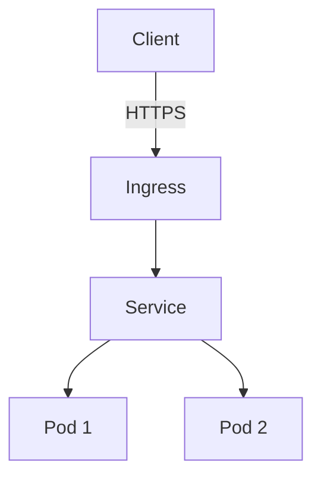

# Contributing to Kubernetes Architecture and Security Training

Thank you for your interest in contributing! This repository benefits from community expertise and we welcome improvements, corrections, and new content.

---

## Table of Contents

- [Code of Conduct](#code-of-conduct)
- [How Can I Contribute?](#how-can-i-contribute)
- [Getting Started](#getting-started)
- [Contribution Workflow](#contribution-workflow)
- [Content Guidelines](#content-guidelines)
- [Lab Development](#lab-development)
- [Diagram Creation](#diagram-creation)
- [Testing Your Changes](#testing-your-changes)
- [Pull Request Process](#pull-request-process)
- [Style Guide](#style-guide)

---

## Code of Conduct

This project adheres to a Code of Conduct that all contributors are expected to follow. Please read [CODE_OF_CONDUCT.md](.github/CODE_OF_CONDUCT.md) before contributing.

**In summary:**
- Be respectful and inclusive
- Welcome newcomers
- Focus on constructive feedback
- Assume good intentions

---

## How Can I Contribute?

### Reporting Issues
- **Bugs**: Found a broken lab or incorrect information? Open a bug report.
- **Enhancements**: Have ideas for new modules or improvements? Open a feature request.
- **Security**: Found a security issue? See [SECURITY.md](SECURITY.md) for responsible disclosure.

### Types of Contributions Welcome

1. **Content Improvements**
   - Fix typos, grammar, or technical inaccuracies
   - Add missing explanations or context
   - Update outdated information
   - Improve clarity and readability

2. **New Labs**
   - Create hands-on exercises
   - Add alternative solutions
   - Provide troubleshooting guides

3. **Diagrams**
   - Add architecture diagrams
   - Improve existing diagrams
   - Create flow charts for complex concepts

4. **Code Examples**
   - Add YAML manifests
   - Contribute Helm charts
   - Share CI/CD pipeline examples

5. **Tooling**
   - Improve automation scripts
   - Add new Makefile targets
   - Enhance GitHub Actions workflows

6. **Translations**
   - Translate content to other languages
   - Review translations for accuracy

---

## Getting Started

### Prerequisites

```bash
# Required
git
kubectl
kind or k3d or minikube
helm

# For documentation
python3
pip3

# For diagram editing
draw.io desktop app or https://app.diagrams.net/
```

### Fork and Clone

```bash
# Fork the repository on GitHub
# Then clone your fork
git clone https://github.com/YOUR-USERNAME/k8s-architecture-and-security-training.git
cd k8s-architecture-and-security-training

# Add upstream remote
git remote add upstream https://github.com/ORIGINAL-OWNER/k8s-architecture-and-security-training.git
```

### Set Up Development Environment

```bash
# Install Python dependencies for docs
pip3 install -r requirements.txt

# Create a test cluster
make kind-up

# Serve documentation locally
make docs-serve
```

---

## Contribution Workflow

### 1. Create a Branch

```bash
# Update your fork
git fetch upstream
git checkout main
git merge upstream/main

# Create a feature branch
git checkout -b feature/your-feature-name
# or
git checkout -b fix/issue-number-description
```

### Branch Naming Convention
- `feature/` - New modules, labs, or significant content
- `fix/` - Bug fixes or corrections
- `docs/` - Documentation improvements
- `chore/` - Maintenance tasks, dependency updates

### 2. Make Your Changes

Follow the [Style Guide](#style-guide) and [Content Guidelines](#content-guidelines).

### 3. Test Your Changes

```bash
# Lint markdown
make lint

# Validate YAML manifests
make validate

# Test labs (if applicable)
make test-labs

# Build documentation
make docs-build
```

### 4. Commit Your Changes

```bash
# Stage changes
git add .

# Commit with descriptive message
git commit -m "type(scope): description"
```

**Commit Message Format:**
```
type(scope): short description

Longer description if needed.

Closes #issue-number
```

**Types:**
- `feat`: New feature or content
- `fix`: Bug fix or correction
- `docs`: Documentation changes
- `style`: Formatting changes
- `refactor`: Code restructuring
- `test`: Test additions or changes
- `chore`: Maintenance tasks

**Examples:**
```
feat(module-06): add AppArmor configuration lab

docs(readme): clarify prerequisites section

fix(lab-03): correct NetworkPolicy YAML syntax
```

### 5. Push and Create Pull Request

```bash
# Push to your fork
git push origin feature/your-feature-name

# Create pull request on GitHub
# Fill out the PR template completely
```

---

## Content Guidelines

### Module Structure

Each module should follow this structure:

```markdown
# Module Title

## Overview
Brief introduction (2-3 paragraphs)

## Learning Objectives
- Objective 1
- Objective 2
- ...

## Conceptual Explanation
Detailed content with subheadings

## Architecture Diagram
```mermaid
[diagram code]
```

## Best Practices
- Practice 1
- Practice 2

## Common Pitfalls / Anti-patterns
- What not to do
- Why it's problematic

## Hands-on Lab
Step-by-step instructions

## Security Checklist
- [ ] Item 1
- [ ] Item 2

## References
- [Link 1](url)
- [Link 2](url)

## Next Steps
Link to next module
```

### Writing Style

- **Clear and Concise**: Use short paragraphs and simple language
- **Technical Accuracy**: Cite sources for claims
- **Practical Focus**: Include real-world examples
- **Progressive Disclosure**: Start simple, add complexity gradually
- **Inclusive Language**: Use "they/them" for singular pronouns, avoid unnecessary jargon

### Code Formatting

```yaml
# YAML manifests should include:
# 1. Comments explaining purpose
# 2. Descriptive names
# 3. Security best practices

apiVersion: v1
kind: Pod
metadata:
  name: secure-pod
  namespace: demo
spec:
  securityContext:
    runAsNonRoot: true
    runAsUser: 1000
  containers:
  - name: app
    image: nginx:1.25
    securityContext:
      allowPrivilegeEscalation: false
      readOnlyRootFilesystem: true
```

### Citations

Always cite sources:
```markdown
Pod Security Standards provide three policies: privileged, baseline, and restricted [^1].

[^1]: [Kubernetes Pod Security Standards](https://kubernetes.io/docs/concepts/security/pod-security-standards/), accessed Nov 2025
```

---

## Lab Development

### Lab Structure

```
labs/
├── 01-basic-deployment/
│   ├── README.md           # Lab instructions
│   ├── setup.sh            # Setup script
│   ├── manifests/          # YAML files
│   ├── expected-output.txt # What success looks like
│   └── troubleshooting.md  # Common issues
└── solutions/
    └── 01-basic-deployment/
        └── solution.md     # Step-by-step solution
```

### Lab Checklist

- [ ] Clear learning objectives
- [ ] Prerequisites listed
- [ ] Step-by-step instructions
- [ ] Expected output provided
- [ ] Cleanup instructions included
- [ ] Tested on kind, k3d, and minikube
- [ ] Solution provided in `labs/solutions/`
- [ ] Troubleshooting guide for common errors

### Testing Labs

```bash
# Test on kind
make kind-up
./labs/XX-lab-name/setup.sh
# Follow lab instructions
make kind-down

# Test on k3d
make k3d-up
./labs/XX-lab-name/setup.sh
# Follow lab instructions
make k3d-down
```

---

## Diagram Creation

### Mermaid Diagrams

Use Mermaid for diagrams that can be rendered in markdown:



**Guidelines:**
- Keep diagrams simple and focused
- Use consistent color schemes
- Add labels for clarity
- Test rendering on GitHub

### Draw.io Diagrams

For complex architecture diagrams:

1. **Create** diagram in draw.io desktop or web app
2. **Save** as `.drawio` file in `diagrams/` directory
3. **Export** as PNG to `diagrams/` with same base name
4. **Embed** PNG in markdown with link to .drawio source

```markdown


*[Edit diagram](../diagrams/control-plane-architecture.drawio)*
```

**Diagram Checklist:**
- [ ] Clear title and legend
- [ ] Consistent styling
- [ ] Readable text (minimum 12pt font)
- [ ] Saved as .drawio in diagrams/
- [ ] Exported as PNG in diagrams/
- [ ] Referenced in relevant module

---

## Testing Your Changes

### Documentation Tests

```bash
# Lint markdown files
npm install -g markdownlint-cli
markdownlint '**/*.md' --ignore node_modules

# Or use Make
make lint
```

### YAML Validation

```bash
# Validate Kubernetes manifests
kubeval examples/**/*.yaml

# Or use Make
make validate
```

### Link Checking

```bash
# Check for broken links
npm install -g markdown-link-check
find . -name \*.md -not -path "./node_modules/*" -exec markdown-link-check {} \;
```

### Accessibility

- Use descriptive alt text for images
- Ensure code blocks have language specified
- Use semantic heading levels (don't skip levels)
- Test with screen reader if possible

---

## Pull Request Process

### Before Submitting

- [ ] Changes are on a feature branch
- [ ] All tests pass (`make lint`, `make validate`)
- [ ] Documentation is updated
- [ ] CHANGELOG.md is updated (for significant changes)
- [ ] Commit messages follow convention
- [ ] No merge conflicts with main

### PR Template

When you create a PR, fill out all sections of the template:

```markdown
## Description
Brief description of changes

## Type of Change
- [ ] Bug fix
- [ ] New feature
- [ ] Documentation update
- [ ] Other (describe)

## Modules Affected
- Module 01
- Module 03

## Testing
How you tested these changes

## Screenshots
If applicable

## Checklist
- [ ] Code follows style guide
- [ ] Tests pass
- [ ] Documentation updated
- [ ] CHANGELOG updated
```

### Review Process

1. **Automated Checks**: CI must pass
2. **Maintainer Review**: At least one maintainer approval required
3. **Community Review**: Others can review and suggest changes
4. **Updates**: Address feedback by pushing to same branch
5. **Merge**: Maintainer will merge when approved

### After Merge

- Your changes will be in the next release
- You'll be added to contributors list
- Consider watching the repo for future issues to contribute to

---

## Style Guide

### Markdown

- Use ATX-style headers (`#` not underlines)
- One sentence per line (makes diffs cleaner)
- Use fenced code blocks with language specified
- Use relative links for internal references
- No trailing whitespace

### YAML

- 2-space indentation
- Include comments for complex configurations
- Use meaningful names
- Follow Kubernetes naming conventions

### Shell Scripts

```bash
#!/usr/bin/env bash

set -euo pipefail  # Exit on error, undefined vars, pipe failures

# Comment explaining function
function main() {
    local cluster_name="${1:-training-cluster}"
    
    echo "Creating cluster: ${cluster_name}"
    kind create cluster --name "${cluster_name}"
}

main "$@"
```

### File Naming

- Use lowercase
- Use hyphens for spaces
- Be descriptive: `network-policy-lab.md` not `lab3.md`
- Module files: `NN-module-name.md` (zero-padded numbers)

---

## Recognition

Contributors will be recognized in:
- README.md contributors section
- Release notes
- CHANGELOG.md

Significant contributors may be invited to become maintainers.

---

## Questions?

- **General Questions**: Open a GitHub Discussion
- **Specific Issues**: Comment on related issue
- **Private Matters**: Email maintainers (see MAINTAINERS.md)

---

**Thank you for contributing to Kubernetes education and security!**

