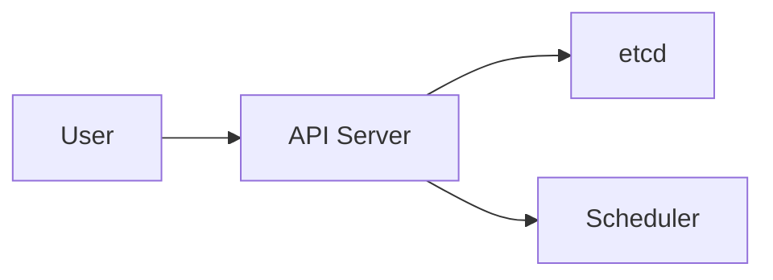

# Maintenance and Workflow Guide

This document describes how to maintain, update, and extend the Kubernetes Architecture and Security Training repository.

---

## Table of Contents

- [Repository Maintenance](#repository-maintenance)
- [Content Updates](#content-updates)
- [Diagram Management](#diagram-management)
- [Lab Testing](#lab-testing)
- [Documentation Site](#documentation-site)
- [Release Process](#release-process)
- [Automation](#automation)

---

## Repository Maintenance

### Regular Maintenance Tasks

#### Weekly
- [ ] Review and respond to new issues
- [ ] Review pending pull requests
- [ ] Check automated test runs
- [ ] Monitor security advisories

#### Monthly
- [ ] Update dependencies (mkdocs, GitHub Actions)
- [ ] Review and update external links
- [ ] Check for Kubernetes version updates
- [ ] Test labs on latest Kubernetes versions

#### Quarterly
- [ ] Comprehensive reference review (REFERENCES.md)
- [ ] Update security tool versions
- [ ] Review and update CIS benchmark alignment
- [ ] Conduct full documentation review
- [ ] Update diagrams for accuracy

### Version Compatibility

Track Kubernetes versions and update content accordingly:

```bash
# Check current Kubernetes stable version
curl -s https://storage.googleapis.com/kubernetes-release/release/stable.txt

# Update badge in README.md
# Update labs to test against new version
# Update module content for new features
```

**Supported Versions**: Document which Kubernetes versions are tested and supported.

Current policy: Support last 3 minor versions (e.g., 1.28, 1.29, 1.30).

---

## Content Updates

### Adding a New Module

1. **Plan the Module**
   ```bash
   # Create planning issue
   gh issue create --title "New Module: [Topic]" --label enhancement
   ```

2. **Create Module File**
   ```bash
   # Create new module file
   touch docs/16-new-topic.md
   ```

3. **Module Template**
   ```markdown
   # Module NN: Topic Name
   
   ## Overview
   [2-3 paragraph introduction]
   
   ## Learning Objectives
   - Objective 1
   - Objective 2
   
   ## Prerequisites
   - Prior module
   - Required knowledge
   
   ## Conceptual Explanation
   [Main content with subheadings]
   
   ## Architecture Diagram
   [Mermaid or reference to draw.io]
   
   ## Hands-on Lab
   [Step-by-step lab]
   
   ## Best Practices
   - Practice 1
   - Practice 2
   
   ## Anti-patterns
   - Anti-pattern 1
   - Why it's problematic
   
   ## Security Checklist
   - [ ] Item 1
   - [ ] Item 2
   
   ## Troubleshooting
   [Common issues and solutions]
   
   ## References
   - [Source 1](url)
   - [Source 2](url)
   
   ## Next Steps
   Link to next module
   ```

4. **Update SUMMARY.md**
   Add new module to course roadmap

5. **Update mkdocs.yml**
   Add new module to navigation

6. **Create Supporting Materials**
   - Add lab in `labs/NN-topic-name/`
   - Add examples in `examples/`
   - Create diagrams in `diagrams/`

7. **Test Thoroughly**
   ```bash
   make lint
   make validate
   make docs-serve  # Preview locally
   ```

### Updating Existing Content

1. **Check Current Information**
   - Verify against official Kubernetes docs
   - Check for deprecated features
   - Review best practices currency

2. **Make Updates**
   ```bash
   # Create feature branch
   git checkout -b docs/update-module-NN
   
   # Edit module
   vim docs/NN-module-name.md
   
   # Test changes
   make lint
   make docs-serve
   ```

3. **Update References**
   - Add new sources to REFERENCES.md
   - Update access dates
   - Remove outdated references

4. **Update CHANGELOG.md**
   ```markdown
   ## [Unreleased]
   
   ### Changed
   - Updated Module NN with current Kubernetes 1.30 features
   ```

---

## Diagram Management

### Mermaid Diagrams

**Creating New Mermaid Diagrams:**

```markdown

```

**Testing Mermaid Rendering:**
- Use [Mermaid Live Editor](https://mermaid.live/)
- Preview in GitHub markdown
- Test in mkdocs local build

**Mermaid Best Practices:**
- Keep diagrams simple (max 10-15 nodes)
- Use consistent styling
- Add diagram title in surrounding text
- Use meaningful node labels

### Draw.io Diagrams

**Creating/Editing Draw.io Diagrams:**

1. **Open draw.io**
   ```bash
   # Desktop app or
   open https://app.diagrams.net/
   ```

2. **Design Principles**
   - Use shapes from Kubernetes icon set
   - Consistent color scheme:
     - Control plane: Blue (#326CE5)
     - Nodes: Green (#00C853)
     - Storage: Orange (#FF9800)
     - Network: Purple (#7B1FA2)
     - Security: Red (#D32F2F)
   - Font: Arial or Helvetica, minimum 12pt
   - Export at 2x resolution for clarity

3. **Save Process**
   ```bash
   # Save as .drawio file
   diagrams/topic-name-architecture.drawio
   
   # Export as PNG
   File > Export as > PNG
   # Settings: 2x scale, transparent background, border: 10px
   # Save as: diagrams/topic-name-architecture.png
   
   # Optional: Export as SVG for web
   diagrams/topic-name-architecture.svg
   ```

4. **Reference in Markdown**
   ```markdown
   
   
   *[Edit this diagram](../diagrams/topic-name-architecture.drawio)*
   ```

**Diagram Maintenance:**
- Keep .drawio source files in version control
- Re-export PNG when updating
- Update diagrams when Kubernetes architecture changes
- Review diagrams quarterly for accuracy

---

## Lab Testing

### Local Testing Workflow

```bash
# 1. Create test cluster
make kind-up

# 2. Run lab setup
cd labs/NN-lab-name
./setup.sh

# 3. Follow lab instructions manually
# Verify each step produces expected output

# 4. Run cleanup
./cleanup.sh  # if exists
cd ../..

# 5. Destroy cluster
make kind-down
```

### Testing on Multiple Platforms

```bash
# Test on kind
make kind-up
./labs/NN-lab-name/setup.sh
# [manual testing]
make kind-down

# Test on k3d
make k3d-up
./labs/NN-lab-name/setup.sh
# [manual testing]
make k3d-down

# Test on minikube
minikube start
./labs/NN-lab-name/setup.sh
# [manual testing]
minikube delete
```

### Automated Lab Testing

GitHub Actions runs basic smoke tests. See `.github/workflows/test-labs.yml`.

**Adding Lab to Automated Tests:**

```yaml
# .github/workflows/test-labs.yml
jobs:
  test-lab-NN:
    runs-on: ubuntu-latest
    steps:
      - uses: actions/checkout@v4
      - name: Setup kind
        uses: helm/kind-action@v1
      - name: Run Lab NN
        run: |
          cd labs/NN-lab-name
          ./setup.sh
          ./test.sh  # Create this to verify success
```

---

## Documentation Site

### MkDocs Configuration

The documentation site uses MkDocs Material theme.

**File**: `mkdocs.yml`

```yaml
site_name: Kubernetes Architecture and Security Training
site_url: https://yourusername.github.io/k8s-architecture-and-security-training/
theme:
  name: material
  features:
    - navigation.tabs
    - navigation.sections
    - search.highlight
nav:
  - Home: index.md
  - Modules:
    - '00: Introduction': docs/00-intro.md
    - '01: Basics': docs/01-k8s-basics.md
    # ... add all modules
```

### Local Development

```bash
# Install dependencies
pip install mkdocs-material

# Serve locally (auto-reload on changes)
mkdocs serve

# Open browser to http://127.0.0.1:8000
```

### Building Documentation

```bash
# Build static site
mkdocs build

# Output in site/ directory
ls site/
```

### Deploying to GitHub Pages

```bash
# Deploy to gh-pages branch
mkdocs gh-deploy

# Or use GitHub Actions (automatic on push to main)
# See .github/workflows/docs.yml
```

**GitHub Pages Setup:**
1. Repository Settings > Pages
2. Source: Deploy from branch
3. Branch: gh-pages, / (root)
4. Save

### Adding Plugins

```bash
# Add to requirements.txt
echo "mkdocs-mermaid2-plugin" >> requirements.txt

# Update mkdocs.yml
# plugins:
#   - search
#   - mermaid2
```

---

## Release Process

### Version Numbering

Follow Semantic Versioning (semver):
- **Major** (X.0.0): Significant changes, new modules, restructuring
- **Minor** (1.X.0): New labs, content updates, enhancements
- **Patch** (1.0.X): Bug fixes, typos, small corrections

### Creating a Release

1. **Update CHANGELOG.md**
   ```markdown
   ## [1.1.0] - 2025-12-01
   
   ### Added
   - New Module 16: Advanced Topics
   - Lab for Istio service mesh
   
   ### Changed
   - Updated Module 05 for Kubernetes 1.30
   
   ### Fixed
   - Corrected YAML syntax in Lab 03
   ```

2. **Update Version References**
   - README.md (if version shown)
   - mkdocs.yml (site version)
   - Documentation footer

3. **Tag Release**
   ```bash
   git checkout main
   git pull origin main
   
   # Create annotated tag
   git tag -a v1.1.0 -m "Release version 1.1.0"
   
   # Push tag
   git push origin v1.1.0
   ```

4. **Create GitHub Release**
   ```bash
   gh release create v1.1.0 \
     --title "Release v1.1.0" \
     --notes-file RELEASE_NOTES.md
   ```

5. **Release Notes Template**
   ```markdown
   # Release v1.1.0
   
   ## Highlights
   - Feature 1
   - Feature 2
   
   ## Full Changelog
   See [CHANGELOG.md](CHANGELOG.md)
   
   ## Upgrade Notes
   - Any breaking changes
   - Migration instructions
   
   ## Contributors
   Thanks to @user1, @user2, ...
   ```

---

## Automation

### Makefile Targets

**Common tasks are automated in the Makefile:**

```bash
make help          # Show all targets
make kind-up       # Create kind cluster
make kind-down     # Delete kind cluster
make lint          # Lint markdown and YAML
make validate      # Validate Kubernetes manifests
make docs-serve    # Serve documentation locally
make docs-build    # Build static documentation
make test-labs     # Run lab smoke tests
```

### GitHub Actions Workflows

**Workflows in `.github/workflows/`:**

1. **ci-docs.yml** - Documentation CI
   - Triggers: Push, PR to main
   - Actions: Lint markdown, build docs
   
2. **ci-yaml.yml** - YAML Validation
   - Triggers: Push, PR with .yaml changes
   - Actions: Validate all YAML files
   
3. **deploy-docs.yml** - Deploy Documentation
   - Triggers: Push to main
   - Actions: Build and deploy to GitHub Pages
   
4. **test-labs.yml** - Lab Testing
   - Triggers: PR with lab changes
   - Actions: Run smoke tests on selected labs

### Dependency Updates

**Dependabot Configuration** (`.github/dependabot.yml`):

```yaml
version: 2
updates:
  - package-ecosystem: "pip"
    directory: "/"
    schedule:
      interval: "weekly"
  - package-ecosystem: "github-actions"
    directory: "/"
    schedule:
      interval: "weekly"
```

---

## Tips for Maintainers

### Efficient Review Process

- Use GitHub's suggestion feature for small fixes
- Create review checklists
- Test labs before approving
- Ask for clarification rather than assume

### Community Engagement

- Welcome first-time contributors
- Provide detailed feedback
- Recognize contributions publicly
- Respond to issues within 48 hours

### Content Quality

- Prefer authoritative sources
- Cite recent references (last 2 years)
- Test all commands before documenting
- Update examples with real-world scenarios

---

## Questions or Issues?

If you have questions about this workflow:
- Open a GitHub Discussion
- Tag @maintainers in an issue
- Email: maintainers@example.com

---

*This workflow guide is a living document. Update as processes evolve.*
