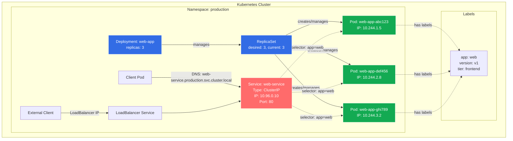

# Module 01: Kubernetes Basics

## Overview

**Estimated Time:** 3-4 hours

**Module Type:** Foundation

**Prerequisites:** Basic understanding of containers and Docker

This module introduces the fundamental building blocks of Kubernetes. You will learn about the core resources that form the foundation of any Kubernetes deployment: Pods, Services, Deployments, ReplicaSets, and how they work together. Additionally, you'll understand how Kubernetes organizes resources using labels, selectors, and namespaces.

---

## Learning Objectives

By the end of this module, you will be able to:

1. Explain what Pods are and how they serve as the atomic unit of deployment in Kubernetes
2. Describe the purpose and functionality of Services in providing stable networking endpoints
3. Understand how Deployments manage application lifecycle and rolling updates
4. Identify the relationship between Deployments, ReplicaSets, and Pods
5. Use labels and selectors to organize and query Kubernetes resources
6. Leverage namespaces for resource isolation and multi-tenancy
7. Write basic YAML manifests for Pods, Services, and Deployments
8. Apply security best practices to basic Kubernetes resources

---

## 1. Pods: The Atomic Unit

### 1.1 What is a Pod?

A Pod is the smallest deployable unit in Kubernetes. It represents a single instance of a running process in your cluster and can contain one or more containers that share:

- Network namespace (same IP address and port space)
- Storage volumes
- Configuration data

**Key Characteristics:**
- Pods are ephemeral and disposable
- Each Pod gets a unique IP address
- Containers within a Pod communicate via `localhost`
- Pods are scheduled together on the same node

### 1.2 Single vs Multi-Container Pods

**Single-Container Pods** (most common):
```yaml
apiVersion: v1
kind: Pod
metadata:
  name: nginx-pod
  labels:
    app: nginx
    tier: frontend
spec:
  containers:
  - name: nginx
    image: nginx:1.21.6
    ports:
    - containerPort: 80
    resources:
      requests:
        memory: "64Mi"
        cpu: "250m"
      limits:
        memory: "128Mi"
        cpu: "500m"
    securityContext:
      allowPrivilegeEscalation: false
      runAsNonRoot: true
      runAsUser: 1000
      capabilities:
        drop:
        - ALL
```

**Multi-Container Pods** (sidecar pattern):
```yaml
apiVersion: v1
kind: Pod
metadata:
  name: app-with-sidecar
spec:
  containers:
  - name: main-app
    image: myapp:1.0
    ports:
    - containerPort: 8080
    volumeMounts:
    - name: shared-logs
      mountPath: /var/log/app
  - name: log-shipper
    image: fluentd:v1.14
    volumeMounts:
    - name: shared-logs
      mountPath: /var/log/app
      readOnly: true
  volumes:
  - name: shared-logs
    emptyDir: {}
```

### 1.3 Pod Lifecycle

Pods go through several phases:
- **Pending:** Pod accepted but containers not yet created
- **Running:** Pod bound to node, containers created
- **Succeeded:** All containers terminated successfully
- **Failed:** All containers terminated, at least one failed
- **Unknown:** Pod state cannot be determined

---

## 2. Services: Stable Network Endpoints

### 2.1 Why Services?

Pods are ephemeral—they come and go. When a Pod dies and is replaced, it gets a new IP address. Services solve this problem by providing:

- A stable IP address and DNS name
- Load balancing across multiple Pods
- Service discovery within the cluster

### 2.2 Service Types

**ClusterIP (default):**
Exposes the Service on an internal IP in the cluster.

```yaml
apiVersion: v1
kind: Service
metadata:
  name: backend-service
  labels:
    app: backend
spec:
  type: ClusterIP
  selector:
    app: backend
    tier: api
  ports:
  - protocol: TCP
    port: 80
    targetPort: 8080
```

**NodePort:**
Exposes the Service on each Node's IP at a static port (30000-32767).

```yaml
apiVersion: v1
kind: Service
metadata:
  name: frontend-nodeport
spec:
  type: NodePort
  selector:
    app: frontend
  ports:
  - protocol: TCP
    port: 80
    targetPort: 8080
    nodePort: 30080
```

**LoadBalancer:**
Provisions an external load balancer (cloud provider dependent).

```yaml
apiVersion: v1
kind: Service
metadata:
  name: web-loadbalancer
spec:
  type: LoadBalancer
  selector:
    app: web
  ports:
  - protocol: TCP
    port: 80
    targetPort: 8080
```

**ExternalName:**
Maps a Service to a DNS name (for external services).

```yaml
apiVersion: v1
kind: Service
metadata:
  name: external-db
spec:
  type: ExternalName
  externalName: database.example.com
```

---

## 3. Deployments and ReplicaSets

### 3.1 ReplicaSets

A ReplicaSet ensures that a specified number of Pod replicas are running at any given time. While you can create ReplicaSets directly, you typically manage them through Deployments.

```yaml
apiVersion: apps/v1
kind: ReplicaSet
metadata:
  name: frontend-replicaset
  labels:
    app: frontend
spec:
  replicas: 3
  selector:
    matchLabels:
      app: frontend
  template:
    metadata:
      labels:
        app: frontend
    spec:
      containers:
      - name: nginx
        image: nginx:1.21.6
        ports:
        - containerPort: 80
```

### 3.2 Deployments: Declarative Updates

Deployments provide declarative updates for Pods and ReplicaSets. They manage:

- Rolling updates and rollbacks
- Scaling
- Pause and resume of rollouts
- History and revision tracking

**Production-Ready Deployment:**

```yaml
apiVersion: apps/v1
kind: Deployment
metadata:
  name: api-deployment
  labels:
    app: api
    version: v1
spec:
  replicas: 3
  revisionHistoryLimit: 10
  strategy:
    type: RollingUpdate
    rollingUpdate:
      maxSurge: 1
      maxUnavailable: 0
  selector:
    matchLabels:
      app: api
  template:
    metadata:
      labels:
        app: api
        version: v1
    spec:
      securityContext:
        runAsNonRoot: true
        fsGroup: 1000
      containers:
      - name: api
        image: myapi:1.2.3
        imagePullPolicy: Always
        ports:
        - containerPort: 8080
          name: http
          protocol: TCP
        env:
        - name: LOG_LEVEL
          value: "info"
        resources:
          requests:
            memory: "256Mi"
            cpu: "500m"
          limits:
            memory: "512Mi"
            cpu: "1000m"
        livenessProbe:
          httpGet:
            path: /healthz
            port: 8080
          initialDelaySeconds: 30
          periodSeconds: 10
        readinessProbe:
          httpGet:
            path: /ready
            port: 8080
          initialDelaySeconds: 5
          periodSeconds: 5
        securityContext:
          allowPrivilegeEscalation: false
          readOnlyRootFilesystem: true
          runAsUser: 1000
          capabilities:
            drop:
            - ALL
```

### 3.3 Deployment Strategies

**RollingUpdate (default):**
- Gradually replaces old Pods with new ones
- Zero downtime deployments
- Controlled by `maxSurge` and `maxUnavailable`

**Recreate:**
- Terminates all existing Pods before creating new ones
- Causes downtime but useful for incompatible changes

---

## 4. Labels and Selectors

### 4.1 Labels

Labels are key-value pairs attached to objects (Pods, Services, Deployments, etc.). They are used to organize and select subsets of objects.

**Best Practices for Labels:**

```yaml
metadata:
  labels:
    app.kubernetes.io/name: myapp
    app.kubernetes.io/instance: myapp-prod
    app.kubernetes.io/version: "1.2.3"
    app.kubernetes.io/component: api
    app.kubernetes.io/part-of: ecommerce-platform
    app.kubernetes.io/managed-by: kubectl
    environment: production
    tier: backend
    cost-center: engineering
```

### 4.2 Selectors

Selectors allow you to filter objects based on their labels.

**Equality-based:**
```yaml
selector:
  matchLabels:
    app: nginx
    tier: frontend
```

**Set-based:**
```yaml
selector:
  matchExpressions:
  - key: environment
    operator: In
    values:
    - production
    - staging
  - key: tier
    operator: NotIn
    values:
    - cache
  - key: app
    operator: Exists
```

---

## 5. Namespaces: Resource Isolation

### 5.1 What are Namespaces?

Namespaces provide a mechanism for isolating groups of resources within a single cluster. They are ideal for:

- Multi-tenancy
- Environment separation (dev, staging, prod)
- Team/project isolation
- Resource quota enforcement

### 5.2 Default Namespaces

- `default`: Default namespace for objects with no namespace specified
- `kube-system`: For objects created by Kubernetes system
- `kube-public`: Readable by all users, reserved for cluster usage
- `kube-node-lease`: Holds node lease objects for node heartbeat data

### 5.3 Creating and Using Namespaces

```yaml
apiVersion: v1
kind: Namespace
metadata:
  name: development
  labels:
    name: development
    environment: dev
```

**With Resource Quotas:**

```yaml
apiVersion: v1
kind: ResourceQuota
metadata:
  name: dev-quota
  namespace: development
spec:
  hard:
    requests.cpu: "10"
    requests.memory: 20Gi
    limits.cpu: "20"
    limits.memory: 40Gi
    pods: "50"
    services: "10"
    persistentvolumeclaims: "5"
```

**Deploying to a Namespace:**

```yaml
apiVersion: apps/v1
kind: Deployment
metadata:
  name: app
  namespace: development
spec:
  replicas: 2
  selector:
    matchLabels:
      app: myapp
  template:
    metadata:
      labels:
        app: myapp
    spec:
      containers:
      - name: app
        image: myapp:dev
```

---

## 6. Pod-to-Service Relationship Diagram



---

## 7. Best Practices

### 7.1 Pod Best Practices

1. **Always define resource requests and limits**
   - Ensures proper scheduling and prevents resource starvation
   - Helps the cluster scheduler make informed decisions

2. **Use liveness and readiness probes**
   - Liveness: Restarts unhealthy containers
   - Readiness: Controls when Pod receives traffic

3. **Avoid running as root**
   - Set `runAsNonRoot: true`
   - Specify `runAsUser` with a non-privileged UID

4. **Use read-only root filesystem when possible**
   - Set `readOnlyRootFilesystem: true`
   - Mount writable volumes only where needed

5. **Drop unnecessary capabilities**
   - Drop ALL capabilities by default
   - Add back only what's needed

### 7.2 Deployment Best Practices

1. **Use Deployments, not bare Pods**
   - Deployments provide self-healing and scaling
   - Enable rolling updates and rollbacks

2. **Pin image versions**
   - Avoid `:latest` tag in production
   - Use specific version tags or digest

3. **Configure rolling update parameters**
   - Set `maxUnavailable: 0` for zero-downtime deployments
   - Adjust `maxSurge` based on capacity

4. **Keep revision history**
   - Set `revisionHistoryLimit` (default: 10)
   - Enables rollbacks to previous versions

5. **Use Pod Disruption Budgets**
   - Prevents voluntary disruptions during maintenance
   - Ensures minimum availability during updates

### 7.3 Service Best Practices

1. **Use ClusterIP for internal services**
   - More secure than exposing via NodePort
   - Use Ingress for external access

2. **Define readiness probes**
   - Services only route to ready Pods
   - Prevents traffic to unhealthy endpoints

3. **Use meaningful service names**
   - Services create DNS entries
   - Name format: `<service-name>.<namespace>.svc.cluster.local`

### 7.4 Label Best Practices

1. **Follow recommended label conventions**
   - Use `app.kubernetes.io/*` prefix for standard labels
   - Include: name, instance, version, component, part-of

2. **Use labels for organization**
   - Environment (prod, staging, dev)
   - Team/owner
   - Cost allocation

3. **Don't use labels for non-identifying information**
   - Use annotations for metadata that doesn't identify resources

### 7.5 Namespace Best Practices

1. **Use namespaces for isolation**
   - Separate environments (dev/staging/prod)
   - Separate teams or projects
   - Multi-tenant scenarios

2. **Apply resource quotas**
   - Prevent resource exhaustion
   - Fair resource allocation

3. **Use Network Policies**
   - Control traffic between namespaces
   - Default deny, explicit allow

---

## 8. Anti-Patterns and Common Mistakes

### 8.1 Pod Anti-Patterns

❌ **Using bare Pods in production**
```yaml
# DON'T DO THIS
apiVersion: v1
kind: Pod
metadata:
  name: myapp
spec:
  containers:
  - name: app
    image: myapp:latest
```

✅ **Use Deployments instead**
```yaml
apiVersion: apps/v1
kind: Deployment
metadata:
  name: myapp
spec:
  replicas: 3
  selector:
    matchLabels:
      app: myapp
  template:
    metadata:
      labels:
        app: myapp
    spec:
      containers:
      - name: app
        image: myapp:1.2.3
```

### 8.2 Resource Anti-Patterns

❌ **No resource limits**
- Pods can consume all node resources
- Causes resource contention and node instability

❌ **Using :latest tag**
- Non-deterministic deployments
- Difficult to rollback
- Cache issues

❌ **Running as root**
```yaml
# INSECURE
spec:
  containers:
  - name: app
    image: myapp:1.0
    securityContext:
      runAsUser: 0  # DON'T DO THIS
```

### 8.3 Service Anti-Patterns

❌ **Exposing everything via LoadBalancer**
- Expensive (each LB costs money)
- Security risk
- Use Ingress instead for HTTP/HTTPS

❌ **Selector mismatch**
```yaml
# Service selector doesn't match Pod labels
Service selector: app=frontend
Pod labels: app=front-end  # Typo!
```

### 8.4 Deployment Anti-Patterns

❌ **maxUnavailable: 100%**
- Causes downtime
- All Pods may be down simultaneously

❌ **No health checks**
- Traffic sent to unhealthy Pods
- Failed deployments not detected

### 8.5 Namespace Anti-Patterns

❌ **Everything in default namespace**
- No isolation
- Difficult to manage
- No resource quotas

❌ **Hard-coding namespace in manifests**
- Makes manifests less reusable
- Use kubectl `--namespace` flag or kustomize

---

## 9. Hands-on Lab References

This module includes the following hands-on labs in the `/labs/01-basics/` directory:

1. **Lab 1.1: Creating and Managing Pods**
   - Create single and multi-container Pods
   - Inspect Pod status and logs
   - Execute commands in containers
   - File: `/labs/01-basics/lab-1.1-pods.md`

2. **Lab 1.2: Working with Services**
   - Create ClusterIP and NodePort Services
   - Test service discovery
   - Debug service connectivity
   - File: `/labs/01-basics/lab-1.2-services.md`

3. **Lab 1.3: Deploying Applications**
   - Create and manage Deployments
   - Perform rolling updates
   - Rollback deployments
   - Scale applications
   - File: `/labs/01-basics/lab-1.3-deployments.md`

4. **Lab 1.4: Labels, Selectors, and Namespaces**
   - Apply and manage labels
   - Use selectors to query resources
   - Create and use namespaces
   - Apply resource quotas
   - File: `/labs/01-basics/lab-1.4-organization.md`

---

## 10. Security Checklist

### Pod Security
- [ ] Define resource requests and limits for all containers
- [ ] Set `runAsNonRoot: true` in security context
- [ ] Specify explicit `runAsUser` (non-zero UID)
- [ ] Set `allowPrivilegeEscalation: false`
- [ ] Use `readOnlyRootFilesystem: true` where possible
- [ ] Drop all capabilities and add back only required ones
- [ ] Avoid `hostNetwork`, `hostPID`, `hostIPC` unless absolutely necessary
- [ ] Use specific image tags, not `:latest`
- [ ] Scan container images for vulnerabilities
- [ ] Use private image registries with authentication

### Deployment Security
- [ ] Configure liveness and readiness probes
- [ ] Set appropriate `revisionHistoryLimit`
- [ ] Use `imagePullPolicy: Always` or `IfNotPresent`
- [ ] Store secrets in Secret objects, not in manifests
- [ ] Use Pod Disruption Budgets for critical applications
- [ ] Apply Pod Security Standards (restricted profile recommended)

### Service Security
- [ ] Use ClusterIP for internal services
- [ ] Avoid exposing services unnecessarily
- [ ] Use Network Policies to restrict traffic
- [ ] Implement authentication and authorization for exposed services

### Namespace Security
- [ ] Use namespaces for isolation
- [ ] Apply ResourceQuotas to prevent resource exhaustion
- [ ] Apply LimitRanges for default resource constraints
- [ ] Use Network Policies for namespace isolation
- [ ] Apply RBAC to limit namespace access

---

## 11. References

1. **Kubernetes Official Documentation**
   - Pods: https://kubernetes.io/docs/concepts/workloads/pods/
   - Services: https://kubernetes.io/docs/concepts/services-networking/service/
   - Deployments: https://kubernetes.io/docs/concepts/workloads/controllers/deployment/
   - Labels and Selectors: https://kubernetes.io/docs/concepts/overview/working-with-objects/labels/
   - Namespaces: https://kubernetes.io/docs/concepts/overview/working-with-objects/namespaces/

2. **Kubernetes API Reference**
   - v1.28 API Reference: https://kubernetes.io/docs/reference/generated/kubernetes-api/v1.28/

3. **Best Practices**
   - Kubernetes Best Practices (Google): https://cloud.google.com/blog/products/containers-kubernetes/your-guide-kubernetes-best-practices
   - Configuration Best Practices: https://kubernetes.io/docs/concepts/configuration/overview/

4. **Security**
   - Pod Security Standards: https://kubernetes.io/docs/concepts/security/pod-security-standards/
   - CIS Kubernetes Benchmark: https://www.cisecurity.org/benchmark/kubernetes

5. **CNCF Resources**
   - CNCF Cloud Native Glossary: https://glossary.cncf.io/
   - CNCF Kubernetes Documentation: https://www.cncf.io/projects/kubernetes/

6. **Books and Guides**
   - "Kubernetes in Action" by Marko Lukša (Manning Publications)
   - "Kubernetes: Up and Running" by Kelsey Hightower et al. (O'Reilly)

---

## Summary

In this module, you learned the fundamental building blocks of Kubernetes:

- **Pods** are the atomic units of deployment that encapsulate one or more containers
- **Services** provide stable networking endpoints and load balancing for Pods
- **Deployments** manage the declarative lifecycle of Pods through ReplicaSets
- **Labels and Selectors** organize and query Kubernetes resources
- **Namespaces** provide resource isolation and multi-tenancy

You also learned security best practices for each resource type and common anti-patterns to avoid. These fundamentals are essential for understanding more advanced Kubernetes concepts covered in subsequent modules.

---

**Next Module:** [02-control-plane.md](./02-control-plane.md) - Control Plane and Cluster Components
