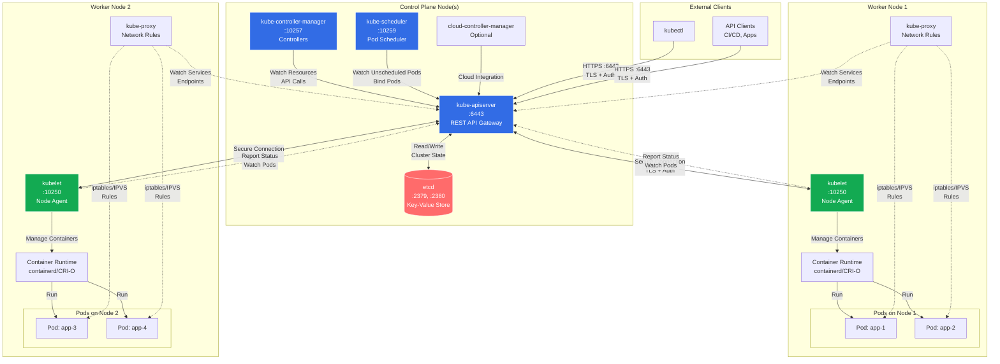

# Module 02: Control Plane and Cluster Components

## Overview

**Estimated Time:** 4-5 hours

**Module Type:** Architecture Deep Dive

**Prerequisites:** Module 01 - Kubernetes Basics

This module provides a comprehensive understanding of Kubernetes cluster architecture, focusing on control plane components and worker node components. You'll learn how these components interact to provide the orchestration, scheduling, and management capabilities that make Kubernetes powerful. Understanding this architecture is crucial for troubleshooting, performance tuning, and implementing high availability patterns.

---

## Learning Objectives

By the end of this module, you will be able to:

1. Explain the role and function of each control plane component
2. Understand how worker node components interact with the control plane
3. Describe the Kubernetes API request flow from client to etcd
4. Implement high availability patterns for control plane components
5. Perform etcd backup and restore operations
6. Troubleshoot common control plane issues
7. Secure control plane components using best practices
8. Monitor control plane health and performance

---

## 1. Kubernetes Architecture Overview

### 1.1 Cluster Components

A Kubernetes cluster consists of two main types of nodes:

**Control Plane Nodes (Master Nodes):**
- Run control plane components
- Make global decisions about the cluster
- Detect and respond to cluster events
- Should run on dedicated infrastructure in production

**Worker Nodes:**
- Run application workloads (Pods)
- Execute container runtime
- Report node and Pod status to control plane
- Can be physical or virtual machines

### 1.2 Component Communication

- All components communicate through the API server
- Only the API server talks directly to etcd
- Secure communication using TLS certificates
- Components use service accounts for authentication

---

## 2. Control Plane Components

### 2.1 kube-apiserver

**Purpose:** The API server is the front-end for the Kubernetes control plane. It exposes the Kubernetes API and is the only component that communicates directly with etcd.

**Key Responsibilities:**
- Serves the Kubernetes REST API
- Validates and processes API requests
- Authenticates and authorizes requests
- Persists cluster state to etcd
- Acts as the gateway for all cluster operations

**Configuration Example:**

```yaml
# /etc/kubernetes/manifests/kube-apiserver.yaml (static pod)
apiVersion: v1
kind: Pod
metadata:
  name: kube-apiserver
  namespace: kube-system
spec:
  containers:
  - name: kube-apiserver
    image: registry.k8s.io/kube-apiserver:v1.28.0
    command:
    - kube-apiserver
    - --advertise-address=192.168.1.100
    - --allow-privileged=true
    - --authorization-mode=Node,RBAC
    - --client-ca-file=/etc/kubernetes/pki/ca.crt
    - --enable-admission-plugins=NodeRestriction,PodSecurityPolicy
    - --enable-bootstrap-token-auth=true
    - --etcd-cafile=/etc/kubernetes/pki/etcd/ca.crt
    - --etcd-certfile=/etc/kubernetes/pki/apiserver-etcd-client.crt
    - --etcd-keyfile=/etc/kubernetes/pki/apiserver-etcd-client.key
    - --etcd-servers=https://127.0.0.1:2379
    - --kubelet-client-certificate=/etc/kubernetes/pki/apiserver-kubelet-client.crt
    - --kubelet-client-key=/etc/kubernetes/pki/apiserver-kubelet-client.key
    - --kubelet-preferred-address-types=InternalIP,ExternalIP,Hostname
    - --proxy-client-cert-file=/etc/kubernetes/pki/front-proxy-client.crt
    - --proxy-client-key-file=/etc/kubernetes/pki/front-proxy-client.key
    - --requestheader-allowed-names=front-proxy-client
    - --requestheader-client-ca-file=/etc/kubernetes/pki/front-proxy-ca.crt
    - --secure-port=6443
    - --service-account-issuer=https://kubernetes.default.svc.cluster.local
    - --service-account-key-file=/etc/kubernetes/pki/sa.pub
    - --service-account-signing-key-file=/etc/kubernetes/pki/sa.key
    - --service-cluster-ip-range=10.96.0.0/12
    - --tls-cert-file=/etc/kubernetes/pki/apiserver.crt
    - --tls-private-key-file=/etc/kubernetes/pki/apiserver.key
    - --audit-log-path=/var/log/kubernetes/audit.log
    - --audit-log-maxage=30
    - --audit-log-maxbackup=10
    - --audit-log-maxsize=100
    - --audit-policy-file=/etc/kubernetes/audit-policy.yaml
```

**Important Flags:**
- `--etcd-servers`: etcd cluster endpoints
- `--authorization-mode`: Authorization modes (Node, RBAC, ABAC, Webhook)
- `--enable-admission-plugins`: Admission controllers to enable
- `--audit-log-path`: Enable audit logging
- `--tls-cert-file` / `--tls-private-key-file`: TLS configuration

### 2.2 etcd

**Purpose:** etcd is a consistent, highly-available key-value store used as Kubernetes' backing store for all cluster data.

**Key Characteristics:**
- Distributed, reliable key-value store
- Uses Raft consensus algorithm
- Stores all Kubernetes objects and state
- Critical for cluster operation—backup regularly!

**etcd Configuration:**

```yaml
# /etc/kubernetes/manifests/etcd.yaml
apiVersion: v1
kind: Pod
metadata:
  name: etcd
  namespace: kube-system
spec:
  containers:
  - name: etcd
    image: registry.k8s.io/etcd:3.5.9-0
    command:
    - etcd
    - --advertise-client-urls=https://192.168.1.100:2379
    - --cert-file=/etc/kubernetes/pki/etcd/server.crt
    - --client-cert-auth=true
    - --data-dir=/var/lib/etcd
    - --initial-advertise-peer-urls=https://192.168.1.100:2380
    - --initial-cluster=master-1=https://192.168.1.100:2380
    - --key-file=/etc/kubernetes/pki/etcd/server.key
    - --listen-client-urls=https://127.0.0.1:2379,https://192.168.1.100:2379
    - --listen-metrics-urls=http://127.0.0.1:2381
    - --listen-peer-urls=https://192.168.1.100:2380
    - --name=master-1
    - --peer-cert-file=/etc/kubernetes/pki/etcd/peer.crt
    - --peer-client-cert-auth=true
    - --peer-key-file=/etc/kubernetes/pki/etcd/peer.key
    - --peer-trusted-ca-file=/etc/kubernetes/pki/etcd/ca.crt
    - --snapshot-count=10000
    - --trusted-ca-file=/etc/kubernetes/pki/etcd/ca.crt
```

**etcd Backup:**

```bash
#!/bin/bash
# Backup etcd data

ETCDCTL_API=3 etcdctl snapshot save /backup/etcd-snapshot-$(date +%Y%m%d-%H%M%S).db \
  --endpoints=https://127.0.0.1:2379 \
  --cacert=/etc/kubernetes/pki/etcd/ca.crt \
  --cert=/etc/kubernetes/pki/etcd/server.crt \
  --key=/etc/kubernetes/pki/etcd/server.key

# Verify backup
ETCDCTL_API=3 etcdctl snapshot status /backup/etcd-snapshot-*.db
```

**etcd Restore:**

```bash
#!/bin/bash
# Restore etcd from backup

# Stop kube-apiserver
mv /etc/kubernetes/manifests/kube-apiserver.yaml /tmp/

# Restore snapshot
ETCDCTL_API=3 etcdctl snapshot restore /backup/etcd-snapshot.db \
  --data-dir=/var/lib/etcd-restore \
  --initial-cluster=master-1=https://192.168.1.100:2380 \
  --initial-advertise-peer-urls=https://192.168.1.100:2380

# Update etcd data directory
mv /var/lib/etcd /var/lib/etcd-old
mv /var/lib/etcd-restore /var/lib/etcd

# Restart kube-apiserver
mv /tmp/kube-apiserver.yaml /etc/kubernetes/manifests/
```

### 2.3 kube-controller-manager

**Purpose:** Runs controller processes that regulate the state of the cluster. Each controller watches the shared state through the API server and makes changes to move the current state toward the desired state.

**Key Controllers:**
- **Node Controller:** Monitors node health and responds to node failures
- **Replication Controller:** Maintains correct number of Pods
- **Endpoints Controller:** Populates Endpoints objects (joins Services & Pods)
- **Service Account & Token Controllers:** Creates default accounts and API access tokens
- **Namespace Controller:** Manages namespace lifecycle
- **PersistentVolume Controller:** Manages PV/PVC binding

**Configuration:**

```yaml
# /etc/kubernetes/manifests/kube-controller-manager.yaml
apiVersion: v1
kind: Pod
metadata:
  name: kube-controller-manager
  namespace: kube-system
spec:
  containers:
  - name: kube-controller-manager
    image: registry.k8s.io/kube-controller-manager:v1.28.0
    command:
    - kube-controller-manager
    - --allocate-node-cidrs=true
    - --authentication-kubeconfig=/etc/kubernetes/controller-manager.conf
    - --authorization-kubeconfig=/etc/kubernetes/controller-manager.conf
    - --bind-address=127.0.0.1
    - --client-ca-file=/etc/kubernetes/pki/ca.crt
    - --cluster-cidr=10.244.0.0/16
    - --cluster-name=kubernetes
    - --cluster-signing-cert-file=/etc/kubernetes/pki/ca.crt
    - --cluster-signing-key-file=/etc/kubernetes/pki/ca.key
    - --controllers=*,bootstrapsigner,tokencleaner
    - --kubeconfig=/etc/kubernetes/controller-manager.conf
    - --leader-elect=true
    - --requestheader-client-ca-file=/etc/kubernetes/pki/front-proxy-ca.crt
    - --root-ca-file=/etc/kubernetes/pki/ca.crt
    - --service-account-private-key-file=/etc/kubernetes/pki/sa.key
    - --service-cluster-ip-range=10.96.0.0/12
    - --use-service-account-credentials=true
```

**Important Flags:**
- `--leader-elect=true`: Enables leader election for HA
- `--controllers`: Which controllers to enable
- `--cluster-cidr`: Pod IP range
- `--service-cluster-ip-range`: Service IP range

### 2.4 kube-scheduler

**Purpose:** Watches for newly created Pods with no assigned node and selects a node for them to run on based on resource requirements, constraints, affinity specifications, and other factors.

**Scheduling Process:**
1. **Filtering:** Find feasible nodes (predicates)
   - Sufficient resources
   - Node selectors match
   - Taints tolerated
   - Volume constraints met

2. **Scoring:** Rank feasible nodes (priorities)
   - Resource availability
   - Spread across zones
   - Affinity/anti-affinity rules
   - Custom priorities

3. **Binding:** Assign Pod to highest-scored node

**Configuration:**

```yaml
# /etc/kubernetes/manifests/kube-scheduler.yaml
apiVersion: v1
kind: Pod
metadata:
  name: kube-scheduler
  namespace: kube-system
spec:
  containers:
  - name: kube-scheduler
    image: registry.k8s.io/kube-scheduler:v1.28.0
    command:
    - kube-scheduler
    - --authentication-kubeconfig=/etc/kubernetes/scheduler.conf
    - --authorization-kubeconfig=/etc/kubernetes/scheduler.conf
    - --bind-address=127.0.0.1
    - --kubeconfig=/etc/kubernetes/scheduler.conf
    - --leader-elect=true
    - --config=/etc/kubernetes/scheduler-config.yaml
```

**Custom Scheduler Configuration:**

```yaml
# /etc/kubernetes/scheduler-config.yaml
apiVersion: kubescheduler.config.k8s.io/v1
kind: KubeSchedulerConfiguration
clientConnection:
  kubeconfig: /etc/kubernetes/scheduler.conf
profiles:
- schedulerName: default-scheduler
  plugins:
    score:
      enabled:
      - name: NodeResourcesFit
        weight: 1
      - name: PodTopologySpread
        weight: 2
      disabled:
      - name: NodeResourcesLeastAllocated
  pluginConfig:
  - name: NodeResourcesFit
    args:
      scoringStrategy:
        type: MostAllocated
```

### 2.5 cloud-controller-manager (Optional)

**Purpose:** Embeds cloud-specific control logic. Lets you link your cluster with cloud provider APIs and separates components that interact with the cloud platform from components that only interact with your cluster.

**Cloud-Specific Controllers:**
- **Node Controller:** Checks if node has been deleted from cloud
- **Route Controller:** Sets up routes in cloud infrastructure
- **Service Controller:** Creates/updates/deletes cloud load balancers

---

## 3. Worker Node Components

### 3.1 kubelet

**Purpose:** An agent that runs on each node in the cluster. It ensures containers are running in a Pod by communicating with the container runtime.

**Key Responsibilities:**
- Registers node with API server
- Watches for Pod assignments
- Starts and monitors containers
- Reports Pod and node status
- Runs liveness and readiness probes
- Mounts volumes

**Configuration:**

```yaml
# /var/lib/kubelet/config.yaml
apiVersion: kubelet.config.k8s.io/v1beta1
kind: KubeletConfiguration
address: 0.0.0.0
authentication:
  anonymous:
    enabled: false
  webhook:
    enabled: true
  x509:
    clientCAFile: /etc/kubernetes/pki/ca.crt
authorization:
  mode: Webhook
cgroupDriver: systemd
clusterDNS:
- 10.96.0.10
clusterDomain: cluster.local
containerRuntimeEndpoint: unix:///var/run/containerd/containerd.sock
cpuManagerPolicy: none
eventRecordQPS: 5
evictionHard:
  imagefs.available: 15%
  memory.available: 100Mi
  nodefs.available: 10%
  nodefs.inodesFree: 5%
featureGates:
  RotateKubeletServerCertificate: true
healthzBindAddress: 127.0.0.1
healthzPort: 10248
imageGCHighThresholdPercent: 85
imageGCLowThresholdPercent: 80
logging:
  format: text
maxPods: 110
readOnlyPort: 0
resolvConf: /run/systemd/resolve/resolv.conf
rotateCertificates: true
runtimeRequestTimeout: 15m
serverTLSBootstrap: true
shutdownGracePeriod: 30s
staticPodPath: /etc/kubernetes/manifests
streamingConnectionIdleTimeout: 4h
syncFrequency: 1m
tlsCertFile: /var/lib/kubelet/pki/kubelet.crt
tlsPrivateKeyFile: /var/lib/kubelet/pki/kubelet.key
```

**Important Settings:**
- `containerRuntimeEndpoint`: CRI socket path
- `evictionHard`: Thresholds for pod eviction
- `maxPods`: Maximum pods per node
- `readOnlyPort: 0`: Disable unauthenticated port (security)

### 3.2 kube-proxy

**Purpose:** Maintains network rules on nodes. These network rules allow network communication to Pods from inside or outside the cluster.

**Modes:**
1. **iptables (default):** Uses iptables rules for packet forwarding
2. **IPVS:** Uses Linux IPVS for better performance and more load-balancing algorithms
3. **userspace:** Legacy mode, rarely used

**Configuration:**

```yaml
# ConfigMap for kube-proxy
apiVersion: v1
kind: ConfigMap
metadata:
  name: kube-proxy
  namespace: kube-system
data:
  config.conf: |
    apiVersion: kubeproxy.config.k8s.io/v1alpha1
    kind: KubeProxyConfiguration
    bindAddress: 0.0.0.0
    clientConnection:
      kubeconfig: /var/lib/kube-proxy/kubeconfig.conf
    clusterCIDR: 10.244.0.0/16
    mode: "ipvs"
    ipvs:
      scheduler: "rr"
      syncPeriod: 30s
    iptables:
      syncPeriod: 30s
    metricsBindAddress: 127.0.0.1:10249
```

**DaemonSet Deployment:**

```yaml
apiVersion: apps/v1
kind: DaemonSet
metadata:
  name: kube-proxy
  namespace: kube-system
spec:
  selector:
    matchLabels:
      k8s-app: kube-proxy
  template:
    metadata:
      labels:
        k8s-app: kube-proxy
    spec:
      hostNetwork: true
      priorityClassName: system-node-critical
      containers:
      - name: kube-proxy
        image: registry.k8s.io/kube-proxy:v1.28.0
        command:
        - /usr/local/bin/kube-proxy
        - --config=/var/lib/kube-proxy/config.conf
        - --hostname-override=$(NODE_NAME)
        securityContext:
          privileged: true
        volumeMounts:
        - name: kube-proxy
          mountPath: /var/lib/kube-proxy
        - name: iptables-lock
          mountPath: /run/xtables.lock
        env:
        - name: NODE_NAME
          valueFrom:
            fieldRef:
              fieldPath: spec.nodeName
      volumes:
      - name: kube-proxy
        configMap:
          name: kube-proxy
      - name: iptables-lock
        hostPath:
          path: /run/xtables.lock
          type: FileOrCreate
```

### 3.3 Container Runtime

**Purpose:** Software responsible for running containers. Kubernetes supports any runtime that implements the Container Runtime Interface (CRI).

**Supported Runtimes:**
- **containerd:** Industry standard, default in many distributions
- **CRI-O:** Lightweight, designed specifically for Kubernetes
- **Docker Engine:** Via cri-dockerd shim (deprecated in 1.24+)

**containerd Configuration:**

```toml
# /etc/containerd/config.toml
version = 2

[plugins]
  [plugins."io.containerd.grpc.v1.cri"]
    [plugins."io.containerd.grpc.v1.cri".containerd]
      [plugins."io.containerd.grpc.v1.cri".containerd.runtimes]
        [plugins."io.containerd.grpc.v1.cri".containerd.runtimes.runc]
          runtime_type = "io.containerd.runc.v2"
          [plugins."io.containerd.grpc.v1.cri".containerd.runtimes.runc.options]
            SystemdCgroup = true
    [plugins."io.containerd.grpc.v1.cri".cni]
      bin_dir = "/opt/cni/bin"
      conf_dir = "/etc/cni/net.d"
```

---

## 4. Control Plane Architecture Diagram



---

## 5. High Availability Patterns

### 5.1 Control Plane HA Architecture

**Stacked etcd Topology:**
- etcd runs on same nodes as control plane components
- Simpler to set up and manage
- Requires fewer nodes
- Single node failure loses both control plane and etcd member

```yaml
# 3-node stacked HA cluster
Master Node 1: API, etcd, controller-manager, scheduler
Master Node 2: API, etcd, controller-manager, scheduler
Master Node 3: API, etcd, controller-manager, scheduler
Load Balancer: Distributes traffic across all API servers
```

**External etcd Topology:**
- etcd cluster runs on separate nodes
- More resilient—control plane failure doesn't affect etcd
- Requires more infrastructure
- Recommended for production

```yaml
# External etcd HA cluster
etcd Node 1: etcd only
etcd Node 2: etcd only
etcd Node 3: etcd only
Master Node 1: API, controller-manager, scheduler
Master Node 2: API, controller-manager, scheduler
Master Node 3: API, controller-manager, scheduler
Load Balancer: Distributes traffic across all API servers
```

### 5.2 Load Balancer Configuration

**HAProxy Example:**

```conf
# /etc/haproxy/haproxy.cfg
global
    log /dev/log local0
    log /dev/log local1 notice
    daemon

defaults
    log global
    mode tcp
    option tcplog
    option dontlognull
    timeout connect 5000ms
    timeout client 50000ms
    timeout server 50000ms

frontend kubernetes-apiserver
    bind *:6443
    mode tcp
    option tcplog
    default_backend kubernetes-apiserver

backend kubernetes-apiserver
    mode tcp
    balance roundrobin
    option tcp-check
    server master-1 192.168.1.101:6443 check
    server master-2 192.168.1.102:6443 check
    server master-3 192.168.1.103:6443 check
```

### 5.3 Leader Election

Controller-manager and scheduler use leader election to ensure only one instance is active at a time:

```yaml
# Leader election settings
- --leader-elect=true
- --leader-elect-lease-duration=15s
- --leader-elect-renew-deadline=10s
- --leader-elect-retry-period=2s
```

---

## 6. etcd Backup and Restore

### 6.1 Automated Backup Script

```bash
#!/bin/bash
# /usr/local/bin/etcd-backup.sh

set -euo pipefail

BACKUP_DIR="/var/backups/etcd"
RETENTION_DAYS=30
TIMESTAMP=$(date +%Y%m%d-%H%M%S)
BACKUP_FILE="${BACKUP_DIR}/etcd-snapshot-${TIMESTAMP}.db"

# Certificate paths
ETCD_CACERT="/etc/kubernetes/pki/etcd/ca.crt"
ETCD_CERT="/etc/kubernetes/pki/etcd/server.crt"
ETCD_KEY="/etc/kubernetes/pki/etcd/server.key"
ETCD_ENDPOINTS="https://127.0.0.1:2379"

# Create backup directory
mkdir -p "${BACKUP_DIR}"

# Create snapshot
echo "Creating etcd snapshot: ${BACKUP_FILE}"
ETCDCTL_API=3 etcdctl snapshot save "${BACKUP_FILE}" \
  --endpoints="${ETCD_ENDPOINTS}" \
  --cacert="${ETCD_CACERT}" \
  --cert="${ETCD_CERT}" \
  --key="${ETCD_KEY}"

# Verify snapshot
echo "Verifying snapshot..."
ETCDCTL_API=3 etcdctl snapshot status "${BACKUP_FILE}" \
  --write-out=table

# Compress backup
echo "Compressing snapshot..."
gzip "${BACKUP_FILE}"

# Remove old backups
echo "Removing backups older than ${RETENTION_DAYS} days..."
find "${BACKUP_DIR}" -name "etcd-snapshot-*.db.gz" -mtime +${RETENTION_DAYS} -delete

# Upload to remote storage (optional)
# aws s3 cp "${BACKUP_FILE}.gz" s3://my-bucket/etcd-backups/

echo "Backup completed successfully: ${BACKUP_FILE}.gz"
```

**Cron Job:**

```bash
# /etc/cron.d/etcd-backup
0 2 * * * root /usr/local/bin/etcd-backup.sh >> /var/log/etcd-backup.log 2>&1
```

### 6.2 Disaster Recovery Procedure

```bash
#!/bin/bash
# Restore etcd from backup

# 1. Stop all control plane components
systemctl stop kubelet
mv /etc/kubernetes/manifests/*.yaml /tmp/

# 2. Stop etcd if running
systemctl stop etcd  # if running as systemd service

# 3. Backup current etcd data
mv /var/lib/etcd /var/lib/etcd-backup-$(date +%Y%m%d)

# 4. Restore from snapshot
ETCDCTL_API=3 etcdctl snapshot restore /backup/etcd-snapshot.db.gz \
  --data-dir=/var/lib/etcd \
  --name=master-1 \
  --initial-cluster=master-1=https://192.168.1.101:2380,master-2=https://192.168.1.102:2380,master-3=https://192.168.1.103:2380 \
  --initial-advertise-peer-urls=https://192.168.1.101:2380

# 5. Set correct permissions
chown -R etcd:etcd /var/lib/etcd

# 6. Start control plane components
mv /tmp/*.yaml /etc/kubernetes/manifests/
systemctl start kubelet

# 7. Verify cluster health
kubectl get nodes
kubectl get pods --all-namespaces
```

---

## 7. Best Practices

### 7.1 Control Plane Best Practices

1. **Run control plane on dedicated nodes**
   - Taint master nodes to prevent workload scheduling
   - Ensure sufficient resources for control plane

2. **Implement High Availability**
   - Minimum 3 control plane nodes
   - Use load balancer for API server
   - Consider external etcd topology for critical clusters

3. **Secure API Server**
   - Enable audit logging
   - Use strong authentication (OIDC, certificates)
   - Enable admission controllers
   - Restrict access with RBAC

4. **Monitor control plane components**
   - Use metrics endpoints
   - Set up alerting for component failures
   - Monitor etcd health and performance

### 7.2 etcd Best Practices

1. **Regular backups**
   - Automated daily backups minimum
   - Store backups off-cluster
   - Test restore procedures regularly

2. **Use dedicated storage**
   - SSD storage for etcd data
   - Separate disk from OS
   - Monitor disk I/O and latency

3. **Tune etcd performance**
   - Adjust snapshot count (--snapshot-count)
   - Monitor database size
   - Defragment regularly

4. **Secure etcd**
   - Enable TLS for client and peer communication
   - Use strong encryption
   - Restrict network access

### 7.3 Node Component Best Practices

1. **Kubelet security**
   - Disable anonymous auth
   - Enable webhook authorization
   - Rotate certificates automatically
   - Disable read-only port

2. **Resource management**
   - Set appropriate eviction thresholds
   - Reserve resources for system components
   - Configure node allocatable correctly

3. **Container runtime**
   - Use recent stable versions
   - Enable content trust
   - Configure resource limits

---

## 8. Anti-Patterns and Common Mistakes

### 8.1 Control Plane Anti-Patterns

❌ **Single control plane node**
- No high availability
- Single point of failure
- Downtime during maintenance

❌ **No etcd backups**
- Data loss risk
- No disaster recovery capability
- Cannot restore cluster state

❌ **Insecure API server**
```yaml
# DON'T DO THIS
- --insecure-port=8080  # Enables unauthenticated access
- --anonymous-auth=true  # Allows anonymous requests
```

❌ **Running workloads on control plane**
- Resource contention
- Stability issues
- Security risk

### 8.2 etcd Anti-Patterns

❌ **etcd on slow storage**
- High latency
- Performance degradation
- Cluster instability

❌ **Large etcd database**
- Slow operations
- Memory issues
- Long backup/restore times

❌ **No monitoring**
- Cannot detect issues early
- No capacity planning
- Reactive rather than proactive

### 8.3 Kubelet Anti-Patterns

❌ **Anonymous authentication enabled**
```yaml
# INSECURE
authentication:
  anonymous:
    enabled: true  # Allows unauthenticated access
```

❌ **Read-only port enabled**
```yaml
# INSECURE
readOnlyPort: 10255  # Exposes metrics without auth
```

❌ **No resource reservations**
- System processes starved
- Node instability
- Pod evictions

---

## 9. Hands-on Lab References

This module includes the following hands-on labs in the `/labs/02-control-plane/` directory:

1. **Lab 2.1: Exploring Control Plane Components**
   - Inspect control plane pods
   - View component logs
   - Check component health
   - File: `/labs/02-control-plane/lab-2.1-exploration.md`

2. **Lab 2.2: etcd Backup and Restore**
   - Create etcd backups
   - Restore from snapshot
   - Verify cluster state
   - File: `/labs/02-control-plane/lab-2.2-etcd-backup.md`

3. **Lab 2.3: High Availability Setup**
   - Deploy multi-master cluster
   - Configure load balancer
   - Test failover scenarios
   - File: `/labs/02-control-plane/lab-2.3-ha-setup.md`

4. **Lab 2.4: Troubleshooting Control Plane**
   - Debug API server issues
   - Resolve scheduling problems
   - Fix node communication
   - File: `/labs/02-control-plane/lab-2.4-troubleshooting.md`

---

## 10. Security Checklist

### API Server Security
- [ ] Enable audit logging with appropriate policy
- [ ] Use TLS for all communication
- [ ] Enable NodeRestriction admission plugin
- [ ] Configure strong authentication (OIDC, certificates)
- [ ] Enable RBAC authorization
- [ ] Disable insecure port (--insecure-port=0)
- [ ] Disable anonymous authentication for production
- [ ] Enable admission controllers (PodSecurity, ResourceQuota, etc.)
- [ ] Set appropriate request timeout
- [ ] Limit API request rate

### etcd Security
- [ ] Enable TLS for client communication
- [ ] Enable TLS for peer communication
- [ ] Enable client certificate authentication
- [ ] Restrict network access to etcd (firewall)
- [ ] Regular automated backups
- [ ] Encrypt etcd data at rest
- [ ] Monitor etcd metrics and health
- [ ] Test restore procedures regularly
- [ ] Use dedicated storage for etcd
- [ ] Implement backup retention policy

### Kubelet Security
- [ ] Disable anonymous authentication
- [ ] Enable webhook authorization
- [ ] Rotate certificates automatically
- [ ] Disable read-only port
- [ ] Use TLS for API server communication
- [ ] Enable NodeRestriction
- [ ] Set appropriate file permissions
- [ ] Configure seccomp profiles
- [ ] Enable protect-kernel-defaults

### Controller Manager Security
- [ ] Enable leader election for HA
- [ ] Use service account credentials
- [ ] Bind to localhost only
- [ ] Enable TLS
- [ ] Rotate service account keys
- [ ] Use separate service accounts per controller

### Scheduler Security
- [ ] Enable leader election for HA
- [ ] Bind to localhost only
- [ ] Use webhook authentication
- [ ] Enable TLS
- [ ] Restrict scheduler permissions

---

## 11. References

1. **Kubernetes Official Documentation**
   - Cluster Architecture: https://kubernetes.io/docs/concepts/architecture/
   - Control Plane Components: https://kubernetes.io/docs/concepts/overview/components/
   - Node Components: https://kubernetes.io/docs/concepts/architecture/nodes/
   - High Availability: https://kubernetes.io/docs/setup/production-environment/tools/kubeadm/high-availability/

2. **etcd Documentation**
   - Official Documentation: https://etcd.io/docs/
   - Disaster Recovery: https://etcd.io/docs/v3.5/op-guide/recovery/
   - Performance Tuning: https://etcd.io/docs/v3.5/tuning/

3. **Security Guides**
   - CIS Kubernetes Benchmark: https://www.cisecurity.org/benchmark/kubernetes
   - Kubernetes Security: https://kubernetes.io/docs/concepts/security/
   - API Server Audit: https://kubernetes.io/docs/tasks/debug/debug-cluster/audit/

4. **CNCF Resources**
   - Kubernetes Architecture SIG: https://github.com/kubernetes/community/tree/master/sig-architecture
   - CNCF Cloud Native Glossary: https://glossary.cncf.io/

5. **Books and Guides**
   - "Kubernetes: Up and Running" by Kelsey Hightower et al. (O'Reilly)
   - "Managing Kubernetes" by Brendan Burns and Craig Tracey (O'Reilly)
   - "Production Kubernetes" by Josh Rosso et al. (O'Reilly)

6. **Tools and Utilities**
   - etcdctl: https://github.com/etcd-io/etcd/tree/main/etcdctl
   - kubeadm: https://kubernetes.io/docs/reference/setup-tools/kubeadm/
   - Velero (Backup): https://velero.io/

---

## Summary

In this module, you learned about the architecture and components that make up a Kubernetes cluster:

**Control Plane Components:**
- **kube-apiserver** serves the Kubernetes API and is the gateway for all operations
- **etcd** stores all cluster state and requires regular backups
- **kube-controller-manager** runs controllers that maintain desired state
- **kube-scheduler** assigns Pods to nodes based on resource requirements and constraints

**Worker Node Components:**
- **kubelet** manages container lifecycle on nodes
- **kube-proxy** maintains network rules for service communication
- **Container runtime** executes containers (containerd, CRI-O)

You also learned high availability patterns, etcd backup/restore procedures, and security best practices for production clusters.

---

**Next Module:** [03-networking.md](./03-networking.md) - Kubernetes Networking
