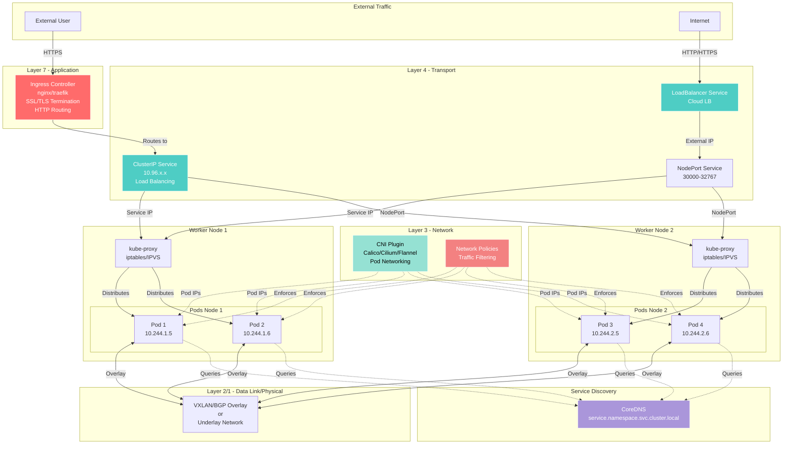

# Module 03: Kubernetes Networking

## Overview

**Estimated Time:** 4-5 hours

**Module Type:** Deep Dive

**Prerequisites:**
- Module 01 - Kubernetes Basics
- Module 02 - Control Plane and Cluster Components
- Basic understanding of networking concepts (IP, TCP/UDP, DNS)

Kubernetes networking is one of the most complex aspects of the platform. This module covers the Container Network Interface (CNI), Service types, Ingress controllers, and Network Policies. You'll learn how Kubernetes implements networking to enable Pod-to-Pod communication, service discovery, and traffic management while maintaining security and performance.

---

## Learning Objectives

By the end of this module, you will be able to:

1. Explain the Kubernetes networking model and its requirements
2. Understand CNI plugins and compare popular implementations (Calico, Cilium, Flannel)
3. Configure different Service types and understand their use cases
4. Deploy and configure Ingress controllers for external access
5. Implement Network Policies for micro-segmentation
6. Troubleshoot common networking issues
7. Apply networking security best practices
8. Design network architectures for multi-tenant clusters

---

## 1. Kubernetes Networking Model

### 1.1 Fundamental Requirements

The Kubernetes networking model has four key requirements:

1. **Pods can communicate with all other Pods** on any node without NAT
2. **Agents on a node** (e.g., kubelet) can communicate with all Pods on that node
3. **Pods in the host network** of a node can communicate with all Pods on all nodes without NAT
4. **Each Pod gets its own unique IP address**

### 1.2 Network Namespaces

Pods use Linux network namespaces to provide network isolation:

```bash
# View network namespaces
ip netns list

# Execute command in Pod's network namespace
nsenter --net=/var/run/netns/cni-xxx ip addr

# View Pod networking from node
crictl inspectp <pod-id> | jq '.info.runtimeSpec.linux.namespaces'
```

### 1.3 IP Address Management (IPAM)

**Cluster IP Ranges:**
- **Pod CIDR:** IP range for Pod IPs (e.g., 10.244.0.0/16)
- **Service CIDR:** IP range for Service IPs (e.g., 10.96.0.0/12)
- **Node CIDR:** IP range for node IPs (varies by infrastructure)

**Example cluster-wide IP allocation:**

```yaml
# kube-controller-manager configuration
- --cluster-cidr=10.244.0.0/16       # Pod network
- --service-cluster-ip-range=10.96.0.0/12  # Service network
- --allocate-node-cidrs=true
- --node-cidr-mask-size=24           # Each node gets /24 subnet
```

---

## 2. Container Network Interface (CNI)

### 2.1 What is CNI?

CNI (Container Network Interface) is a specification and libraries for configuring network interfaces in Linux containers. CNI plugins are responsible for:

- Assigning IP addresses to Pods
- Setting up network interfaces
- Configuring routes
- Implementing network policies

**CNI Configuration:**

```json
{
  "cniVersion": "0.4.0",
  "name": "k8s-pod-network",
  "plugins": [
    {
      "type": "calico",
      "datastore_type": "kubernetes",
      "mtu": 1440,
      "ipam": {
        "type": "calico-ipam",
        "assign_ipv4": "true",
        "assign_ipv6": "false"
      },
      "policy": {
        "type": "k8s"
      },
      "kubernetes": {
        "kubeconfig": "/etc/cni/net.d/calico-kubeconfig"
      }
    },
    {
      "type": "portmap",
      "capabilities": {"portMappings": true}
    },
    {
      "type": "bandwidth",
      "capabilities": {"bandwidth": true}
    }
  ]
}
```

### 2.2 Calico

**Overview:**
- Layer 3 networking using BGP
- Network policy enforcement
- Both overlay (VXLAN, IPIP) and underlay (BGP) modes
- High performance and scalability

**Installation:**

```yaml
# Install Calico operator
kubectl create -f https://raw.githubusercontent.com/projectcalico/calico/v3.26.0/manifests/tigera-operator.yaml

# Install Calico custom resources
apiVersion: operator.tigera.io/v1
kind: Installation
metadata:
  name: default
spec:
  calicoNetwork:
    ipPools:
    - blockSize: 26
      cidr: 10.244.0.0/16
      encapsulation: VXLANCrossSubnet
      natOutgoing: Enabled
      nodeSelector: all()
  registry: quay.io/
---
apiVersion: operator.tigera.io/v1
kind: APIServer
metadata:
  name: default
spec: {}
```

**Calico Features:**

```yaml
# Enable IP-in-IP encapsulation
apiVersion: projectcalico.org/v3
kind: IPPool
metadata:
  name: default-ipv4-ippool
spec:
  cidr: 10.244.0.0/16
  ipipMode: CrossSubnet
  natOutgoing: true
  nodeSelector: all()
```

**Advantages:**
- Excellent network policy support
- High performance in BGP mode
- Flexible encapsulation options
- Extensive documentation

**Disadvantages:**
- More complex to configure
- BGP requires networking knowledge
- Overhead in overlay modes

### 2.3 Cilium

**Overview:**
- eBPF-based networking and security
- Layer 7 network policies
- Built-in observability with Hubble
- Service mesh capabilities

**Installation:**

```bash
# Install Cilium CLI
curl -L --remote-name-all https://github.com/cilium/cilium-cli/releases/latest/download/cilium-linux-amd64.tar.gz
tar xzvfC cilium-linux-amd64.tar.gz /usr/local/bin

# Install Cilium
cilium install --version 1.14.0 \
  --set ipam.mode=kubernetes \
  --set tunnel=vxlan \
  --set encryption.enabled=true \
  --set encryption.type=wireguard
```

**Cilium Configuration:**

```yaml
apiVersion: v1
kind: ConfigMap
metadata:
  name: cilium-config
  namespace: kube-system
data:
  enable-ipv4: "true"
  enable-ipv6: "false"
  tunnel: "vxlan"
  monitor-aggregation: "medium"
  ipam: "kubernetes"
  enable-bpf-masquerade: "true"
  enable-hubble: "true"
  hubble-listen-address: ":4244"
  enable-policy: "default"
  policy-audit-mode: "false"
  enable-l7-proxy: "true"
  enable-wireguard: "true"
```

**Layer 7 Network Policy Example:**

```yaml
apiVersion: cilium.io/v2
kind: CiliumNetworkPolicy
metadata:
  name: api-access-control
spec:
  endpointSelector:
    matchLabels:
      app: api-server
  ingress:
  - fromEndpoints:
    - matchLabels:
        app: frontend
    toPorts:
    - ports:
      - port: "80"
        protocol: TCP
      rules:
        http:
        - method: "GET"
          path: "/api/v1/.*"
        - method: "POST"
          path: "/api/v1/users"
```

**Advantages:**
- High performance with eBPF
- Advanced observability
- Layer 7 policy support
- Transparent encryption

**Disadvantages:**
- Requires recent kernel (5.4+)
- More complex troubleshooting
- Higher learning curve

### 2.4 Flannel

**Overview:**
- Simple overlay network
- Easy to set up and maintain
- Supports multiple backends (VXLAN, host-gw, WireGuard)
- No network policy support (requires additional CNI)

**Installation:**

```bash
kubectl apply -f https://github.com/flannel-io/flannel/releases/latest/download/kube-flannel.yml
```

**Configuration:**

```json
{
  "Network": "10.244.0.0/16",
  "Backend": {
    "Type": "vxlan",
    "VNI": 1,
    "Port": 8472
  }
}
```

**Advantages:**
- Simple and easy to understand
- Minimal configuration
- Stable and reliable
- Low overhead

**Disadvantages:**
- No built-in network policies
- Limited features
- Less flexible than alternatives

### 2.5 CNI Comparison

| Feature | Calico | Cilium | Flannel |
|---------|--------|--------|---------|
| Network Policies | Yes | Yes (L3-L7) | No |
| Encryption | Yes | Yes (WireGuard) | Yes (WireGuard) |
| Observability | Basic | Advanced (Hubble) | None |
| Performance | High | Very High | Good |
| Complexity | Medium | High | Low |
| Service Mesh | No | Yes | No |
| Windows Support | Yes | Limited | Yes |

---

## 3. Services

### 3.1 ClusterIP

Default service type. Exposes service on an internal cluster IP.

```yaml
apiVersion: v1
kind: Service
metadata:
  name: backend-api
  labels:
    app: backend
spec:
  type: ClusterIP
  selector:
    app: backend
    tier: api
  ports:
  - name: http
    port: 80
    targetPort: 8080
    protocol: TCP
  - name: grpc
    port: 9090
    targetPort: 9090
    protocol: TCP
  sessionAffinity: ClientIP
  sessionAffinityConfig:
    clientIP:
      timeoutSeconds: 10800
```

**DNS Resolution:**
- Within same namespace: `backend-api`
- From other namespace: `backend-api.default.svc.cluster.local`
- Full FQDN: `backend-api.default.svc.cluster.local`

**Use Cases:**
- Internal service communication
- Microservices architecture
- Backend services not exposed externally

### 3.2 NodePort

Exposes service on each node's IP at a static port (30000-32767).

```yaml
apiVersion: v1
kind: Service
metadata:
  name: web-nodeport
spec:
  type: NodePort
  selector:
    app: web
  ports:
  - port: 80
    targetPort: 8080
    nodePort: 30080
    protocol: TCP
```

**Access:**
- From outside cluster: `http://<any-node-ip>:30080`
- From inside cluster: `http://web-nodeport:80`

**Use Cases:**
- Development and testing
- On-premises without load balancer
- Temporary external access

**Limitations:**
- Only one service per port
- Limited port range (30000-32767)
- Requires knowledge of node IPs
- No built-in load balancing across nodes

### 3.3 LoadBalancer

Provisions an external load balancer (cloud provider dependent).

```yaml
apiVersion: v1
kind: Service
metadata:
  name: web-lb
  annotations:
    service.beta.kubernetes.io/aws-load-balancer-type: "nlb"
    service.beta.kubernetes.io/aws-load-balancer-internal: "false"
    service.beta.kubernetes.io/aws-load-balancer-cross-zone-load-balancing-enabled: "true"
spec:
  type: LoadBalancer
  selector:
    app: web
  ports:
  - port: 80
    targetPort: 8080
    protocol: TCP
  loadBalancerSourceRanges:
  - "203.0.113.0/24"  # Restrict source IPs
  externalTrafficPolicy: Local  # Preserve source IP
```

**Cloud Provider Examples:**

**AWS:**
```yaml
metadata:
  annotations:
    service.beta.kubernetes.io/aws-load-balancer-type: "nlb"
    service.beta.kubernetes.io/aws-load-balancer-ssl-cert: "arn:aws:acm:..."
    service.beta.kubernetes.io/aws-load-balancer-backend-protocol: "http"
```

**GCP:**
```yaml
metadata:
  annotations:
    cloud.google.com/load-balancer-type: "Internal"
    networking.gke.io/load-balancer-type: "Internal"
```

**Azure:**
```yaml
metadata:
  annotations:
    service.beta.kubernetes.io/azure-load-balancer-internal: "true"
```

**Use Cases:**
- Production external services
- Cloud deployments
- HTTP/HTTPS services
- TCP/UDP load balancing

### 3.4 Headless Services

Services without a cluster IP, used for direct Pod-to-Pod communication.

```yaml
apiVersion: v1
kind: Service
metadata:
  name: database-headless
spec:
  clusterIP: None  # Headless service
  selector:
    app: database
  ports:
  - port: 5432
    targetPort: 5432
```

**Use Cases:**
- StatefulSets
- Service discovery without load balancing
- Client-side load balancing
- Database clusters

### 3.5 ExternalName

Maps a service to a DNS name.

```yaml
apiVersion: v1
kind: Service
metadata:
  name: external-db
  namespace: production
spec:
  type: ExternalName
  externalName: prod-db.example.com
  ports:
  - port: 5432
```

**Use Cases:**
- External service integration
- Migration from external to in-cluster services
- Service abstraction

---

## 4. Ingress

### 4.1 What is Ingress?

Ingress exposes HTTP and HTTPS routes from outside the cluster to services within the cluster. It provides:

- HTTP(S) routing
- SSL/TLS termination
- Name-based virtual hosting
- Path-based routing
- Load balancing

### 4.2 Ingress Controllers

**Popular Ingress Controllers:**
- **NGINX Ingress Controller:** Most widely used
- **Traefik:** Modern, feature-rich
- **HAProxy Ingress:** High performance
- **Contour:** VMware-backed, uses Envoy
- **Ambassador/Emissary:** API Gateway features
- **Istio Gateway:** Service mesh integration

### 4.3 NGINX Ingress Controller

**Installation:**

```bash
kubectl apply -f https://raw.githubusercontent.com/kubernetes/ingress-nginx/controller-v1.8.0/deploy/static/provider/cloud/deploy.yaml
```

**Basic Ingress:**

```yaml
apiVersion: networking.k8s.io/v1
kind: Ingress
metadata:
  name: web-ingress
  annotations:
    nginx.ingress.kubernetes.io/rewrite-target: /
spec:
  ingressClassName: nginx
  rules:
  - host: www.example.com
    http:
      paths:
      - path: /
        pathType: Prefix
        backend:
          service:
            name: web-service
            port:
              number: 80
```

**TLS/SSL Ingress:**

```yaml
apiVersion: v1
kind: Secret
metadata:
  name: tls-secret
type: kubernetes.io/tls
data:
  tls.crt: <base64-encoded-cert>
  tls.key: <base64-encoded-key>
---
apiVersion: networking.k8s.io/v1
kind: Ingress
metadata:
  name: web-ingress-tls
  annotations:
    cert-manager.io/cluster-issuer: "letsencrypt-prod"
    nginx.ingress.kubernetes.io/ssl-redirect: "true"
spec:
  ingressClassName: nginx
  tls:
  - hosts:
    - www.example.com
    secretName: tls-secret
  rules:
  - host: www.example.com
    http:
      paths:
      - path: /
        pathType: Prefix
        backend:
          service:
            name: web-service
            port:
              number: 80
```

**Advanced Routing:**

```yaml
apiVersion: networking.k8s.io/v1
kind: Ingress
metadata:
  name: api-ingress
  annotations:
    nginx.ingress.kubernetes.io/use-regex: "true"
    nginx.ingress.kubernetes.io/rate-limit: "100"
    nginx.ingress.kubernetes.io/limit-rps: "10"
    nginx.ingress.kubernetes.io/auth-type: basic
    nginx.ingress.kubernetes.io/auth-secret: basic-auth
spec:
  ingressClassName: nginx
  rules:
  - host: api.example.com
    http:
      paths:
      - path: /v1/users
        pathType: Prefix
        backend:
          service:
            name: user-api
            port:
              number: 8080
      - path: /v1/orders
        pathType: Prefix
        backend:
          service:
            name: order-api
            port:
              number: 8080
      - path: /v2/.*
        pathType: ImplementationSpecific
        backend:
          service:
            name: api-v2
            port:
              number: 8080
```

### 4.4 cert-manager for TLS

```yaml
# Install cert-manager
kubectl apply -f https://github.com/cert-manager/cert-manager/releases/download/v1.12.0/cert-manager.yaml

# ClusterIssuer for Let's Encrypt
apiVersion: cert-manager.io/v1
kind: ClusterIssuer
metadata:
  name: letsencrypt-prod
spec:
  acme:
    server: https://acme-v02.api.letsencrypt.org/directory
    email: admin@example.com
    privateKeySecretRef:
      name: letsencrypt-prod
    solvers:
    - http01:
        ingress:
          class: nginx
```

---

## 5. Network Policies

### 5.1 What are Network Policies?

Network Policies are specifications for controlling network traffic between Pods. They provide micro-segmentation and implement zero-trust networking.

**Requirements:**
- CNI plugin must support Network Policies (Calico, Cilium, etc.)
- Policies are namespace-scoped
- Default deny is recommended

### 5.2 Default Deny Policy

**Deny all ingress:**

```yaml
apiVersion: networking.k8s.io/v1
kind: NetworkPolicy
metadata:
  name: default-deny-ingress
  namespace: production
spec:
  podSelector: {}
  policyTypes:
  - Ingress
```

**Deny all egress:**

```yaml
apiVersion: networking.k8s.io/v1
kind: NetworkPolicy
metadata:
  name: default-deny-egress
  namespace: production
spec:
  podSelector: {}
  policyTypes:
  - Egress
```

**Deny all ingress and egress:**

```yaml
apiVersion: networking.k8s.io/v1
kind: NetworkPolicy
metadata:
  name: default-deny-all
  namespace: production
spec:
  podSelector: {}
  policyTypes:
  - Ingress
  - Egress
```

### 5.3 Allow Specific Traffic

**Allow from same namespace:**

```yaml
apiVersion: networking.k8s.io/v1
kind: NetworkPolicy
metadata:
  name: allow-same-namespace
  namespace: production
spec:
  podSelector:
    matchLabels:
      app: api
  policyTypes:
  - Ingress
  ingress:
  - from:
    - podSelector: {}
```

**Allow from specific Pods:**

```yaml
apiVersion: networking.k8s.io/v1
kind: NetworkPolicy
metadata:
  name: api-allow-frontend
  namespace: production
spec:
  podSelector:
    matchLabels:
      app: api
      tier: backend
  policyTypes:
  - Ingress
  ingress:
  - from:
    - podSelector:
        matchLabels:
          app: frontend
    ports:
    - protocol: TCP
      port: 8080
```

**Allow from specific namespace:**

```yaml
apiVersion: networking.k8s.io/v1
kind: NetworkPolicy
metadata:
  name: allow-from-monitoring
  namespace: production
spec:
  podSelector:
    matchLabels:
      app: api
  policyTypes:
  - Ingress
  ingress:
  - from:
    - namespaceSelector:
        matchLabels:
          name: monitoring
    ports:
    - protocol: TCP
      port: 9090
```

### 5.4 Egress Policies

**Allow DNS and specific external service:**

```yaml
apiVersion: networking.k8s.io/v1
kind: NetworkPolicy
metadata:
  name: api-egress
  namespace: production
spec:
  podSelector:
    matchLabels:
      app: api
  policyTypes:
  - Egress
  egress:
  # Allow DNS
  - to:
    - namespaceSelector:
        matchLabels:
          name: kube-system
    ports:
    - protocol: UDP
      port: 53
  # Allow to database
  - to:
    - podSelector:
        matchLabels:
          app: database
    ports:
    - protocol: TCP
      port: 5432
  # Allow to external API
  - to:
    - ipBlock:
        cidr: 0.0.0.0/0
        except:
        - 169.254.169.254/32  # Block metadata service
    ports:
    - protocol: TCP
      port: 443
```

### 5.5 Complete Example: Three-Tier Application

```yaml
# Frontend Network Policy
apiVersion: networking.k8s.io/v1
kind: NetworkPolicy
metadata:
  name: frontend-netpol
  namespace: production
spec:
  podSelector:
    matchLabels:
      tier: frontend
  policyTypes:
  - Ingress
  - Egress
  ingress:
  # Allow from Ingress controller
  - from:
    - namespaceSelector:
        matchLabels:
          name: ingress-nginx
    ports:
    - protocol: TCP
      port: 8080
  egress:
  # Allow DNS
  - to:
    - namespaceSelector:
        matchLabels:
          name: kube-system
      podSelector:
        matchLabels:
          k8s-app: kube-dns
    ports:
    - protocol: UDP
      port: 53
  # Allow to backend
  - to:
    - podSelector:
        matchLabels:
          tier: backend
    ports:
    - protocol: TCP
      port: 8080
---
# Backend Network Policy
apiVersion: networking.k8s.io/v1
kind: NetworkPolicy
metadata:
  name: backend-netpol
  namespace: production
spec:
  podSelector:
    matchLabels:
      tier: backend
  policyTypes:
  - Ingress
  - Egress
  ingress:
  # Allow from frontend
  - from:
    - podSelector:
        matchLabels:
          tier: frontend
    ports:
    - protocol: TCP
      port: 8080
  egress:
  # Allow DNS
  - to:
    - namespaceSelector:
        matchLabels:
          name: kube-system
      podSelector:
        matchLabels:
          k8s-app: kube-dns
    ports:
    - protocol: UDP
      port: 53
  # Allow to database
  - to:
    - podSelector:
        matchLabels:
          tier: database
    ports:
    - protocol: TCP
      port: 5432
---
# Database Network Policy
apiVersion: networking.k8s.io/v1
kind: NetworkPolicy
metadata:
  name: database-netpol
  namespace: production
spec:
  podSelector:
    matchLabels:
      tier: database
  policyTypes:
  - Ingress
  - Egress
  ingress:
  # Allow from backend only
  - from:
    - podSelector:
        matchLabels:
          tier: backend
    ports:
    - protocol: TCP
      port: 5432
  egress:
  # Allow DNS only
  - to:
    - namespaceSelector:
        matchLabels:
          name: kube-system
      podSelector:
        matchLabels:
          k8s-app: kube-dns
    ports:
    - protocol: UDP
      port: 53
```

---

## 6. Networking Layers Diagram



---

## 7. Best Practices

### 7.1 CNI Best Practices

1. **Choose appropriate CNI for your use case**
   - Calico: Enterprise features, network policies
   - Cilium: Advanced security, observability
   - Flannel: Simplicity

2. **Use overlay only when necessary**
   - Underlay/BGP for better performance
   - Overlay for flexibility and ease

3. **Enable encryption for multi-tenant clusters**
   - WireGuard encryption (Calico, Cilium)
   - IPSec for compliance

4. **Monitor CNI performance**
   - Network latency
   - Packet loss
   - CNI plugin errors

### 7.2 Service Best Practices

1. **Use ClusterIP for internal services**
   - More secure
   - Better performance
   - Simpler networking

2. **Avoid NodePort in production**
   - Use Ingress instead
   - Limited port range
   - Security concerns

3. **Configure health checks**
   - Readiness probes
   - Liveness probes
   - Startup probes

4. **Use sessionAffinity judiciously**
   - Only when necessary
   - Can cause load imbalance

### 7.3 Ingress Best Practices

1. **Always use TLS/SSL**
   - cert-manager for automation
   - Strong cipher suites
   - TLS 1.2 minimum

2. **Implement rate limiting**
   - Prevent abuse
   - Protect backend services
   - DDoS mitigation

3. **Use authentication/authorization**
   - OAuth2/OIDC
   - Basic auth for testing only
   - External auth services

4. **Monitor Ingress metrics**
   - Request rates
   - Error rates
   - Latency

### 7.4 Network Policy Best Practices

1. **Implement default deny**
   - Start with deny-all
   - Add explicit allows
   - Zero-trust approach

2. **Use namespace isolation**
   - Label namespaces
   - Control cross-namespace traffic
   - Enforce tenant isolation

3. **Allow DNS explicitly**
   - Required for most workloads
   - Allow to kube-dns/CoreDNS
   - UDP port 53

4. **Document network policies**
   - Policy purpose
   - Affected services
   - Change history

5. **Test policies thoroughly**
   - Use network policy simulators
   - Test in non-production first
   - Have rollback plan

---

## 8. Anti-Patterns and Common Mistakes

### 8.1 Networking Anti-Patterns

❌ **No network policies**
- All Pods can communicate
- No micro-segmentation
- Security risk

❌ **Overly permissive policies**
```yaml
# TOO PERMISSIVE
egress:
- to:
  - ipBlock:
      cidr: 0.0.0.0/0  # Allow all egress!
```

❌ **Using hostNetwork unnecessarily**
```yaml
# AVOID unless absolutely necessary
spec:
  hostNetwork: true
  containers:
  - name: app
    image: myapp:1.0
```

### 8.2 Service Anti-Patterns

❌ **Selector mismatch**
```yaml
# Service selector doesn't match any Pods
Service: app=frontend
Pod labels: app=front-end
```

❌ **No readiness probe**
- Traffic sent to unavailable Pods
- Service disruption
- Poor user experience

❌ **Wrong service type**
- LoadBalancer for internal services (expensive)
- NodePort for production (insecure)
- ClusterIP for external access (won't work)

### 8.3 Ingress Anti-Patterns

❌ **No TLS**
- Data transmitted in clear text
- Credentials exposed
- Compliance violations

❌ **Wildcard hosts without authentication**
```yaml
# INSECURE
spec:
  rules:
  - host: "*.example.com"  # Too permissive
```

❌ **No rate limiting**
- Vulnerable to abuse
- No DDoS protection
- Resource exhaustion

---

## 9. Hands-on Lab References

This module includes the following hands-on labs in the `/labs/03-networking/` directory:

1. **Lab 3.1: CNI Plugin Installation**
   - Install and configure Calico
   - Compare with Cilium
   - Test Pod-to-Pod communication
   - File: `/labs/03-networking/lab-3.1-cni-setup.md`

2. **Lab 3.2: Service Types**
   - Create ClusterIP, NodePort, LoadBalancer services
   - Test service discovery
   - Configure session affinity
   - File: `/labs/03-networking/lab-3.2-services.md`

3. **Lab 3.3: Ingress Configuration**
   - Deploy NGINX Ingress Controller
   - Configure TLS with cert-manager
   - Implement path-based routing
   - File: `/labs/03-networking/lab-3.3-ingress.md`

4. **Lab 3.4: Network Policies**
   - Implement default deny
   - Create allow policies
   - Test policy enforcement
   - Troubleshoot connectivity
   - File: `/labs/03-networking/lab-3.4-network-policies.md`

---

## 10. Security Checklist

### CNI Security
- [ ] Enable encryption in transit (WireGuard/IPSec)
- [ ] Use network policies (choose CNI that supports them)
- [ ] Restrict CNI plugin permissions
- [ ] Monitor CNI component logs
- [ ] Keep CNI plugins updated
- [ ] Use separate network for control plane

### Service Security
- [ ] Use ClusterIP for internal services
- [ ] Implement Network Policies for service endpoints
- [ ] Configure appropriate session affinity
- [ ] Use headless services for StatefulSets
- [ ] Restrict LoadBalancer source ranges
- [ ] Use externalTrafficPolicy: Local when needed

### Ingress Security
- [ ] Always use TLS/SSL in production
- [ ] Implement rate limiting
- [ ] Configure authentication (OAuth2/OIDC)
- [ ] Use WAF (Web Application Firewall)
- [ ] Restrict allowed hosts
- [ ] Enable access logging
- [ ] Implement DDoS protection
- [ ] Use strong TLS ciphers (TLS 1.2+)
- [ ] Implement HSTS headers
- [ ] Regular security scanning

### Network Policy Security
- [ ] Implement default deny policies
- [ ] Use namespace isolation
- [ ] Allow DNS explicitly
- [ ] Block metadata service (169.254.169.254)
- [ ] Document all policies
- [ ] Test policies before production
- [ ] Regular policy audits
- [ ] Monitor policy violations
- [ ] Implement egress filtering
- [ ] Use label-based policies

---

## 11. References

1. **Kubernetes Official Documentation**
   - Networking Model: https://kubernetes.io/docs/concepts/cluster-administration/networking/
   - Services: https://kubernetes.io/docs/concepts/services-networking/service/
   - Ingress: https://kubernetes.io/docs/concepts/services-networking/ingress/
   - Network Policies: https://kubernetes.io/docs/concepts/services-networking/network-policies/

2. **CNI Documentation**
   - CNI Specification: https://github.com/containernetworking/cni
   - Calico Documentation: https://docs.tigera.io/calico/latest/about/
   - Cilium Documentation: https://docs.cilium.io/
   - Flannel Documentation: https://github.com/flannel-io/flannel

3. **Ingress Controllers**
   - NGINX Ingress: https://kubernetes.github.io/ingress-nginx/
   - Traefik: https://doc.traefik.io/traefik/
   - cert-manager: https://cert-manager.io/docs/

4. **Security Resources**
   - Network Policy Recipes: https://github.com/ahmetb/kubernetes-network-policy-recipes
   - CIS Kubernetes Benchmark: https://www.cisecurity.org/benchmark/kubernetes
   - NSA/CISA Kubernetes Hardening Guide: https://media.defense.gov/2022/Aug/29/2003066362/-1/-1/0/CTR_KUBERNETES_HARDENING_GUIDANCE_1.2_20220829.PDF

5. **CNCF Resources**
   - CNCF Network SIG: https://github.com/kubernetes/community/tree/master/sig-network
   - Service Mesh Landscape: https://landscape.cncf.io/guide#orchestration-management--service-mesh

6. **Books and Guides**
   - "Kubernetes Networking" by James Strong and Vallery Lancey (O'Reilly)
   - "Container Networking" by Michael Hausenblas (O'Reilly)

---

## Summary

In this module, you learned about Kubernetes networking:

**Networking Model:**
- Pod-to-Pod communication without NAT
- Each Pod gets unique IP
- Service abstraction for stable endpoints

**CNI Plugins:**
- Calico for enterprise features and network policies
- Cilium for eBPF-based performance and L7 policies
- Flannel for simplicity

**Services:**
- ClusterIP for internal communication
- NodePort for simple external access
- LoadBalancer for production external services
- Headless services for StatefulSets

**Ingress:**
- HTTP/HTTPS routing and load balancing
- TLS termination
- Path and host-based routing
- Integration with cert-manager

**Network Policies:**
- Micro-segmentation and zero-trust
- Default deny approach
- Namespace and Pod-level isolation

---

**Next Module:** [04-storage.md](./04-storage.md) - Kubernetes Storage
