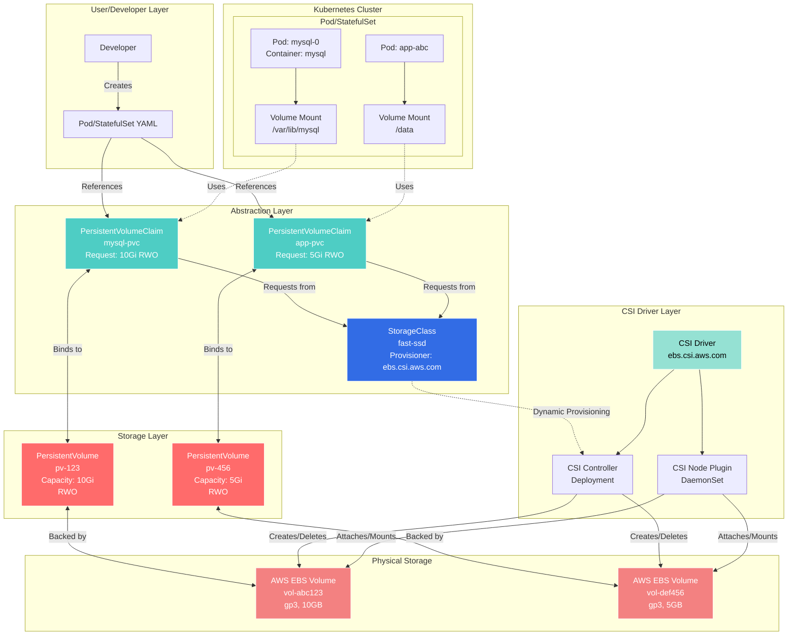

# Module 04: Kubernetes Storage

## Overview

**Estimated Time:** 4-5 hours

**Module Type:** Deep Dive

**Prerequisites:**
- Module 01 - Kubernetes Basics
- Module 02 - Control Plane and Cluster Components
- Basic understanding of storage concepts (block, file, object storage)

Storage in Kubernetes is a critical component for stateful applications. This module covers the various storage abstractions Kubernetes provides, from ephemeral volumes to persistent storage with dynamic provisioning. You'll learn about Volumes, PersistentVolumes (PV), PersistentVolumeClaims (PVC), StorageClasses, and how to deploy stateful applications using StatefulSets.

---

## Learning Objectives

By the end of this module, you will be able to:

1. Understand the different types of Kubernetes volumes and their use cases
2. Configure PersistentVolumes and PersistentVolumeClaims
3. Implement dynamic provisioning with StorageClasses
4. Work with Container Storage Interface (CSI) drivers
5. Deploy and manage StatefulSets for stateful applications
6. Implement backup and disaster recovery strategies
7. Apply storage security best practices
8. Troubleshoot common storage issues

---

## 1. Volume Fundamentals

### 1.1 Why Volumes?

Containers are ephemeral—when they restart, all data is lost. Volumes solve this problem by providing persistent storage that outlives individual containers.

**Key Concepts:**
- Volumes are defined in Pod specifications
- Mounted into container filesystems
- Lifetime tied to Pod (for most volume types)
- Can be shared between containers in a Pod

### 1.2 Volume Types Overview

Kubernetes supports many volume types:

**Ephemeral:**
- `emptyDir` - Empty directory, lifecycle tied to Pod
- `configMap` - Configuration data
- `secret` - Sensitive data
- `downwardAPI` - Pod/container metadata

**Persistent:**
- `hostPath` - Node filesystem (development only)
- `persistentVolumeClaim` - Abstract persistent storage
- CSI volumes - Via Container Storage Interface

**Cloud Provider:**
- `awsElasticBlockStore` - AWS EBS
- `azureDisk` / `azureFile` - Azure storage
- `gcePersistentDisk` - GCP Persistent Disk

**Network:**
- `nfs` - Network File System
- `cephfs` - Ceph filesystem
- `glusterfs` - GlusterFS

---

## 2. Basic Volume Types

### 2.1 emptyDir

Temporary directory created when Pod is assigned to node. Deleted when Pod is removed.

```yaml
apiVersion: v1
kind: Pod
metadata:
  name: cache-pod
spec:
  containers:
  - name: app
    image: myapp:1.0
    volumeMounts:
    - name: cache-volume
      mountPath: /cache
  - name: cache-warmer
    image: cache-warmer:1.0
    volumeMounts:
    - name: cache-volume
      mountPath: /cache
  volumes:
  - name: cache-volume
    emptyDir:
      sizeLimit: 1Gi  # Optional size limit
```

**Use Cases:**
- Scratch space for computations
- Cache storage
- Shared storage between containers in same Pod

**emptyDir with Memory:**

```yaml
volumes:
- name: memory-volume
  emptyDir:
    medium: Memory  # Use tmpfs (RAM)
    sizeLimit: 256Mi
```

### 2.2 hostPath

Mounts a file or directory from the host node's filesystem.

```yaml
apiVersion: v1
kind: Pod
metadata:
  name: hostpath-pod
spec:
  containers:
  - name: app
    image: myapp:1.0
    volumeMounts:
    - name: host-volume
      mountPath: /host-data
      readOnly: true
  volumes:
  - name: host-volume
    hostPath:
      path: /var/data
      type: Directory
```

**hostPath Types:**
- `Directory` - Must exist
- `DirectoryOrCreate` - Create if doesn't exist
- `File` - Must exist
- `FileOrCreate` - Create if doesn't exist
- `Socket` - Unix socket
- `CharDevice` / `BlockDevice` - Device files

**⚠️ Security Warning:**
- Avoid in production
- Pods can access host filesystem
- Security risk
- Node affinity issues

### 2.3 ConfigMap Volumes

Mount ConfigMaps as volumes to inject configuration files.

```yaml
apiVersion: v1
kind: ConfigMap
metadata:
  name: app-config
data:
  app.conf: |
    server {
      listen 80;
      server_name example.com;
    }
  logging.conf: |
    level: info
    format: json
---
apiVersion: v1
kind: Pod
metadata:
  name: configmap-pod
spec:
  containers:
  - name: app
    image: myapp:1.0
    volumeMounts:
    - name: config-volume
      mountPath: /etc/config
      readOnly: true
  volumes:
  - name: config-volume
    configMap:
      name: app-config
      items:
      - key: app.conf
        path: app.conf
      - key: logging.conf
        path: logging.conf
```

### 2.4 Secret Volumes

Mount Secrets as volumes for sensitive data.

```yaml
apiVersion: v1
kind: Secret
metadata:
  name: db-credentials
type: Opaque
stringData:
  username: admin
  password: SecureP@ssw0rd!
---
apiVersion: v1
kind: Pod
metadata:
  name: secret-pod
spec:
  containers:
  - name: app
    image: myapp:1.0
    volumeMounts:
    - name: secret-volume
      mountPath: /etc/secrets
      readOnly: true
  volumes:
  - name: secret-volume
    secret:
      secretName: db-credentials
      defaultMode: 0400  # Read-only for owner
```

---

## 3. Persistent Volumes and Claims

### 3.1 PersistentVolume (PV)

A PersistentVolume is a piece of storage in the cluster that has been provisioned by an administrator or dynamically provisioned using StorageClasses.

**Lifecycle:**
- Independent of any Pod
- Can be pre-provisioned or dynamically provisioned
- Reclaimed when claim is deleted

**Example PV:**

```yaml
apiVersion: v1
kind: PersistentVolume
metadata:
  name: mysql-pv
  labels:
    type: local
spec:
  storageClassName: manual
  capacity:
    storage: 10Gi
  accessModes:
  - ReadWriteOnce
  persistentVolumeReclaimPolicy: Retain
  hostPath:
    path: /mnt/data
```

**Access Modes:**
- `ReadWriteOnce (RWO)` - Mounted read-write by single node
- `ReadOnlyMany (ROX)` - Mounted read-only by many nodes
- `ReadWriteMany (RWX)` - Mounted read-write by many nodes
- `ReadWriteOncePod (RWOP)` - Mounted read-write by single Pod (1.27+)

**Reclaim Policies:**
- `Retain` - Manual reclamation (data preserved)
- `Delete` - Volume deleted when claim released
- `Recycle` - Basic scrub (deprecated)

### 3.2 PersistentVolumeClaim (PVC)

A request for storage by a user. Claims can request specific size and access modes.

```yaml
apiVersion: v1
kind: PersistentVolumeClaim
metadata:
  name: mysql-pvc
spec:
  storageClassName: manual
  accessModes:
  - ReadWriteOnce
  resources:
    requests:
      storage: 5Gi
  selector:
    matchLabels:
      type: local
```

**Using PVC in Pod:**

```yaml
apiVersion: v1
kind: Pod
metadata:
  name: mysql-pod
spec:
  containers:
  - name: mysql
    image: mysql:8.0
    env:
    - name: MYSQL_ROOT_PASSWORD
      valueFrom:
        secretKeyRef:
          name: mysql-secret
          key: password
    volumeMounts:
    - name: mysql-storage
      mountPath: /var/lib/mysql
  volumes:
  - name: mysql-storage
    persistentVolumeClaim:
      claimName: mysql-pvc
```

### 3.3 PV/PVC Binding

**Binding Process:**
1. User creates PVC with requirements
2. Control plane watches for new PVCs
3. Finds matching PV based on:
   - Storage class
   - Access modes
   - Capacity
   - Selector labels
4. Binds PVC to PV
5. PVC status becomes `Bound`

**PVC States:**
- `Pending` - Waiting for binding or provisioning
- `Bound` - Bound to a PV
- `Lost` - PV was deleted but claim still exists

---

## 4. StorageClasses and Dynamic Provisioning

### 4.1 What are StorageClasses?

StorageClasses provide a way to describe "classes" of storage with different performance characteristics, backup policies, or arbitrary policies.

**Benefits:**
- Dynamic provisioning (no pre-creation needed)
- Abstraction of storage implementation
- Different tiers (SSD, HDD, etc.)
- Automated lifecycle management

### 4.2 StorageClass Examples

**AWS EBS:**

```yaml
apiVersion: storage.k8s.io/v1
kind: StorageClass
metadata:
  name: fast-ssd
provisioner: kubernetes.io/aws-ebs
parameters:
  type: gp3
  iops: "3000"
  throughput: "125"
  encrypted: "true"
  kmsKeyId: arn:aws:kms:us-east-1:123456789:key/...
allowVolumeExpansion: true
reclaimPolicy: Delete
volumeBindingMode: WaitForFirstConsumer
```

**GCP Persistent Disk:**

```yaml
apiVersion: storage.k8s.io/v1
kind: StorageClass
metadata:
  name: fast-gcp
provisioner: kubernetes.io/gce-pd
parameters:
  type: pd-ssd
  replication-type: regional-pd
allowVolumeExpansion: true
reclaimPolicy: Delete
volumeBindingMode: WaitForFirstConsumer
```

**Azure Disk:**

```yaml
apiVersion: storage.k8s.io/v1
kind: StorageClass
metadata:
  name: managed-premium
provisioner: kubernetes.io/azure-disk
parameters:
  storageaccounttype: Premium_LRS
  kind: Managed
allowVolumeExpansion: true
reclaimPolicy: Delete
volumeBindingMode: WaitForFirstConsumer
```

**NFS:**

```yaml
apiVersion: storage.k8s.io/v1
kind: StorageClass
metadata:
  name: nfs-storage
provisioner: nfs.csi.k8s.io
parameters:
  server: nfs-server.example.com
  share: /exports/kubernetes
mountOptions:
  - hard
  - nfsvers=4.1
reclaimPolicy: Retain
volumeBindingMode: Immediate
```

### 4.3 Volume Binding Modes

**Immediate:**
- PV created immediately when PVC is created
- May create volume in wrong zone/location

**WaitForFirstConsumer (recommended):**
- Delays PV binding/provisioning until Pod using PVC is created
- Ensures volume created in same zone as Pod
- Better for multi-zone clusters

### 4.4 Using StorageClass

```yaml
apiVersion: v1
kind: PersistentVolumeClaim
metadata:
  name: fast-storage-claim
spec:
  storageClassName: fast-ssd
  accessModes:
  - ReadWriteOnce
  resources:
    requests:
      storage: 100Gi
---
apiVersion: v1
kind: Pod
metadata:
  name: app-pod
spec:
  containers:
  - name: app
    image: myapp:1.0
    volumeMounts:
    - name: data
      mountPath: /data
  volumes:
  - name: data
    persistentVolumeClaim:
      claimName: fast-storage-claim
```

### 4.5 Default StorageClass

```yaml
apiVersion: storage.k8s.io/v1
kind: StorageClass
metadata:
  name: standard
  annotations:
    storageclass.kubernetes.io/is-default-class: "true"
provisioner: kubernetes.io/aws-ebs
parameters:
  type: gp3
```

---

## 5. Container Storage Interface (CSI)

### 5.1 What is CSI?

CSI is a standard for exposing storage systems to containerized workloads. It provides:

- Vendor-neutral storage interface
- Out-of-tree storage plugins
- Rich feature set (snapshots, cloning, expansion)

### 5.2 Popular CSI Drivers

**AWS EBS CSI:**

```bash
# Install EBS CSI driver
kubectl apply -k "github.com/kubernetes-sigs/aws-ebs-csi-driver/deploy/kubernetes/overlays/stable/?ref=release-1.20"
```

```yaml
apiVersion: storage.k8s.io/v1
kind: StorageClass
metadata:
  name: ebs-sc
provisioner: ebs.csi.aws.com
parameters:
  type: gp3
  encrypted: "true"
volumeBindingMode: WaitForFirstConsumer
allowVolumeExpansion: true
```

**Longhorn (Cloud-Native Storage):**

```bash
# Install Longhorn
kubectl apply -f https://raw.githubusercontent.com/longhorn/longhorn/v1.5.0/deploy/longhorn.yaml
```

```yaml
apiVersion: storage.k8s.io/v1
kind: StorageClass
metadata:
  name: longhorn
provisioner: driver.longhorn.io
allowVolumeExpansion: true
reclaimPolicy: Delete
volumeBindingMode: Immediate
parameters:
  numberOfReplicas: "3"
  staleReplicaTimeout: "2880"
  fromBackup: ""
  fsType: "ext4"
```

**Rook-Ceph:**

```yaml
apiVersion: storage.k8s.io/v1
kind: StorageClass
metadata:
  name: rook-ceph-block
provisioner: rook-ceph.rbd.csi.ceph.com
parameters:
  clusterID: rook-ceph
  pool: replicapool
  imageFormat: "2"
  imageFeatures: layering
  csi.storage.k8s.io/provisioner-secret-name: rook-csi-rbd-provisioner
  csi.storage.k8s.io/provisioner-secret-namespace: rook-ceph
  csi.storage.k8s.io/node-stage-secret-name: rook-csi-rbd-node
  csi.storage.k8s.io/node-stage-secret-namespace: rook-ceph
  csi.storage.k8s.io/fstype: ext4
allowVolumeExpansion: true
reclaimPolicy: Delete
```

### 5.3 Volume Snapshots

**VolumeSnapshotClass:**

```yaml
apiVersion: snapshot.storage.k8s.io/v1
kind: VolumeSnapshotClass
metadata:
  name: csi-snapclass
driver: ebs.csi.aws.com
deletionPolicy: Delete
```

**VolumeSnapshot:**

```yaml
apiVersion: snapshot.storage.k8s.io/v1
kind: VolumeSnapshot
metadata:
  name: mysql-snapshot
spec:
  volumeSnapshotClassName: csi-snapclass
  source:
    persistentVolumeClaimName: mysql-pvc
```

**Restore from Snapshot:**

```yaml
apiVersion: v1
kind: PersistentVolumeClaim
metadata:
  name: mysql-pvc-restored
spec:
  storageClassName: fast-ssd
  dataSource:
    name: mysql-snapshot
    kind: VolumeSnapshot
    apiGroup: snapshot.storage.k8s.io
  accessModes:
  - ReadWriteOnce
  resources:
    requests:
      storage: 10Gi
```

### 5.4 Volume Cloning

```yaml
apiVersion: v1
kind: PersistentVolumeClaim
metadata:
  name: cloned-pvc
spec:
  storageClassName: fast-ssd
  dataSource:
    name: source-pvc
    kind: PersistentVolumeClaim
  accessModes:
  - ReadWriteOnce
  resources:
    requests:
      storage: 10Gi
```

---

## 6. StatefulSets

### 6.1 What are StatefulSets?

StatefulSets manage stateful applications, providing:

- Stable, unique network identifiers
- Stable, persistent storage
- Ordered, graceful deployment and scaling
- Ordered, automated rolling updates

### 6.2 StatefulSet Example

```yaml
apiVersion: v1
kind: Service
metadata:
  name: mysql
  labels:
    app: mysql
spec:
  ports:
  - port: 3306
    name: mysql
  clusterIP: None  # Headless service
  selector:
    app: mysql
---
apiVersion: apps/v1
kind: StatefulSet
metadata:
  name: mysql
spec:
  serviceName: mysql
  replicas: 3
  selector:
    matchLabels:
      app: mysql
  template:
    metadata:
      labels:
        app: mysql
    spec:
      containers:
      - name: mysql
        image: mysql:8.0
        ports:
        - containerPort: 3306
          name: mysql
        env:
        - name: MYSQL_ROOT_PASSWORD
          valueFrom:
            secretKeyRef:
              name: mysql-secret
              key: password
        volumeMounts:
        - name: data
          mountPath: /var/lib/mysql
        - name: config
          mountPath: /etc/mysql/conf.d
      volumes:
      - name: config
        configMap:
          name: mysql-config
  volumeClaimTemplates:
  - metadata:
      name: data
    spec:
      accessModes:
      - ReadWriteOnce
      storageClassName: fast-ssd
      resources:
        requests:
          storage: 10Gi
```

### 6.3 StatefulSet Features

**Stable Network Identity:**
- Predictable Pod names: `mysql-0`, `mysql-1`, `mysql-2`
- Stable DNS: `mysql-0.mysql.default.svc.cluster.local`

**Ordered Operations:**
- Pods created in order: 0, 1, 2
- Pods deleted in reverse: 2, 1, 0
- Rolling updates sequential

**Persistent Storage:**
- volumeClaimTemplates create PVC per Pod
- PVCs not deleted when StatefulSet scaled down
- Data preserved across Pod restarts

### 6.4 Advanced StatefulSet

```yaml
apiVersion: apps/v1
kind: StatefulSet
metadata:
  name: cassandra
spec:
  serviceName: cassandra
  replicas: 3
  podManagementPolicy: Parallel  # Create Pods in parallel
  updateStrategy:
    type: RollingUpdate
    rollingUpdate:
      partition: 0  # Update all Pods
  selector:
    matchLabels:
      app: cassandra
  template:
    metadata:
      labels:
        app: cassandra
    spec:
      terminationGracePeriodSeconds: 1800
      affinity:
        podAntiAffinity:
          requiredDuringSchedulingIgnoredDuringExecution:
          - labelSelector:
              matchExpressions:
              - key: app
                operator: In
                values:
                - cassandra
            topologyKey: kubernetes.io/hostname
      containers:
      - name: cassandra
        image: cassandra:4.0
        ports:
        - containerPort: 7000
          name: intra-node
        - containerPort: 7001
          name: tls-intra-node
        - containerPort: 7199
          name: jmx
        - containerPort: 9042
          name: cql
        resources:
          requests:
            cpu: 2
            memory: 4Gi
          limits:
            cpu: 2
            memory: 4Gi
        env:
        - name: CASSANDRA_SEEDS
          value: cassandra-0.cassandra.default.svc.cluster.local
        - name: MAX_HEAP_SIZE
          value: 2G
        - name: HEAP_NEWSIZE
          value: 512M
        - name: CASSANDRA_CLUSTER_NAME
          value: "K8s-Cassandra"
        - name: CASSANDRA_DC
          value: "DC1"
        - name: CASSANDRA_RACK
          value: "Rack1"
        volumeMounts:
        - name: data
          mountPath: /var/lib/cassandra
        livenessProbe:
          exec:
            command:
            - /bin/sh
            - -c
            - nodetool status
          initialDelaySeconds: 90
          periodSeconds: 30
        readinessProbe:
          exec:
            command:
            - /bin/sh
            - -c
            - nodetool status | grep UN
          initialDelaySeconds: 60
          periodSeconds: 10
  volumeClaimTemplates:
  - metadata:
      name: data
    spec:
      accessModes:
      - ReadWriteOnce
      storageClassName: fast-ssd
      resources:
        requests:
          storage: 100Gi
```

---

## 7. Storage Architecture Diagram



---

## 8. Best Practices

### 8.1 General Storage Best Practices

1. **Use dynamic provisioning**
   - Avoid pre-provisioning PVs
   - Let StorageClass handle creation
   - Easier management and scaling

2. **Use WaitForFirstConsumer binding mode**
   - Ensures volume in correct zone
   - Critical for multi-zone clusters
   - Prevents scheduling issues

3. **Define resource requests accurately**
   - Don't over-provision storage
   - Monitor actual usage
   - Plan for growth

4. **Enable volume expansion**
   - Set `allowVolumeExpansion: true`
   - Allows growing volumes without downtime
   - Not all storage types support it

### 8.2 StorageClass Best Practices

1. **Create multiple StorageClasses**
   - Different performance tiers (SSD, HDD)
   - Different backup policies
   - Different replication factors

2. **Use meaningful names**
   - `fast-ssd`, `slow-hdd`, `replicated-storage`
   - Include performance characteristics
   - Document in naming

3. **Set appropriate reclaim policies**
   - `Delete` for ephemeral data
   - `Retain` for production databases
   - Consider data protection requirements

### 8.3 StatefulSet Best Practices

1. **Use headless services**
   - Required for stable network identities
   - Enables direct Pod-to-Pod communication
   - Critical for clustered applications

2. **Configure Pod anti-affinity**
   - Spread Pods across nodes
   - Improves availability
   - Prevents single point of failure

3. **Set appropriate termination grace period**
   - Allow time for graceful shutdown
   - Prevent data corruption
   - Database-specific tuning

4. **Use init containers for setup**
   - Database initialization
   - Configuration generation
   - Dependency checking

### 8.4 Backup Best Practices

1. **Regular snapshots**
   - Automated snapshot schedules
   - Use VolumeSnapshot API
   - Test restoration regularly

2. **Off-cluster backups**
   - Don't rely solely on snapshots
   - Export to object storage (S3, GCS)
   - Geographic redundancy

3. **Implement backup retention**
   - Define retention policies
   - Automate old backup cleanup
   - Balance cost vs. compliance

---

## 9. Anti-Patterns and Common Mistakes

### 9.1 Storage Anti-Patterns

❌ **Using hostPath in production**
```yaml
# DON'T DO THIS IN PRODUCTION
volumes:
- name: data
  hostPath:
    path: /mnt/data
    type: Directory
```

❌ **No backup strategy**
- Data loss risk
- No disaster recovery
- Compliance violations

❌ **Ignoring access modes**
```yaml
# Wrong access mode for use case
accessModes:
- ReadWriteMany  # But using single-node storage!
```

### 9.2 PVC Anti-Patterns

❌ **Oversized PVCs**
```yaml
# Requesting way more than needed
resources:
  requests:
    storage: 1Ti  # Only need 10Gi!
```

❌ **No StorageClass specified**
```yaml
# Uses default, might not be appropriate
spec:
  # storageClassName: missing!
  accessModes:
  - ReadWriteOnce
```

❌ **Deleting PVC with Retain policy**
- Orphaned PVs
- Wasted storage costs
- Manual cleanup needed

### 9.3 StatefulSet Anti-Patterns

❌ **Using Deployment for stateful apps**
```yaml
# DON'T: Deployments don't guarantee stable identities
kind: Deployment  # Should be StatefulSet!
```

❌ **No pod management policy consideration**
- Sequential startup may be slow
- Parallel can cause race conditions
- Choose based on app requirements

❌ **Insufficient termination grace period**
```yaml
# Too short for database
terminationGracePeriodSeconds: 30  # Database needs more!
```

---

## 10. Hands-on Lab References

This module includes the following hands-on labs in the `/labs/04-storage/` directory:

1. **Lab 4.1: Working with Volumes**
   - Create emptyDir and ConfigMap volumes
   - Mount secrets as volumes
   - Share volumes between containers
   - File: `/labs/04-storage/lab-4.1-volumes.md`

2. **Lab 4.2: PersistentVolumes and Claims**
   - Create static PVs
   - Request storage with PVCs
   - Bind PVCs to PVs
   - File: `/labs/04-storage/lab-4.2-pv-pvc.md`

3. **Lab 4.3: Dynamic Provisioning**
   - Create StorageClasses
   - Use dynamic provisioning
   - Expand volumes
   - File: `/labs/04-storage/lab-4.3-dynamic-provisioning.md`

4. **Lab 4.4: StatefulSets**
   - Deploy MySQL StatefulSet
   - Scale StatefulSet
   - Update StatefulSet
   - Test persistent storage
   - File: `/labs/04-storage/lab-4.4-statefulsets.md`

5. **Lab 4.5: Volume Snapshots and Backups**
   - Create volume snapshots
   - Restore from snapshots
   - Clone volumes
   - File: `/labs/04-storage/lab-4.5-snapshots.md`

---

## 11. Security Checklist

### Volume Security
- [ ] Avoid hostPath volumes in production
- [ ] Use readOnly mounts when possible
- [ ] Set appropriate file permissions (defaultMode)
- [ ] Use secrets for sensitive data, not ConfigMaps
- [ ] Encrypt data at rest
- [ ] Limit volume size (sizeLimit for emptyDir)
- [ ] Use Pod Security Standards to restrict volume types

### PV/PVC Security
- [ ] Enable encryption for PVs (CSI parameters)
- [ ] Use RBAC to control PVC creation
- [ ] Implement resource quotas for storage
- [ ] Set appropriate reclaim policies
- [ ] Audit PVC/PV access
- [ ] Use separate StorageClasses per tenant

### StorageClass Security
- [ ] Enable encryption in StorageClass parameters
- [ ] Use CSI drivers with security features
- [ ] Restrict StorageClass access with RBAC
- [ ] Define allowed StorageClasses per namespace
- [ ] Use volume binding mode WaitForFirstConsumer
- [ ] Implement backup/snapshot policies

### StatefulSet Security
- [ ] Use Pod Security Standards
- [ ] Configure resource limits
- [ ] Enable network policies
- [ ] Use secrets for credentials
- [ ] Implement RBAC for StatefulSet management
- [ ] Configure security contexts
- [ ] Use read-only root filesystems where possible

### Backup and DR
- [ ] Automated regular backups
- [ ] Off-cluster backup storage
- [ ] Encrypted backups
- [ ] Tested restore procedures
- [ ] Documented recovery time objectives (RTO)
- [ ] Documented recovery point objectives (RPO)
- [ ] Backup retention policies
- [ ] Backup access controls

---

## 12. References

1. **Kubernetes Official Documentation**
   - Volumes: https://kubernetes.io/docs/concepts/storage/volumes/
   - Persistent Volumes: https://kubernetes.io/docs/concepts/storage/persistent-volumes/
   - Storage Classes: https://kubernetes.io/docs/concepts/storage/storage-classes/
   - StatefulSets: https://kubernetes.io/docs/concepts/workloads/controllers/statefulset/
   - CSI: https://kubernetes.io/docs/concepts/storage/volumes/#csi

2. **CSI Documentation**
   - CSI Specification: https://github.com/container-storage-interface/spec
   - Kubernetes CSI Developer Documentation: https://kubernetes-csi.github.io/docs/
   - AWS EBS CSI Driver: https://github.com/kubernetes-sigs/aws-ebs-csi-driver
   - GCP PD CSI Driver: https://github.com/kubernetes-sigs/gcp-compute-persistent-disk-csi-driver

3. **Storage Solutions**
   - Longhorn Documentation: https://longhorn.io/docs/
   - Rook Documentation: https://rook.io/docs/
   - Ceph Documentation: https://docs.ceph.com/
   - OpenEBS: https://openebs.io/docs

4. **Backup Solutions**
   - Velero: https://velero.io/docs/
   - Kasten K10: https://docs.kasten.io/
   - Stash: https://stash.run/docs/

5. **Security**
   - CIS Kubernetes Benchmark: https://www.cisecurity.org/benchmark/kubernetes
   - NIST Storage Security: https://csrc.nist.gov/publications/detail/sp/800-209/final

6. **Books and Guides**
   - "Cloud Native Data Center Networking" by Dinesh Dutt (O'Reilly)
   - "Managing Kubernetes" by Brendan Burns and Craig Tracey (O'Reilly)

---

## Summary

In this module, you learned about Kubernetes storage:

**Volume Types:**
- Ephemeral volumes (emptyDir, configMap, secret)
- Persistent volumes for stateful applications
- Different volume types for different use cases

**PersistentVolumes and Claims:**
- PVs provide cluster-wide storage resources
- PVCs request storage for Pods
- Binding process connects PVCs to PVs

**Dynamic Provisioning:**
- StorageClasses enable automated provisioning
- CSI drivers provide vendor-specific implementations
- Volume snapshots for backup and cloning

**StatefulSets:**
- Manage stateful applications
- Provide stable network identities
- Persistent storage per Pod replica
- Ordered deployment and scaling

**Best Practices:**
- Use dynamic provisioning
- Implement regular backups
- Apply appropriate security controls
- Monitor storage usage and performance

---

**Next Module:** [05-authn-authz.md](./05-authn-authz.md) - Authentication and Authorization
