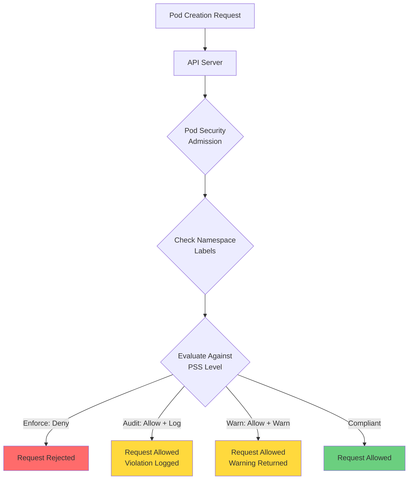

# Module 06: Pod Security

## Overview

**Estimated Time:** 6-7 hours

**Module Type:** Security Deep Dive

**Prerequisites:**
- Module 01 - Kubernetes Basics
- Module 02 - Control Plane and Cluster Components
- Module 05 - Authentication and Authorization
- Understanding of Linux security primitives (capabilities, namespaces, cgroups)

Pod security is foundational to Kubernetes cluster hardening. This module covers the Pod Security Standards framework, Pod Security Admission (PSA), security contexts, Linux security modules (seccomp, AppArmor, SELinux), and best practices for creating secure pod configurations. Based on CIS Kubernetes Benchmark and NSA/CISA hardening guidelines, you'll learn to implement defense-in-depth strategies at the pod level.

---

## Learning Objectives

By the end of this module, you will be able to:

1. Understand and implement Pod Security Standards (Privileged, Baseline, Restricted)
2. Configure Pod Security Admission (PSA) at namespace and cluster levels
3. Apply security contexts to pods and containers with appropriate restrictions
4. Implement seccomp profiles for syscall filtering
5. Configure AppArmor and SELinux for mandatory access control
6. Design pods with read-only root filesystems
7. Apply principle of least privilege to container permissions
8. Identify and remediate common pod security anti-patterns
9. Perform security audits of pod configurations
10. Create production-ready secure pod specifications

---

## 1. Pod Security Standards (PSS)

### 1.1 Overview

Pod Security Standards define three levels of security policies that progressively restrict pod configurations. These standards, introduced in Kubernetes 1.23 (stable in 1.25), replaced Pod Security Policies (PSP).

**Three Security Levels:**

1. **Privileged** - Unrestricted, allows known privilege escalations
2. **Baseline** - Minimally restrictive, prevents known privilege escalations
3. **Restricted** - Heavily restricted, follows pod hardening best practices

### 1.2 Privileged Profile

The Privileged profile is unrestricted and should only be used for trusted, infrastructure-level workloads.

**Characteristics:**
- No restrictions applied
- Allows privileged containers
- Allows host namespace sharing (PID, IPC, Network)
- Allows all capabilities
- Allows host path volumes

**Use Cases:**
- CNI plugins
- Storage drivers
- Monitoring agents with host access
- Development/testing environments

### 1.3 Baseline Profile

The Baseline profile prevents known privilege escalations while maintaining minimal restrictions for common containerized workloads.

**Key Restrictions:**

| Control | Requirement |
|---------|-------------|
| HostProcess | Windows HostProcess containers prohibited |
| Host Namespaces | Sharing host PID, IPC, or network namespaces prohibited |
| Privileged Containers | `privileged: true` prohibited |
| Capabilities | Adding all capabilities prohibited; specific dangerous capabilities dropped |
| HostPath Volumes | Prohibited |
| Host Ports | Prohibited or restricted to known ranges |
| AppArmor | Unconfined profiles prohibited |
| SELinux | Custom types or user/role options prohibited |
| /proc Mount Type | Default /proc masks required |
| Seccomp | Unconfined profile prohibited |
| Sysctls | Only safe sysctls allowed |

**Example Violations:**
```yaml
# VIOLATION: Host network enabled
spec:
  hostNetwork: true  # Baseline violation
  containers:
  - name: app
    image: myapp:1.0
```

### 1.4 Restricted Profile

The Restricted profile implements pod hardening best practices with significant restrictions. All production workloads should target this level.

**Additional Restrictions Beyond Baseline:**

| Control | Requirement |
|---------|-------------|
| Volume Types | Restricted to configMap, emptyDir, projected, secret, downwardAPI, persistentVolumeClaim, ephemeral |
| Privilege Escalation | `allowPrivilegeEscalation: false` required |
| Non-root User | `runAsNonRoot: true` required; containers must not run as UID 0 |
| Capabilities | Must drop ALL capabilities; may add only NET_BIND_SERVICE |
| Seccomp | Must use RuntimeDefault, Localhost, or specific profile |

**Compliant Example:**
```yaml
apiVersion: v1
kind: Pod
metadata:
  name: restricted-pod
  namespace: production
spec:
  securityContext:
    runAsNonRoot: true
    runAsUser: 1000
    fsGroup: 2000
    seccompProfile:
      type: RuntimeDefault
  containers:
  - name: app
    image: myapp:1.0
    securityContext:
      allowPrivilegeEscalation: false
      readOnlyRootFilesystem: true
      runAsNonRoot: true
      runAsUser: 1000
      capabilities:
        drop:
        - ALL
    volumeMounts:
    - name: cache
      mountPath: /cache
    - name: tmp
      mountPath: /tmp
  volumes:
  - name: cache
    emptyDir: {}
  - name: tmp
    emptyDir: {}
```

---

## 2. Pod Security Admission (PSA)

### 2.1 PSA Architecture

Pod Security Admission is a built-in admission controller that enforces Pod Security Standards.



### 2.2 PSA Modes

PSA operates in three modes simultaneously per namespace:

1. **enforce** - Policy violations cause pod rejection
2. **audit** - Policy violations trigger audit log annotation
3. **warn** - Policy violations return warnings to user

**Namespace Labels:**
```yaml
# Enforce restricted, audit and warn on baseline
pod-security.kubernetes.io/enforce: restricted
pod-security.kubernetes.io/enforce-version: latest

pod-security.kubernetes.io/audit: baseline
pod-security.kubernetes.io/audit-version: latest

pod-security.kubernetes.io/warn: baseline
pod-security.kubernetes.io/warn-version: latest
```

### 2.3 Configuring PSA at Namespace Level

**Production Namespace (Restricted):**
```yaml
apiVersion: v1
kind: Namespace
metadata:
  name: production-apps
  labels:
    pod-security.kubernetes.io/enforce: restricted
    pod-security.kubernetes.io/audit: restricted
    pod-security.kubernetes.io/warn: restricted
    pod-security.kubernetes.io/enforce-version: v1.28
```

**Apply with kubectl:**
```bash
# Label existing namespace
kubectl label namespace production-apps \
  pod-security.kubernetes.io/enforce=restricted \
  pod-security.kubernetes.io/audit=restricted \
  pod-security.kubernetes.io/warn=restricted

# Verify labels
kubectl get namespace production-apps -o yaml | grep pod-security
```

**Development Namespace (Baseline with Warnings):**
```yaml
apiVersion: v1
kind: Namespace
metadata:
  name: dev-team-a
  labels:
    pod-security.kubernetes.io/enforce: baseline
    pod-security.kubernetes.io/audit: restricted
    pod-security.kubernetes.io/warn: restricted
```

### 2.4 Cluster-Wide PSA Configuration

Configure default PSA behavior using AdmissionConfiguration:

```yaml
# /etc/kubernetes/admission-config.yaml
apiVersion: apiserver.config.k8s.io/v1
kind: AdmissionConfiguration
plugins:
- name: PodSecurity
  configuration:
    apiVersion: pod-security.admission.config.k8s.io/v1
    kind: PodSecurityConfiguration
    defaults:
      enforce: "baseline"
      enforce-version: "latest"
      audit: "restricted"
      audit-version: "latest"
      warn: "restricted"
      warn-version: "latest"
    exemptions:
      usernames: []
      runtimeClasses: []
      namespaces:
      - kube-system
      - kube-public
      - kube-node-lease
```

**Enable in API server:**
```bash
# Add to kube-apiserver manifest
--admission-control-config-file=/etc/kubernetes/admission-config.yaml
```

---

## 3. Security Contexts

### 3.1 Pod-Level Security Context

Security contexts define privilege and access control settings for pods and containers.

**Pod Security Context Fields:**

```yaml
apiVersion: v1
kind: Pod
metadata:
  name: security-context-demo
spec:
  securityContext:
    # Run as specific user/group
    runAsUser: 1000
    runAsGroup: 3000
    fsGroup: 2000
    fsGroupChangePolicy: "OnRootMismatch"

    # Supplemental groups
    supplementalGroups: [4000, 5000]

    # Require non-root user
    runAsNonRoot: true

    # Seccomp profile
    seccompProfile:
      type: RuntimeDefault

    # SELinux options
    seLinuxOptions:
      level: "s0:c123,c456"
      role: "system_r"
      type: "container_t"
      user: "system_u"

    # Sysctl settings
    sysctls:
    - name: kernel.shm_rmid_forced
      value: "1"

  containers:
  - name: app
    image: nginx:1.25
```

### 3.2 Container-Level Security Context

Container-level settings override pod-level settings:

```yaml
apiVersion: v1
kind: Pod
metadata:
  name: container-security-context
spec:
  securityContext:
    runAsUser: 1000
    runAsNonRoot: true

  containers:
  - name: nginx
    image: nginx:1.25
    securityContext:
      # Container-specific overrides
      runAsUser: 2000  # Overrides pod runAsUser
      allowPrivilegeEscalation: false
      readOnlyRootFilesystem: true

      # Linux capabilities
      capabilities:
        drop:
        - ALL
        add:
        - NET_BIND_SERVICE

      # Seccomp (container-level)
      seccompProfile:
        type: Localhost
        localhostProfile: profiles/audit.json

      # Privileged mode (avoid in production)
      privileged: false

      # Process namespace sharing
      shareProcessNamespace: false

    volumeMounts:
    - name: cache
      mountPath: /var/cache/nginx
    - name: run
      mountPath: /var/run

  volumes:
  - name: cache
    emptyDir: {}
  - name: run
    emptyDir: {}
```

### 3.3 Linux Capabilities

Capabilities divide root privileges into distinct units that can be independently enabled or disabled.

**Common Capabilities:**

| Capability | Description | Risk Level |
|------------|-------------|------------|
| CAP_SYS_ADMIN | Administrative operations | Critical |
| CAP_NET_ADMIN | Network administration | High |
| CAP_SYS_PTRACE | Trace arbitrary processes | High |
| CAP_SYS_MODULE | Load/unload kernel modules | Critical |
| CAP_DAC_OVERRIDE | Bypass file permissions | High |
| CAP_NET_BIND_SERVICE | Bind to ports < 1024 | Low |
| CAP_CHOWN | Change file ownership | Medium |
| CAP_SETUID | Set user ID | High |
| CAP_SETGID | Set group ID | High |

**Secure Capability Configuration:**
```yaml
apiVersion: v1
kind: Pod
metadata:
  name: capability-demo
spec:
  containers:
  - name: web
    image: nginx:1.25
    securityContext:
      capabilities:
        drop:
        - ALL  # Drop all capabilities first
        add:
        - NET_BIND_SERVICE  # Add only what's needed
    ports:
    - containerPort: 80
```

**Check Container Capabilities:**
```bash
# Install libcap2-bin in container
apt-get update && apt-get install -y libcap2-bin

# View effective capabilities
capsh --print

# View capability bounding set
cat /proc/1/status | grep Cap
```

---

## 4. Seccomp Profiles

### 4.1 Seccomp Overview

Secure Computing Mode (seccomp) is a Linux kernel feature that filters system calls, reducing the kernel attack surface.

**Seccomp Profile Types:**

1. **RuntimeDefault** - Container runtime's default profile (recommended)
2. **Localhost** - Custom profile loaded from node filesystem
3. **Unconfined** - No filtering (insecure, avoid in production)

### 4.2 RuntimeDefault Profile

The simplest and recommended approach for most workloads:

```yaml
apiVersion: v1
kind: Pod
metadata:
  name: seccomp-runtime-default
spec:
  securityContext:
    seccompProfile:
      type: RuntimeDefault
  containers:
  - name: app
    image: myapp:1.0
```

### 4.3 Custom Seccomp Profiles

**Profile Location:**
Seccomp profiles must be placed on each node at `/var/lib/kubelet/seccomp/`.

**Example Custom Profile (audit.json):**
```json
{
  "defaultAction": "SCMP_ACT_LOG",
  "architectures": [
    "SCMP_ARCH_X86_64",
    "SCMP_ARCH_X86",
    "SCMP_ARCH_X32"
  ],
  "syscalls": [
    {
      "names": [
        "accept",
        "accept4",
        "access",
        "arch_prctl",
        "bind",
        "brk",
        "chmod",
        "chown",
        "clone",
        "close",
        "connect",
        "dup",
        "dup2",
        "epoll_create",
        "epoll_ctl",
        "epoll_wait",
        "exit",
        "exit_group",
        "fcntl",
        "fstat",
        "futex",
        "getcwd",
        "getdents",
        "getpid",
        "getppid",
        "getuid",
        "listen",
        "mmap",
        "open",
        "openat",
        "read",
        "readlink",
        "rt_sigaction",
        "rt_sigprocmask",
        "rt_sigreturn",
        "select",
        "set_robust_list",
        "set_tid_address",
        "socket",
        "stat",
        "wait4",
        "write"
      ],
      "action": "SCMP_ACT_ALLOW"
    }
  ]
}
```

**Restrictive Profile (deny-write.json):**
```json
{
  "defaultAction": "SCMP_ACT_ALLOW",
  "syscalls": [
    {
      "names": [
        "write",
        "writev",
        "pwrite64",
        "pwritev",
        "pwritev2"
      ],
      "action": "SCMP_ACT_ERRNO"
    }
  ]
}
```

**Using Localhost Profile:**
```yaml
apiVersion: v1
kind: Pod
metadata:
  name: seccomp-localhost
spec:
  securityContext:
    seccompProfile:
      type: Localhost
      localhostProfile: profiles/audit.json
  containers:
  - name: app
    image: myapp:1.0
```

**Deploy Profile to Nodes:**
```bash
# Copy profile to all nodes
for node in $(kubectl get nodes -o name | cut -d/ -f2); do
  scp profiles/audit.json $node:/var/lib/kubelet/seccomp/profiles/
done

# Verify profile
ssh node01 ls -la /var/lib/kubelet/seccomp/profiles/
```

### 4.4 Generating Seccomp Profiles

Use OCI seccomp profile generator or record syscalls:

```bash
# Install seccomp-bpf
apt-get install -y linux-tools-common linux-tools-$(uname -r)

# Trace syscalls (strace)
kubectl exec -it pod-name -- strace -c -f -e trace=all sleep 10

# Use oci-seccomp-bpf-hook (in container runtime)
# Automatically generates profiles based on observed behavior
```

---

## 5. AppArmor

### 5.1 AppArmor Overview

AppArmor is a Mandatory Access Control (MAC) system that restricts program capabilities using per-program profiles.

**AppArmor Support:**
- Supported on Ubuntu, Debian, SUSE
- Check if enabled: `cat /sys/module/apparmor/parameters/enabled`
- Profiles location: `/etc/apparmor.d/`

### 5.2 AppArmor Profiles

**Check Available Profiles:**
```bash
# On the node
sudo aa-status

# List loaded profiles
sudo apparmor_status
```

**Example AppArmor Profile:**
```bash
# /etc/apparmor.d/k8s-nginx
#include <tunables/global>

profile k8s-nginx flags=(attach_disconnected,mediate_deleted) {
  #include <abstractions/base>
  #include <abstractions/apache2-common>

  # Network access
  network inet tcp,
  network inet udp,

  # File access
  /usr/sbin/nginx ix,
  /etc/nginx/** r,
  /var/log/nginx/* w,
  /var/cache/nginx/** rw,
  /run/nginx.pid rw,

  # Deny sensitive paths
  deny /proc/sys/** w,
  deny /sys/** w,
  deny /etc/shadow r,
  deny /etc/passwd w,

  # Required directories
  /usr/share/nginx/** r,
  /var/www/** r,

  # Temporary files
  /tmp/** rw,
  /var/tmp/** rw,

  # Capabilities (limited)
  capability net_bind_service,
  capability dac_override,
  capability setuid,
  capability setgid,
  capability chown,

  # Deny dangerous capabilities
  deny capability sys_admin,
  deny capability sys_module,
  deny capability sys_rawio,
}
```

**Load Profile:**
```bash
# Parse and load profile
sudo apparmor_parser -r -W /etc/apparmor.d/k8s-nginx

# Verify profile loaded
sudo aa-status | grep k8s-nginx
```

### 5.3 Using AppArmor in Pods

**AppArmor Annotation:**
```yaml
apiVersion: v1
kind: Pod
metadata:
  name: nginx-apparmor
  annotations:
    # Format: container.apparmor.security.beta.kubernetes.io/<container-name>: <profile>
    container.apparmor.security.beta.kubernetes.io/nginx: localhost/k8s-nginx
spec:
  containers:
  - name: nginx
    image: nginx:1.25
    ports:
    - containerPort: 80
```

**Runtime Default Profile:**
```yaml
metadata:
  annotations:
    container.apparmor.security.beta.kubernetes.io/nginx: runtime/default
```

**Unconfined (Insecure):**
```yaml
metadata:
  annotations:
    container.apparmor.security.beta.kubernetes.io/nginx: unconfined
```

### 5.4 Testing AppArmor Enforcement

```bash
# Deploy pod with AppArmor
kubectl apply -f nginx-apparmor.yaml

# Test restricted operation (should fail)
kubectl exec nginx-apparmor -- touch /etc/shadow
# Output: touch: cannot touch '/etc/shadow': Permission denied

# Check AppArmor denials in logs
kubectl exec nginx-apparmor -- dmesg | grep DENIED
```

---

## 6. SELinux

### 6.1 SELinux Overview

Security-Enhanced Linux (SELinux) provides mandatory access control (MAC) through security labels and policies.

**SELinux Contexts:**
- **User** (`system_u`) - SELinux user
- **Role** (`system_r`) - Role-based access control
- **Type** (`container_t`) - Type enforcement (most important)
- **Level** (`s0:c1,c2`) - Multi-Level Security (MLS)

**Check SELinux Status:**
```bash
# On the node
getenforce
# Output: Enforcing / Permissive / Disabled

sestatus
```

### 6.2 Container SELinux Types

**Common Container Types:**

| Type | Description | Use Case |
|------|-------------|----------|
| `container_t` | Default container type | Standard containers |
| `container_init_t` | Container init process | systemd in containers |
| `svirt_sandbox_file_t` | Container files | Volume mounts |
| `container_file_t` | Container filesystem | Container layers |

### 6.3 SELinux in Pods

**Basic SELinux Options:**
```yaml
apiVersion: v1
kind: Pod
metadata:
  name: selinux-demo
spec:
  securityContext:
    seLinuxOptions:
      level: "s0:c123,c456"  # MLS/MCS level
      role: "system_r"        # SELinux role
      type: "container_t"     # SELinux type
      user: "system_u"        # SELinux user

  containers:
  - name: app
    image: myapp:1.0
```

**Custom SELinux Policy:**
```yaml
apiVersion: v1
kind: Pod
metadata:
  name: nginx-selinux
spec:
  securityContext:
    seLinuxOptions:
      level: "s0"
      type: "container_t"

  containers:
  - name: nginx
    image: nginx:1.25
    volumeMounts:
    - name: content
      mountPath: /usr/share/nginx/html

  volumes:
  - name: content
    persistentVolumeClaim:
      claimName: web-content
```

**Verify SELinux Context:**
```bash
# Check pod context
kubectl exec selinux-demo -- ps -eZ | grep nginx

# Check file contexts
kubectl exec selinux-demo -- ls -Z /usr/share/nginx/html
```

### 6.4 SELinux Volume Labeling

Kubernetes automatically applies SELinux labels to volumes based on pod context:

```yaml
apiVersion: v1
kind: Pod
metadata:
  name: volume-selinux
spec:
  securityContext:
    seLinuxOptions:
      level: "s0:c100,c200"

  containers:
  - name: app
    image: busybox
    command: ["sleep", "3600"]
    volumeMounts:
    - name: data
      mountPath: /data

  volumes:
  - name: data
    emptyDir: {}
```

**Check Volume Labels:**
```bash
# On the node, find container ID
docker ps | grep volume-selinux

# Check volume mount labels
docker inspect <container-id> | grep -A 10 Mounts

# Verify filesystem labels
ls -Z /var/lib/kubelet/pods/<pod-uid>/volumes/
```

---

## 7. Read-Only Root Filesystem

### 7.1 Why Read-Only Root Filesystems?

**Security Benefits:**
- Prevents malware persistence
- Blocks unauthorized file modifications
- Reduces attack surface
- Enforces immutable infrastructure
- Simplifies security auditing

### 7.2 Implementing Read-Only Root Filesystem

**Basic Configuration:**
```yaml
apiVersion: v1
kind: Pod
metadata:
  name: readonly-root
spec:
  containers:
  - name: nginx
    image: nginx:1.25
    securityContext:
      readOnlyRootFilesystem: true
    volumeMounts:
    - name: cache
      mountPath: /var/cache/nginx
    - name: run
      mountPath: /var/run
    - name: tmp
      mountPath: /tmp

  volumes:
  - name: cache
    emptyDir: {}
  - name: run
    emptyDir: {}
  - name: tmp
    emptyDir: {}
```

### 7.3 Application-Specific Writable Paths

Different applications require different writable directories:

**Nginx:**
```yaml
volumeMounts:
- name: cache
  mountPath: /var/cache/nginx
- name: run
  mountPath: /var/run
- name: tmp
  mountPath: /tmp
```

**Node.js Application:**
```yaml
volumeMounts:
- name: npm-cache
  mountPath: /.npm
- name: node-cache
  mountPath: /.node
- name: tmp
  mountPath: /tmp
- name: app-logs
  mountPath: /app/logs
```

**Java Application:**
```yaml
volumeMounts:
- name: tmp
  mountPath: /tmp
- name: java-tmp
  mountPath: /opt/java/tmp
env:
- name: JAVA_TOOL_OPTIONS
  value: "-Djava.io.tmpdir=/opt/java/tmp"
```

### 7.4 Production-Ready Example with Read-Only Root

**Complete Deployment:**
```yaml
apiVersion: apps/v1
kind: Deployment
metadata:
  name: secure-web-app
  namespace: production
spec:
  replicas: 3
  selector:
    matchLabels:
      app: secure-web
  template:
    metadata:
      labels:
        app: secure-web
    spec:
      # Pod-level security
      securityContext:
        runAsNonRoot: true
        runAsUser: 1000
        runAsGroup: 3000
        fsGroup: 2000
        seccompProfile:
          type: RuntimeDefault

      containers:
      - name: app
        image: mycompany/web-app:1.2.3

        # Container-level security
        securityContext:
          allowPrivilegeEscalation: false
          readOnlyRootFilesystem: true
          runAsNonRoot: true
          runAsUser: 1000
          capabilities:
            drop:
            - ALL
            add:
            - NET_BIND_SERVICE

        # Application requirements
        ports:
        - containerPort: 8080
          protocol: TCP

        # Resource limits
        resources:
          limits:
            cpu: "1"
            memory: 512Mi
          requests:
            cpu: 250m
            memory: 256Mi

        # Writable volumes
        volumeMounts:
        - name: cache
          mountPath: /app/cache
        - name: tmp
          mountPath: /tmp
        - name: logs
          mountPath: /app/logs
        - name: config
          mountPath: /app/config
          readOnly: true

        # Health checks
        livenessProbe:
          httpGet:
            path: /health
            port: 8080
          initialDelaySeconds: 30
          periodSeconds: 10

        readinessProbe:
          httpGet:
            path: /ready
            port: 8080
          initialDelaySeconds: 5
          periodSeconds: 5

      volumes:
      - name: cache
        emptyDir:
          sizeLimit: 100Mi
      - name: tmp
        emptyDir:
          sizeLimit: 50Mi
      - name: logs
        emptyDir:
          sizeLimit: 200Mi
      - name: config
        configMap:
          name: app-config
```

---

## 8. Security Best Practices

### 8.1 Defense in Depth

Implement multiple security layers:

1. **Pod Security Standards** - Enforce at namespace level
2. **Security Contexts** - Configure for every container
3. **Seccomp/AppArmor/SELinux** - Add MAC layer
4. **Read-Only Filesystem** - Prevent modifications
5. **Network Policies** - Restrict traffic
6. **Resource Limits** - Prevent resource exhaustion

### 8.2 Principle of Least Privilege

**Checklist:**
- ✅ Run as non-root user
- ✅ Drop all capabilities, add only required ones
- ✅ Use read-only root filesystem
- ✅ Disable privilege escalation
- ✅ Apply seccomp profile (RuntimeDefault minimum)
- ✅ Use specific image tags (not `latest`)
- ✅ Set resource limits
- ✅ Avoid hostPath, hostNetwork, hostPID, hostIPC

**Minimal Security Template:**
```yaml
securityContext:
  runAsNonRoot: true
  runAsUser: 10000
  allowPrivilegeEscalation: false
  readOnlyRootFilesystem: true
  capabilities:
    drop:
    - ALL
  seccompProfile:
    type: RuntimeDefault
```

### 8.3 Secure Image Practices

```yaml
# Use minimal base images
FROM gcr.io/distroless/static-debian11:nonroot

# Or create non-root user
FROM alpine:3.18
RUN addgroup -g 1000 appuser && \
    adduser -D -u 1000 -G appuser appuser
USER appuser

# Use specific tags, not latest
image: registry.example.com/myapp:v1.2.3-sha256@abc123...
```

### 8.4 Admission Controllers

Enforce security policies cluster-wide using admission controllers:

**Example OPA Gatekeeper Policy:**
```yaml
apiVersion: constraints.gatekeeper.sh/v1beta1
kind: K8sRequireReadOnlyRoot
metadata:
  name: require-readonly-root
spec:
  match:
    kinds:
    - apiGroups: [""]
      kinds: ["Pod"]
    namespaces:
    - production
  parameters:
    exemptions:
    - kube-system
```

---

## 9. Security Anti-Patterns

### 9.1 Common Mistakes

**❌ Anti-Pattern 1: Running as Root**
```yaml
# BAD: Runs as root (UID 0)
spec:
  containers:
  - name: app
    image: myapp:latest
    # No securityContext specified
```

**✅ Corrected:**
```yaml
spec:
  securityContext:
    runAsNonRoot: true
    runAsUser: 1000
  containers:
  - name: app
    image: myapp:latest
```

**❌ Anti-Pattern 2: Privileged Containers**
```yaml
# BAD: Privileged container
spec:
  containers:
  - name: app
    image: myapp:latest
    securityContext:
      privileged: true
```

**✅ Corrected:**
```yaml
spec:
  containers:
  - name: app
    image: myapp:latest
    securityContext:
      privileged: false
      capabilities:
        drop:
        - ALL
        add:
        - NET_ADMIN  # Only if absolutely required
```

**❌ Anti-Pattern 3: Host Namespaces**
```yaml
# BAD: Sharing host namespaces
spec:
  hostNetwork: true
  hostPID: true
  hostIPC: true
```

**✅ Corrected:**
```yaml
spec:
  hostNetwork: false
  hostPID: false
  hostIPC: false
```

**❌ Anti-Pattern 4: Writable Root Filesystem**
```yaml
# BAD: Writable filesystem
spec:
  containers:
  - name: app
    image: myapp:latest
    # No readOnlyRootFilesystem setting
```

**✅ Corrected:**
```yaml
spec:
  containers:
  - name: app
    image: myapp:latest
    securityContext:
      readOnlyRootFilesystem: true
    volumeMounts:
    - name: tmp
      mountPath: /tmp
  volumes:
  - name: tmp
    emptyDir: {}
```

**❌ Anti-Pattern 5: No Resource Limits**
```yaml
# BAD: No resource limits
spec:
  containers:
  - name: app
    image: myapp:latest
```

**✅ Corrected:**
```yaml
spec:
  containers:
  - name: app
    image: myapp:latest
    resources:
      limits:
        cpu: 500m
        memory: 512Mi
      requests:
        cpu: 250m
        memory: 256Mi
```

---

## 10. Hands-On Labs

### Lab 1: Implementing Pod Security Admission

**Objective:** Configure PSA for a namespace and test enforcement.

**Steps:**

1. Create namespace with restricted PSA:
```bash
cat <<EOF | kubectl apply -f -
apiVersion: v1
kind: Namespace
metadata:
  name: lab-restricted
  labels:
    pod-security.kubernetes.io/enforce: restricted
    pod-security.kubernetes.io/audit: restricted
    pod-security.kubernetes.io/warn: restricted
EOF
```

2. Try deploying non-compliant pod:
```bash
cat <<EOF | kubectl apply -f -
apiVersion: v1
kind: Pod
metadata:
  name: bad-pod
  namespace: lab-restricted
spec:
  containers:
  - name: nginx
    image: nginx:1.25
EOF
```

Expected error: Pod violates restricted policy.

3. Deploy compliant pod:
```bash
cat <<EOF | kubectl apply -f -
apiVersion: v1
kind: Pod
metadata:
  name: good-pod
  namespace: lab-restricted
spec:
  securityContext:
    runAsNonRoot: true
    runAsUser: 1000
    seccompProfile:
      type: RuntimeDefault
  containers:
  - name: nginx
    image: nginx:1.25
    securityContext:
      allowPrivilegeEscalation: false
      readOnlyRootFilesystem: true
      runAsNonRoot: true
      runAsUser: 1000
      capabilities:
        drop:
        - ALL
    volumeMounts:
    - name: cache
      mountPath: /var/cache/nginx
    - name: run
      mountPath: /var/run
  volumes:
  - name: cache
    emptyDir: {}
  - name: run
    emptyDir: {}
EOF
```

4. Verify pod running:
```bash
kubectl get pod -n lab-restricted
kubectl describe pod good-pod -n lab-restricted
```

### Lab 2: Seccomp Profile Creation

**Objective:** Create and apply a custom seccomp profile.

**Steps:**

1. Create audit profile:
```bash
sudo mkdir -p /var/lib/kubelet/seccomp/profiles

cat <<EOF | sudo tee /var/lib/kubelet/seccomp/profiles/audit.json
{
  "defaultAction": "SCMP_ACT_LOG",
  "architectures": ["SCMP_ARCH_X86_64"],
  "syscalls": [
    {
      "names": ["accept", "bind", "connect", "read", "write"],
      "action": "SCMP_ACT_ALLOW"
    }
  ]
}
EOF
```

2. Deploy pod with profile:
```bash
cat <<EOF | kubectl apply -f -
apiVersion: v1
kind: Pod
metadata:
  name: seccomp-test
spec:
  securityContext:
    seccompProfile:
      type: Localhost
      localhostProfile: profiles/audit.json
  containers:
  - name: test
    image: busybox
    command: ["sleep", "3600"]
EOF
```

3. Monitor syscalls:
```bash
# View audit logs
kubectl exec seccomp-test -- dmesg | grep seccomp
```

### Lab 3: AppArmor Profile

**Objective:** Create and enforce an AppArmor profile.

**Steps:**

1. Create profile on node:
```bash
cat <<EOF | sudo tee /etc/apparmor.d/k8s-deny-write
#include <tunables/global>

profile k8s-deny-write flags=(attach_disconnected,mediate_deleted) {
  #include <abstractions/base>

  file,

  # Deny all write operations
  deny /** w,

  # Allow reads
  /** r,
}
EOF
```

2. Load profile:
```bash
sudo apparmor_parser -r -W /etc/apparmor.d/k8s-deny-write
sudo aa-status | grep k8s-deny-write
```

3. Deploy pod with AppArmor:
```bash
cat <<EOF | kubectl apply -f -
apiVersion: v1
kind: Pod
metadata:
  name: apparmor-test
  annotations:
    container.apparmor.security.beta.kubernetes.io/test: localhost/k8s-deny-write
spec:
  containers:
  - name: test
    image: busybox
    command: ["sleep", "3600"]
EOF
```

4. Test enforcement:
```bash
# Should succeed (read)
kubectl exec apparmor-test -- cat /etc/hostname

# Should fail (write)
kubectl exec apparmor-test -- touch /tmp/test
```

### Lab 4: Complete Secure Deployment

**Objective:** Create a production-ready secure deployment.

**Create deployment:**
```bash
cat <<EOF | kubectl apply -f -
apiVersion: v1
kind: Namespace
metadata:
  name: secure-prod
  labels:
    pod-security.kubernetes.io/enforce: restricted
---
apiVersion: apps/v1
kind: Deployment
metadata:
  name: secure-app
  namespace: secure-prod
spec:
  replicas: 2
  selector:
    matchLabels:
      app: secure-app
  template:
    metadata:
      labels:
        app: secure-app
    spec:
      securityContext:
        runAsNonRoot: true
        runAsUser: 1000
        fsGroup: 2000
        seccompProfile:
          type: RuntimeDefault
      containers:
      - name: app
        image: nginx:1.25-alpine
        securityContext:
          allowPrivilegeEscalation: false
          readOnlyRootFilesystem: true
          runAsNonRoot: true
          runAsUser: 1000
          capabilities:
            drop:
            - ALL
        ports:
        - containerPort: 8080
        resources:
          limits:
            cpu: 200m
            memory: 128Mi
          requests:
            cpu: 100m
            memory: 64Mi
        volumeMounts:
        - name: cache
          mountPath: /var/cache/nginx
        - name: run
          mountPath: /var/run
      volumes:
      - name: cache
        emptyDir: {}
      - name: run
        emptyDir: {}
EOF
```

**Verify security:**
```bash
kubectl get deployment -n secure-prod
kubectl describe pod -n secure-prod | grep -A 10 "Security Context"
```

---

## 11. Security Checklist

### Pre-Deployment Security Audit

- [ ] **Pod Security Standards**
  - [ ] Namespace has PSA labels configured
  - [ ] Enforcement level appropriate (restricted for prod)
  - [ ] Exemptions documented and minimal

- [ ] **Security Context**
  - [ ] runAsNonRoot: true
  - [ ] runAsUser set to non-zero UID
  - [ ] allowPrivilegeEscalation: false
  - [ ] readOnlyRootFilesystem: true (with required writable mounts)
  - [ ] All capabilities dropped, only required added
  - [ ] No privileged: true
  - [ ] No hostNetwork, hostPID, hostIPC

- [ ] **Seccomp/AppArmor/SELinux**
  - [ ] Seccomp profile configured (RuntimeDefault minimum)
  - [ ] AppArmor profile applied (if available)
  - [ ] SELinux context appropriate

- [ ] **Resource Management**
  - [ ] CPU limits and requests defined
  - [ ] Memory limits and requests defined
  - [ ] Storage limits on emptyDir volumes

- [ ] **Image Security**
  - [ ] Using specific image tags (not latest)
  - [ ] Images from trusted registries
  - [ ] Image scanned for vulnerabilities
  - [ ] Minimal base image (distroless/alpine)

- [ ] **Network Security**
  - [ ] Network policies defined
  - [ ] Ingress/egress rules restrictive
  - [ ] No unnecessary exposed ports

- [ ] **Volumes**
  - [ ] No hostPath volumes (unless absolutely required)
  - [ ] Sensitive data in Secrets, not ConfigMaps
  - [ ] Volume mounts have appropriate permissions

- [ ] **Monitoring**
  - [ ] Logging configured
  - [ ] Security events monitored
  - [ ] Alerts for policy violations

---

## 12. References

### Official Documentation

1. **Kubernetes Pod Security Standards**
   - https://kubernetes.io/docs/concepts/security/pod-security-standards/

2. **Pod Security Admission**
   - https://kubernetes.io/docs/concepts/security/pod-security-admission/

3. **Security Context**
   - https://kubernetes.io/docs/tasks/configure-pod-container/security-context/

4. **Seccomp**
   - https://kubernetes.io/docs/tutorials/security/seccomp/

5. **AppArmor**
   - https://kubernetes.io/docs/tutorials/security/apparmor/

### Security Frameworks

6. **CIS Kubernetes Benchmark v1.8**
   - https://www.cisecurity.org/benchmark/kubernetes

7. **NSA/CISA Kubernetes Hardening Guide**
   - https://media.defense.gov/2022/Aug/29/2003066362/-1/-1/0/CTR_KUBERNETES_HARDENING_GUIDANCE_1.2_20220829.PDF

8. **NIST SP 800-190 - Container Security**
   - https://nvlpubs.nist.gov/nistpubs/SpecialPublications/NIST.SP.800-190.pdf

9. **CNCF Security TAG - Cloud Native Security Whitepaper**
   - https://github.com/cncf/tag-security/tree/main/security-whitepaper

### Linux Security

10. **Linux Capabilities Man Page**
    - https://man7.org/linux/man-pages/man7/capabilities.7.html

11. **Seccomp BPF**
    - https://www.kernel.org/doc/html/latest/userspace-api/seccomp_filter.html

12. **AppArmor Documentation**
    - https://gitlab.com/apparmor/apparmor/-/wikis/Documentation

13. **SELinux Project**
    - https://github.com/SELinuxProject/selinux

### Tools

14. **kubesec - Security risk analysis**
    - https://kubesec.io/

15. **kube-bench - CIS benchmark checker**
    - https://github.com/aquasecurity/kube-bench

16. **Polaris - Kubernetes best practices**
    - https://github.com/FairwindsOps/polaris

---

## Next Steps

Continue to **Module 07: Admission Control and Policy** to learn about policy enforcement, admission webhooks, OPA/Gatekeeper, and Kyverno for cluster-wide security governance.

---

**Module Completion Status:** ✅ Complete
