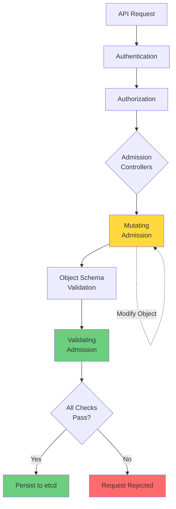
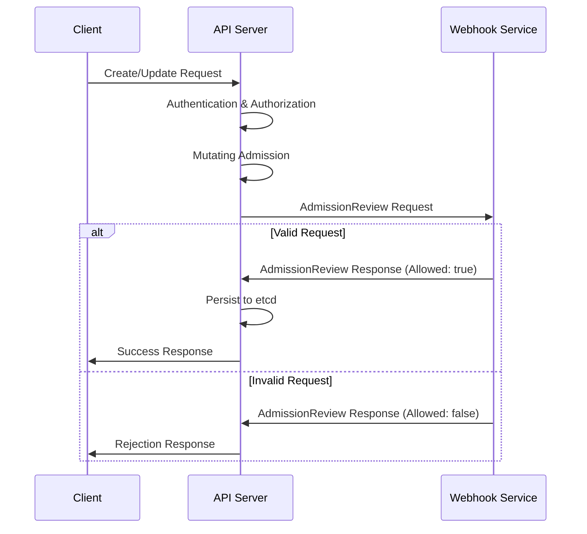
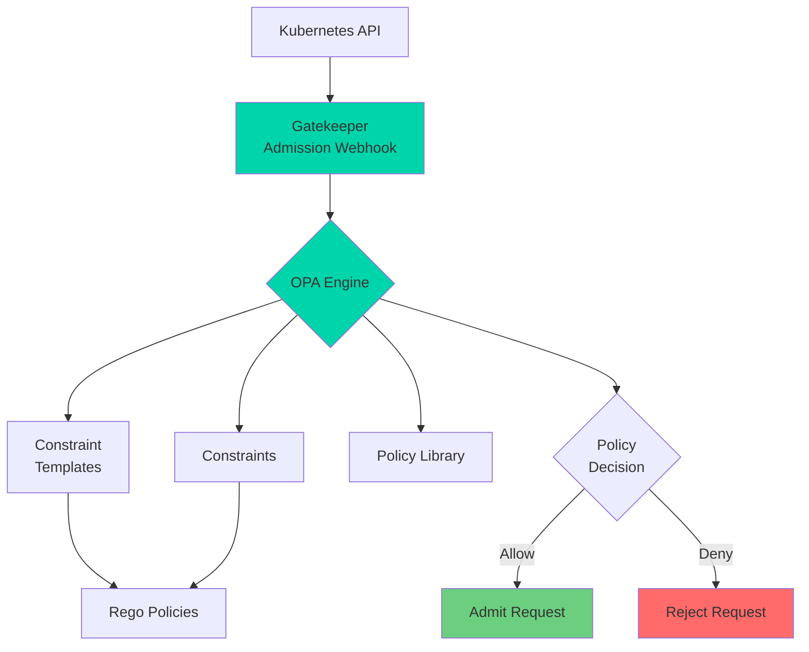

# Module 07: Admission Control and Policy

## Overview

**Estimated Time:** 6-7 hours

**Module Type:** Security Deep Dive

**Prerequisites:**
- Module 02 - Control Plane and Cluster Components
- Module 05 - Authentication and Authorization
- Module 06 - Pod Security
- Understanding of webhooks and REST APIs

Admission control is Kubernetes' last line of defense before objects are persisted to etcd. This module explores admission controllers, validating and mutating webhooks, and policy engines (OPA/Gatekeeper and Kyverno) for enforcing organizational security policies. You'll learn to implement policy-as-code patterns, create custom admission policies, and build defense-in-depth security controls for production clusters.

---

## Learning Objectives

By the end of this module, you will be able to:

1. Understand the admission control architecture and request flow
2. Configure and use built-in admission controllers
3. Create ValidatingWebhookConfiguration and MutatingWebhookConfiguration
4. Deploy and configure OPA/Gatekeeper with Rego policies
5. Implement Kyverno for policy management
6. Write policy-as-code for security enforcement
7. Validate container images, labels, and resource configurations
8. Create mutation policies for automatic remediation
9. Implement policy reporting and compliance monitoring
10. Troubleshoot admission webhook failures

---

## 1. Admission Control Architecture

### 1.1 Admission Control Flow



### 1.2 Admission Phases

**Phase 1: Mutating Admission**
- Modifies objects before validation
- Can set defaults, inject sidecars, add labels
- Multiple mutators execute in sequence
- Changes must pass validation phase

**Phase 2: Object Schema Validation**
- Validates against OpenAPI schema
- Ensures required fields present
- Type checking and format validation

**Phase 3: Validating Admission**
- Validates business logic and policies
- Cannot modify objects
- All validators must approve
- Any rejection blocks the request

### 1.3 Admission Controller Types

**Built-in Admission Controllers:**
- Compiled into kube-apiserver
- Enabled/disabled via API server flags
- Examples: PodSecurity, ResourceQuota, LimitRanger

**Dynamic Admission Controllers:**
- External webhooks
- ValidatingWebhookConfiguration
- MutatingWebhookConfiguration
- Custom logic in external services

**View Enabled Admission Controllers:**
```bash
# Check API server configuration
kubectl -n kube-system get pod <apiserver-pod> -o yaml | grep enable-admission-plugins

# Or check API server process
ps aux | grep kube-apiserver | grep admission-plugins
```

---

## 2. Built-in Admission Controllers

### 2.1 Common Built-in Controllers

| Controller | Type | Purpose |
|------------|------|---------|
| PodSecurity | Validating | Enforces Pod Security Standards |
| NamespaceLifecycle | Validating | Prevents operations on terminating namespaces |
| LimitRanger | Validating | Enforces LimitRange constraints |
| ResourceQuota | Validating | Enforces resource quotas |
| ServiceAccount | Mutating | Adds default service account |
| DefaultStorageClass | Mutating | Adds default storage class to PVCs |
| MutatingAdmissionWebhook | Mutating | Calls external mutating webhooks |
| ValidatingAdmissionWebhook | Validating | Calls external validating webhooks |
| NodeRestriction | Validating | Limits node's ability to modify objects |
| PodNodeSelector | Mutating | Applies node selectors to pods |

### 2.2 LimitRanger Example

**Create LimitRange:**
```yaml
apiVersion: v1
kind: LimitRange
metadata:
  name: resource-limits
  namespace: production
spec:
  limits:
  # Container-level defaults and constraints
  - type: Container
    default:
      cpu: 500m
      memory: 512Mi
    defaultRequest:
      cpu: 250m
      memory: 256Mi
    max:
      cpu: 2000m
      memory: 2Gi
    min:
      cpu: 100m
      memory: 64Mi

  # Pod-level constraints
  - type: Pod
    max:
      cpu: 4000m
      memory: 4Gi

  # PVC size constraints
  - type: PersistentVolumeClaim
    max:
      storage: 10Gi
    min:
      storage: 1Gi
```

**Apply and test:**
```bash
kubectl apply -f limitrange.yaml

# Deploy pod without resource requests
cat <<EOF | kubectl apply -f -
apiVersion: v1
kind: Pod
metadata:
  name: test-limits
  namespace: production
spec:
  containers:
  - name: app
    image: nginx:1.25
EOF

# Check applied defaults
kubectl get pod test-limits -n production -o yaml | grep -A 10 resources
```

### 2.3 ResourceQuota Example

**Create ResourceQuota:**
```yaml
apiVersion: v1
kind: ResourceQuota
metadata:
  name: team-quota
  namespace: team-a
spec:
  hard:
    # Compute resources
    requests.cpu: "10"
    requests.memory: 20Gi
    limits.cpu: "20"
    limits.memory: 40Gi

    # Storage resources
    requests.storage: 100Gi
    persistentvolumeclaims: "10"

    # Object counts
    pods: "50"
    services: "10"
    secrets: "20"
    configmaps: "20"

    # Custom resources
    count/deployments.apps: "10"
    count/jobs.batch: "20"
```

**Verify quota usage:**
```bash
kubectl describe quota team-quota -n team-a
```

### 2.4 Enabling Admission Controllers

**Modify API server configuration:**
```yaml
# /etc/kubernetes/manifests/kube-apiserver.yaml
spec:
  containers:
  - command:
    - kube-apiserver
    - --enable-admission-plugins=NodeRestriction,PodSecurity,LimitRanger,ResourceQuota,ServiceAccount,DefaultStorageClass,MutatingAdmissionWebhook,ValidatingAdmissionWebhook
    - --disable-admission-plugins=AlwaysAdmit
```

---

## 3. Validating Webhooks

### 3.1 ValidatingWebhookConfiguration

Validating webhooks allow external services to approve or reject admission requests.

**Architecture:**


### 3.2 Creating a Validating Webhook

**Webhook Service (Python Flask):**
```python
# webhook-server.py
from flask import Flask, request, jsonify
import base64
import json

app = Flask(__name__)

@app.route('/validate', methods=['POST'])
def validate():
    admission_review = request.json

    # Extract request
    req = admission_review['request']
    uid = req['uid']

    # Get object being created/updated
    obj = req.get('object', {})
    kind = obj.get('kind', '')
    metadata = obj.get('metadata', {})
    spec = obj.get('spec', {})

    # Validation logic
    allowed = True
    message = "Request allowed"

    # Example: Require 'owner' label
    labels = metadata.get('labels', {})
    if 'owner' not in labels:
        allowed = False
        message = "Missing required label 'owner'"

    # Example: Require resource limits
    if kind == "Pod":
        containers = spec.get('containers', [])
        for container in containers:
            resources = container.get('resources', {})
            if 'limits' not in resources:
                allowed = False
                message = f"Container {container['name']} missing resource limits"
                break

    # Build response
    response = {
        "apiVersion": "admission.k8s.io/v1",
        "kind": "AdmissionReview",
        "response": {
            "uid": uid,
            "allowed": allowed,
            "status": {
                "message": message
            }
        }
    }

    return jsonify(response)

if __name__ == '__main__':
    app.run(host='0.0.0.0', port=8443, ssl_context=('cert.pem', 'key.pem'))
```

**Deployment:**
```yaml
apiVersion: apps/v1
kind: Deployment
metadata:
  name: validation-webhook
  namespace: webhook-system
spec:
  replicas: 2
  selector:
    matchLabels:
      app: validation-webhook
  template:
    metadata:
      labels:
        app: validation-webhook
    spec:
      containers:
      - name: webhook
        image: myregistry/validation-webhook:1.0
        ports:
        - containerPort: 8443
        volumeMounts:
        - name: certs
          mountPath: /etc/webhook/certs
          readOnly: true
      volumes:
      - name: certs
        secret:
          secretName: webhook-certs
---
apiVersion: v1
kind: Service
metadata:
  name: validation-webhook
  namespace: webhook-system
spec:
  selector:
    app: validation-webhook
  ports:
  - port: 443
    targetPort: 8443
```

### 3.3 ValidatingWebhookConfiguration Resource

```yaml
apiVersion: admissionregistration.k8s.io/v1
kind: ValidatingWebhookConfiguration
metadata:
  name: pod-validator
webhooks:
- name: validate.pods.example.com
  admissionReviewVersions: ["v1"]

  # When to call this webhook
  rules:
  - apiGroups: [""]
    apiVersions: ["v1"]
    operations: ["CREATE", "UPDATE"]
    resources: ["pods"]
    scope: "Namespaced"

  # Webhook endpoint
  clientConfig:
    service:
      name: validation-webhook
      namespace: webhook-system
      path: /validate
      port: 443
    caBundle: LS0tLS1CRUdJTi... # Base64 encoded CA cert

  # Failure policy
  failurePolicy: Fail  # or Ignore

  # Timeout
  timeoutSeconds: 10

  # Side effects
  sideEffects: None

  # Namespace selector
  namespaceSelector:
    matchExpressions:
    - key: environment
      operator: In
      values: ["production", "staging"]

  # Object selector
  objectSelector:
    matchLabels:
      validate: "true"
```

**Key Configuration Options:**

| Field | Description | Values |
|-------|-------------|--------|
| failurePolicy | Behavior on webhook failure | Fail, Ignore |
| sideEffects | Whether webhook has side effects | None, NoneOnDryRun |
| timeoutSeconds | Webhook timeout | 1-30 seconds |
| reinvocationPolicy | Call webhook multiple times | Never, IfNeeded |
| matchPolicy | How to match requests | Exact, Equivalent |

### 3.4 Generating Webhook Certificates

```bash
#!/bin/bash
# generate-webhook-certs.sh

NAMESPACE="webhook-system"
SERVICE="validation-webhook"

# Create CA
openssl genrsa -out ca.key 2048
openssl req -x509 -new -nodes -key ca.key -days 3650 -out ca.crt -subj "/CN=webhook-ca"

# Create server certificate
cat > server.conf <<EOF
[req]
req_extensions = v3_req
distinguished_name = req_distinguished_name

[req_distinguished_name]

[v3_req]
basicConstraints = CA:FALSE
keyUsage = nonRepudiation, digitalSignature, keyEncipherment
extendedKeyUsage = serverAuth
subjectAltName = @alt_names

[alt_names]
DNS.1 = ${SERVICE}
DNS.2 = ${SERVICE}.${NAMESPACE}
DNS.3 = ${SERVICE}.${NAMESPACE}.svc
DNS.4 = ${SERVICE}.${NAMESPACE}.svc.cluster.local
EOF

openssl genrsa -out server.key 2048
openssl req -new -key server.key -out server.csr -subj "/CN=${SERVICE}.${NAMESPACE}.svc" -config server.conf
openssl x509 -req -in server.csr -CA ca.crt -CAkey ca.key -CAcreateserial -out server.crt -days 3650 -extensions v3_req -extfile server.conf

# Create Kubernetes secret
kubectl create secret tls webhook-certs \
  --cert=server.crt \
  --key=server.key \
  -n ${NAMESPACE}

# Output CA bundle for webhook config
echo "CA Bundle (add to webhookConfig):"
cat ca.crt | base64 | tr -d '\n'
```

---

## 4. Mutating Webhooks

### 4.1 MutatingWebhookConfiguration

Mutating webhooks modify objects before they're persisted.

**Use Cases:**
- Inject sidecar containers
- Add default labels/annotations
- Set security contexts
- Add init containers
- Modify resource requests/limits

### 4.2 Example: Sidecar Injection Webhook

**Webhook Logic (Python):**
```python
@app.route('/mutate', methods=['POST'])
def mutate():
    admission_review = request.json
    req = admission_review['request']
    uid = req['uid']
    obj = req['object']

    # Only inject for pods with annotation
    annotations = obj.get('metadata', {}).get('annotations', {})
    if annotations.get('sidecar-injector', '') != 'enabled':
        return jsonify({
            "apiVersion": "admission.k8s.io/v1",
            "kind": "AdmissionReview",
            "response": {
                "uid": uid,
                "allowed": True
            }
        })

    # Build JSON patch to add sidecar
    patches = []

    # Add sidecar container
    sidecar = {
        "name": "logging-agent",
        "image": "fluentd:v1.16",
        "volumeMounts": [{
            "name": "logs",
            "mountPath": "/var/log/app"
        }]
    }

    containers = obj['spec']['containers']
    patches.append({
        "op": "add",
        "path": "/spec/containers/-",
        "value": sidecar
    })

    # Add shared volume
    if 'volumes' not in obj['spec']:
        obj['spec']['volumes'] = []

    patches.append({
        "op": "add",
        "path": "/spec/volumes/-",
        "value": {
            "name": "logs",
            "emptyDir": {}
        }
    })

    # Encode patches
    import base64
    patch_bytes = json.dumps(patches).encode('utf-8')
    patch_b64 = base64.b64encode(patch_bytes).decode('utf-8')

    return jsonify({
        "apiVersion": "admission.k8s.io/v1",
        "kind": "AdmissionReview",
        "response": {
            "uid": uid,
            "allowed": True,
            "patchType": "JSONPatch",
            "patch": patch_b64
        }
    })
```

### 4.3 MutatingWebhookConfiguration

```yaml
apiVersion: admissionregistration.k8s.io/v1
kind: MutatingWebhookConfiguration
metadata:
  name: sidecar-injector
webhooks:
- name: inject.sidecars.example.com
  admissionReviewVersions: ["v1"]

  rules:
  - apiGroups: [""]
    apiVersions: ["v1"]
    operations: ["CREATE"]
    resources: ["pods"]

  clientConfig:
    service:
      name: sidecar-injector
      namespace: webhook-system
      path: /mutate
    caBundle: LS0tLS1CRUdJTi...

  failurePolicy: Fail
  sideEffects: None
  timeoutSeconds: 10

  # Reinvoke if object changed by other mutators
  reinvocationPolicy: IfNeeded

  namespaceSelector:
    matchLabels:
      sidecar-injection: enabled
```

**Test sidecar injection:**
```bash
# Label namespace
kubectl label namespace default sidecar-injection=enabled

# Create pod with annotation
cat <<EOF | kubectl apply -f -
apiVersion: v1
kind: Pod
metadata:
  name: test-app
  annotations:
    sidecar-injector: enabled
spec:
  containers:
  - name: app
    image: nginx:1.25
EOF

# Verify sidecar added
kubectl get pod test-app -o json | jq '.spec.containers[].name'
```

---

## 5. OPA Gatekeeper

### 5.1 OPA Gatekeeper Overview

Open Policy Agent (OPA) Gatekeeper is a policy engine for Kubernetes that uses the Rego policy language.

**Architecture:**


### 5.2 Installing Gatekeeper

**Using kubectl:**
```bash
# Install latest release
kubectl apply -f https://raw.githubusercontent.com/open-policy-agent/gatekeeper/release-3.14/deploy/gatekeeper.yaml

# Verify installation
kubectl get pods -n gatekeeper-system
kubectl get crd | grep gatekeeper
```

**Using Helm:**
```bash
helm repo add gatekeeper https://open-policy-agent.github.io/gatekeeper/charts
helm install gatekeeper gatekeeper/gatekeeper --namespace gatekeeper-system --create-namespace
```

### 5.3 Constraint Templates

Constraint Templates define reusable policy logic in Rego.

**Example: Require Labels Template**
```yaml
apiVersion: templates.gatekeeper.sh/v1
kind: ConstraintTemplate
metadata:
  name: k8srequiredlabels
spec:
  crd:
    spec:
      names:
        kind: K8sRequiredLabels
      validation:
        openAPIV3Schema:
          type: object
          properties:
            labels:
              type: array
              items:
                type: string

  targets:
  - target: admission.k8s.gatekeeper.sh
    rego: |
      package k8srequiredlabels

      violation[{"msg": msg, "details": {"missing_labels": missing}}] {
        provided := {label | input.review.object.metadata.labels[label]}
        required := {label | label := input.parameters.labels[_]}
        missing := required - provided
        count(missing) > 0
        msg := sprintf("Missing required labels: %v", [missing])
      }
```

**Apply template:**
```bash
kubectl apply -f require-labels-template.yaml
```

### 5.4 Constraints

Constraints instantiate templates with specific parameters.

**Require 'owner' and 'environment' labels:**
```yaml
apiVersion: constraints.gatekeeper.sh/v1beta1
kind: K8sRequiredLabels
metadata:
  name: require-owner-env-labels
spec:
  match:
    kinds:
    - apiGroups: [""]
      kinds: ["Namespace", "Pod", "Service"]
    - apiGroups: ["apps"]
      kinds: ["Deployment", "StatefulSet"]

  parameters:
    labels:
    - owner
    - environment
```

**Test constraint:**
```bash
# This should fail (missing labels)
cat <<EOF | kubectl apply -f -
apiVersion: v1
kind: Pod
metadata:
  name: test-pod
spec:
  containers:
  - name: nginx
    image: nginx:1.25
EOF

# This should succeed
cat <<EOF | kubectl apply -f -
apiVersion: v1
kind: Pod
metadata:
  name: test-pod
  labels:
    owner: john
    environment: dev
spec:
  containers:
  - name: nginx
    image: nginx:1.25
EOF
```

### 5.5 Security Policy Examples

**Block Privileged Containers:**
```yaml
apiVersion: templates.gatekeeper.sh/v1
kind: ConstraintTemplate
metadata:
  name: k8spsprivilegedcontainer
spec:
  crd:
    spec:
      names:
        kind: K8sPSPrivilegedContainer
  targets:
  - target: admission.k8s.gatekeeper.sh
    rego: |
      package k8spsprivilegedcontainer

      violation[{"msg": msg}] {
        container := input.review.object.spec.containers[_]
        container.securityContext.privileged
        msg := sprintf("Privileged container not allowed: %v", [container.name])
      }
---
apiVersion: constraints.gatekeeper.sh/v1beta1
kind: K8sPSPrivilegedContainer
metadata:
  name: block-privileged-containers
spec:
  match:
    kinds:
    - apiGroups: [""]
      kinds: ["Pod"]
```

**Require Read-Only Root Filesystem:**
```yaml
apiVersion: templates.gatekeeper.sh/v1
kind: ConstraintTemplate
metadata:
  name: k8sreadonlyrootfilesystem
spec:
  crd:
    spec:
      names:
        kind: K8sReadOnlyRootFilesystem
  targets:
  - target: admission.k8s.gatekeeper.sh
    rego: |
      package k8sreadonlyrootfilesystem

      violation[{"msg": msg}] {
        container := input.review.object.spec.containers[_]
        not container.securityContext.readOnlyRootFilesystem
        msg := sprintf("Container %v must have readOnlyRootFilesystem: true", [container.name])
      }
---
apiVersion: constraints.gatekeeper.sh/v1beta1
kind: K8sReadOnlyRootFilesystem
metadata:
  name: require-readonly-root
spec:
  match:
    kinds:
    - apiGroups: [""]
      kinds: ["Pod"]
    namespaces:
    - production
```

**Block Images from Untrusted Registries:**
```yaml
apiVersion: templates.gatekeeper.sh/v1
kind: ConstraintTemplate
metadata:
  name: k8sallowedrepos
spec:
  crd:
    spec:
      names:
        kind: K8sAllowedRepos
      validation:
        openAPIV3Schema:
          type: object
          properties:
            repos:
              type: array
              items:
                type: string
  targets:
  - target: admission.k8s.gatekeeper.sh
    rego: |
      package k8sallowedrepos

      violation[{"msg": msg}] {
        container := input.review.object.spec.containers[_]
        satisfied := [good | repo := input.parameters.repos[_]
                           good := startswith(container.image, repo)]
        not any(satisfied)
        msg := sprintf("Image %v not from approved registry", [container.image])
      }
---
apiVersion: constraints.gatekeeper.sh/v1beta1
kind: K8sAllowedRepos
metadata:
  name: allowed-registries
spec:
  match:
    kinds:
    - apiGroups: [""]
      kinds: ["Pod"]
  parameters:
    repos:
    - gcr.io/mycompany/
    - registry.example.com/
    - docker.io/library/
```

### 5.6 Audit and Compliance

**View constraint violations:**
```bash
# Check constraint status
kubectl get constraints

# View violations
kubectl describe k8srequiredlabels require-owner-env-labels

# Audit existing resources
kubectl get constraint -o json | jq '.items[].status.violations'
```

**Enable audit logging:**
```yaml
# In Gatekeeper deployment
spec:
  template:
    spec:
      containers:
      - name: manager
        args:
        - --audit-interval=60
        - --log-level=DEBUG
        - --emit-audit-events=true
```

---

## 6. Kyverno

### 6.1 Kyverno Overview

Kyverno is a policy engine designed specifically for Kubernetes, using YAML instead of Rego.

**Key Features:**
- Native Kubernetes YAML syntax
- No new language to learn
- Validation, mutation, and generation policies
- CLI for testing policies
- Policy reports

### 6.2 Installing Kyverno

```bash
# Install using kubectl
kubectl create -f https://github.com/kyverno/kyverno/releases/download/v1.11.0/install.yaml

# Verify installation
kubectl get pods -n kyverno
kubectl get crd | grep kyverno
```

**Using Helm:**
```bash
helm repo add kyverno https://kyverno.github.io/kyverno/
helm install kyverno kyverno/kyverno --namespace kyverno --create-namespace
```

### 6.3 Validation Policies

**Require Labels:**
```yaml
apiVersion: kyverno.io/v1
kind: ClusterPolicy
metadata:
  name: require-labels
spec:
  validationFailureAction: Enforce  # or Audit
  background: true

  rules:
  - name: check-for-labels
    match:
      any:
      - resources:
          kinds:
          - Pod
          - Deployment
          - Service
    validate:
      message: "Labels 'owner' and 'environment' are required"
      pattern:
        metadata:
          labels:
            owner: "?*"
            environment: "?*"
```

**Require Resource Limits:**
```yaml
apiVersion: kyverno.io/v1
kind: ClusterPolicy
metadata:
  name: require-resource-limits
spec:
  validationFailureAction: Enforce

  rules:
  - name: validate-resources
    match:
      any:
      - resources:
          kinds:
          - Pod
    validate:
      message: "CPU and memory resource limits are required"
      pattern:
        spec:
          containers:
          - resources:
              limits:
                memory: "?*"
                cpu: "?*"
              requests:
                memory: "?*"
                cpu: "?*"
```

**Block Latest Tag:**
```yaml
apiVersion: kyverno.io/v1
kind: ClusterPolicy
metadata:
  name: disallow-latest-tag
spec:
  validationFailureAction: Enforce

  rules:
  - name: require-image-tag
    match:
      any:
      - resources:
          kinds:
          - Pod
    validate:
      message: "Using 'latest' tag is not allowed"
      pattern:
        spec:
          containers:
          - image: "!*:latest"

  - name: require-tag-present
    match:
      any:
      - resources:
          kinds:
          - Pod
    validate:
      message: "Image tag is required"
      pattern:
        spec:
          containers:
          - image: "*:*"
```

### 6.4 Mutation Policies

**Add Default Security Context:**
```yaml
apiVersion: kyverno.io/v1
kind: ClusterPolicy
metadata:
  name: add-default-securitycontext
spec:
  background: false

  rules:
  - name: set-container-security
    match:
      any:
      - resources:
          kinds:
          - Pod
    mutate:
      patchStrategicMerge:
        spec:
          securityContext:
            runAsNonRoot: true
            runAsUser: 1000
            seccompProfile:
              type: RuntimeDefault
          containers:
          - (name): "*"
            securityContext:
              allowPrivilegeEscalation: false
              readOnlyRootFilesystem: true
              capabilities:
                drop:
                - ALL
```

**Add Network Policy:**
```yaml
apiVersion: kyverno.io/v1
kind: ClusterPolicy
metadata:
  name: add-default-networkpolicy
spec:
  background: true

  rules:
  - name: default-deny
    match:
      any:
      - resources:
          kinds:
          - Namespace
    generate:
      synchronize: true
      kind: NetworkPolicy
      name: default-deny
      namespace: "{{request.object.metadata.name}}"
      data:
        spec:
          podSelector: {}
          policyTypes:
          - Ingress
          - Egress
```

**Inject Sidecar:**
```yaml
apiVersion: kyverno.io/v1
kind: ClusterPolicy
metadata:
  name: inject-logging-sidecar
spec:
  background: false

  rules:
  - name: inject-sidecar
    match:
      any:
      - resources:
          kinds:
          - Pod
          annotations:
            logging-sidecar: "true"
    mutate:
      patchesJson6902: |-
        - op: add
          path: /spec/containers/-
          value:
            name: logging-agent
            image: fluentd:v1.16
            volumeMounts:
            - name: logs
              mountPath: /var/log/app
        - op: add
          path: /spec/volumes/-
          value:
            name: logs
            emptyDir: {}
```

### 6.5 Generation Policies

**Auto-create ConfigMap for Namespaces:**
```yaml
apiVersion: kyverno.io/v1
kind: ClusterPolicy
metadata:
  name: generate-configmap
spec:
  background: true

  rules:
  - name: create-configmap
    match:
      any:
      - resources:
          kinds:
          - Namespace
    exclude:
      any:
      - resources:
          namespaces:
          - kube-system
          - kube-public
          - kube-node-lease
    generate:
      synchronize: true
      kind: ConfigMap
      name: default-config
      namespace: "{{request.object.metadata.name}}"
      data:
        data:
          environment: "{{request.object.metadata.labels.environment}}"
          owner: "{{request.object.metadata.labels.owner}}"
```

### 6.6 Image Verification

**Verify Image Signatures with cosign:**
```yaml
apiVersion: kyverno.io/v1
kind: ClusterPolicy
metadata:
  name: verify-images
spec:
  validationFailureAction: Enforce
  webhookTimeoutSeconds: 30

  rules:
  - name: verify-signature
    match:
      any:
      - resources:
          kinds:
          - Pod
    verifyImages:
    - imageReferences:
      - "registry.example.com/myapp/*"
      attestors:
      - count: 1
        entries:
        - keys:
            publicKeys: |-
              -----BEGIN PUBLIC KEY-----
              MFkwEwYHKoZIzj0CAQYIKoZIzj0DAQcDQgAE...
              -----END PUBLIC KEY-----
```

### 6.7 Policy Reports

**View policy violations:**
```bash
# Install Kyverno CLI
curl -LO https://github.com/kyverno/kyverno/releases/download/v1.11.0/kyverno-cli_v1.11.0_linux_x86_64.tar.gz
tar -xzf kyverno-cli_v1.11.0_linux_x86_64.tar.gz
sudo mv kyverno /usr/local/bin/

# Test policy against resources
kyverno apply policy.yaml --resource deployment.yaml

# View cluster policy reports
kubectl get clusterpolicyreport -A

# View policy report details
kubectl get policyreport -n default -o yaml
```

**PolicyReport Example:**
```yaml
apiVersion: wgpolicyk8s.io/v1alpha2
kind: PolicyReport
metadata:
  name: polr-ns-default
  namespace: default
results:
- policy: require-labels
  rule: check-for-labels
  result: fail
  message: "Labels 'owner' and 'environment' are required"
  source: kyverno
  resources:
  - apiVersion: v1
    kind: Pod
    name: nginx
    namespace: default
```

---

## 7. Policy-as-Code Patterns

### 7.1 Policy Organization

**Directory Structure:**
```
policies/
├── base/
│   ├── security/
│   │   ├── pod-security.yaml
│   │   ├── network-policies.yaml
│   │   └── rbac-restrictions.yaml
│   ├── compliance/
│   │   ├── require-labels.yaml
│   │   └── resource-limits.yaml
│   └── operational/
│       ├── image-policies.yaml
│       └── backup-policies.yaml
├── environments/
│   ├── production/
│   │   └── kustomization.yaml
│   ├── staging/
│   │   └── kustomization.yaml
│   └── development/
│       └── kustomization.yaml
└── tests/
    └── resources/
        ├── compliant/
        └── non-compliant/
```

### 7.2 Policy Testing

**Create test resources:**
```bash
# tests/resources/compliant/good-pod.yaml
apiVersion: v1
kind: Pod
metadata:
  name: good-pod
  labels:
    owner: security-team
    environment: production
spec:
  securityContext:
    runAsNonRoot: true
    runAsUser: 1000
  containers:
  - name: app
    image: registry.example.com/app:v1.0
    securityContext:
      readOnlyRootFilesystem: true
      allowPrivilegeEscalation: false
      capabilities:
        drop:
        - ALL
    resources:
      limits:
        cpu: 500m
        memory: 512Mi
      requests:
        cpu: 250m
        memory: 256Mi
```

**Test script:**
```bash
#!/bin/bash
# test-policies.sh

echo "Testing Kyverno policies..."

# Test compliant resources (should pass)
for file in tests/resources/compliant/*.yaml; do
    echo "Testing compliant: $file"
    kyverno apply policies/ --resource $file || exit 1
done

# Test non-compliant resources (should fail)
for file in tests/resources/non-compliant/*.yaml; do
    echo "Testing non-compliant: $file"
    if kyverno apply policies/ --resource $file; then
        echo "ERROR: Non-compliant resource was not blocked!"
        exit 1
    fi
done

echo "All policy tests passed!"
```

### 7.3 CI/CD Integration

**GitHub Actions Workflow:**
```yaml
name: Policy Validation

on:
  pull_request:
    paths:
    - 'policies/**'
    - 'manifests/**'

jobs:
  validate-policies:
    runs-on: ubuntu-latest
    steps:
    - uses: actions/checkout@v4

    - name: Install Kyverno CLI
      run: |
        curl -LO https://github.com/kyverno/kyverno/releases/download/v1.11.0/kyverno-cli_v1.11.0_linux_x86_64.tar.gz
        tar -xzf kyverno-cli_v1.11.0_linux_x86_64.tar.gz
        sudo mv kyverno /usr/local/bin/

    - name: Validate manifests against policies
      run: |
        kyverno apply policies/ --resource manifests/ > results.txt
        cat results.txt

        if grep -q "fail" results.txt; then
          echo "Policy violations found!"
          exit 1
        fi

    - name: Test policies
      run: |
        ./tests/test-policies.sh
```

### 7.4 Policy Exceptions

**Using Kyverno PolicyException:**
```yaml
apiVersion: kyverno.io/v2alpha1
kind: PolicyException
metadata:
  name: allow-legacy-app-root
  namespace: default
spec:
  exceptions:
  - policyName: require-non-root
    ruleNames:
    - validate-runAsNonRoot
  match:
    any:
    - resources:
        kinds:
        - Pod
        names:
        - legacy-app-*
        namespaces:
        - default
```

**Document exceptions:**
```yaml
metadata:
  annotations:
    exception-reason: "Legacy application requires root, migrating to non-root in Q2 2024"
    approved-by: "security-team@example.com"
    expires: "2024-06-30"
```

---

## 8. Best Practices

### 8.1 Policy Design Principles

1. **Start with Audit Mode**
   - Set `validationFailureAction: Audit`
   - Monitor violations before enforcing
   - Adjust policies based on findings

2. **Fail Closed**
   - Use `failurePolicy: Fail` for critical policies
   - Ensure high availability of webhook services
   - Set reasonable timeouts

3. **Scope Appropriately**
   - Use namespace selectors
   - Exclude system namespaces
   - Apply policies to specific resource kinds

4. **Test Thoroughly**
   - Test compliant and non-compliant resources
   - Validate policy behavior in CI/CD
   - Use policy testing tools

5. **Document Policies**
   - Include clear violation messages
   - Document exceptions and rationale
   - Maintain policy catalog

### 8.2 Webhook High Availability

**Multi-replica Deployment:**
```yaml
apiVersion: apps/v1
kind: Deployment
metadata:
  name: policy-webhook
spec:
  replicas: 3
  strategy:
    type: RollingUpdate
    rollingUpdate:
      maxUnavailable: 1
  template:
    spec:
      affinity:
        podAntiAffinity:
          requiredDuringSchedulingIgnoredDuringExecution:
          - labelSelector:
              matchLabels:
                app: policy-webhook
            topologyKey: kubernetes.io/hostname
      containers:
      - name: webhook
        image: policy-webhook:1.0
        resources:
          requests:
            cpu: 100m
            memory: 128Mi
          limits:
            cpu: 500m
            memory: 512Mi
        livenessProbe:
          httpGet:
            path: /health
            port: 8080
          initialDelaySeconds: 30
          periodSeconds: 10
        readinessProbe:
          httpGet:
            path: /ready
            port: 8080
          initialDelaySeconds: 5
          periodSeconds: 5
```

### 8.3 Monitoring Policies

**Prometheus Metrics:**
```yaml
# ServiceMonitor for Gatekeeper
apiVersion: monitoring.coreos.com/v1
kind: ServiceMonitor
metadata:
  name: gatekeeper
  namespace: gatekeeper-system
spec:
  selector:
    matchLabels:
      control-plane: controller-manager
  endpoints:
  - port: metrics
    interval: 30s
```

**Alert Rules:**
```yaml
apiVersion: monitoring.coreos.com/v1
kind: PrometheusRule
metadata:
  name: policy-alerts
spec:
  groups:
  - name: admission-control
    interval: 30s
    rules:
    - alert: HighPolicyViolationRate
      expr: rate(gatekeeper_violations_total[5m]) > 10
      annotations:
        summary: "High rate of policy violations detected"

    - alert: WebhookFailureRate
      expr: rate(apiserver_admission_webhook_rejection_count[5m]) > 0.1
      annotations:
        summary: "Admission webhook failures detected"
```

---

## 9. Security Anti-Patterns

### 9.1 Common Mistakes

**❌ Using Ignore Failure Policy**
```yaml
# BAD: Silently allows violations on webhook failure
failurePolicy: Ignore
```

**✅ Corrected:**
```yaml
failurePolicy: Fail  # Fail closed for security
# Ensure webhook HA to minimize failures
```

**❌ Overly Broad Scope**
```yaml
# BAD: Applies to all namespaces including system
spec:
  match:
    kinds:
    - apiGroups: ["*"]
      kinds: ["*"]
```

**✅ Corrected:**
```yaml
spec:
  match:
    kinds:
    - apiGroups: [""]
      kinds: ["Pod"]
  namespaceSelector:
    matchExpressions:
    - key: environment
      operator: In
      values: ["production"]
  # Exclude system namespaces
  exclude:
    namespaces:
    - kube-system
    - kube-public
```

**❌ No Policy Testing**
```yaml
# BAD: Deploying untested policies to production
kubectl apply -f new-policy.yaml --validate=false
```

**✅ Corrected:**
```bash
# Test in audit mode first
validationFailureAction: Audit

# Test with CLI
kyverno apply policy.yaml --resource test-resources/

# Monitor violations
kubectl get policyreport -A
```

---

## 10. Hands-On Labs

### Lab 1: Deploy OPA Gatekeeper

**Objective:** Install Gatekeeper and create a policy to require labels.

**Steps:**

1. Install Gatekeeper:
```bash
kubectl apply -f https://raw.githubusercontent.com/open-policy-agent/gatekeeper/release-3.14/deploy/gatekeeper.yaml
kubectl wait --for=condition=Ready pod -l control-plane=controller-manager -n gatekeeper-system --timeout=90s
```

2. Create constraint template:
```bash
kubectl apply -f - <<EOF
apiVersion: templates.gatekeeper.sh/v1
kind: ConstraintTemplate
metadata:
  name: k8srequiredlabels
spec:
  crd:
    spec:
      names:
        kind: K8sRequiredLabels
      validation:
        openAPIV3Schema:
          type: object
          properties:
            labels:
              type: array
              items:
                type: string
  targets:
  - target: admission.k8s.gatekeeper.sh
    rego: |
      package k8srequiredlabels
      violation[{"msg": msg, "details": {"missing_labels": missing}}] {
        provided := {label | input.review.object.metadata.labels[label]}
        required := {label | label := input.parameters.labels[_]}
        missing := required - provided
        count(missing) > 0
        msg := sprintf("Missing required labels: %v", [missing])
      }
EOF
```

3. Create constraint:
```bash
kubectl apply -f - <<EOF
apiVersion: constraints.gatekeeper.sh/v1beta1
kind: K8sRequiredLabels
metadata:
  name: ns-must-have-owner
spec:
  match:
    kinds:
    - apiGroups: [""]
      kinds: ["Namespace"]
  parameters:
    labels: ["owner"]
EOF
```

4. Test policy:
```bash
# Should fail
kubectl create namespace test-ns

# Should succeed
kubectl create namespace test-ns-2 --labels=owner=john
```

### Lab 2: Deploy Kyverno Policy

**Objective:** Install Kyverno and enforce image policies.

**Steps:**

1. Install Kyverno:
```bash
kubectl create -f https://github.com/kyverno/kyverno/releases/download/v1.11.0/install.yaml
kubectl wait --for=condition=Ready pod -l app.kubernetes.io/name=kyverno -n kyverno --timeout=90s
```

2. Create image policy:
```bash
kubectl apply -f - <<EOF
apiVersion: kyverno.io/v1
kind: ClusterPolicy
metadata:
  name: restrict-image-registries
spec:
  validationFailureAction: Enforce
  rules:
  - name: validate-registries
    match:
      any:
      - resources:
          kinds:
          - Pod
    validate:
      message: "Images must be from approved registries"
      pattern:
        spec:
          containers:
          - image: "docker.io/*|gcr.io/*|registry.k8s.io/*"
EOF
```

3. Test policy:
```bash
# Should fail (unapproved registry)
kubectl run test --image=quay.io/nginx:latest

# Should succeed
kubectl run test --image=docker.io/nginx:1.25
```

### Lab 3: Mutation Policy

**Objective:** Create a policy that automatically adds security contexts.

```bash
kubectl apply -f - <<EOF
apiVersion: kyverno.io/v1
kind: ClusterPolicy
metadata:
  name: add-security-context
spec:
  background: false
  rules:
  - name: add-default-security
    match:
      any:
      - resources:
          kinds:
          - Pod
    mutate:
      patchStrategicMerge:
        spec:
          securityContext:
            runAsNonRoot: true
            runAsUser: 1000
          containers:
          - (name): "*"
            securityContext:
              allowPrivilegeEscalation: false
              capabilities:
                drop:
                - ALL
EOF

# Test mutation
kubectl run test-mutation --image=nginx:1.25
kubectl get pod test-mutation -o yaml | grep -A 10 securityContext
```

---

## 11. Security Checklist

- [ ] **Admission Controller Configuration**
  - [ ] All recommended admission controllers enabled
  - [ ] Dynamic admission enabled (MutatingAdmissionWebhook, ValidatingAdmissionWebhook)
  - [ ] NodeRestriction enabled
  - [ ] PodSecurity enabled

- [ ] **Policy Engine Deployed**
  - [ ] OPA Gatekeeper or Kyverno installed
  - [ ] Policy engine highly available (multiple replicas)
  - [ ] Metrics and monitoring configured

- [ ] **Security Policies**
  - [ ] Require non-root containers
  - [ ] Block privileged containers
  - [ ] Enforce read-only root filesystem
  - [ ] Require resource limits
  - [ ] Restrict host namespaces
  - [ ] Block host path volumes
  - [ ] Enforce approved registries
  - [ ] Block latest image tags

- [ ] **Compliance Policies**
  - [ ] Required labels enforced
  - [ ] Required annotations enforced
  - [ ] Naming conventions validated

- [ ] **Policy Testing**
  - [ ] Policies tested before enforcement
  - [ ] CI/CD integration for policy validation
  - [ ] Regular policy audits

- [ ] **Webhook Security**
  - [ ] Webhooks use TLS with valid certificates
  - [ ] Webhook endpoints authenticated
  - [ ] failurePolicy: Fail for critical policies
  - [ ] Reasonable timeout configured

---

## 12. References

### Official Documentation

1. **Admission Controllers**
   - https://kubernetes.io/docs/reference/access-authn-authz/admission-controllers/

2. **Dynamic Admission Control**
   - https://kubernetes.io/docs/reference/access-authn-authz/extensible-admission-controllers/

3. **Validating Admission Webhooks**
   - https://kubernetes.io/docs/reference/access-authn-authz/admission-controllers/#validatingadmissionwebhook

4. **Mutating Admission Webhooks**
   - https://kubernetes.io/docs/reference/access-authn-authz/admission-controllers/#mutatingadmissionwebhook

### Policy Engines

5. **OPA Gatekeeper**
   - https://open-policy-agent.github.io/gatekeeper/

6. **Gatekeeper Library**
   - https://github.com/open-policy-agent/gatekeeper-library

7. **Kyverno Documentation**
   - https://kyverno.io/docs/

8. **Kyverno Policies**
   - https://kyverno.io/policies/

### Rego Language

9. **OPA Rego Documentation**
   - https://www.openpolicyagent.org/docs/latest/policy-language/

10. **Rego Playground**
    - https://play.openpolicyagent.org/

### Security Standards

11. **CIS Kubernetes Benchmark**
    - https://www.cisecurity.org/benchmark/kubernetes

12. **NSA/CISA Hardening Guide**
    - https://media.defense.gov/2022/Aug/29/2003066362/-1/-1/0/CTR_KUBERNETES_HARDENING_GUIDANCE_1.2_20220829.PDF

---

## Next Steps

Continue to **Module 08: Observability and Logging** to learn about monitoring, logging, and security event detection in Kubernetes.

---

**Module Completion Status:** ✅ Complete
