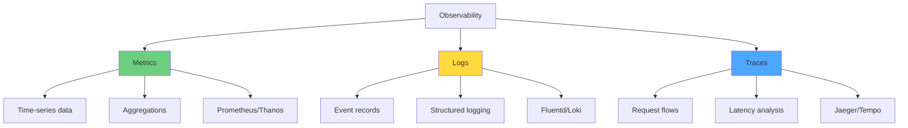
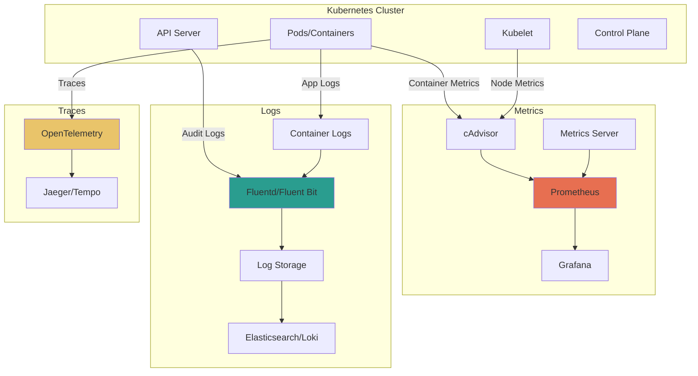
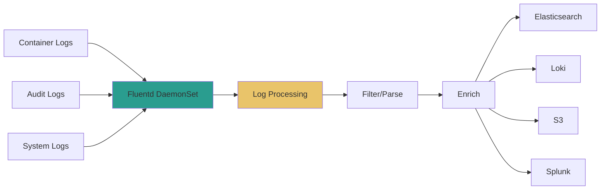

# Module 08: Observability and Logging

## Overview

**Estimated Time:** 6-7 hours

**Module Type:** Security Deep Dive

**Prerequisites:**
- Module 02 - Control Plane and Cluster Components
- Module 03 - Networking Fundamentals
- Understanding of metrics, logs, and distributed tracing concepts
- Basic knowledge of Prometheus and Grafana

Observability is critical for detecting security incidents, troubleshooting issues, and maintaining cluster health. This module covers the three pillars of observability (metrics, logs, traces), deploying monitoring stacks (Prometheus, Grafana), implementing security-focused logging, Kubernetes audit logging, and alerting on security events. You'll learn to build comprehensive observability systems for production Kubernetes clusters.

---

## Learning Objectives

By the end of this module, you will be able to:

1. Understand the three pillars of observability (metrics, logs, traces)
2. Deploy and configure Prometheus for Kubernetes monitoring
3. Create Grafana dashboards for security and operational metrics
4. Implement centralized logging with Fluentd/Fluent Bit
5. Configure Kubernetes audit logging for security events
6. Deploy OpenTelemetry for distributed tracing
7. Create security-focused alerts and runbooks
8. Query logs and metrics for security investigations
9. Implement log retention and compliance requirements
10. Build end-to-end observability pipelines

---

## 1. Observability Fundamentals

### 1.1 The Three Pillars of Observability



**Metrics:**
- Numerical measurements over time
- CPU usage, memory consumption, request rates
- Efficient for dashboards and alerting
- Tools: Prometheus, Thanos, Cortex

**Logs:**
- Discrete event records
- Application logs, audit logs, system logs
- Detailed context for investigations
- Tools: Fluentd, Fluent Bit, Loki, Elasticsearch

**Traces:**
- Request lifecycle tracking
- Distributed transaction flows
- Identify performance bottlenecks
- Tools: Jaeger, Tempo, Zipkin, OpenTelemetry

### 1.2 Kubernetes Observability Architecture



### 1.3 Observability for Security

**Security Use Cases:**
- Detect anomalous behavior (unusual API calls, resource consumption)
- Track authentication/authorization failures
- Monitor policy violations
- Audit trail for compliance
- Incident response and forensics
- Vulnerability detection
- Lateral movement detection

---

## 2. Prometheus Stack Deployment

### 2.1 Prometheus Overview

Prometheus is a time-series database and monitoring system that scrapes metrics from instrumented targets.

**Key Components:**
- **Prometheus Server** - Scrapes and stores metrics
- **Alertmanager** - Handles alerts
- **Node Exporter** - Hardware and OS metrics
- **kube-state-metrics** - Kubernetes object state
- **Pushgateway** - For short-lived jobs

### 2.2 Installing Prometheus Operator

**Using Helm (kube-prometheus-stack):**
```bash
# Add Prometheus community Helm repository
helm repo add prometheus-community https://prometheus-community.github.io/helm-charts
helm repo update

# Create namespace
kubectl create namespace monitoring

# Install kube-prometheus-stack
helm install prometheus prometheus-community/kube-prometheus-stack \
  --namespace monitoring \
  --set prometheus.prometheusSpec.retention=30d \
  --set prometheus.prometheusSpec.storageSpec.volumeClaimTemplate.spec.resources.requests.storage=50Gi \
  --set grafana.adminPassword=SecurePassword123! \
  --set prometheus.prometheusSpec.securityContext.runAsNonRoot=true \
  --set prometheus.prometheusSpec.securityContext.runAsUser=65534

# Verify installation
kubectl get pods -n monitoring
```

**Verify services:**
```bash
kubectl get svc -n monitoring

# Expected services:
# - prometheus-kube-prometheus-prometheus
# - prometheus-kube-state-metrics
# - prometheus-prometheus-node-exporter
# - alertmanager-operated
# - prometheus-grafana
```

### 2.3 Prometheus Configuration

**ServiceMonitor for Custom Application:**
```yaml
apiVersion: monitoring.coreos.com/v1
kind: ServiceMonitor
metadata:
  name: myapp-monitor
  namespace: production
  labels:
    release: prometheus
spec:
  selector:
    matchLabels:
      app: myapp
  endpoints:
  - port: metrics
    interval: 30s
    path: /metrics
    scheme: http
```

**PodMonitor Example:**
```yaml
apiVersion: monitoring.coreos.com/v1
kind: PodMonitor
metadata:
  name: pod-monitor
  namespace: monitoring
spec:
  selector:
    matchLabels:
      app: instrumented-app
  podMetricsEndpoints:
  - port: metrics
    path: /metrics
    interval: 30s
```

### 2.4 Key Prometheus Metrics for Security

**API Server Metrics:**
```promql
# Authentication failures
rate(apiserver_authentication_failure_total[5m])

# Authorization failures
rate(apiserver_authorization_failure_total[5m])

# API request rate by verb and user
rate(apiserver_request_total[5m])

# Requests to sensitive resources
apiserver_request_total{resource="secrets"}
apiserver_request_total{resource="serviceaccounts"}

# Admission webhook failures
apiserver_admission_webhook_rejection_count
```

**Container Security Metrics:**
```promql
# Privileged containers
count(kube_pod_container_status_running{container_security_context_privileged="true"})

# Containers running as root
count(kube_pod_container_status_running{container_security_context_run_as_user="0"})

# Pods without resource limits
count(kube_pod_container_resource_limits{resource="memory"} == 0)
```

**Network Metrics:**
```promql
# Network policy violations (requires CNI support)
rate(cilium_policy_drop_total[5m])

# Suspicious network connections
rate(container_network_tcp_connections_total[5m]) > 1000
```

### 2.5 Prometheus Security Configuration

**Authentication and Authorization:**
```yaml
apiVersion: monitoring.coreos.com/v1
kind: Prometheus
metadata:
  name: prometheus
  namespace: monitoring
spec:
  # Security context
  securityContext:
    runAsNonRoot: true
    runAsUser: 65534
    fsGroup: 65534
    seccompProfile:
      type: RuntimeDefault

  # Pod security
  podSecurityContext:
    runAsNonRoot: true
    runAsUser: 65534

  # Enable RBAC
  serviceAccountName: prometheus

  # Remote write with authentication
  remoteWrite:
  - url: https://remote-storage.example.com/api/v1/push
    basicAuth:
      username:
        name: prometheus-creds
        key: username
      password:
        name: prometheus-creds
        key: password
    tlsConfig:
      ca:
        secret:
          name: remote-ca
          key: ca.crt

  # Encryption at rest
  volumes:
  - name: data
    persistentVolumeClaim:
      claimName: prometheus-data
```

---

## 3. Grafana Dashboards

### 3.1 Accessing Grafana

```bash
# Port-forward to Grafana
kubectl port-forward -n monitoring svc/prometheus-grafana 3000:80

# Or use LoadBalancer/Ingress
kubectl patch svc prometheus-grafana -n monitoring -p '{"spec": {"type": "LoadBalancer"}}'

# Get admin password (if using default)
kubectl get secret -n monitoring prometheus-grafana -o jsonpath="{.data.admin-password}" | base64 --decode
```

### 3.2 Security-Focused Dashboards

**API Server Security Dashboard:**
```json
{
  "dashboard": {
    "title": "Kubernetes Security - API Server",
    "panels": [
      {
        "title": "Authentication Failures",
        "targets": [
          {
            "expr": "rate(apiserver_authentication_failure_total[5m])"
          }
        ],
        "type": "graph"
      },
      {
        "title": "Authorization Failures by User",
        "targets": [
          {
            "expr": "topk(10, rate(apiserver_authorization_failure_total[5m]))"
          }
        ],
        "type": "graph"
      },
      {
        "title": "Requests to Secrets",
        "targets": [
          {
            "expr": "sum(rate(apiserver_request_total{resource=\"secrets\"}[5m])) by (verb, user)"
          }
        ],
        "type": "table"
      },
      {
        "title": "Admission Webhook Latency",
        "targets": [
          {
            "expr": "histogram_quantile(0.99, rate(apiserver_admission_webhook_admission_duration_seconds_bucket[5m]))"
          }
        ],
        "type": "graph"
      }
    ]
  }
}
```

**Pod Security Dashboard (PromQL queries):**
```promql
# Privileged pods count
count(kube_pod_container_status_running{container_security_context_privileged="true"}) by (namespace)

# Pods running as root
count(kube_pod_container_status_running{container_security_context_run_as_user="0"}) by (namespace, pod)

# Pods without resource limits
count(kube_pod_container_info unless on(pod, namespace) kube_pod_container_resource_limits) by (namespace)

# Host network usage
count(kube_pod_spec_host_network{host_network="true"}) by (namespace)

# Recent pod failures
increase(kube_pod_container_status_restarts_total[1h]) > 3
```

**Network Security Dashboard:**
```promql
# Top talkers by pod
topk(10, sum(rate(container_network_transmit_bytes_total[5m])) by (pod))

# Egress traffic by namespace
sum(rate(container_network_transmit_bytes_total[5m])) by (namespace)

# Network policy denies (Cilium)
rate(cilium_policy_drop_total[5m])

# DNS queries
rate(coredns_dns_requests_total[5m])
```

### 3.3 Creating Custom Dashboards

**Import Dashboard via UI:**
1. Navigate to Dashboards → Import
2. Use dashboard ID from Grafana.com (e.g., 15757 for Kubernetes Cluster Monitoring)
3. Or paste JSON configuration

**Dashboard as Code (Terraform):**
```hcl
resource "grafana_dashboard" "security" {
  config_json = file("${path.module}/dashboards/security.json")
  folder      = grafana_folder.security.id
}

resource "grafana_folder" "security" {
  title = "Security Dashboards"
}
```

### 3.4 Grafana Security Configuration

```yaml
# values.yaml for Grafana Helm chart
grafana:
  adminPassword: <strong-password>

  # Authentication
  grafana.ini:
    server:
      root_url: https://grafana.example.com
    security:
      admin_user: admin
      secret_key: <random-secret-key>
      disable_gravatar: true
    auth:
      disable_login_form: false
    auth.anonymous:
      enabled: false
    auth.basic:
      enabled: true
    users:
      allow_sign_up: false
      auto_assign_org_role: Viewer

  # RBAC
  rbac:
    enabled: true

  # Security context
  securityContext:
    runAsNonRoot: true
    runAsUser: 472
    fsGroup: 472
```

---

## 4. Log Aggregation

### 4.1 Fluentd Architecture



### 4.2 Installing Fluent Bit

Fluent Bit is a lightweight alternative to Fluentd, ideal for forwarding logs.

**Fluent Bit DaemonSet:**
```yaml
apiVersion: v1
kind: ServiceAccount
metadata:
  name: fluent-bit
  namespace: logging
---
apiVersion: rbac.authorization.k8s.io/v1
kind: ClusterRole
metadata:
  name: fluent-bit
rules:
- apiGroups: [""]
  resources: ["namespaces", "pods"]
  verbs: ["get", "list", "watch"]
---
apiVersion: rbac.authorization.k8s.io/v1
kind: ClusterRoleBinding
metadata:
  name: fluent-bit
roleRef:
  apiGroup: rbac.authorization.k8s.io
  kind: ClusterRole
  name: fluent-bit
subjects:
- kind: ServiceAccount
  name: fluent-bit
  namespace: logging
---
apiVersion: v1
kind: ConfigMap
metadata:
  name: fluent-bit-config
  namespace: logging
data:
  fluent-bit.conf: |
    [SERVICE]
        Flush         5
        Log_Level     info
        Daemon        off
        Parsers_File  parsers.conf

    [INPUT]
        Name              tail
        Path              /var/log/containers/*.log
        Parser            docker
        Tag               kube.*
        Refresh_Interval  5
        Mem_Buf_Limit     50MB
        Skip_Long_Lines   On

    [FILTER]
        Name                kubernetes
        Match               kube.*
        Kube_URL            https://kubernetes.default.svc:443
        Kube_CA_File        /var/run/secrets/kubernetes.io/serviceaccount/ca.crt
        Kube_Token_File     /var/run/secrets/kubernetes.io/serviceaccount/token
        Kube_Tag_Prefix     kube.var.log.containers.
        Merge_Log           On
        Keep_Log            Off
        K8S-Logging.Parser  On
        K8S-Logging.Exclude On

    [OUTPUT]
        Name            es
        Match           *
        Host            elasticsearch.logging.svc
        Port            9200
        Logstash_Format On
        Logstash_Prefix fluent-bit
        Type            _doc
        tls             On
        tls.verify      Off

  parsers.conf: |
    [PARSER]
        Name   json
        Format json
        Time_Key time
        Time_Format %Y-%m-%dT%H:%M:%S.%L%z

    [PARSER]
        Name        docker
        Format      json
        Time_Key    time
        Time_Format %Y-%m-%dT%H:%M:%S.%L%z
---
apiVersion: apps/v1
kind: DaemonSet
metadata:
  name: fluent-bit
  namespace: logging
spec:
  selector:
    matchLabels:
      app: fluent-bit
  template:
    metadata:
      labels:
        app: fluent-bit
    spec:
      serviceAccountName: fluent-bit
      containers:
      - name: fluent-bit
        image: fluent/fluent-bit:2.1
        securityContext:
          runAsNonRoot: true
          runAsUser: 1000
          allowPrivilegeEscalation: false
          readOnlyRootFilesystem: true
          capabilities:
            drop:
            - ALL
        resources:
          limits:
            memory: 200Mi
            cpu: 200m
          requests:
            cpu: 100m
            memory: 100Mi
        volumeMounts:
        - name: varlog
          mountPath: /var/log
          readOnly: true
        - name: varlibdockercontainers
          mountPath: /var/lib/docker/containers
          readOnly: true
        - name: fluent-bit-config
          mountPath: /fluent-bit/etc/
      volumes:
      - name: varlog
        hostPath:
          path: /var/log
      - name: varlibdockercontainers
        hostPath:
          path: /var/lib/docker/containers
      - name: fluent-bit-config
        configMap:
          name: fluent-bit-config
```

### 4.3 Loki for Log Storage

Loki is a horizontally-scalable log aggregation system inspired by Prometheus.

**Install Loki Stack:**
```bash
helm repo add grafana https://grafana.github.io/helm-charts
helm install loki grafana/loki-stack \
  --namespace logging \
  --create-namespace \
  --set promtail.enabled=true \
  --set grafana.enabled=true \
  --set loki.persistence.enabled=true \
  --set loki.persistence.size=50Gi
```

**Promtail Configuration (included in loki-stack):**
```yaml
# Scrape configs automatically discovered
scrape_configs:
- job_name: kubernetes-pods
  kubernetes_sd_configs:
  - role: pod
  pipeline_stages:
  - docker: {}
  - match:
      selector: '{app="myapp"}'
      stages:
      - json:
          expressions:
            level: level
            msg: message
      - labels:
          level:
  relabel_configs:
  - source_labels: [__meta_kubernetes_pod_name]
    target_label: pod
  - source_labels: [__meta_kubernetes_namespace]
    target_label: namespace
```

**Query Loki (LogQL):**
```logql
# All logs from namespace
{namespace="production"}

# Filter by log level
{namespace="production"} |= "ERROR"

# JSON parsing
{app="api"} | json | level="error"

# Rate of errors
rate({namespace="production"} |= "ERROR" [5m])

# Top error messages
topk(10, sum by (message) (rate({namespace="production"} |= "ERROR" [5m])))
```

### 4.4 Log Security Best Practices

**Exclude Sensitive Data:**
```yaml
# Fluent Bit filter to redact secrets
[FILTER]
    Name    modify
    Match   *
    Add     redacted true
    Condition Key_value_matches log password=.*
    Set     log "password=[REDACTED]"
```

**Log Retention Policies:**
```yaml
# Loki retention configuration
limits_config:
  retention_period: 744h  # 31 days

# Table manager for retention
table_manager:
  retention_deletes_enabled: true
  retention_period: 744h
```

---

## 5. Kubernetes Audit Logging

### 5.1 Audit Logging Overview

Kubernetes audit logs provide a chronological record of API server activities.

**Audit Stages:**
1. **RequestReceived** - Audit handler receives request
2. **ResponseStarted** - Response headers sent (long-running requests)
3. **ResponseComplete** - Response body completed
4. **Panic** - Events generated when panic occurs

**Audit Levels:**
- **None** - Don't log
- **Metadata** - Log request metadata (user, timestamp, resource, verb)
- **Request** - Log metadata and request body
- **RequestResponse** - Log metadata, request, and response bodies

### 5.2 Audit Policy Configuration

```yaml
# /etc/kubernetes/audit-policy.yaml
apiVersion: audit.k8s.io/v1
kind: Policy
omitStages:
  - "RequestReceived"

rules:
  # Log all requests at RequestResponse level for debugging
  # CAUTION: This generates large volumes of logs
  - level: RequestResponse
    resources:
    - group: ""
      resources: ["secrets", "configmaps"]
    namespaces: ["production"]

  # Log authentication/authorization failures
  - level: Metadata
    omitStages:
    - "RequestReceived"
    verbs: ["get", "list", "watch"]
    resources:
    - group: ""
      resources: ["secrets", "serviceaccounts"]

  # Log modifications to security resources
  - level: RequestResponse
    verbs: ["create", "update", "patch", "delete"]
    resources:
    - group: "rbac.authorization.k8s.io"
      resources: ["clusterroles", "clusterrolebindings", "roles", "rolebindings"]
    - group: ""
      resources: ["serviceaccounts"]
    - group: "certificates.k8s.io"
      resources: ["certificatesigningrequests"]

  # Log admission webhook decisions
  - level: Metadata
    verbs: ["create", "update"]
    omitStages:
    - "RequestReceived"

  # Log pod exec/attach (potential attacker activity)
  - level: Metadata
    verbs: ["create"]
    resources:
    - group: ""
      resources: ["pods/exec", "pods/attach", "pods/portforward"]

  # Log all deletions
  - level: Request
    verbs: ["delete", "deletecollection"]

  # Catch-all: log metadata for everything else
  - level: Metadata
    omitStages:
    - "RequestReceived"
```

### 5.3 Enabling Audit Logging

**Configure API Server:**
```yaml
# /etc/kubernetes/manifests/kube-apiserver.yaml
spec:
  containers:
  - command:
    - kube-apiserver
    - --audit-policy-file=/etc/kubernetes/audit-policy.yaml
    - --audit-log-path=/var/log/kubernetes/audit.log
    - --audit-log-maxage=30
    - --audit-log-maxbackup=10
    - --audit-log-maxsize=100
    # Or use webhook backend
    - --audit-webhook-config-file=/etc/kubernetes/audit-webhook-config.yaml
    - --audit-webhook-batch-max-wait=5s
    volumeMounts:
    - name: audit-policy
      mountPath: /etc/kubernetes/audit-policy.yaml
      readOnly: true
    - name: audit-logs
      mountPath: /var/log/kubernetes
  volumes:
  - name: audit-policy
    hostPath:
      path: /etc/kubernetes/audit-policy.yaml
      type: File
  - name: audit-logs
    hostPath:
      path: /var/log/kubernetes
      type: DirectoryOrCreate
```

### 5.4 Audit Webhook Backend

**Webhook Configuration:**
```yaml
# /etc/kubernetes/audit-webhook-config.yaml
apiVersion: v1
kind: Config
clusters:
- name: audit-webhook
  cluster:
    server: https://audit-collector.logging.svc.cluster.local:8443/audit
    certificate-authority: /etc/kubernetes/pki/ca.crt
contexts:
- context:
    cluster: audit-webhook
    user: audit-webhook
  name: audit-webhook
current-context: audit-webhook
users:
- name: audit-webhook
  user:
    client-certificate: /etc/kubernetes/pki/audit-webhook-client.crt
    client-key: /etc/kubernetes/pki/audit-webhook-client.key
```

**Audit Webhook Receiver (example):**
```python
from flask import Flask, request, jsonify
import json
import logging

app = Flask(__name__)

@app.route('/audit', methods=['POST'])
def receive_audit():
    audit_event = request.json

    # Extract key information
    kind = audit_event.get('kind')
    api_version = audit_event.get('apiVersion')
    level = audit_event.get('level')
    stage = audit_event.get('stage')
    verb = audit_event.get('verb')
    user = audit_event.get('user', {}).get('username')
    resource = audit_event.get('objectRef', {})

    # Log to centralized logging system
    logging.info(f"Audit: {verb} {resource} by {user}")

    # Detect suspicious activity
    if verb in ['delete', 'deletecollection'] and resource.get('resource') == 'secrets':
        logging.warning(f"ALERT: Secret deletion by {user}")

    return jsonify({"received": True}), 200

if __name__ == '__main__':
    app.run(host='0.0.0.0', port=8443, ssl_context=('cert.pem', 'key.pem'))
```

### 5.5 Analyzing Audit Logs

**Query Examples:**
```bash
# Failed authentication attempts
jq 'select(.responseStatus.code >= 400) | select(.verb == "authenticate")' audit.log

# Secret access
jq 'select(.objectRef.resource == "secrets")' audit.log

# Admin actions
jq 'select(.user.username | contains("system:admin"))' audit.log

# Pod exec events
jq 'select(.objectRef.subresource == "exec")' audit.log

# RBAC changes
jq 'select(.objectRef.apiGroup == "rbac.authorization.k8s.io")' audit.log
```

---

## 6. OpenTelemetry and Distributed Tracing

### 6.1 OpenTelemetry Overview

OpenTelemetry provides vendor-neutral instrumentation for metrics, logs, and traces.

**Components:**
- **SDK** - Instrumentation libraries
- **Collector** - Receive, process, export telemetry
- **Exporter** - Send data to backends (Jaeger, Zipkin, Prometheus)

### 6.2 Installing OpenTelemetry Operator

```bash
# Install cert-manager (prerequisite)
kubectl apply -f https://github.com/cert-manager/cert-manager/releases/download/v1.13.0/cert-manager.yaml

# Install OpenTelemetry Operator
kubectl apply -f https://github.com/open-telemetry/opentelemetry-operator/releases/latest/download/opentelemetry-operator.yaml
```

### 6.3 OpenTelemetry Collector Configuration

```yaml
apiVersion: opentelemetry.io/v1alpha1
kind: OpenTelemetryCollector
metadata:
  name: otel-collector
  namespace: observability
spec:
  mode: deployment
  config: |
    receivers:
      otlp:
        protocols:
          grpc:
            endpoint: 0.0.0.0:4317
          http:
            endpoint: 0.0.0.0:4318

      # Prometheus receiver
      prometheus:
        config:
          scrape_configs:
          - job_name: 'kubernetes-pods'
            kubernetes_sd_configs:
            - role: pod

    processors:
      batch:
        timeout: 10s
        send_batch_size: 1024

      # Add Kubernetes metadata
      k8sattributes:
        auth_type: "serviceAccount"
        passthrough: false
        extract:
          metadata:
          - k8s.pod.name
          - k8s.pod.uid
          - k8s.deployment.name
          - k8s.namespace.name
          - k8s.node.name

    exporters:
      # Jaeger for traces
      jaeger:
        endpoint: jaeger-collector.observability.svc:14250
        tls:
          insecure: false

      # Prometheus for metrics
      prometheus:
        endpoint: 0.0.0.0:8889

      # Loki for logs
      loki:
        endpoint: http://loki.logging.svc:3100/loki/api/v1/push

    service:
      pipelines:
        traces:
          receivers: [otlp]
          processors: [k8sattributes, batch]
          exporters: [jaeger]
        metrics:
          receivers: [otlp, prometheus]
          processors: [k8sattributes, batch]
          exporters: [prometheus]
        logs:
          receivers: [otlp]
          processors: [k8sattributes, batch]
          exporters: [loki]
```

### 6.4 Instrumenting Applications

**Python Flask Example:**
```python
from opentelemetry import trace
from opentelemetry.sdk.trace import TracerProvider
from opentelemetry.sdk.trace.export import BatchSpanProcessor
from opentelemetry.exporter.otlp.proto.grpc.trace_exporter import OTLPSpanExporter
from opentelemetry.instrumentation.flask import FlaskInstrumentor
from flask import Flask

# Initialize tracing
trace.set_tracer_provider(TracerProvider())
tracer = trace.get_tracer(__name__)

# Configure OTLP exporter
otlp_exporter = OTLPSpanExporter(
    endpoint="otel-collector.observability.svc:4317",
    insecure=True
)
span_processor = BatchSpanProcessor(otlp_exporter)
trace.get_tracer_provider().add_span_processor(span_processor)

# Create Flask app
app = Flask(__name__)
FlaskInstrumentor().instrument_app(app)

@app.route('/api/data')
def get_data():
    with tracer.start_as_current_span("get_data"):
        # Your application logic
        return {"status": "ok"}

if __name__ == '__main__':
    app.run(host='0.0.0.0', port=8080)
```

---

## 7. Security Alerting

### 7.1 Alertmanager Configuration

```yaml
apiVersion: v1
kind: ConfigMap
metadata:
  name: alertmanager-config
  namespace: monitoring
data:
  alertmanager.yml: |
    global:
      resolve_timeout: 5m
      slack_api_url: 'https://hooks.slack.com/services/YOUR/WEBHOOK/URL'

    route:
      group_by: ['alertname', 'cluster', 'namespace']
      group_wait: 10s
      group_interval: 10s
      repeat_interval: 12h
      receiver: 'default'
      routes:
      # Critical security alerts
      - match:
          severity: critical
        receiver: 'security-team'
        continue: true

      # High priority alerts
      - match:
          severity: warning
        receiver: 'ops-team'

    receivers:
    - name: 'default'
      slack_configs:
      - channel: '#alerts'
        title: 'Kubernetes Alert'
        text: '{{ range .Alerts }}{{ .Annotations.summary }}{{ end }}'

    - name: 'security-team'
      slack_configs:
      - channel: '#security-alerts'
        title: '🚨 SECURITY ALERT'
        text: '{{ range .Alerts }}{{ .Annotations.description }}{{ end }}'
      email_configs:
      - to: 'security@example.com'
        from: 'alertmanager@example.com'
        smarthost: 'smtp.example.com:587'
        auth_username: 'alertmanager'
        auth_password: 'password'

    - name: 'ops-team'
      slack_configs:
      - channel: '#ops-alerts'
```

### 7.2 Security Alert Rules

```yaml
apiVersion: monitoring.coreos.com/v1
kind: PrometheusRule
metadata:
  name: security-alerts
  namespace: monitoring
spec:
  groups:
  - name: kubernetes-security
    interval: 30s
    rules:
    # Authentication failures
    - alert: HighAuthenticationFailureRate
      expr: rate(apiserver_authentication_failure_total[5m]) > 5
      for: 5m
      labels:
        severity: warning
      annotations:
        summary: "High authentication failure rate"
        description: "Authentication failure rate is {{ $value }} per second"

    # Authorization failures
    - alert: HighAuthorizationFailureRate
      expr: rate(apiserver_authorization_failure_total[5m]) > 10
      for: 5m
      labels:
        severity: warning
      annotations:
        summary: "High authorization failure rate"
        description: "Authorization failure rate is {{ $value }} per second"

    # Privileged pods
    - alert: PrivilegedPodRunning
      expr: count(kube_pod_container_status_running{container_security_context_privileged="true"}) > 0
      for: 1m
      labels:
        severity: critical
      annotations:
        summary: "Privileged pod detected"
        description: "{{ $value }} privileged pods are running"

    # Pods running as root
    - alert: PodRunningAsRoot
      expr: count(kube_pod_container_status_running{container_security_context_run_as_user="0"}) > 5
      for: 5m
      labels:
        severity: warning
      annotations:
        summary: "Pods running as root detected"
        description: "{{ $value }} pods are running as root user"

    # Secret access spike
    - alert: SecretAccessSpike
      expr: rate(apiserver_request_total{resource="secrets"}[5m]) > 10
      for: 2m
      labels:
        severity: critical
      annotations:
        summary: "Unusual secret access detected"
        description: "Secret access rate is {{ $value }} per second"

    # Pod exec events
    - alert: PodExecDetected
      expr: rate(apiserver_request_total{verb="create", resource="pods", subresource="exec"}[5m]) > 0.1
      for: 1m
      labels:
        severity: warning
      annotations:
        summary: "Pod exec activity detected"
        description: "Pod exec rate is {{ $value }} per second"

    # RBAC modification
    - alert: RBACModification
      expr: rate(apiserver_request_total{verb=~"create|update|patch|delete", resource=~"roles|rolebindings|clusterroles|clusterrolebindings"}[5m]) > 0
      for: 1m
      labels:
        severity: critical
      annotations:
        summary: "RBAC modification detected"
        description: "RBAC resources are being modified"

    # Network policy violations (Cilium)
    - alert: NetworkPolicyViolations
      expr: rate(cilium_policy_drop_total[5m]) > 10
      for: 5m
      labels:
        severity: warning
      annotations:
        summary: "High rate of network policy violations"
        description: "Network policy violation rate is {{ $value }} per second"

    # Container restart loop
    - alert: PodCrashLooping
      expr: rate(kube_pod_container_status_restarts_total[15m]) > 0.1
      for: 5m
      labels:
        severity: warning
      annotations:
        summary: "Pod is crash looping"
        description: "Pod {{ $labels.namespace }}/{{ $labels.pod }} is restarting frequently"
```

### 7.3 Log-Based Alerts (Loki)

```yaml
# Loki alerting rules
groups:
- name: log-alerts
  interval: 1m
  rules:
  - alert: HighErrorRate
    expr: |
      sum(rate({namespace="production"} |= "ERROR" [5m])) by (namespace)
      > 10
    for: 5m
    labels:
      severity: warning
    annotations:
      summary: "High error rate in {{ $labels.namespace }}"

  - alert: AuthenticationFailureInLogs
    expr: |
      sum(rate({namespace=~".+"} |= "authentication failed" [5m])) > 5
    for: 2m
    labels:
      severity: critical
    annotations:
      summary: "Authentication failures detected in logs"

  - alert: PrivilegeEscalationAttempt
    expr: |
      count_over_time({namespace=~".+"} |~ "(?i)(privilege escalation|sudo|su root)" [5m]) > 0
    for: 1m
    labels:
      severity: critical
    annotations:
      summary: "Potential privilege escalation attempt detected"
```

---

## 8. Observability Stack Security

### 8.1 Securing Prometheus

```yaml
# Network policy for Prometheus
apiVersion: networking.k8s.io/v1
kind: NetworkPolicy
metadata:
  name: prometheus-netpol
  namespace: monitoring
spec:
  podSelector:
    matchLabels:
      app: prometheus
  policyTypes:
  - Ingress
  - Egress
  ingress:
  # Allow Grafana
  - from:
    - podSelector:
        matchLabels:
          app: grafana
    ports:
    - protocol: TCP
      port: 9090
  # Allow Alertmanager
  - from:
    - podSelector:
        matchLabels:
          app: alertmanager
    ports:
    - protocol: TCP
      port: 9090
  egress:
  # Allow scraping targets
  - to:
    - namespaceSelector: {}
    ports:
    - protocol: TCP
      port: 8080
  # Allow DNS
  - to:
    - namespaceSelector:
        matchLabels:
          name: kube-system
    ports:
    - protocol: UDP
      port: 53
```

### 8.2 Encryption at Rest

```yaml
# Encrypted storage for Prometheus
apiVersion: v1
kind: PersistentVolumeClaim
metadata:
  name: prometheus-data
  namespace: monitoring
spec:
  accessModes:
  - ReadWriteOnce
  resources:
    requests:
      storage: 50Gi
  storageClassName: encrypted-ssd
```

### 8.3 Access Control

```yaml
# RBAC for Prometheus
apiVersion: rbac.authorization.k8s.io/v1
kind: ClusterRole
metadata:
  name: prometheus
rules:
- apiGroups: [""]
  resources:
  - nodes
  - nodes/metrics
  - services
  - endpoints
  - pods
  verbs: ["get", "list", "watch"]
- apiGroups: [""]
  resources:
  - configmaps
  verbs: ["get"]
- nonResourceURLs: ["/metrics"]
  verbs: ["get"]
```

---

## 9. Best Practices

### 9.1 Observability Checklist

- ✅ **Metrics Collection**
  - Prometheus deployed with HA configuration
  - ServiceMonitors for all applications
  - Security-focused metrics monitored
  - Long-term storage (Thanos/Cortex)

- ✅ **Log Aggregation**
  - Centralized logging (Loki/Elasticsearch)
  - Container logs collected
  - Audit logs forwarded
  - Log retention policy defined

- ✅ **Distributed Tracing**
  - OpenTelemetry collector deployed
  - Critical services instrumented
  - Trace sampling configured

- ✅ **Alerting**
  - Security alerts configured
  - On-call rotations defined
  - Runbooks documented
  - Alert fatigue minimized

- ✅ **Security**
  - Observability stack secured
  - Network policies applied
  - RBAC configured
  - Data encrypted

### 9.2 Performance Optimization

**Metric Relabeling:**
```yaml
# Drop high-cardinality metrics
metric_relabel_configs:
- source_labels: [__name__]
  regex: 'etcd_request_duration_seconds_bucket'
  action: drop
```

**Log Sampling:**
```yaml
# Fluent Bit sampling
[FILTER]
    Name    sampling
    Match   *
    Percentage 10  # Keep 10% of logs
```

---

## 10. Security Checklist

- [ ] **Metrics Monitoring**
  - [ ] Prometheus deployed with security context
  - [ ] Metrics endpoints secured
  - [ ] Network policies applied
  - [ ] Security-focused dashboards created

- [ ] **Log Management**
  - [ ] Centralized logging configured
  - [ ] Audit logs collected
  - [ ] Sensitive data redacted
  - [ ] Retention policies enforced
  - [ ] Log access controlled via RBAC

- [ ] **Security Alerts**
  - [ ] Authentication failure alerts
  - [ ] Authorization failure alerts
  - [ ] Privileged pod alerts
  - [ ] RBAC modification alerts
  - [ ] Secret access alerts
  - [ ] Pod exec alerts

- [ ] **Compliance**
  - [ ] Audit logs retained per policy
  - [ ] Access logs available
  - [ ] Security events monitored
  - [ ] Incident response procedures defined

---

## 11. References

### Official Documentation

1. **Kubernetes Monitoring Architecture**
   - https://kubernetes.io/docs/tasks/debug/debug-cluster/resource-metrics-pipeline/

2. **Kubernetes Audit Logging**
   - https://kubernetes.io/docs/tasks/debug/debug-cluster/audit/

### Prometheus

3. **Prometheus Documentation**
   - https://prometheus.io/docs/

4. **kube-prometheus-stack**
   - https://github.com/prometheus-operator/kube-prometheus

5. **Prometheus Best Practices**
   - https://prometheus.io/docs/practices/naming/

### Logging

6. **Fluent Bit Documentation**
   - https://docs.fluentbit.io/

7. **Grafana Loki**
   - https://grafana.com/docs/loki/

### Tracing

8. **OpenTelemetry**
   - https://opentelemetry.io/docs/

9. **Jaeger**
   - https://www.jaegertracing.io/docs/

### Security

10. **CNCF Security TAG - Observability**
    - https://github.com/cncf/tag-security/tree/main/security-whitepaper

---

## Next Steps

Continue to **Module 09: Supply Chain and Image Security** to learn about securing container images, software supply chain, and CI/CD pipelines.

---

**Module Completion Status:** ✅ Complete
