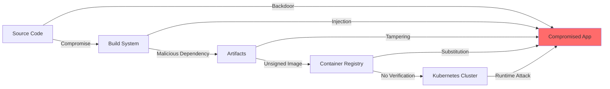
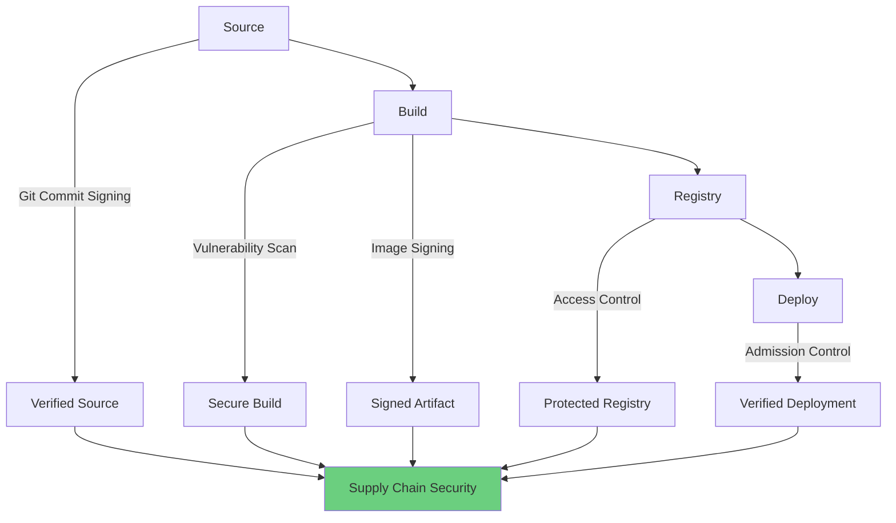
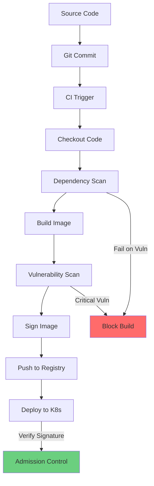

# Module 09: Supply Chain and Image Security

## Overview

**Estimated Time:** 6-7 hours

**Module Type:** Security Deep Dive

**Prerequisites:**
- Module 01 - Kubernetes Basics
- Module 06 - Pod Security
- Module 07 - Admission Control and Policy
- Understanding of Docker/container images and CI/CD concepts

Software supply chain security is critical for protecting against compromised dependencies, malicious images, and supply chain attacks. This module covers the SLSA framework, container image scanning with Trivy, image signing with cosign, admission control for image verification, SBOM generation, and secure CI/CD pipeline patterns. Based on SLSA, NIST SP 800-218, and CNCF supply chain security best practices.

---

## Learning Objectives

By the end of this module, you will be able to:

1. Understand software supply chain threat models and SLSA framework
2. Scan container images for vulnerabilities using Trivy
3. Sign and verify container images with cosign and Sigstore
4. Generate and validate Software Bill of Materials (SBOM)
5. Implement admission controllers for image verification
6. Configure private container registries securely
7. Build secure CI/CD pipelines with GitHub Actions
8. Apply supply chain security best practices
9. Detect and respond to supply chain compromises
10. Implement zero-trust artifact verification

---

## 1. Software Supply Chain Security

### 1.1 Supply Chain Threat Model



**Common Attack Vectors:**

1. **Source Code Compromise**
   - Malicious commits
   - Compromised developer accounts
   - Backdoored dependencies

2. **Build System Compromise**
   - Malicious build scripts
   - Compromised CI/CD pipelines
   - Stolen secrets

3. **Artifact Tampering**
   - Modified container images
   - Unsigned artifacts
   - Registry compromise

4. **Deployment Attacks**
   - Runtime image substitution
   - Privilege escalation
   - Supply chain injection

### 1.2 SLSA Framework

Supply chain Levels for Software Artifacts (SLSA) defines security levels:

| Level | Requirements | Protection |
|-------|--------------|------------|
| SLSA 0 | No guarantees | None |
| SLSA 1 | Build process documented | Basic provenance |
| SLSA 2 | Tamper-resistant build service | Signed provenance |
| SLSA 3 | Hardened build platform | Verified provenance |
| SLSA 4 | Two-party review | Maximum trust |

**SLSA Provenance:**
```json
{
  "_type": "https://in-toto.io/Statement/v0.1",
  "subject": [
    {
      "name": "registry.example.com/app",
      "digest": {
        "sha256": "abc123..."
      }
    }
  ],
  "predicateType": "https://slsa.dev/provenance/v0.2",
  "predicate": {
    "builder": {
      "id": "https://github.com/Attestations/GitHubActionsWorkflow@v1"
    },
    "buildType": "https://github.com/Attestations/GitHubActionsWorkflow@v1",
    "invocation": {
      "configSource": {
        "uri": "git+https://github.com/org/repo@refs/heads/main",
        "digest": {
          "sha1": "def456..."
        }
      }
    },
    "metadata": {
      "buildStartedOn": "2024-01-15T10:00:00Z",
      "buildFinishedOn": "2024-01-15T10:15:00Z"
    },
    "materials": [
      {
        "uri": "git+https://github.com/org/repo",
        "digest": {
          "sha1": "def456..."
        }
      }
    ]
  }
}
```

### 1.3 Defense in Depth Strategy



---

## 2. Container Image Scanning with Trivy

### 2.1 Trivy Overview

Trivy is a comprehensive vulnerability scanner for containers, filesystems, and git repositories.

**Scan Types:**
- **Vulnerability scanning** - OS and application packages
- **Misconfiguration detection** - Kubernetes, Docker, Terraform
- **Secret detection** - API keys, passwords, tokens
- **License scanning** - Software license compliance
- **SBOM generation** - Software Bill of Materials

### 2.2 Installing Trivy

```bash
# Install Trivy CLI
wget -qO - https://aquasecurity.github.io/trivy-repo/deb/public.key | sudo apt-key add -
echo "deb https://aquasecurity.github.io/trivy-repo/deb $(lsb_release -sc) main" | sudo tee /etc/apt/sources.list.d/trivy.list
sudo apt-get update
sudo apt-get install trivy

# Or using binary
curl -sfL https://raw.githubusercontent.com/aquasecurity/trivy/main/contrib/install.sh | sh -s -- -b /usr/local/bin

# Verify installation
trivy --version
```

### 2.3 Scanning Container Images

**Basic Image Scan:**
```bash
# Scan public image
trivy image nginx:1.25

# Scan with specific severity
trivy image --severity CRITICAL,HIGH nginx:1.25

# Scan private registry image
trivy image --username myuser --password mypass registry.example.com/app:v1.0

# Output formats
trivy image --format json --output result.json nginx:1.25
trivy image --format sarif --output result.sarif nginx:1.25
trivy image --format cyclonedx --output sbom.json nginx:1.25
```

**Scan with Exit Code:**
```bash
# Fail on critical vulnerabilities
trivy image --exit-code 1 --severity CRITICAL nginx:1.25

# Fail if vulnerability count exceeds threshold
trivy image --exit-code 1 --severity HIGH,CRITICAL nginx:1.25
```

**Example Output:**
```
nginx:1.25 (debian 12.4)
=======================
Total: 120 (UNKNOWN: 0, LOW: 65, MEDIUM: 40, HIGH: 12, CRITICAL: 3)

┌───────────────┬────────────────┬──────────┬───────────────────┬───────────────┬────────────────────────────────────┐
│   Library     │ Vulnerability  │ Severity │ Installed Version │ Fixed Version │             Title                  │
├───────────────┼────────────────┼──────────┼───────────────────┼───────────────┼────────────────────────────────────┤
│ openssl       │ CVE-2024-0001  │ CRITICAL │ 3.0.11-1          │ 3.0.11-2      │ OpenSSL: remote code execution     │
│ libssl3       │ CVE-2024-0001  │ CRITICAL │ 3.0.11-1          │ 3.0.11-2      │ OpenSSL: remote code execution     │
│ curl          │ CVE-2024-0002  │ HIGH     │ 7.88.1-10         │ 7.88.1-11     │ curl: buffer overflow              │
└───────────────┴────────────────┴──────────┴───────────────────┴───────────────┴────────────────────────────────────┘
```

### 2.4 Scanning Kubernetes Manifests

```bash
# Scan Kubernetes YAML
trivy config deployment.yaml

# Scan entire directory
trivy config ./kubernetes/

# Scan with policy
trivy config --policy ./policies/ ./kubernetes/
```

**Example Misconfigurations:**
```
deployment.yaml (kubernetes)
============================
Tests: 28 (SUCCESSES: 20, FAILURES: 8)
Failures: 8 (UNKNOWN: 0, LOW: 2, MEDIUM: 3, HIGH: 2, CRITICAL: 1)

CRITICAL: Container is running as root
════════════════════════════════════════
Container 'app' is running as root user

See https://avd.aquasec.com/misconfig/ksv012
────────────────────────────────────────
 deployment.yaml:15-20
────────────────────────────────────────
  15 ┌   containers:
  16 │   - name: app
  17 │     image: myapp:latest
  18 │     # No securityContext defined
  19 │     ports:
  20 └     - containerPort: 8080
────────────────────────────────────────
```

### 2.5 Trivy in CI/CD

**GitHub Actions:**
```yaml
name: Container Scan
on: [push, pull_request]

jobs:
  scan:
    runs-on: ubuntu-latest
    steps:
    - name: Checkout code
      uses: actions/checkout@v4

    - name: Build image
      run: docker build -t myapp:${{ github.sha }} .

    - name: Run Trivy vulnerability scanner
      uses: aquasecurity/trivy-action@master
      with:
        image-ref: myapp:${{ github.sha }}
        format: 'sarif'
        output: 'trivy-results.sarif'
        severity: 'CRITICAL,HIGH'
        exit-code: '1'

    - name: Upload Trivy results to GitHub Security
      uses: github/codeql-action/upload-sarif@v2
      if: always()
      with:
        sarif_file: 'trivy-results.sarif'
```

**GitLab CI:**
```yaml
image_scan:
  stage: test
  image:
    name: aquasec/trivy:latest
    entrypoint: [""]
  script:
    - trivy image --exit-code 1 --severity CRITICAL $CI_REGISTRY_IMAGE:$CI_COMMIT_SHA
  only:
    - merge_requests
    - main
```

### 2.6 Trivy Operator for Kubernetes

Deploy Trivy as an operator to continuously scan cluster resources:

```bash
# Install Trivy Operator
kubectl apply -f https://raw.githubusercontent.com/aquasecurity/trivy-operator/main/deploy/static/trivy-operator.yaml

# Verify installation
kubectl get pods -n trivy-system

# View vulnerability reports
kubectl get vulnerabilityreports -A
kubectl get configauditreports -A
```

**Example VulnerabilityReport:**
```yaml
apiVersion: aquasecurity.github.io/v1alpha1
kind: VulnerabilityReport
metadata:
  name: deployment-myapp
  namespace: production
spec:
  vulnerabilities:
  - vulnerabilityID: CVE-2024-0001
    severity: CRITICAL
    title: OpenSSL remote code execution
    installedVersion: 3.0.11-1
    fixedVersion: 3.0.11-2
    resource: openssl
```

---

## 3. Image Signing with cosign

### 3.1 cosign Overview

cosign is a tool for signing and verifying container images using Sigstore.

**Key Features:**
- Sign container images
- Verify signatures
- Attach SBOMs and attestations
- Keyless signing with OIDC
- Hardware security module (HSM) support

### 3.2 Installing cosign

```bash
# Install cosign
curl -LO https://github.com/sigstore/cosign/releases/latest/download/cosign-linux-amd64
sudo mv cosign-linux-amd64 /usr/local/bin/cosign
sudo chmod +x /usr/local/bin/cosign

# Verify installation
cosign version
```

### 3.3 Generating Key Pairs

**Generate Keys:**
```bash
# Generate key pair (passphrase protected)
cosign generate-key-pair

# Output: cosign.key (private), cosign.pub (public)

# Store private key securely
kubectl create secret generic cosign-key \
  --from-file=cosign.key=cosign.key \
  -n signing-system
```

**Using Cloud KMS:**
```bash
# Google Cloud KMS
cosign generate-key-pair --kms gcpkms://projects/PROJECT/locations/LOCATION/keyRings/RING/cryptoKeys/KEY

# AWS KMS
cosign generate-key-pair --kms awskms:///arn:aws:kms:REGION:ACCOUNT:key/KEY-ID

# Azure Key Vault
cosign generate-key-pair --kms azurekms://VAULT-NAME.vault.azure.net/keys/KEY-NAME/KEY-VERSION
```

### 3.4 Signing Images

**Sign with Key Pair:**
```bash
# Build and push image
docker build -t registry.example.com/app:v1.0 .
docker push registry.example.com/app:v1.0

# Sign image
cosign sign --key cosign.key registry.example.com/app:v1.0

# Sign with annotations
cosign sign --key cosign.key \
  -a author=security-team \
  -a build-date=$(date -u +%Y-%m-%dT%H:%M:%SZ) \
  registry.example.com/app:v1.0
```

**Keyless Signing (Sigstore):**
```bash
# Sign using OIDC (GitHub, Google, Microsoft)
cosign sign registry.example.com/app:v1.0

# This opens browser for authentication
# Signature stored in transparency log
```

**Verify Signature:**
```bash
# Verify with public key
cosign verify --key cosign.pub registry.example.com/app:v1.0

# Verify keyless signature
cosign verify \
  --certificate-identity=user@example.com \
  --certificate-oidc-issuer=https://github.com/login/oauth \
  registry.example.com/app:v1.0
```

### 3.5 Attaching Attestations

**Generate and Attach SBOM:**
```bash
# Generate SBOM with Syft
syft packages registry.example.com/app:v1.0 -o spdx-json > sbom.spdx.json

# Attach SBOM to image
cosign attach sbom --sbom sbom.spdx.json registry.example.com/app:v1.0

# Attest SBOM (signed)
cosign attest --predicate sbom.spdx.json --key cosign.key registry.example.com/app:v1.0

# Verify attestation
cosign verify-attestation --key cosign.pub registry.example.com/app:v1.0
```

**Custom Attestations:**
```bash
# Create custom attestation
cat > attestation.json <<EOF
{
  "predicateType": "https://example.com/security-scan/v1",
  "predicate": {
    "scanned": true,
    "scanner": "trivy",
    "vulnerabilities": {
      "critical": 0,
      "high": 2
    },
    "timestamp": "2024-01-15T10:00:00Z"
  }
}
EOF

# Attach attestation
cosign attest --predicate attestation.json --key cosign.key registry.example.com/app:v1.0
```

### 3.6 Image Verification in Kubernetes

**Kyverno Policy for Image Verification:**
```yaml
apiVersion: kyverno.io/v1
kind: ClusterPolicy
metadata:
  name: verify-image-signatures
spec:
  validationFailureAction: Enforce
  webhookTimeoutSeconds: 30
  rules:
  - name: verify-signature
    match:
      any:
      - resources:
          kinds:
          - Pod
    verifyImages:
    - imageReferences:
      - "registry.example.com/*"
      attestors:
      - count: 1
        entries:
        - keys:
            publicKeys: |-
              -----BEGIN PUBLIC KEY-----
              MFkwEwYHKoZIzj0CAQYIKoZIzj0DAQcDQgAE...
              -----END PUBLIC KEY-----
```

**Sigstore Policy Controller:**
```bash
# Install Sigstore Policy Controller
kubectl apply -f https://github.com/sigstore/policy-controller/releases/latest/download/policy-controller.yaml

# Create ClusterImagePolicy
cat <<EOF | kubectl apply -f -
apiVersion: policy.sigstore.dev/v1beta1
kind: ClusterImagePolicy
metadata:
  name: signed-images-policy
spec:
  images:
  - glob: "registry.example.com/**"
  authorities:
  - key:
      data: |
        -----BEGIN PUBLIC KEY-----
        MFkwEwYHKoZIzj0CAQYIKoZIzj0DAQcDQgAE...
        -----END PUBLIC KEY-----
EOF
```

---

## 4. Software Bill of Materials (SBOM)

### 4.1 SBOM Overview

An SBOM is a comprehensive inventory of software components, dependencies, and metadata.

**SBOM Formats:**
- **SPDX** - Software Package Data Exchange (ISO standard)
- **CycloneDX** - OWASP standard for supply chain security
- **SWID** - Software Identification Tags (ISO/IEC 19770-2)

### 4.2 Generating SBOMs with Syft

```bash
# Install Syft
curl -sSfL https://raw.githubusercontent.com/anchore/syft/main/install.sh | sh -s -- -b /usr/local/bin

# Generate SBOM
syft packages registry.example.com/app:v1.0 -o spdx-json > sbom.spdx.json
syft packages registry.example.com/app:v1.0 -o cyclonedx-json > sbom.cyclonedx.json

# Generate from local image
syft packages alpine:latest -o table

# Generate from directory
syft packages dir:./app -o spdx-json
```

**Example SPDX SBOM:**
```json
{
  "spdxVersion": "SPDX-2.3",
  "dataLicense": "CC0-1.0",
  "SPDXID": "SPDXRef-DOCUMENT",
  "name": "registry.example.com/app:v1.0",
  "packages": [
    {
      "SPDXID": "SPDXRef-Package-openssl",
      "name": "openssl",
      "versionInfo": "3.0.11-1",
      "supplier": "Organization: Debian",
      "licenseConcluded": "Apache-2.0",
      "externalRefs": [
        {
          "referenceCategory": "SECURITY",
          "referenceType": "cpe23Type",
          "referenceLocator": "cpe:2.3:a:openssl:openssl:3.0.11:*:*:*:*:*:*:*"
        }
      ]
    }
  ]
}
```

### 4.3 SBOM Analysis

**Scan SBOM for Vulnerabilities:**
```bash
# Scan SBOM with Trivy
trivy sbom sbom.spdx.json

# Scan SBOM with Grype
grype sbom:sbom.spdx.json
```

**Query SBOM:**
```bash
# Extract specific information
jq '.packages[] | select(.name=="openssl")' sbom.spdx.json

# List all licenses
jq '.packages[].licenseConcluded' sbom.spdx.json | sort -u

# Count packages
jq '.packages | length' sbom.spdx.json
```

### 4.4 SBOM Distribution

**Attach to Container Image:**
```bash
# Using cosign
cosign attach sbom --sbom sbom.spdx.json registry.example.com/app:v1.0

# Download SBOM
cosign download sbom registry.example.com/app:v1.0 > downloaded-sbom.json
```

**Store in OCI Registry:**
```bash
# Using ORAS
oras push registry.example.com/app:v1.0-sbom \
  --artifact-type application/spdx+json \
  sbom.spdx.json:application/spdx+json
```

---

## 5. Private Registry Security

### 5.1 Docker Registry

**Deploy Secure Docker Registry:**
```yaml
apiVersion: apps/v1
kind: Deployment
metadata:
  name: docker-registry
  namespace: registry
spec:
  replicas: 2
  selector:
    matchLabels:
      app: docker-registry
  template:
    metadata:
      labels:
        app: docker-registry
    spec:
      securityContext:
        runAsNonRoot: true
        runAsUser: 1000
        fsGroup: 1000
      containers:
      - name: registry
        image: registry:2.8
        securityContext:
          allowPrivilegeEscalation: false
          readOnlyRootFilesystem: true
          capabilities:
            drop:
            - ALL
        env:
        # Authentication
        - name: REGISTRY_AUTH
          value: htpasswd
        - name: REGISTRY_AUTH_HTPASSWD_REALM
          value: "Registry Realm"
        - name: REGISTRY_AUTH_HTPASSWD_PATH
          value: /auth/htpasswd

        # TLS
        - name: REGISTRY_HTTP_TLS_CERTIFICATE
          value: /certs/tls.crt
        - name: REGISTRY_HTTP_TLS_KEY
          value: /certs/tls.key

        # Storage
        - name: REGISTRY_STORAGE_FILESYSTEM_ROOTDIRECTORY
          value: /var/lib/registry

        ports:
        - containerPort: 5000

        volumeMounts:
        - name: registry-data
          mountPath: /var/lib/registry
        - name: certs
          mountPath: /certs
          readOnly: true
        - name: auth
          mountPath: /auth
          readOnly: true

      volumes:
      - name: registry-data
        persistentVolumeClaim:
          claimName: registry-data
      - name: certs
        secret:
          secretName: registry-tls
      - name: auth
        secret:
          secretName: registry-auth
```

**Generate htpasswd:**
```bash
# Create htpasswd file
docker run --rm --entrypoint htpasswd httpd:2 -Bbn admin SecurePass123! > htpasswd

# Create secret
kubectl create secret generic registry-auth \
  --from-file=htpasswd=htpasswd \
  -n registry
```

### 5.2 Harbor Registry

Harbor is an enterprise-grade registry with security features built-in.

**Install Harbor with Helm:**
```bash
# Add Harbor Helm repository
helm repo add harbor https://helm.goharbor.io
helm repo update

# Install Harbor
helm install harbor harbor/harbor \
  --namespace harbor \
  --create-namespace \
  --set expose.type=loadBalancer \
  --set expose.tls.enabled=true \
  --set expose.tls.certSource=secret \
  --set expose.tls.secret.secretName=harbor-tls \
  --set externalURL=https://harbor.example.com \
  --set harborAdminPassword=SecurePassword123! \
  --set database.type=external \
  --set database.external.host=postgres.database.svc \
  --set trivy.enabled=true \
  --set notary.enabled=true
```

**Harbor Features:**
- Image vulnerability scanning (Trivy integration)
- Image signing and verification (Notary/cosign)
- RBAC and project-based access control
- Image replication
- Webhook notifications
- Audit logging

### 5.3 Image Pull Secrets

**Create Docker Registry Secret:**
```bash
# Create image pull secret
kubectl create secret docker-registry regcred \
  --docker-server=registry.example.com \
  --docker-username=myuser \
  --docker-password=mypass \
  --docker-email=user@example.com \
  -n production

# Use in pod
kubectl patch serviceaccount default \
  -p '{"imagePullSecrets": [{"name": "regcred"}]}' \
  -n production
```

**Deployment with Image Pull Secret:**
```yaml
apiVersion: apps/v1
kind: Deployment
metadata:
  name: app
spec:
  template:
    spec:
      imagePullSecrets:
      - name: regcred
      containers:
      - name: app
        image: registry.example.com/app:v1.0
```

---

## 6. Secure CI/CD Pipelines

### 6.1 Secure CI/CD Architecture



### 6.2 GitHub Actions Secure Pipeline

**Complete Secure Pipeline:**
```yaml
name: Secure Build and Deploy

on:
  push:
    branches: [main]
  pull_request:
    branches: [main]

env:
  REGISTRY: registry.example.com
  IMAGE_NAME: myapp

jobs:
  security-scan:
    runs-on: ubuntu-latest
    permissions:
      contents: read
      security-events: write
    steps:
    - name: Checkout code
      uses: actions/checkout@v4

    - name: Run Trivy vulnerability scanner in repo mode
      uses: aquasecurity/trivy-action@master
      with:
        scan-type: 'fs'
        scan-ref: '.'
        format: 'sarif'
        output: 'trivy-results.sarif'

    - name: Upload Trivy results to GitHub Security tab
      uses: github/codeql-action/upload-sarif@v2
      with:
        sarif_file: 'trivy-results.sarif'

  build:
    needs: security-scan
    runs-on: ubuntu-latest
    permissions:
      contents: read
      packages: write
      id-token: write  # For cosign keyless signing

    steps:
    - name: Checkout code
      uses: actions/checkout@v4

    - name: Set up Docker Buildx
      uses: docker/setup-buildx-action@v3

    - name: Log in to container registry
      uses: docker/login-action@v3
      with:
        registry: ${{ env.REGISTRY }}
        username: ${{ secrets.REGISTRY_USERNAME }}
        password: ${{ secrets.REGISTRY_PASSWORD }}

    - name: Extract metadata
      id: meta
      uses: docker/metadata-action@v5
      with:
        images: ${{ env.REGISTRY }}/${{ env.IMAGE_NAME }}
        tags: |
          type=ref,event=branch
          type=ref,event=pr
          type=semver,pattern={{version}}
          type=sha,prefix={{branch}}-

    - name: Build and push image
      id: build-push
      uses: docker/build-push-action@v5
      with:
        context: .
        push: true
        tags: ${{ steps.meta.outputs.tags }}
        labels: ${{ steps.meta.outputs.labels }}
        cache-from: type=gha
        cache-to: type=gha,mode=max

    - name: Run Trivy vulnerability scanner on image
      uses: aquasecurity/trivy-action@master
      with:
        image-ref: ${{ env.REGISTRY }}/${{ env.IMAGE_NAME }}:${{ steps.meta.outputs.version }}
        format: 'sarif'
        output: 'trivy-image-results.sarif'
        severity: 'CRITICAL,HIGH'
        exit-code: '1'

    - name: Install cosign
      uses: sigstore/cosign-installer@v3

    - name: Sign container image
      run: |
        cosign sign --yes \
          ${{ env.REGISTRY }}/${{ env.IMAGE_NAME }}@${{ steps.build-push.outputs.digest }}

    - name: Generate SBOM
      uses: anchore/sbom-action@v0
      with:
        image: ${{ env.REGISTRY }}/${{ env.IMAGE_NAME }}:${{ steps.meta.outputs.version }}
        format: spdx-json
        output-file: sbom.spdx.json

    - name: Attach SBOM to image
      run: |
        cosign attach sbom --sbom sbom.spdx.json \
          ${{ env.REGISTRY }}/${{ env.IMAGE_NAME }}@${{ steps.build-push.outputs.digest }}

    - name: Generate provenance
      uses: slsa-framework/slsa-github-generator/.github/workflows/generator_container_slsa3.yml@v1.9.0
      with:
        image: ${{ env.REGISTRY }}/${{ env.IMAGE_NAME }}
        digest: ${{ steps.build-push.outputs.digest }}

  deploy:
    needs: build
    runs-on: ubuntu-latest
    if: github.ref == 'refs/heads/main'
    steps:
    - name: Checkout code
      uses: actions/checkout@v4

    - name: Set up kubectl
      uses: azure/setup-kubectl@v3

    - name: Configure kubectl
      run: |
        echo "${{ secrets.KUBECONFIG }}" | base64 -d > kubeconfig
        export KUBECONFIG=kubeconfig

    - name: Deploy to Kubernetes
      run: |
        kubectl set image deployment/myapp \
          myapp=${{ env.REGISTRY }}/${{ env.IMAGE_NAME }}:${{ github.sha }} \
          -n production

    - name: Verify deployment
      run: |
        kubectl rollout status deployment/myapp -n production --timeout=5m
```

### 6.3 GitLab CI Secure Pipeline

```yaml
stages:
  - test
  - build
  - scan
  - sign
  - deploy

variables:
  IMAGE_NAME: $CI_REGISTRY_IMAGE:$CI_COMMIT_SHA
  SECURE_ANALYZERS_PREFIX: "registry.gitlab.com/security-products"

dependency_scan:
  stage: test
  image: $SECURE_ANALYZERS_PREFIX/gemnasium:latest
  script:
    - /analyzer run
  artifacts:
    reports:
      dependency_scanning: gl-dependency-scanning-report.json

build:
  stage: build
  image: docker:24
  services:
    - docker:24-dind
  before_script:
    - echo "$CI_REGISTRY_PASSWORD" | docker login -u "$CI_REGISTRY_USER" --password-stdin $CI_REGISTRY
  script:
    - docker build -t $IMAGE_NAME .
    - docker push $IMAGE_NAME

container_scan:
  stage: scan
  image: aquasec/trivy:latest
  script:
    - trivy image --exit-code 1 --severity CRITICAL,HIGH $IMAGE_NAME
  allow_failure: false

sign_image:
  stage: sign
  image: gcr.io/projectsigstore/cosign:latest
  script:
    - cosign sign --key env://COSIGN_KEY $IMAGE_NAME
  only:
    - main

deploy_production:
  stage: deploy
  image: bitnami/kubectl:latest
  script:
    - kubectl set image deployment/myapp myapp=$IMAGE_NAME -n production
    - kubectl rollout status deployment/myapp -n production
  only:
    - main
  environment:
    name: production
```

### 6.4 Pipeline Security Best Practices

**Secret Management:**
```yaml
# GitHub Actions - Use secrets
env:
  REGISTRY_PASSWORD: ${{ secrets.REGISTRY_PASSWORD }}

# Never log secrets
- name: Deploy
  run: |
    echo "::add-mask::$REGISTRY_PASSWORD"
    echo "$REGISTRY_PASSWORD" | docker login -u admin --password-stdin
```

**Least Privilege:**
```yaml
# Minimal permissions
permissions:
  contents: read
  packages: write
  security-events: write
```

**Immutable Tags:**
```bash
# Use SHA digests, not mutable tags
image: registry.example.com/app@sha256:abc123...

# Not this:
# image: registry.example.com/app:latest
```

---

## 7. Supply Chain Security Best Practices

### 7.1 Security Checklist

- ✅ **Source Code**
  - [ ] Git commit signing enforced
  - [ ] Branch protection enabled
  - [ ] Code review required
  - [ ] Dependency scanning enabled

- ✅ **Build**
  - [ ] Ephemeral build environments
  - [ ] Vulnerability scanning in CI
  - [ ] Reproducible builds
  - [ ] Build provenance generated

- ✅ **Artifacts**
  - [ ] Images signed with cosign
  - [ ] SBOMs generated and attached
  - [ ] Images scanned for vulnerabilities
  - [ ] Minimal base images used

- ✅ **Registry**
  - [ ] Private registry deployed
  - [ ] Authentication required
  - [ ] TLS enabled
  - [ ] Image retention policies

- ✅ **Deployment**
  - [ ] Admission control enforces signatures
  - [ ] Image pull policies set
  - [ ] Security contexts configured
  - [ ] Network policies applied

### 7.2 Minimal Base Images

**Distroless Images:**
```dockerfile
# Multi-stage build with distroless
FROM golang:1.21 AS builder
WORKDIR /app
COPY . .
RUN CGO_ENABLED=0 go build -o app

FROM gcr.io/distroless/static-debian12:nonroot
COPY --from=builder /app/app /
USER nonroot:nonroot
ENTRYPOINT ["/app"]
```

**Alpine Linux:**
```dockerfile
FROM alpine:3.19
RUN apk add --no-cache ca-certificates
COPY app /usr/local/bin/
RUN addgroup -g 1000 appuser && \
    adduser -D -u 1000 -G appuser appuser
USER appuser
CMD ["app"]
```

### 7.3 Dependency Management

**Go Example:**
```bash
# Use go.sum for integrity
go mod verify

# Scan dependencies
go list -json -m all | nancy sleuth

# Update dependencies
go get -u ./...
go mod tidy
```

**Node.js Example:**
```bash
# Use package-lock.json
npm ci --only=production

# Audit dependencies
npm audit --audit-level=high

# Fix vulnerabilities
npm audit fix
```

---

## 8. Incident Response

### 8.1 Supply Chain Compromise Detection

**Indicators of Compromise:**
- Unsigned or improperly signed images deployed
- Unknown image registries
- Unexpected SBOM changes
- Vulnerability spikes
- Unusual build patterns

**Detection Queries:**
```promql
# Unsigned images running
count(kube_pod_container_info)
  unless on(image)
  image_signature_verified

# Images from untrusted registries
count(kube_pod_container_info{image!~"registry.example.com/.*"})

# Recent critical vulnerabilities
sum(container_vulnerabilities{severity="CRITICAL"}) by (image)
```

### 8.2 Incident Response Playbook

**Response Steps:**

1. **Identify Affected Resources**
```bash
# Find pods using compromised image
kubectl get pods -A -o json | \
  jq '.items[] | select(.spec.containers[].image == "compromised-image")'

# Get deployment history
kubectl rollout history deployment/app -n production
```

2. **Isolate and Quarantine**
```bash
# Scale down deployment
kubectl scale deployment app --replicas=0 -n production

# Apply network policy to block traffic
kubectl apply -f quarantine-netpol.yaml
```

3. **Investigate and Analyze**
```bash
# Extract logs
kubectl logs deployment/app -n production --all-containers > incident-logs.txt

# Analyze SBOM
trivy sbom sbom.json

# Check audit logs
jq 'select(.objectRef.name == "app")' audit.log
```

4. **Remediate**
```bash
# Deploy known-good version
kubectl set image deployment/app app=registry.example.com/app@sha256:good-digest

# Rotate secrets
kubectl create secret generic app-secrets --from-literal=key=newvalue --dry-run=client -o yaml | kubectl apply -f -
```

5. **Post-Incident Review**
- Document timeline
- Identify root cause
- Update security controls
- Implement preventive measures

---

## 9. Security Checklist

- [ ] **Vulnerability Scanning**
  - [ ] Trivy deployed and scanning images
  - [ ] CI/CD pipeline includes vulnerability scans
  - [ ] Critical vulnerabilities block deployments
  - [ ] Regular rescanning of running images

- [ ] **Image Signing**
  - [ ] cosign configured and used
  - [ ] All production images signed
  - [ ] Admission control verifies signatures
  - [ ] Public keys securely distributed

- [ ] **SBOM**
  - [ ] SBOMs generated for all images
  - [ ] SBOMs attached to images
  - [ ] SBOM analysis in security reviews
  - [ ] License compliance checked

- [ ] **Private Registry**
  - [ ] Private registry deployed
  - [ ] Authentication and authorization configured
  - [ ] TLS enabled
  - [ ] Backup and disaster recovery planned

- [ ] **CI/CD Security**
  - [ ] Secrets stored securely
  - [ ] Least privilege for pipeline
  - [ ] Ephemeral build environments
  - [ ] Build provenance generated

---

## 10. References

### Official Documentation

1. **SLSA Framework**
   - https://slsa.dev/

2. **Sigstore Documentation**
   - https://docs.sigstore.dev/

3. **cosign Documentation**
   - https://github.com/sigstore/cosign

### Security Tools

4. **Trivy Documentation**
   - https://aquasecurity.github.io/trivy/

5. **Syft SBOM Generator**
   - https://github.com/anchore/syft

6. **Harbor Registry**
   - https://goharbor.io/docs/

### Standards and Frameworks

7. **NIST SP 800-218 - Secure Software Development Framework**
   - https://csrc.nist.gov/publications/detail/sp/800-218/final

8. **SPDX Specification**
   - https://spdx.dev/specifications/

9. **CycloneDX Specification**
   - https://cyclonedx.org/specification/overview/

10. **CNCF Supply Chain Security Paper**
    - https://github.com/cncf/tag-security/tree/main/supply-chain-security

---

## Next Steps

Continue to **Module 10: Network Security** to learn about network segmentation, zero trust networking, service mesh security, and mTLS.

---

**Module Completion Status:** ✅ Complete
