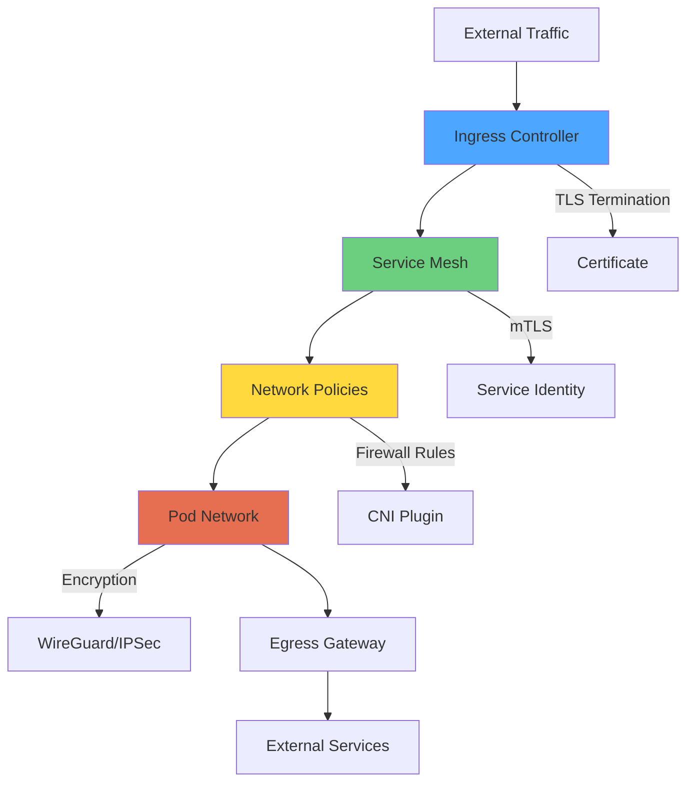
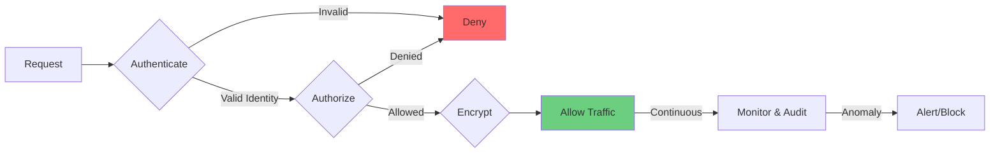
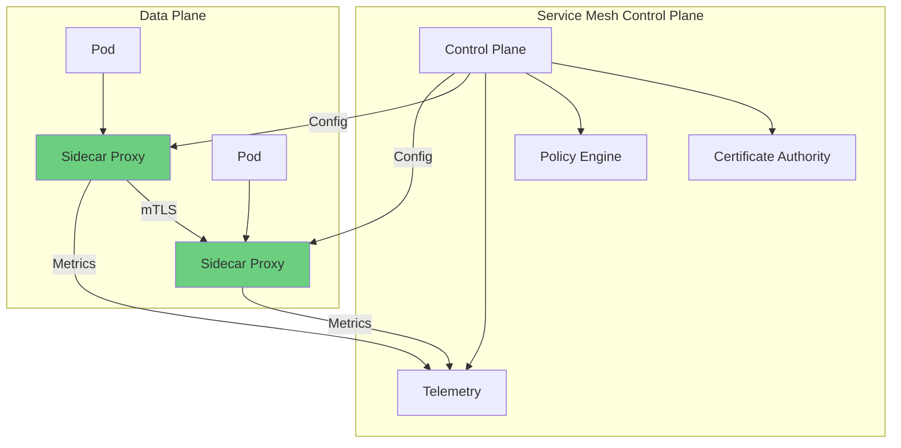
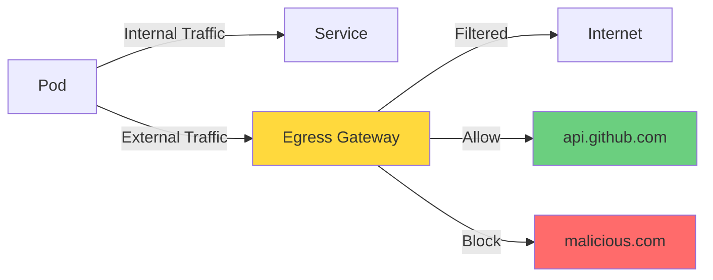
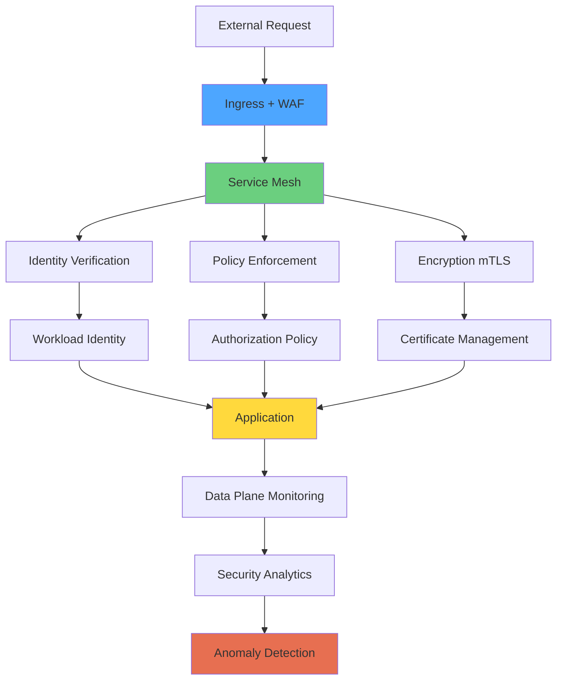

# Module 10: Network Security

## Overview

**Estimated Time:** 7-8 hours

**Module Type:** Security Deep Dive

**Prerequisites:**
- Module 03 - Networking Fundamentals
- Module 06 - Pod Security
- Module 07 - Admission Control and Policy
- Understanding of TCP/IP, TLS/SSL, and network security concepts

Network security is critical for protecting Kubernetes workloads from unauthorized access and lateral movement. This module covers advanced network segmentation, zero trust networking principles, service mesh security (Istio/Linkerd), mutual TLS (mTLS), egress controls, DNS security, and defense-in-depth network strategies. Based on NIST Zero Trust Architecture and CNCF service mesh security best practices.

---

## Learning Objectives

By the end of this module, you will be able to:

1. Implement advanced network segmentation strategies
2. Apply zero trust networking principles to Kubernetes
3. Deploy and configure service mesh (Istio/Linkerd) for security
4. Configure mutual TLS (mTLS) for pod-to-pod communication
5. Implement egress controls and policies
6. Secure DNS infrastructure in Kubernetes
7. Configure network policies for defense-in-depth
8. Monitor and audit network traffic
9. Implement microsegmentation and workload identity
10. Build zero-trust network architectures

---

## 1. Network Security Fundamentals

### 1.1 Kubernetes Network Security Layers



### 1.2 Defense-in-Depth Strategy

**Security Layers:**

1. **Perimeter Security**
   - Ingress controllers with WAF
   - TLS termination
   - DDoS protection

2. **Service Mesh Layer**
   - mTLS between services
   - Authorization policies
   - Traffic encryption

3. **Network Policy Layer**
   - Firewall rules
   - Namespace isolation
   - Microsegmentation

4. **Pod Network Layer**
   - Encrypted overlay network
   - Network plugin security
   - Host firewall

5. **Egress Control**
   - Egress gateways
   - External traffic filtering
   - DNS policy enforcement

### 1.3 Zero Trust Networking Principles

**Core Tenets:**

1. **Never Trust, Always Verify**
   - Authenticate every connection
   - Authorize every request
   - Encrypt all traffic

2. **Assume Breach**
   - Limit blast radius
   - Continuous monitoring
   - Least privilege access

3. **Verify Explicitly**
   - Workload identity
   - Cryptographic verification
   - Policy-based access control



---

## 2. Advanced Network Policies

### 2.1 Default Deny Policies

**Namespace-Level Default Deny:**
```yaml
apiVersion: networking.k8s.io/v1
kind: NetworkPolicy
metadata:
  name: default-deny-all
  namespace: production
spec:
  podSelector: {}
  policyTypes:
  - Ingress
  - Egress
```

**Allow DNS Only:**
```yaml
apiVersion: networking.k8s.io/v1
kind: NetworkPolicy
metadata:
  name: allow-dns
  namespace: production
spec:
  podSelector: {}
  policyTypes:
  - Egress
  egress:
  - to:
    - namespaceSelector:
        matchLabels:
          name: kube-system
    ports:
    - protocol: UDP
      port: 53
```

### 2.2 Microsegmentation

**Frontend to Backend:**
```yaml
apiVersion: networking.k8s.io/v1
kind: NetworkPolicy
metadata:
  name: frontend-to-backend
  namespace: production
spec:
  podSelector:
    matchLabels:
      tier: backend
  policyTypes:
  - Ingress
  ingress:
  - from:
    - podSelector:
        matchLabels:
          tier: frontend
    ports:
    - protocol: TCP
      port: 8080
```

**Backend to Database:**
```yaml
apiVersion: networking.k8s.io/v1
kind: NetworkPolicy
metadata:
  name: backend-to-database
  namespace: production
spec:
  podSelector:
    matchLabels:
      tier: database
  policyTypes:
  - Ingress
  ingress:
  - from:
    - podSelector:
        matchLabels:
          tier: backend
    ports:
    - protocol: TCP
      port: 5432
```

### 2.3 Cross-Namespace Communication

**Allow Specific Namespace:**
```yaml
apiVersion: networking.k8s.io/v1
kind: NetworkPolicy
metadata:
  name: allow-monitoring
  namespace: production
spec:
  podSelector: {}
  policyTypes:
  - Ingress
  ingress:
  - from:
    - namespaceSelector:
        matchLabels:
          name: monitoring
      podSelector:
        matchLabels:
          app: prometheus
    ports:
    - protocol: TCP
      port: 8080
```

**Cross-Namespace Service Access:**
```yaml
apiVersion: networking.k8s.io/v1
kind: NetworkPolicy
metadata:
  name: api-gateway-access
  namespace: backend
spec:
  podSelector:
    matchLabels:
      app: api
  policyTypes:
  - Ingress
  ingress:
  - from:
    - namespaceSelector:
        matchLabels:
          environment: production
      podSelector:
        matchLabels:
          app: gateway
```

### 2.4 Egress Controls

**Allow External HTTPS:**
```yaml
apiVersion: networking.k8s.io/v1
kind: NetworkPolicy
metadata:
  name: allow-external-https
  namespace: production
spec:
  podSelector:
    matchLabels:
      app: api
  policyTypes:
  - Egress
  egress:
  # Allow DNS
  - to:
    - namespaceSelector:
        matchLabels:
          name: kube-system
    ports:
    - protocol: UDP
      port: 53

  # Allow HTTPS to specific CIDR
  - to:
    - ipBlock:
        cidr: 0.0.0.0/0
        except:
        - 169.254.169.254/32  # Block metadata service
        - 10.0.0.0/8          # Block internal
        - 172.16.0.0/12
        - 192.168.0.0/16
    ports:
    - protocol: TCP
      port: 443
```

**Allow Specific External Services:**
```yaml
apiVersion: networking.k8s.io/v1
kind: NetworkPolicy
metadata:
  name: allow-external-api
  namespace: production
spec:
  podSelector:
    matchLabels:
      app: backend
  policyTypes:
  - Egress
  egress:
  - to:
    - ipBlock:
        cidr: 203.0.113.0/24  # External API CIDR
    ports:
    - protocol: TCP
      port: 443
```

### 2.5 Cilium Network Policies

Cilium provides Layer 7 (HTTP, gRPC, Kafka) network policies.

**HTTP Method Filtering:**
```yaml
apiVersion: cilium.io/v2
kind: CiliumNetworkPolicy
metadata:
  name: api-l7-policy
  namespace: production
spec:
  endpointSelector:
    matchLabels:
      app: api
  ingress:
  - fromEndpoints:
    - matchLabels:
        app: frontend
    toPorts:
    - ports:
      - port: "8080"
        protocol: TCP
      rules:
        http:
        - method: "GET"
          path: "/api/v1/.*"
        - method: "POST"
          path: "/api/v1/resources"
```

**DNS-Based Policies:**
```yaml
apiVersion: cilium.io/v2
kind: CiliumNetworkPolicy
metadata:
  name: allow-github-api
  namespace: production
spec:
  endpointSelector:
    matchLabels:
      app: ci-runner
  egress:
  - toFQDNs:
    - matchPattern: "*.github.com"
    - matchName: "api.github.com"
  - toPorts:
    - ports:
      - port: "443"
        protocol: TCP
```

**Kafka Protocol Policy:**
```yaml
apiVersion: cilium.io/v2
kind: CiliumNetworkPolicy
metadata:
  name: kafka-policy
spec:
  endpointSelector:
    matchLabels:
      app: consumer
  egress:
  - toEndpoints:
    - matchLabels:
        app: kafka
    toPorts:
    - ports:
      - port: "9092"
        protocol: TCP
      rules:
        kafka:
        - role: "consume"
          topic: "orders"
        - role: "produce"
          topic: "events"
```

---

## 3. Service Mesh Security

### 3.1 Service Mesh Overview



**Service Mesh Benefits:**
- Automatic mTLS encryption
- Service-to-service authentication
- Authorization policies
- Traffic management
- Observability
- Circuit breaking

### 3.2 Installing Istio

**Install Istio with istioctl:**
```bash
# Download Istio
curl -L https://istio.io/downloadIstio | sh -
cd istio-1.20.0
export PATH=$PWD/bin:$PATH

# Install Istio with minimal profile
istioctl install --set profile=minimal -y

# Or production profile with HA
istioctl install --set profile=production -y

# Verify installation
kubectl get pods -n istio-system
```

**Enable Sidecar Injection:**
```bash
# Label namespace for automatic injection
kubectl label namespace production istio-injection=enabled

# Verify label
kubectl get namespace -L istio-injection
```

**Manual Sidecar Injection:**
```bash
# Inject sidecar into deployment
istioctl kube-inject -f deployment.yaml | kubectl apply -f -
```

### 3.3 Istio mTLS Configuration

**Strict mTLS for Namespace:**
```yaml
apiVersion: security.istio.io/v1beta1
kind: PeerAuthentication
metadata:
  name: default
  namespace: production
spec:
  mtls:
    mode: STRICT
```

**Cluster-Wide Strict mTLS:**
```yaml
apiVersion: security.istio.io/v1beta1
kind: PeerAuthentication
metadata:
  name: default
  namespace: istio-system
spec:
  mtls:
    mode: STRICT
```

**Per-Service mTLS:**
```yaml
apiVersion: security.istio.io/v1beta1
kind: PeerAuthentication
metadata:
  name: api-mtls
  namespace: production
spec:
  selector:
    matchLabels:
      app: api
  mtls:
    mode: STRICT
  portLevelMtls:
    8080:
      mode: STRICT
    8081:
      mode: PERMISSIVE  # Allow non-mTLS for legacy clients
```

**Verify mTLS:**
```bash
# Check mTLS status
istioctl authn tls-check <pod-name>.<namespace>

# Test with curl
kubectl exec -it <pod> -c istio-proxy -- curl -v https://api.production.svc.cluster.local:8080
```

### 3.4 Istio Authorization Policies

**Deny All by Default:**
```yaml
apiVersion: security.istio.io/v1beta1
kind: AuthorizationPolicy
metadata:
  name: deny-all
  namespace: production
spec: {}  # Empty spec denies all
```

**Allow Specific Service Access:**
```yaml
apiVersion: security.istio.io/v1beta1
kind: AuthorizationPolicy
metadata:
  name: frontend-to-api
  namespace: production
spec:
  selector:
    matchLabels:
      app: api
  action: ALLOW
  rules:
  - from:
    - source:
        principals: ["cluster.local/ns/production/sa/frontend"]
    to:
    - operation:
        methods: ["GET", "POST"]
        paths: ["/api/v1/*"]
    when:
    - key: request.headers[x-api-version]
      values: ["v1"]
```

**JWT-Based Authorization:**
```yaml
apiVersion: security.istio.io/v1beta1
kind: RequestAuthentication
metadata:
  name: jwt-auth
  namespace: production
spec:
  selector:
    matchLabels:
      app: api
  jwtRules:
  - issuer: "https://accounts.example.com"
    jwksUri: "https://accounts.example.com/.well-known/jwks.json"
    audiences:
    - "api.example.com"
---
apiVersion: security.istio.io/v1beta1
kind: AuthorizationPolicy
metadata:
  name: require-jwt
  namespace: production
spec:
  selector:
    matchLabels:
      app: api
  action: ALLOW
  rules:
  - from:
    - source:
        requestPrincipals: ["*"]
    when:
    - key: request.auth.claims[role]
      values: ["admin", "user"]
```

**IP-Based Access Control:**
```yaml
apiVersion: security.istio.io/v1beta1
kind: AuthorizationPolicy
metadata:
  name: ip-allowlist
  namespace: production
spec:
  selector:
    matchLabels:
      app: admin-panel
  action: ALLOW
  rules:
  - from:
    - source:
        ipBlocks: ["10.0.0.0/8", "172.16.0.0/12"]
```

### 3.5 Linkerd Installation

**Install Linkerd CLI:**
```bash
# Install CLI
curl --proto '=https' --tlsv1.2 -sSfL https://run.linkerd.io/install | sh
export PATH=$PATH:$HOME/.linkerd2/bin

# Verify installation
linkerd version
```

**Install Linkerd on Cluster:**
```bash
# Check cluster prerequisites
linkerd check --pre

# Install Linkerd CRDs
linkerd install --crds | kubectl apply -f -

# Install Linkerd control plane
linkerd install | kubectl apply -f -

# Verify installation
linkerd check
```

**Enable Linkerd for Namespace:**
```bash
# Annotate namespace
kubectl annotate namespace production linkerd.io/inject=enabled

# Or inject manually
linkerd inject deployment.yaml | kubectl apply -f -
```

### 3.6 Linkerd mTLS and Policies

**Verify mTLS:**
```bash
# Check mTLS status
linkerd viz tap deploy/api -n production

# Expected output shows 🔒 for mTLS connections
```

**Server Authorization Policy:**
```yaml
apiVersion: policy.linkerd.io/v1beta1
kind: Server
metadata:
  name: api-server
  namespace: production
spec:
  podSelector:
    matchLabels:
      app: api
  port: 8080
---
apiVersion: policy.linkerd.io/v1beta1
kind: ServerAuthorization
metadata:
  name: api-clients
  namespace: production
spec:
  server:
    name: api-server
  client:
    meshTLS:
      serviceAccounts:
      - name: frontend
        namespace: production
      - name: mobile-backend
        namespace: production
```

**HTTP Route Policy:**
```yaml
apiVersion: policy.linkerd.io/v1beta1
kind: HTTPRoute
metadata:
  name: api-routes
  namespace: production
spec:
  parentRefs:
  - name: api-server
    kind: Server
    group: policy.linkerd.io
  rules:
  - matches:
    - path:
        value: "/api/v1/users"
        type: PathPrefix
      method: GET
    backendRefs:
    - name: api
      port: 8080
```

---

## 4. Mutual TLS (mTLS) Implementation

### 4.1 Certificate Management

**cert-manager Installation:**
```bash
# Install cert-manager
kubectl apply -f https://github.com/cert-manager/cert-manager/releases/download/v1.13.0/cert-manager.yaml

# Verify installation
kubectl get pods -n cert-manager
```

**ClusterIssuer for Internal CA:**
```yaml
apiVersion: cert-manager.io/v1
kind: ClusterIssuer
metadata:
  name: internal-ca
spec:
  ca:
    secretName: ca-key-pair
---
apiVersion: v1
kind: Secret
metadata:
  name: ca-key-pair
  namespace: cert-manager
type: kubernetes.io/tls
data:
  tls.crt: LS0tLS1CRUdJTi...  # Base64 encoded CA cert
  tls.key: LS0tLS1CRUdJTi...  # Base64 encoded CA key
```

**Certificate for Service:**
```yaml
apiVersion: cert-manager.io/v1
kind: Certificate
metadata:
  name: api-tls
  namespace: production
spec:
  secretName: api-tls-secret
  duration: 2160h  # 90 days
  renewBefore: 360h  # 15 days
  subject:
    organizations:
    - example-inc
  commonName: api.production.svc.cluster.local
  dnsNames:
  - api.production.svc.cluster.local
  - api.production.svc
  - api
  issuerRef:
    name: internal-ca
    kind: ClusterIssuer
  usages:
  - digital signature
  - key encipherment
  - server auth
  - client auth
```

### 4.2 Manual mTLS Configuration

**Server Configuration (Nginx):**
```yaml
apiVersion: v1
kind: ConfigMap
metadata:
  name: nginx-mtls-config
  namespace: production
data:
  nginx.conf: |
    events {}
    http {
      server {
        listen 8443 ssl;
        server_name api.production.svc.cluster.local;

        # Server certificate
        ssl_certificate /etc/nginx/certs/tls.crt;
        ssl_certificate_key /etc/nginx/certs/tls.key;

        # Client certificate verification
        ssl_client_certificate /etc/nginx/certs/ca.crt;
        ssl_verify_client on;
        ssl_verify_depth 2;

        # TLS configuration
        ssl_protocols TLSv1.2 TLSv1.3;
        ssl_ciphers HIGH:!aNULL:!MD5;
        ssl_prefer_server_ciphers on;

        location / {
          if ($ssl_client_verify != SUCCESS) {
            return 403;
          }
          proxy_pass http://localhost:8080;
          proxy_set_header X-Client-DN $ssl_client_s_dn;
          proxy_set_header X-Client-Verified $ssl_client_verify;
        }
      }
    }
---
apiVersion: apps/v1
kind: Deployment
metadata:
  name: api-with-mtls
  namespace: production
spec:
  replicas: 2
  selector:
    matchLabels:
      app: api
  template:
    metadata:
      labels:
        app: api
    spec:
      containers:
      - name: nginx
        image: nginx:1.25
        ports:
        - containerPort: 8443
        volumeMounts:
        - name: nginx-config
          mountPath: /etc/nginx/nginx.conf
          subPath: nginx.conf
        - name: tls-certs
          mountPath: /etc/nginx/certs
          readOnly: true

      - name: app
        image: myapp:1.0
        ports:
        - containerPort: 8080

      volumes:
      - name: nginx-config
        configMap:
          name: nginx-mtls-config
      - name: tls-certs
        secret:
          secretName: api-tls-secret
```

**Client Configuration:**
```yaml
apiVersion: v1
kind: Pod
metadata:
  name: client
  namespace: production
spec:
  containers:
  - name: client
    image: curlimages/curl:latest
    command: ["sleep", "3600"]
    volumeMounts:
    - name: client-certs
      mountPath: /certs
      readOnly: true
  volumes:
  - name: client-certs
    secret:
      secretName: client-tls-secret

# Test mTLS connection
# kubectl exec client -- curl --cert /certs/tls.crt --key /certs/tls.key --cacert /certs/ca.crt https://api.production.svc.cluster.local:8443
```

### 4.3 Workload Identity

**SPIFFE/SPIRE Installation:**
```bash
# Install SPIRE server
kubectl apply -f https://raw.githubusercontent.com/spiffe/spire-tutorials/main/k8s/quickstart/spire-namespace.yaml
kubectl apply -f https://raw.githubusercontent.com/spiffe/spire-tutorials/main/k8s/quickstart/server-account.yaml
kubectl apply -f https://raw.githubusercontent.com/spiffe/spire-tutorials/main/k8s/quickstart/spire-bundle-configmap.yaml
kubectl apply -f https://raw.githubusercontent.com/spiffe/spire-tutorials/main/k8s/quickstart/server-cluster-role.yaml
kubectl apply -f https://raw.githubusercontent.com/spiffe/spire-tutorials/main/k8s/quickstart/server-configmap.yaml
kubectl apply -f https://raw.githubusercontent.com/spire-tutorials/main/k8s/quickstart/server-statefulset.yaml

# Install SPIRE agent
kubectl apply -f https://raw.githubusercontent.com/spiffe/spire-tutorials/main/k8s/quickstart/agent-account.yaml
kubectl apply -f https://raw.githubusercontent.com/spiffe/spire-tutorials/main/k8s/quickstart/agent-cluster-role.yaml
kubectl apply -f https://raw.githubusercontent.com/spiffe/spire-tutorials/main/k8s/quickstart/agent-configmap.yaml
kubectl apply -f https://raw.githubusercontent.com/spiffe/spire-tutorials/main/k8s/quickstart/agent-daemonset.yaml
```

**Register Workload:**
```bash
# Register workload identity
kubectl exec -n spire spire-server-0 -- \
  /opt/spire/bin/spire-server entry create \
  -spiffeID spiffe://example.org/ns/production/sa/api \
  -parentID spiffe://example.org/ns/spire/sa/spire-agent \
  -selector k8s:ns:production \
  -selector k8s:sa:api
```

---

## 5. Egress Control

### 5.1 Egress Gateway Pattern



### 5.2 Istio Egress Gateway

**Deploy Egress Gateway:**
```bash
# Install Istio with egress gateway
istioctl install --set values.gateways.istio-egressgateway.enabled=true -y
```

**ServiceEntry for External Service:**
```yaml
apiVersion: networking.istio.io/v1beta1
kind: ServiceEntry
metadata:
  name: external-api
  namespace: production
spec:
  hosts:
  - api.external.com
  ports:
  - number: 443
    name: https
    protocol: HTTPS
  location: MESH_EXTERNAL
  resolution: DNS
```

**Gateway Configuration:**
```yaml
apiVersion: networking.istio.io/v1beta1
kind: Gateway
metadata:
  name: egress-gateway
  namespace: production
spec:
  selector:
    istio: egressgateway
  servers:
  - port:
      number: 443
      name: https
      protocol: HTTPS
    hosts:
    - api.external.com
    tls:
      mode: PASSTHROUGH
```

**VirtualService for Egress:**
```yaml
apiVersion: networking.istio.io/v1beta1
kind: VirtualService
metadata:
  name: external-api-via-egress
  namespace: production
spec:
  hosts:
  - api.external.com
  gateways:
  - mesh
  - egress-gateway
  http:
  - match:
    - gateways:
      - mesh
      port: 443
    route:
    - destination:
        host: istio-egressgateway.istio-system.svc.cluster.local
        port:
          number: 443
  - match:
    - gateways:
      - egress-gateway
      port: 443
    route:
    - destination:
        host: api.external.com
        port:
          number: 443
```

### 5.3 Squid Proxy for Egress

**Deploy Squid Proxy:**
```yaml
apiVersion: v1
kind: ConfigMap
metadata:
  name: squid-config
  namespace: egress
data:
  squid.conf: |
    http_port 3128

    # ACL definitions
    acl allowed_domains dstdomain .github.com .docker.io
    acl SSL_ports port 443
    acl CONNECT method CONNECT

    # Access control
    http_access deny !allowed_domains
    http_access allow allowed_domains
    http_access deny all

    # Logging
    access_log /var/log/squid/access.log
    cache_log /var/log/squid/cache.log
---
apiVersion: apps/v1
kind: Deployment
metadata:
  name: squid-proxy
  namespace: egress
spec:
  replicas: 2
  selector:
    matchLabels:
      app: squid
  template:
    metadata:
      labels:
        app: squid
    spec:
      containers:
      - name: squid
        image: ubuntu/squid:latest
        ports:
        - containerPort: 3128
        volumeMounts:
        - name: config
          mountPath: /etc/squid/squid.conf
          subPath: squid.conf
        - name: logs
          mountPath: /var/log/squid
      volumes:
      - name: config
        configMap:
          name: squid-config
      - name: logs
        emptyDir: {}
---
apiVersion: v1
kind: Service
metadata:
  name: squid-proxy
  namespace: egress
spec:
  selector:
    app: squid
  ports:
  - port: 3128
    targetPort: 3128
```

**Configure Pods to Use Proxy:**
```yaml
apiVersion: v1
kind: Pod
metadata:
  name: client
  namespace: production
spec:
  containers:
  - name: app
    image: myapp:1.0
    env:
    - name: HTTP_PROXY
      value: "http://squid-proxy.egress.svc.cluster.local:3128"
    - name: HTTPS_PROXY
      value: "http://squid-proxy.egress.svc.cluster.local:3128"
    - name: NO_PROXY
      value: ".cluster.local,.svc,localhost,127.0.0.1"
```

---

## 6. DNS Security

### 6.1 CoreDNS Security Configuration

**Secure CoreDNS ConfigMap:**
```yaml
apiVersion: v1
kind: ConfigMap
metadata:
  name: coredns
  namespace: kube-system
data:
  Corefile: |
    .:53 {
        errors
        health {
          lameduck 5s
        }
        ready
        kubernetes cluster.local in-addr.arpa ip6.arpa {
          pods insecure
          fallthrough in-addr.arpa ip6.arpa
          ttl 30
        }
        prometheus :9153
        forward . /etc/resolv.conf {
          max_concurrent 1000
          policy sequential
        }
        cache 30
        loop
        reload
        loadbalance

        # Rate limiting
        ratelimit 100

        # Block malicious domains
        file /etc/coredns/blocklist.db blocklist

        # DNSSEC validation
        dnssec
    }

  blocklist.db: |
    $ORIGIN blocklist.
    @   IN  SOA blocklist. admin.blocklist. (
                2024011501 ; serial
                3600       ; refresh
                1800       ; retry
                604800     ; expire
                86400 )    ; minimum

    malicious.com.      IN  A  0.0.0.0
    phishing.net.       IN  A  0.0.0.0
```

### 6.2 DNS Policy Enforcement

**Cilium DNS Policy:**
```yaml
apiVersion: cilium.io/v2
kind: CiliumNetworkPolicy
metadata:
  name: dns-lockdown
  namespace: production
spec:
  endpointSelector:
    matchLabels:
      app: backend
  egress:
  - toEndpoints:
    - matchLabels:
        k8s:io.kubernetes.pod.namespace: kube-system
        k8s:k8s-app: kube-dns
    toPorts:
    - ports:
      - port: "53"
        protocol: UDP
      rules:
        dns:
        - matchPattern: "*.cluster.local"
        - matchName: "api.github.com"
        - matchPattern: "*.example.com"
```

### 6.3 External DNS with Security

**ExternalDNS with RBAC:**
```yaml
apiVersion: v1
kind: ServiceAccount
metadata:
  name: external-dns
  namespace: external-dns
---
apiVersion: rbac.authorization.k8s.io/v1
kind: ClusterRole
metadata:
  name: external-dns
rules:
- apiGroups: [""]
  resources: ["services", "endpoints", "pods"]
  verbs: ["get", "watch", "list"]
- apiGroups: ["extensions", "networking.k8s.io"]
  resources: ["ingresses"]
  verbs: ["get", "watch", "list"]
- apiGroups: [""]
  resources: ["nodes"]
  verbs: ["list"]
---
apiVersion: apps/v1
kind: Deployment
metadata:
  name: external-dns
  namespace: external-dns
spec:
  selector:
    matchLabels:
      app: external-dns
  template:
    metadata:
      labels:
        app: external-dns
    spec:
      serviceAccountName: external-dns
      containers:
      - name: external-dns
        image: registry.k8s.io/external-dns/external-dns:v0.14.0
        args:
        - --source=service
        - --source=ingress
        - --domain-filter=example.com
        - --provider=aws
        - --policy=upsert-only
        - --registry=txt
        - --txt-owner-id=k8s-cluster-1
        env:
        - name: AWS_REGION
          value: us-east-1
```

---

## 7. Zero Trust Architecture

### 7.1 Zero Trust Reference Architecture



### 7.2 Complete Zero Trust Example

**Namespace Configuration:**
```yaml
apiVersion: v1
kind: Namespace
metadata:
  name: zero-trust-app
  labels:
    istio-injection: enabled
    pod-security.kubernetes.io/enforce: restricted
---
apiVersion: networking.k8s.io/v1
kind: NetworkPolicy
metadata:
  name: default-deny
  namespace: zero-trust-app
spec:
  podSelector: {}
  policyTypes:
  - Ingress
  - Egress
```

**Application with Security:**
```yaml
apiVersion: v1
kind: ServiceAccount
metadata:
  name: api
  namespace: zero-trust-app
---
apiVersion: apps/v1
kind: Deployment
metadata:
  name: api
  namespace: zero-trust-app
spec:
  replicas: 3
  selector:
    matchLabels:
      app: api
      version: v1
  template:
    metadata:
      labels:
        app: api
        version: v1
    spec:
      serviceAccountName: api
      securityContext:
        runAsNonRoot: true
        runAsUser: 1000
        fsGroup: 2000
        seccompProfile:
          type: RuntimeDefault
      containers:
      - name: api
        image: registry.example.com/api:v1.0@sha256:abc123
        securityContext:
          allowPrivilegeEscalation: false
          readOnlyRootFilesystem: true
          capabilities:
            drop:
            - ALL
        ports:
        - containerPort: 8080
        resources:
          limits:
            cpu: 500m
            memory: 512Mi
          requests:
            cpu: 250m
            memory: 256Mi
        livenessProbe:
          httpGet:
            path: /health
            port: 8080
          initialDelaySeconds: 30
        readinessProbe:
          httpGet:
            path: /ready
            port: 8080
          initialDelaySeconds: 5
---
apiVersion: v1
kind: Service
metadata:
  name: api
  namespace: zero-trust-app
spec:
  selector:
    app: api
  ports:
  - port: 8080
    targetPort: 8080
```

**Istio Security Policies:**
```yaml
# Strict mTLS
apiVersion: security.istio.io/v1beta1
kind: PeerAuthentication
metadata:
  name: default
  namespace: zero-trust-app
spec:
  mtls:
    mode: STRICT
---
# Deny all by default
apiVersion: security.istio.io/v1beta1
kind: AuthorizationPolicy
metadata:
  name: deny-all
  namespace: zero-trust-app
spec: {}
---
# Allow frontend to API
apiVersion: security.istio.io/v1beta1
kind: AuthorizationPolicy
metadata:
  name: frontend-to-api
  namespace: zero-trust-app
spec:
  selector:
    matchLabels:
      app: api
  action: ALLOW
  rules:
  - from:
    - source:
        principals: ["cluster.local/ns/zero-trust-app/sa/frontend"]
    to:
    - operation:
        methods: ["GET", "POST"]
        paths: ["/api/v1/*"]
    when:
    - key: request.headers[authorization]
      values: ["Bearer *"]
```

**Network Policy:**
```yaml
apiVersion: networking.k8s.io/v1
kind: NetworkPolicy
metadata:
  name: api-ingress
  namespace: zero-trust-app
spec:
  podSelector:
    matchLabels:
      app: api
  policyTypes:
  - Ingress
  ingress:
  - from:
    - podSelector:
        matchLabels:
          app: frontend
    ports:
    - protocol: TCP
      port: 8080
```

---

## 8. Network Monitoring and Auditing

### 8.1 Hubble (Cilium Observability)

**Enable Hubble:**
```bash
# Enable Hubble in Cilium
cilium hubble enable --ui

# Port-forward to Hubble UI
cilium hubble ui

# Or use Hubble CLI
hubble observe --all
```

**Monitor Specific Traffic:**
```bash
# Monitor traffic to specific pod
hubble observe --pod production/api

# Monitor denied traffic
hubble observe --verdict DROPPED

# Monitor specific protocol
hubble observe --protocol TCP --port 8080
```

### 8.2 Network Flow Logs

**FlowCollector (Calico):**
```yaml
apiVersion: operator.tigera.io/v1
kind: FlowCollector
metadata:
  name: tigera-secure
spec:
  logRequestsPerInterval: 10
  collectorImage: calico/flow-collector:v3.26.0
  syslogForward:
    enabled: true
    url: tcp://syslog.example.com:514
```

### 8.3 Service Mesh Metrics

**Istio Metrics:**
```promql
# Request rate
rate(istio_requests_total[5m])

# Success rate
sum(rate(istio_requests_total{response_code!~"5.*"}[5m])) /
sum(rate(istio_requests_total[5m]))

# mTLS connections
istio_tcp_connections_opened_total{connection_security_policy="mutual_tls"}

# Authorization denials
rate(envoy_http_rbac_denied[5m])
```

**Linkerd Metrics:**
```promql
# Success rate by service
sum(rate(response_total{classification="success"}[5m])) by (dst_service) /
sum(rate(response_total[5m])) by (dst_service)

# mTLS enabled
sum(tcp_open_connections{tls="true"})

# Request latency
histogram_quantile(0.99, sum(rate(response_latency_ms_bucket[5m])) by (le, dst_service))
```

---

## 9. Best Practices

### 9.1 Network Security Checklist

- ✅ **Network Policies**
  - [ ] Default deny policies applied
  - [ ] Microsegmentation implemented
  - [ ] Egress controls configured
  - [ ] DNS access restricted

- ✅ **Service Mesh**
  - [ ] Service mesh deployed (Istio/Linkerd)
  - [ ] Strict mTLS enabled cluster-wide
  - [ ] Authorization policies enforced
  - [ ] Workload identity implemented

- ✅ **Certificates**
  - [ ] cert-manager deployed
  - [ ] Automated certificate rotation
  - [ ] Certificate monitoring alerts
  - [ ] Short certificate lifetimes

- ✅ **Egress Control**
  - [ ] Egress gateway deployed
  - [ ] External access logged
  - [ ] DNS filtering enabled
  - [ ] Known bad domains blocked

- ✅ **Monitoring**
  - [ ] Network flow logs collected
  - [ ] mTLS monitoring enabled
  - [ ] Anomaly detection configured
  - [ ] Security alerts defined

### 9.2 Performance Optimization

**Connection Pooling:**
```yaml
apiVersion: networking.istio.io/v1beta1
kind: DestinationRule
metadata:
  name: api-pool
spec:
  host: api.production.svc.cluster.local
  trafficPolicy:
    connectionPool:
      tcp:
        maxConnections: 100
      http:
        http1MaxPendingRequests: 1024
        http2MaxRequests: 1024
        maxRequestsPerConnection: 10
```

**Circuit Breaking:**
```yaml
apiVersion: networking.istio.io/v1beta1
kind: DestinationRule
metadata:
  name: api-circuit-breaker
spec:
  host: api.production.svc.cluster.local
  trafficPolicy:
    outlierDetection:
      consecutive5xxErrors: 5
      interval: 30s
      baseEjectionTime: 30s
      maxEjectionPercent: 50
```

---

## 10. Security Checklist

- [ ] **Network Segmentation**
  - [ ] Namespaces isolated with network policies
  - [ ] Microsegmentation between services
  - [ ] No cross-namespace traffic unless explicitly allowed
  - [ ] System namespaces protected

- [ ] **Encryption**
  - [ ] mTLS enabled for all services
  - [ ] TLS 1.2+ only
  - [ ] Strong cipher suites configured
  - [ ] Certificate rotation automated

- [ ] **Access Control**
  - [ ] Authorization policies enforced
  - [ ] Service accounts per workload
  - [ ] Workload identity implemented
  - [ ] JWT authentication where applicable

- [ ] **Egress**
  - [ ] Egress gateway configured
  - [ ] External access allowlisted
  - [ ] DNS filtering enabled
  - [ ] Proxy logs monitored

- [ ] **Monitoring**
  - [ ] Network traffic monitored
  - [ ] Security events alerted
  - [ ] Anomaly detection enabled
  - [ ] Compliance reports generated

---

## 11. References

### Official Documentation

1. **Kubernetes Network Policies**
   - https://kubernetes.io/docs/concepts/services-networking/network-policies/

2. **Istio Documentation**
   - https://istio.io/latest/docs/

3. **Linkerd Documentation**
   - https://linkerd.io/2/overview/

4. **Cilium Documentation**
   - https://docs.cilium.io/

### Service Mesh Security

5. **Istio Security Best Practices**
   - https://istio.io/latest/docs/ops/best-practices/security/

6. **SPIFFE/SPIRE**
   - https://spiffe.io/docs/

7. **cert-manager**
   - https://cert-manager.io/docs/

### Standards and Frameworks

8. **NIST Zero Trust Architecture (SP 800-207)**
   - https://csrc.nist.gov/publications/detail/sp/800-207/final

9. **CNCF Cloud Native Security Whitepaper**
   - https://github.com/cncf/tag-security/tree/main/security-whitepaper

10. **NSA/CISA Kubernetes Hardening Guide**
    - https://media.defense.gov/2022/Aug/29/2003066362/-1/-1/0/CTR_KUBERNETES_HARDENING_GUIDANCE_1.2_20220829.PDF

---

## Conclusion

This completes Module 10 and the Kubernetes Security Training series. You've learned comprehensive network security strategies including:

- Advanced network policies and microsegmentation
- Zero trust networking principles
- Service mesh security (Istio/Linkerd)
- Mutual TLS implementation
- Egress controls and DNS security
- Network monitoring and auditing

**Next Steps:**
- Practice implementing these concepts in lab environments
- Review all modules and complete hands-on labs
- Pursue relevant certifications (CKS, CKAD)
- Stay updated with CNCF security publications

---

**Module Completion Status:** ✅ Complete
**Training Series:** ✅ Complete (Modules 00-10)
