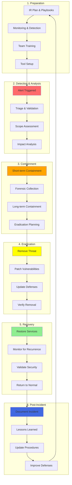

# Module 12: Incident Response

## Overview

**Estimated Time:** 8-9 hours

**Module Type:** Security Operations and Incident Management

**Prerequisites:**
- Module 08 - Observability and Monitoring
- Module 11 - Runtime Security
- Understanding of NIST Incident Response Framework
- Familiarity with forensic analysis and evidence handling
- Knowledge of Kubernetes audit logging

Incident response is critical for minimizing damage and recovery time when security incidents occur. This module covers the complete incident response lifecycle based on NIST SP 800-61, Kubernetes-specific forensics techniques, audit log analysis, container breakout detection, containment strategies, evidence preservation, and post-incident review processes. Built on industry best practices from SANS Incident Handler's Handbook and real-world Kubernetes security incidents.

---

## Learning Objectives

By the end of this module, you will be able to:

1. Implement NIST incident response framework for Kubernetes
2. Perform forensic analysis on compromised containers and nodes
3. Analyze Kubernetes audit logs with jq and specialized tools
4. Detect and respond to container breakout attempts
5. Implement effective containment strategies using NetworkPolicy and RBAC
6. Collect and preserve evidence for investigation
7. Conduct post-incident reviews and extract lessons learned
8. Develop incident response playbooks for common scenarios
9. Integrate IR processes with SIEM and alerting systems
10. Build and maintain incident response capabilities

---

## 1. Incident Response Lifecycle

### 1.1 NIST IR Framework for Kubernetes



### 1.2 Preparation Phase

**1.2.1 Incident Response Plan Template**

```markdown
# Kubernetes Incident Response Plan

## 1. Team Structure
- **Incident Commander**: Makes key decisions, coordinates response
- **Security Analyst**: Investigates and analyzes threats
- **Forensics Specialist**: Collects and preserves evidence
- **Communications Lead**: Handles internal/external communications
- **Technical Lead**: Implements containment and remediation

## 2. Contact Information
| Role | Name | Phone | Email | Backup |
|------|------|-------|-------|--------|
| IC   | John Doe | +1-555-0100 | john@example.com | Jane Smith |

## 3. Escalation Paths
- **P1 (Critical)**: Immediate escalation to CTO, notify legal within 1 hour
- **P2 (High)**: Notify engineering lead within 2 hours
- **P3 (Medium)**: Standard on-call process
- **P4 (Low)**: Document and address during business hours

## 4. Communication Channels
- War Room: #incident-response (Slack)
- Video: Zoom bridge (always-on during P1/P2)
- Documentation: Confluence incident page
- Updates: Status page, stakeholder email list

## 5. Tool Inventory
- SIEM: Splunk (https://siem.example.com)
- Log Aggregation: ELK Stack
- Forensics: kubectl, etcdctl, docker/containerd tools
- Evidence Storage: S3 bucket s3://incident-evidence/
- Backup Cluster: cluster-dr.example.com
```

**1.2.2 Detection Tools Setup**

```yaml
# alertmanager-config.yaml
apiVersion: v1
kind: ConfigMap
metadata:
  name: alertmanager-config
  namespace: monitoring
data:
  alertmanager.yml: |
    global:
      resolve_timeout: 5m
      slack_api_url: 'https://hooks.slack.com/services/YOUR/WEBHOOK/URL'

    route:
      group_by: ['alertname', 'cluster', 'namespace']
      group_wait: 10s
      group_interval: 10s
      repeat_interval: 12h
      receiver: 'security-team'

      routes:
      # Critical security alerts
      - match:
          severity: critical
          category: security
        receiver: 'security-critical'
        group_wait: 0s
        repeat_interval: 5m
        continue: true

      # Container breakout attempts
      - match:
          alertname: ContainerEscapeAttempt
        receiver: 'security-critical'
        group_wait: 0s

      # Cryptocurrency mining
      - match:
          alertname: CryptoMiningDetected
        receiver: 'security-high'

    receivers:
    - name: 'security-critical'
      slack_configs:
      - channel: '#security-critical'
        title: 'CRITICAL SECURITY ALERT'
        text: '{{ range .Alerts }}{{ .Annotations.description }}{{ end }}'
        send_resolved: true
      pagerduty_configs:
      - service_key: 'YOUR_PAGERDUTY_KEY'
        severity: 'critical'
      webhook_configs:
      - url: 'https://incident-response.example.com/webhook'

    - name: 'security-high'
      slack_configs:
      - channel: '#security-alerts'
        title: 'High Priority Security Alert'
        text: '{{ range .Alerts }}{{ .Annotations.description }}{{ end }}'

    - name: 'security-team'
      slack_configs:
      - channel: '#security'
        text: '{{ range .Alerts }}{{ .Annotations.summary }}{{ end }}'

    inhibit_rules:
    - source_match:
        severity: 'critical'
      target_match:
        severity: 'warning'
      equal: ['alertname', 'cluster', 'namespace']
```

**1.2.3 Incident Response Runbook**

```bash
#!/bin/bash
# incident-response-init.sh

set -e

echo "=== Kubernetes Incident Response Initialization ==="
echo "Incident ID: $(date +%Y%m%d-%H%M%S)"

# Create incident working directory
INCIDENT_ID="INC-$(date +%Y%m%d-%H%M%S)"
INCIDENT_DIR="/var/incident-response/${INCIDENT_ID}"
mkdir -p "${INCIDENT_DIR}"/{logs,evidence,analysis,reports}

echo "Incident Directory: ${INCIDENT_DIR}"

# Collect initial state
echo "[1/6] Collecting cluster state..."
kubectl get nodes -o wide > "${INCIDENT_DIR}/logs/nodes.txt"
kubectl get pods --all-namespaces -o wide > "${INCIDENT_DIR}/logs/pods.txt"
kubectl get events --all-namespaces --sort-by='.lastTimestamp' > "${INCIDENT_DIR}/logs/events.txt"

echo "[2/6] Collecting audit logs..."
kubectl logs -n kube-system kube-apiserver-* --tail=10000 > "${INCIDENT_DIR}/logs/apiserver.log"

echo "[3/6] Collecting security events..."
kubectl logs -n falco -l app=falco --tail=5000 > "${INCIDENT_DIR}/logs/falco.log"

echo "[4/6] Collecting network policies..."
kubectl get networkpolicies --all-namespaces -o yaml > "${INCIDENT_DIR}/logs/network-policies.yaml"

echo "[5/6] Collecting RBAC configuration..."
kubectl get clusterroles,clusterrolebindings -o yaml > "${INCIDENT_DIR}/logs/rbac.yaml"

echo "[6/6] Taking etcd snapshot..."
ETCDCTL_API=3 etcdctl snapshot save "${INCIDENT_DIR}/evidence/etcd-snapshot.db" \
  --endpoints=https://127.0.0.1:2379 \
  --cacert=/etc/kubernetes/pki/etcd/ca.crt \
  --cert=/etc/kubernetes/pki/etcd/server.crt \
  --key=/etc/kubernetes/pki/etcd/server.key

echo "=== Initialization Complete ==="
echo "Evidence Location: ${INCIDENT_DIR}"
echo "Next Steps:"
echo "1. Review Falco alerts: cat ${INCIDENT_DIR}/logs/falco.log | grep CRITICAL"
echo "2. Analyze suspicious pods: grep -i 'suspect_pod_name' ${INCIDENT_DIR}/logs/pods.txt"
echo "3. Review recent events: tail -100 ${INCIDENT_DIR}/logs/events.txt"
```

### 1.3 Detection and Analysis Phase

**Triage Checklist:**

```markdown
# Incident Triage Checklist

## Initial Assessment (5 minutes)
- [ ] What is the alert/event that triggered investigation?
- [ ] What is the affected resource (pod, node, namespace)?
- [ ] When did the incident occur (timestamp)?
- [ ] Is this a false positive? (Check known patterns)
- [ ] What is the initial severity assessment?

## Scope Determination (15 minutes)
- [ ] Which clusters are affected?
- [ ] Which namespaces/applications are involved?
- [ ] How many pods/nodes are compromised?
- [ ] Are there indicators of lateral movement?
- [ ] What data/systems are at risk?

## Impact Analysis (15 minutes)
- [ ] Is there active data exfiltration?
- [ ] Are production services impacted?
- [ ] Is there privilege escalation?
- [ ] Are customer data or credentials compromised?
- [ ] What is the business impact?

## Classification
- [ ] Assign severity: P1/P2/P3/P4
- [ ] Assign category: Malware/Intrusion/Data Breach/DoS/Other
- [ ] Determine if escalation is needed
- [ ] Create incident ticket and notify team
```

---

## 2. Kubernetes Forensics Techniques

### 2.1 Container Forensics

**2.1.1 Live Container Analysis**

```bash
#!/bin/bash
# container-forensics.sh

NAMESPACE="$1"
POD_NAME="$2"
CONTAINER_NAME="$3"
OUTPUT_DIR="./forensics/${POD_NAME}"

mkdir -p "${OUTPUT_DIR}"

echo "=== Container Forensics: ${NAMESPACE}/${POD_NAME}/${CONTAINER_NAME} ==="

# 1. Collect container metadata
echo "[1/10] Collecting metadata..."
kubectl get pod -n "${NAMESPACE}" "${POD_NAME}" -o yaml > "${OUTPUT_DIR}/pod-spec.yaml"
kubectl describe pod -n "${NAMESPACE}" "${POD_NAME}" > "${OUTPUT_DIR}/pod-description.txt"

# 2. Collect logs
echo "[2/10] Collecting logs..."
kubectl logs -n "${NAMESPACE}" "${POD_NAME}" -c "${CONTAINER_NAME}" > "${OUTPUT_DIR}/container.log"
kubectl logs -n "${NAMESPACE}" "${POD_NAME}" -c "${CONTAINER_NAME}" --previous > "${OUTPUT_DIR}/container-previous.log" 2>/dev/null || true

# 3. Collect process list
echo "[3/10] Collecting process list..."
kubectl exec -n "${NAMESPACE}" "${POD_NAME}" -c "${CONTAINER_NAME}" -- ps auxf > "${OUTPUT_DIR}/processes.txt"

# 4. Collect network connections
echo "[4/10] Collecting network connections..."
kubectl exec -n "${NAMESPACE}" "${POD_NAME}" -c "${CONTAINER_NAME}" -- netstat -tulpn > "${OUTPUT_DIR}/network-connections.txt" 2>/dev/null || true
kubectl exec -n "${NAMESPACE}" "${POD_NAME}" -c "${CONTAINER_NAME}" -- ss -tulpn > "${OUTPUT_DIR}/network-ss.txt" 2>/dev/null || true

# 5. Collect environment variables (may contain secrets!)
echo "[5/10] Collecting environment..."
kubectl exec -n "${NAMESPACE}" "${POD_NAME}" -c "${CONTAINER_NAME}" -- env > "${OUTPUT_DIR}/environment.txt"

# 6. Collect file system changes
echo "[6/10] Checking file system modifications..."
kubectl exec -n "${NAMESPACE}" "${POD_NAME}" -c "${CONTAINER_NAME}" -- find / -type f -mtime -1 2>/dev/null > "${OUTPUT_DIR}/recent-files.txt" || true

# 7. Check for suspicious files
echo "[7/10] Looking for suspicious files..."
kubectl exec -n "${NAMESPACE}" "${POD_NAME}" -c "${CONTAINER_NAME}" -- find / -name "*.sh" -o -name "*.elf" -o -name "xmrig" 2>/dev/null > "${OUTPUT_DIR}/suspicious-files.txt" || true

# 8. Collect cron jobs
echo "[8/10] Checking cron jobs..."
kubectl exec -n "${NAMESPACE}" "${POD_NAME}" -c "${CONTAINER_NAME}" -- crontab -l > "${OUTPUT_DIR}/crontab.txt" 2>/dev/null || true

# 9. Check for backdoors in common locations
echo "[9/10] Checking for backdoors..."
kubectl exec -n "${NAMESPACE}" "${POD_NAME}" -c "${CONTAINER_NAME}" -- cat /etc/passwd > "${OUTPUT_DIR}/passwd.txt" 2>/dev/null || true
kubectl exec -n "${NAMESPACE}" "${POD_NAME}" -c "${CONTAINER_NAME}" -- cat ~/.bashrc > "${OUTPUT_DIR}/bashrc.txt" 2>/dev/null || true
kubectl exec -n "${NAMESPACE}" "${POD_NAME}" -c "${CONTAINER_NAME}" -- cat ~/.bash_history > "${OUTPUT_DIR}/bash-history.txt" 2>/dev/null || true

# 10. Capture full filesystem (if small enough)
echo "[10/10] Attempting filesystem capture..."
kubectl exec -n "${NAMESPACE}" "${POD_NAME}" -c "${CONTAINER_NAME}" -- tar czf /tmp/fs-capture.tar.gz / 2>/dev/null || true
kubectl cp "${NAMESPACE}/${POD_NAME}:/tmp/fs-capture.tar.gz" "${OUTPUT_DIR}/filesystem.tar.gz" 2>/dev/null || true

echo "=== Forensics collection complete: ${OUTPUT_DIR} ==="
```

**2.1.2 Post-Mortem Container Analysis**

```bash
#!/bin/bash
# dead-container-forensics.sh

NODE_NAME="$1"
CONTAINER_ID="$2"
OUTPUT_DIR="./forensics/${CONTAINER_ID}"

mkdir -p "${OUTPUT_DIR}"

echo "=== Dead Container Forensics: ${CONTAINER_ID} on ${NODE_NAME} ==="

# SSH to node (or use kubectl debug node)
ssh "${NODE_NAME}" << EOF
  # Find container filesystem
  CONTAINER_ROOT=\$(find /var/lib/containerd -name "${CONTAINER_ID}" -type d | head -1)

  if [ -z "\${CONTAINER_ROOT}" ]; then
    CONTAINER_ROOT=\$(find /var/lib/docker -name "${CONTAINER_ID}" -type d | head -1)
  fi

  echo "Container root: \${CONTAINER_ROOT}"

  # Create forensic image
  tar czf "/tmp/${CONTAINER_ID}-forensics.tar.gz" "\${CONTAINER_ROOT}" 2>/dev/null

  # Collect container logs
  journalctl -u containerd CONTAINER_ID="${CONTAINER_ID}" > "/tmp/${CONTAINER_ID}-logs.txt"

  # Collect system logs around incident time
  journalctl --since "1 hour ago" > "/tmp/${CONTAINER_ID}-system-logs.txt"
EOF

# Copy back to analysis machine
scp "${NODE_NAME}:/tmp/${CONTAINER_ID}-*" "${OUTPUT_DIR}/"

echo "=== Forensics complete: ${OUTPUT_DIR} ==="
```

### 2.2 Node Forensics

**2.2.1 Node Evidence Collection**

```bash
#!/bin/bash
# node-forensics.sh

NODE_NAME="$1"
OUTPUT_DIR="./forensics/node-${NODE_NAME}"

mkdir -p "${OUTPUT_DIR}"

echo "=== Node Forensics: ${NODE_NAME} ==="

# Use kubectl debug to create forensics pod on node
kubectl debug node/"${NODE_NAME}" -it --image=nicolaka/netshoot -- /bin/bash << 'FORENSICS'

# Change to host root
chroot /host /bin/bash

OUTPUT="/tmp/node-forensics"
mkdir -p "${OUTPUT}"

# 1. System information
echo "[1/12] Collecting system info..."
uname -a > "${OUTPUT}/system-info.txt"
hostname >> "${OUTPUT}/system-info.txt"
uptime >> "${OUTPUT}/system-info.txt"

# 2. Running processes
echo "[2/12] Collecting processes..."
ps auxf > "${OUTPUT}/processes.txt"
pstree -p > "${OUTPUT}/process-tree.txt"

# 3. Network connections
echo "[3/12] Collecting network state..."
netstat -tulpn > "${OUTPUT}/netstat.txt"
ss -tulpn > "${OUTPUT}/ss.txt"
iptables-save > "${OUTPUT}/iptables.txt"
ip route show > "${OUTPUT}/routes.txt"

# 4. Loaded kernel modules
echo "[4/12] Collecting kernel modules..."
lsmod > "${OUTPUT}/lsmod.txt"

# 5. Authentication logs
echo "[5/12] Collecting auth logs..."
tail -10000 /var/log/auth.log > "${OUTPUT}/auth.log" 2>/dev/null || \
  tail -10000 /var/log/secure > "${OUTPUT}/secure.log"

# 6. System logs
echo "[6/12] Collecting system logs..."
journalctl --since "24 hours ago" > "${OUTPUT}/journalctl.log"

# 7. Kubelet logs
echo "[7/12] Collecting kubelet logs..."
journalctl -u kubelet --since "24 hours ago" > "${OUTPUT}/kubelet.log"

# 8. Container runtime logs
echo "[8/12] Collecting container runtime logs..."
journalctl -u containerd --since "24 hours ago" > "${OUTPUT}/containerd.log" 2>/dev/null || \
  journalctl -u docker --since "24 hours ago" > "${OUTPUT}/docker.log"

# 9. Check for persistence mechanisms
echo "[9/12] Checking persistence mechanisms..."
crontab -l > "${OUTPUT}/root-crontab.txt" 2>/dev/null
cat /etc/crontab > "${OUTPUT}/system-crontab.txt"
ls -la /etc/cron.* > "${OUTPUT}/cron-dirs.txt"
systemctl list-unit-files --type=service --state=enabled > "${OUTPUT}/enabled-services.txt"

# 10. Check for suspicious files
echo "[10/12] Searching for suspicious files..."
find /tmp -type f -executable > "${OUTPUT}/tmp-executables.txt"
find /var/tmp -type f -executable > "${OUTPUT}/vartmp-executables.txt"
find /dev/shm -type f > "${OUTPUT}/devshm-files.txt"

# 11. Check for rootkits
echo "[11/12] Running rootkit checks..."
if command -v rkhunter &> /dev/null; then
  rkhunter --check --skip-keypress --report-warnings-only > "${OUTPUT}/rkhunter.txt"
fi

# 12. Memory dump (if available)
echo "[12/12] Attempting memory capture..."
if command -v avml &> /dev/null; then
  avml "${OUTPUT}/memory.lime" --compress
fi

# Create archive
tar czf /tmp/node-forensics.tar.gz -C /tmp node-forensics/

echo "=== Forensics complete: /tmp/node-forensics.tar.gz ==="

FORENSICS

# Copy evidence from node
kubectl cp "${NODE_NAME}:/tmp/node-forensics.tar.gz" "${OUTPUT_DIR}/evidence.tar.gz"

echo "=== Evidence collected: ${OUTPUT_DIR}/evidence.tar.gz ==="
```

---

## 3. Audit Log Analysis

### 3.1 Kubernetes Audit Policy

**Comprehensive Audit Policy:**

```yaml
# /etc/kubernetes/audit-policy.yaml
apiVersion: audit.k8s.io/v1
kind: Policy
omitStages:
  - "RequestReceived"
rules:
  # Log all authentication failures
  - level: Metadata
    omitStages:
      - "RequestReceived"
    namespaces: ["*"]
    verbs: ["*"]
    userGroups: ["system:unauthenticated"]

  # Log all Secret access
  - level: RequestResponse
    resources:
      - group: ""
        resources: ["secrets"]
    omitStages:
      - "RequestReceived"

  # Log all ConfigMap changes
  - level: Request
    resources:
      - group: ""
        resources: ["configmaps"]
    verbs: ["create", "update", "patch", "delete"]

  # Log all RBAC changes
  - level: RequestResponse
    resources:
      - group: "rbac.authorization.k8s.io"
        resources: ["clusterroles", "clusterrolebindings", "roles", "rolebindings"]
    verbs: ["create", "update", "patch", "delete"]

  # Log pod exec/attach (potential attacker activity)
  - level: Request
    resources:
      - group: ""
        resources: ["pods/exec", "pods/attach", "pods/portforward"]
    verbs: ["create"]

  # Log privilege escalation attempts
  - level: RequestResponse
    resources:
      - group: ""
        resources: ["pods"]
    verbs: ["create", "update", "patch"]
    omitStages:
      - "RequestReceived"

  # Log admission webhook denials
  - level: Request
    omitStages:
      - "RequestReceived"
    namespaces: ["*"]
    verbs: ["create", "update", "patch"]

  # Log node changes
  - level: RequestResponse
    resources:
      - group: ""
        resources: ["nodes"]
    verbs: ["create", "update", "patch", "delete"]

  # Log authentication token creation
  - level: Metadata
    resources:
      - group: ""
        resources: ["serviceaccounts/token"]

  # Don't log read-only requests
  - level: None
    verbs: ["get", "list", "watch"]

  # Log everything else at Metadata level
  - level: Metadata
    omitStages:
      - "RequestReceived"
```

### 3.2 Audit Log Analysis with jq

**Common Investigation Queries:**

```bash
#!/bin/bash
# audit-analysis.sh

AUDIT_LOG="/var/log/kubernetes/audit.log"

echo "=== Kubernetes Audit Log Analysis ==="

# 1. Find all failed authentication attempts
echo "[1] Failed Authentication Attempts:"
cat "${AUDIT_LOG}" | jq -r 'select(.responseStatus.code >= 400) |
  select(.user.username != "system:anonymous") |
  "\(.timestamp) | User: \(.user.username) | Verb: \(.verb) | Resource: \(.objectRef.resource) | Status: \(.responseStatus.code)"' | \
  sort | uniq -c | sort -rn | head -20

# 2. Find all privileged pod creations
echo -e "\n[2] Privileged Pod Creations:"
cat "${AUDIT_LOG}" | jq -r 'select(.verb == "create") |
  select(.objectRef.resource == "pods") |
  select(.requestObject.spec.containers[]?.securityContext.privileged == true) |
  "\(.timestamp) | Namespace: \(.objectRef.namespace) | Pod: \(.objectRef.name) | User: \(.user.username)"'

# 3. Find all secret access
echo -e "\n[3] Secret Access:"
cat "${AUDIT_LOG}" | jq -r 'select(.objectRef.resource == "secrets") |
  "\(.timestamp) | Verb: \(.verb) | Namespace: \(.objectRef.namespace) | Secret: \(.objectRef.name) | User: \(.user.username)"' | \
  tail -50

# 4. Find all RBAC changes
echo -e "\n[4] RBAC Changes:"
cat "${AUDIT_LOG}" | jq -r 'select(.objectRef.resource | test("role|rolebinding")) |
  select(.verb | test("create|update|patch|delete")) |
  "\(.timestamp) | Verb: \(.verb) | Resource: \(.objectRef.resource) | Name: \(.objectRef.name) | User: \(.user.username)"'

# 5. Find all exec/attach operations
echo -e "\n[5] Pod Exec/Attach Operations:"
cat "${AUDIT_LOG}" | jq -r 'select(.objectRef.subresource | test("exec|attach|portforward")) |
  "\(.timestamp) | Operation: \(.objectRef.subresource) | Namespace: \(.objectRef.namespace) | Pod: \(.objectRef.name) | User: \(.user.username) | Command: \(.requestObject.command // "N/A" | @json)"'

# 6. Find unauthorized access attempts (403)
echo -e "\n[6] Unauthorized Access Attempts (403):"
cat "${AUDIT_LOG}" | jq -r 'select(.responseStatus.code == 403) |
  "\(.timestamp) | User: \(.user.username) | Verb: \(.verb) | Resource: \(.objectRef.resource)/\(.objectRef.name) | Namespace: \(.objectRef.namespace)"' | \
  sort | uniq -c | sort -rn | head -20

# 7. Find service account token creation
echo -e "\n[7] Service Account Token Creation:"
cat "${AUDIT_LOG}" | jq -r 'select(.objectRef.resource == "serviceaccounts") |
  select(.objectRef.subresource == "token") |
  "\(.timestamp) | Namespace: \(.objectRef.namespace) | SA: \(.objectRef.name) | User: \(.user.username)"'

# 8. Find admission webhook denials
echo -e "\n[8] Admission Webhook Denials:"
cat "${AUDIT_LOG}" | jq -r 'select(.annotations."authorization.k8s.io/decision" == "forbid" or .responseStatus.code >= 400) |
  select(.stage == "ResponseComplete") |
  "\(.timestamp) | Verb: \(.verb) | Resource: \(.objectRef.resource) | Reason: \(.responseStatus.reason) | User: \(.user.username)"' | \
  head -20

# 9. Timeline of suspicious activity
echo -e "\n[9] Suspicious Activity Timeline (last hour):"
HOUR_AGO=$(date -u -d '1 hour ago' --iso-8601=seconds)
cat "${AUDIT_LOG}" | jq -r --arg since "$HOUR_AGO" 'select(.timestamp > $since) |
  select(
    (.responseStatus.code >= 400) or
    (.objectRef.resource == "secrets") or
    (.objectRef.subresource | test("exec|attach")) or
    (.requestObject.spec.containers[]?.securityContext.privileged == true)
  ) |
  "\(.timestamp) | \(.verb) \(.objectRef.resource) | User: \(.user.username) | Status: \(.responseStatus.code)"' | \
  sort

# 10. User activity summary
echo -e "\n[10] Most Active Users (last 24 hours):"
cat "${AUDIT_LOG}" | jq -r '.user.username' | sort | uniq -c | sort -rn | head -20

echo -e "\n=== Analysis Complete ==="
```

**Advanced Audit Analysis - Detecting Anomalies:**

```bash
#!/bin/bash
# audit-anomaly-detection.sh

AUDIT_LOG="/var/log/kubernetes/audit.log"

# Detect unusual API access patterns
echo "=== Anomaly Detection ==="

# 1. Users accessing resources they don't normally access
echo "[1] Unusual Resource Access by User:"
cat "${AUDIT_LOG}" | jq -r '"\(.user.username)|\(.objectRef.resource)"' | \
  sort | uniq -c | sort -rn | awk '$1 < 5 {print}' | head -20

# 2. API calls from unusual source IPs
echo -e "\n[2] Unusual Source IPs:"
cat "${AUDIT_LOG}" | jq -r '"\(.sourceIPs[]) | \(.user.username)"' | \
  sort | uniq -c | sort -rn | awk '$1 < 3 {print}' | head -20

# 3. Unusual timing (off-hours activity)
echo -e "\n[3] Off-Hours Activity (00:00-06:00 UTC):"
cat "${AUDIT_LOG}" | jq -r 'select(.timestamp | test("T0[0-6]:")) |
  "\(.timestamp) | \(.user.username) | \(.verb) \(.objectRef.resource)"' | \
  head -20

# 4. Rapid-fire requests (potential automation/attack)
echo -e "\n[4] Rapid Request Patterns (>50 req/min):"
cat "${AUDIT_LOG}" | jq -r '"\(.timestamp[0:16])|\(.user.username)"' | \
  sort | uniq -c | awk '$1 > 50 {print}' | head -20

# 5. Multiple failed auth attempts followed by success
echo -e "\n[5] Brute Force Patterns:"
cat "${AUDIT_LOG}" | jq -r 'select(.responseStatus.code == 401) | .user.username' | \
  sort | uniq -c | awk '$1 > 10 {print $2}' | \
  while read user; do
    echo "User $user had $(grep -c "\"username\":\"$user\".*401" ${AUDIT_LOG}) failed attempts"
    if grep -q "\"username\":\"$user\".*200" ${AUDIT_LOG}; then
      echo "  -> Followed by successful authentication!"
    fi
  done
```

---

## 4. Container Breakout Detection and Response

### 4.1 Common Container Breakout Techniques

**Technique 1: Privileged Container Escape**

```yaml
# Detection rule (Falco)
- rule: Privileged Container Escape Attempt
  desc: Detect attempts to escape from privileged containers
  condition: >
    spawned_process and
    container and
    container.privileged = true and
    (proc.name in (nsenter, unshare) or
     proc.cmdline contains "mount" or
     proc.cmdline contains "chroot /host")
  output: >
    Potential privileged container escape
    (process=%proc.name cmdline=%proc.cmdline
    user=%user.name container=%container.name
    pod=%k8s.pod.name namespace=%k8s.ns.name)
  priority: CRITICAL
  tags: [container_escape, privilege_escalation]
```

**Technique 2: Kernel Exploit**

```yaml
- rule: Kernel Exploit Attempt
  desc: Detect suspicious kernel-level activities
  condition: >
    spawned_process and
    (proc.name in (dirty_cow, overlayfs, runc_exploit) or
     open_write and fd.name glob "/proc/sys/kernel/*" or
     syscall.type in (ptrace, process_vm_writev))
  output: >
    Potential kernel exploit detected
    (process=%proc.name syscall=%syscall.type
    file=%fd.name user=%user.name
    container=%container.name)
  priority: CRITICAL
  tags: [container_escape, kernel_exploit]
```

**Technique 3: Docker Socket Abuse**

```yaml
- rule: Docker Socket Abuse
  desc: Detect container accessing Docker socket
  condition: >
    open_read and
    container and
    fd.name = "/var/run/docker.sock"
  output: >
    Container accessing Docker socket (escape risk)
    (file=%fd.name process=%proc.name
    container=%container.name pod=%k8s.pod.name
    namespace=%k8s.ns.name)
  priority: CRITICAL
  tags: [container_escape, docker_socket]
```

### 4.2 Response Playbook for Container Breakout

```bash
#!/bin/bash
# breakout-response-playbook.sh

NAMESPACE="$1"
POD_NAME="$2"

echo "=== Container Breakout Response Playbook ==="
echo "Target: ${NAMESPACE}/${POD_NAME}"
echo "Started: $(date)"

# Step 1: Immediate containment
echo -e "\n[STEP 1] IMMEDIATE CONTAINMENT"

# Isolate pod with network policy
echo "- Creating isolation NetworkPolicy..."
kubectl apply -f - <<EOF
apiVersion: networking.k8s.io/v1
kind: NetworkPolicy
metadata:
  name: isolate-${POD_NAME}
  namespace: ${NAMESPACE}
spec:
  podSelector:
    matchLabels:
      pod: ${POD_NAME}
  policyTypes:
  - Ingress
  - Egress
  # Deny all traffic
EOF

# Revoke service account permissions
echo "- Revoking service account permissions..."
SA_NAME=$(kubectl get pod -n "${NAMESPACE}" "${POD_NAME}" -o jsonpath='{.spec.serviceAccountName}')
kubectl create rolebinding revoke-${SA_NAME} \
  --clusterrole=view \
  --serviceaccount="${NAMESPACE}:${SA_NAME}" \
  -n "${NAMESPACE}" --dry-run=client -o yaml | kubectl apply -f -

# Step 2: Evidence collection
echo -e "\n[STEP 2] EVIDENCE COLLECTION"
EVIDENCE_DIR="./incident/breakout-${POD_NAME}-$(date +%Y%m%d-%H%M%S)"
mkdir -p "${EVIDENCE_DIR}"

echo "- Collecting pod specification..."
kubectl get pod -n "${NAMESPACE}" "${POD_NAME}" -o yaml > "${EVIDENCE_DIR}/pod-spec.yaml"

echo "- Collecting logs..."
kubectl logs -n "${NAMESPACE}" "${POD_NAME}" --all-containers=true > "${EVIDENCE_DIR}/pod-logs.txt"

echo "- Collecting events..."
kubectl get events -n "${NAMESPACE}" --field-selector involvedObject.name="${POD_NAME}" > "${EVIDENCE_DIR}/events.txt"

echo "- Collecting Falco alerts..."
kubectl logs -n falco -l app=falco | grep "${POD_NAME}" > "${EVIDENCE_DIR}/falco-alerts.txt"

# Step 3: Node inspection
echo -e "\n[STEP 3] NODE INSPECTION"
NODE_NAME=$(kubectl get pod -n "${NAMESPACE}" "${POD_NAME}" -o jsonpath='{.spec.nodeName}')
echo "- Pod running on node: ${NODE_NAME}"

echo "- Checking for other suspicious pods on same node..."
kubectl get pods --all-namespaces --field-selector spec.nodeName="${NODE_NAME}" -o wide > "${EVIDENCE_DIR}/node-pods.txt"

echo "- Cordoning node..."
kubectl cordon "${NODE_NAME}"

# Step 4: Threat assessment
echo -e "\n[STEP 4] THREAT ASSESSMENT"

# Check if pod has dangerous capabilities
echo "- Checking pod capabilities..."
kubectl get pod -n "${NAMESPACE}" "${POD_NAME}" -o jsonpath='{.spec.containers[*].securityContext}' > "${EVIDENCE_DIR}/security-context.json"

# Check if pod is privileged
IS_PRIVILEGED=$(kubectl get pod -n "${NAMESPACE}" "${POD_NAME}" -o jsonpath='{.spec.containers[*].securityContext.privileged}')
echo "- Privileged: ${IS_PRIVILEGED}"

# Check for host path mounts
HOST_MOUNTS=$(kubectl get pod -n "${NAMESPACE}" "${POD_NAME}" -o jsonpath='{.spec.volumes[?(@.hostPath)].hostPath.path}')
echo "- Host mounts: ${HOST_MOUNTS}"

# Step 5: Eradication
echo -e "\n[STEP 5] ERADICATION"

echo "- Deleting compromised pod..."
kubectl delete pod -n "${NAMESPACE}" "${POD_NAME}" --grace-period=0 --force

echo "- Checking for malicious deployments..."
OWNER_KIND=$(kubectl get pod -n "${NAMESPACE}" "${POD_NAME}" -o jsonpath='{.metadata.ownerReferences[0].kind}')
OWNER_NAME=$(kubectl get pod -n "${NAMESPACE}" "${POD_NAME}" -o jsonpath='{.metadata.ownerReferences[0].name}')

if [ -n "${OWNER_NAME}" ]; then
  echo "- Pod owned by ${OWNER_KIND}/${OWNER_NAME}"
  read -p "Delete owner resource? (yes/no): " DELETE_OWNER
  if [ "$DELETE_OWNER" = "yes" ]; then
    kubectl delete "${OWNER_KIND}" -n "${NAMESPACE}" "${OWNER_NAME}"
  fi
fi

# Step 6: Recovery
echo -e "\n[STEP 6] RECOVERY"

echo "- Node ${NODE_NAME} remains cordoned. Manual review required before uncordoning."
echo "- Review evidence in: ${EVIDENCE_DIR}"
echo "- Update security policies to prevent recurrence"

# Step 7: Documentation
echo -e "\n[STEP 7] DOCUMENTATION"
cat > "${EVIDENCE_DIR}/incident-summary.md" <<SUMMARY
# Container Breakout Incident Summary

**Date:** $(date)
**Affected Resource:** ${NAMESPACE}/${POD_NAME}
**Node:** ${NODE_NAME}
**Privileged:** ${IS_PRIVILEGED}
**Host Mounts:** ${HOST_MOUNTS}

## Timeline
1. Breakout detected: $(date)
2. Pod isolated with NetworkPolicy
3. Service account permissions revoked
4. Evidence collected
5. Node cordoned
6. Pod deleted

## Next Steps
- [ ] Review evidence in ${EVIDENCE_DIR}
- [ ] Analyze Falco alerts for root cause
- [ ] Check audit logs for attacker activity
- [ ] Scan node for persistence mechanisms
- [ ] Review and update admission policies
- [ ] Uncordon node after verification
- [ ] Update incident response playbook

## Evidence Location
${EVIDENCE_DIR}
SUMMARY

echo "=== Response Complete ==="
echo "Evidence: ${EVIDENCE_DIR}"
echo "Incident Summary: ${EVIDENCE_DIR}/incident-summary.md"
```

---

## 5. Containment Strategies

### 5.1 Network-Based Containment

**Immediate Network Isolation:**

```yaml
# zero-trust-isolation.yaml
apiVersion: networking.k8s.io/v1
kind: NetworkPolicy
metadata:
  name: emergency-isolation
  namespace: compromised-namespace
spec:
  podSelector:
    matchLabels:
      incident: active
  policyTypes:
  - Ingress
  - Egress
  # Deny all ingress and egress
  # This completely isolates the pod
---
# Allow only DNS for investigation
apiVersion: networking.k8s.io/v1
kind: NetworkPolicy
metadata:
  name: allow-dns-only
  namespace: compromised-namespace
spec:
  podSelector:
    matchLabels:
      incident: investigation
  policyTypes:
  - Egress
  egress:
  - to:
    - namespaceSelector:
        matchLabels:
          name: kube-system
    ports:
    - protocol: UDP
      port: 53
```

**Progressive Containment:**

```bash
#!/bin/bash
# progressive-containment.sh

NAMESPACE="$1"
LABEL_SELECTOR="$2"

echo "=== Progressive Containment ==="

# Level 1: Block external egress
echo "[Level 1] Blocking external egress..."
kubectl apply -f - <<EOF
apiVersion: networking.k8s.io/v1
kind: NetworkPolicy
metadata:
  name: block-external-egress
  namespace: ${NAMESPACE}
spec:
  podSelector:
    matchLabels:
      ${LABEL_SELECTOR}
  policyTypes:
  - Egress
  egress:
  # Allow internal cluster traffic only
  - to:
    - podSelector: {}
  - to:
    - namespaceSelector: {}
EOF

sleep 5

# Level 2: Restrict to essential services only
echo "[Level 2] Restricting to essential services..."
kubectl apply -f - <<EOF
apiVersion: networking.k8s.io/v1
kind: NetworkPolicy
metadata:
  name: essential-only
  namespace: ${NAMESPACE}
spec:
  podSelector:
    matchLabels:
      ${LABEL_SELECTOR}
  policyTypes:
  - Egress
  egress:
  # DNS only
  - to:
    - namespaceSelector:
        matchLabels:
          name: kube-system
    ports:
    - protocol: UDP
      port: 53
  # Kubernetes API only
  - to:
    - namespaceSelector: {}
      podSelector:
        matchLabels:
          component: kube-apiserver
    ports:
    - protocol: TCP
      port: 443
EOF

# Level 3: Complete isolation (if needed)
read -p "Proceed to complete isolation? (yes/no): " ISOLATE
if [ "$ISOLATE" = "yes" ]; then
  echo "[Level 3] Complete isolation..."
  kubectl apply -f - <<EOF
apiVersion: networking.k8s.io/v1
kind: NetworkPolicy
metadata:
  name: complete-isolation
  namespace: ${NAMESPACE}
spec:
  podSelector:
    matchLabels:
      ${LABEL_SELECTOR}
  policyTypes:
  - Ingress
  - Egress
  # No rules = deny all
EOF
fi

echo "=== Containment applied ==="
```

### 5.2 RBAC-Based Containment

**Revoke Service Account Permissions:**

```bash
#!/bin/bash
# revoke-permissions.sh

NAMESPACE="$1"
SERVICE_ACCOUNT="$2"

echo "=== Revoking Service Account Permissions ==="
echo "Target: ${NAMESPACE}/${SERVICE_ACCOUNT}"

# Backup current bindings
echo "- Backing up current bindings..."
kubectl get rolebindings,clusterrolebindings -A -o yaml | \
  grep -A 20 "serviceaccount.*${NAMESPACE}.*${SERVICE_ACCOUNT}" > \
  "./backup-bindings-${SERVICE_ACCOUNT}-$(date +%Y%m%d-%H%M%S).yaml"

# Remove all ClusterRoleBindings
echo "- Removing ClusterRoleBindings..."
kubectl get clusterrolebindings -o json | \
  jq -r ".items[] | select(.subjects[]? | select(.kind==\"ServiceAccount\" and .name==\"${SERVICE_ACCOUNT}\" and .namespace==\"${NAMESPACE}\")) | .metadata.name" | \
  while read binding; do
    echo "  Deleting ClusterRoleBinding: ${binding}"
    kubectl delete clusterrolebinding "${binding}"
  done

# Remove all RoleBindings in namespace
echo "- Removing RoleBindings in ${NAMESPACE}..."
kubectl get rolebindings -n "${NAMESPACE}" -o json | \
  jq -r ".items[] | select(.subjects[]? | select(.kind==\"ServiceAccount\" and .name==\"${SERVICE_ACCOUNT}\")) | .metadata.name" | \
  while read binding; do
    echo "  Deleting RoleBinding: ${binding}"
    kubectl delete rolebinding -n "${NAMESPACE}" "${binding}"
  done

# Create minimal read-only binding
echo "- Creating minimal read-only binding..."
kubectl create rolebinding "${SERVICE_ACCOUNT}-restricted" \
  --clusterrole=view \
  --serviceaccount="${NAMESPACE}:${SERVICE_ACCOUNT}" \
  -n "${NAMESPACE}"

echo "=== Permissions revoked successfully ==="
echo "Backup: ./backup-bindings-${SERVICE_ACCOUNT}-*.yaml"
```

---

## 6. Post-Incident Review

### 6.1 Incident Report Template

```markdown
# Kubernetes Security Incident Report

## Incident Overview
- **Incident ID:** INC-YYYYMMDD-NNNN
- **Date/Time Detected:** YYYY-MM-DD HH:MM UTC
- **Date/Time Resolved:** YYYY-MM-DD HH:MM UTC
- **Duration:** X hours
- **Severity:** Critical / High / Medium / Low
- **Status:** Closed / Open / Under Investigation

## Executive Summary
[2-3 paragraph summary of what happened, impact, and resolution]

## Incident Timeline
| Time (UTC) | Event | Actor | Notes |
|------------|-------|-------|-------|
| 10:15 | Falco alert triggered | Automated | Container escape attempt |
| 10:17 | Incident declared | Security Team | P1 severity |
| 10:20 | Pod isolated | IR Team | NetworkPolicy applied |
| 10:25 | Evidence collected | Forensics | Logs, configs captured |
| 10:45 | Threat eradicated | IR Team | Pod deleted, node scanned |
| 11:30 | Services restored | Ops Team | Clean deployment |
| 14:00 | Post-mortem | All Teams | Lessons learned |

## Technical Details

### Attack Vector
[How did the attacker gain initial access?]

### Exploitation Method
[What vulnerability or misconfiguration was exploited?]

### Indicators of Compromise (IOCs)
```
- Pod: malicious-app-xyz in namespace: production
- Container Image: evil/malware:v1.2.3
- Process: /tmp/xmrig --url=pool.evil.com
- Network: Outbound connection to 192.0.2.100:8080
- File: /tmp/.hidden/backdoor.sh
```

### Affected Systems
- Cluster: production-us-east-1
- Nodes: worker-01, worker-02 (cordoned)
- Namespaces: production, staging
- Services: api-service (downtime: 15 minutes)

### Data Exposure
[What data was accessed or exfiltrated?]
- Customer data: NO
- Credentials: YES (service account tokens)
- Internal data: YES (ConfigMaps with config data)

## Response Actions Taken

### Containment
1. Applied NetworkPolicy to isolate pods
2. Revoked service account permissions
3. Cordoned affected nodes
4. Blocked outbound traffic to C2 server

### Eradication
1. Deleted compromised pods
2. Scanned nodes for persistence
3. Rotated all service account tokens
4. Updated admission policies

### Recovery
1. Deployed clean application version
2. Verified no persistence mechanisms
3. Uncordoned nodes after scan
4. Monitored for 24 hours

## Root Cause Analysis

### Primary Cause
[What was the fundamental issue?]

Example: Deployment used privileged container with hostPath mount to /var/run/docker.sock, allowing container escape.

### Contributing Factors
1. Admission controller not enforcing PodSecurityStandards
2. Namespace lacked NetworkPolicies
3. Service account had cluster-admin privileges
4. No runtime monitoring for privileged containers

### Why It Wasn't Caught Earlier
1. Build-time image scanning didn't detect malware
2. Manual YAML reviews didn't flag dangerous configs
3. Runtime alerts not properly configured

## Impact Assessment

### Business Impact
- Service downtime: 15 minutes
- Customer impact: Minimal (no customer-facing services affected)
- Data breach: No customer data exposed
- Financial impact: $X estimated

### Security Impact
- Confidentiality: Medium (internal configs exposed)
- Integrity: Low (no data modified)
- Availability: Medium (brief service disruption)

## Lessons Learned

### What Went Well
1. Falco detected the exploit within seconds
2. IR playbook was effective for containment
3. Evidence was properly preserved
4. Team communication was excellent

### What Went Wrong
1. Privileged container should have been blocked
2. Response could have been faster (training needed)
3. Monitoring gaps in certain namespaces

### Action Items

| ID | Action | Owner | Priority | Due Date | Status |
|----|--------|-------|----------|----------|--------|
| 1 | Implement PodSecurityStandards=Restricted | Security | High | 2024-02-15 | Open |
| 2 | Deploy admission controller (OPA) | Platform | High | 2024-02-20 | Open |
| 3 | Create NetworkPolicies for all namespaces | Network | High | 2024-02-10 | In Progress |
| 4 | Audit all service account permissions | Security | Medium | 2024-03-01 | Open |
| 5 | Implement least-privilege RBAC | Security | Medium | 2024-03-15 | Open |
| 6 | Improve runtime monitoring coverage | SecOps | High | 2024-02-25 | Open |
| 7 | Conduct IR training/tabletop exercise | Security | Medium | 2024-04-01 | Open |

## Recommendations

### Short-term (0-30 days)
1. Block privileged containers in production
2. Implement NetworkPolicy defaults
3. Rotate all secrets and tokens
4. Update Falco rules

### Medium-term (30-90 days)
1. Implement comprehensive admission control
2. Deploy RBAC least-privilege model
3. Enhance monitoring and alerting
4. Conduct security training

### Long-term (90+ days)
1. Implement zero-trust architecture
2. Deploy service mesh for mTLS
3. Automate compliance scanning
4. Regular penetration testing

## Appendices

### Appendix A: Evidence Files
- Pod specifications: incident-evidence/pod-specs/
- Logs: incident-evidence/logs/
- Forensics: incident-evidence/forensics/
- Audit logs: incident-evidence/audit/

### Appendix B: IOC List
[Full list of indicators of compromise]

### Appendix C: Remediation Scripts
[Scripts used for containment and eradication]
```

---

## Summary

This module covered:

1. **Incident Response Lifecycle** - NIST framework applied to Kubernetes
2. **Forensics** - Container and node evidence collection techniques
3. **Audit Analysis** - Log analysis with jq for threat hunting
4. **Breakout Detection** - Identifying and responding to container escapes
5. **Containment** - Network and RBAC-based isolation strategies
6. **Evidence Preservation** - Proper handling of forensic data
7. **Post-Incident Review** - Lessons learned and improvement cycles
8. **Playbooks** - Practical, executable response procedures

## Hands-On Labs

1. Simulate security incident and execute IR playbook
2. Practice forensic collection on running containers
3. Analyze audit logs to identify attack patterns
4. Respond to container breakout simulation
5. Implement progressive containment strategies
6. Conduct post-incident review workshop
7. Create custom IR playbooks for your environment

## Additional Resources

- [NIST SP 800-61 Rev. 2: Incident Handling Guide](https://nvlpubs.nist.gov/nistpubs/SpecialPublications/NIST.SP.800-61r2.pdf)
- [SANS Incident Handler's Handbook](https://www.sans.org/reading-room/whitepapers/incident/incident-handlers-handbook-33901)
- [Kubernetes Audit Documentation](https://kubernetes.io/docs/tasks/debug/debug-cluster/audit/)
- [Falco Response Engine](https://falco.org/docs/event-sources/kubernetes-audit/)
- [Container Forensics Guide](https://kubernetes.io/docs/tasks/debug/debug-application/)

---

**Next Module:** [Module 13 - CIS Benchmark and Compliance](13-cis-compliance.md)
