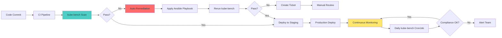

# Module 13: CIS Benchmark and Compliance

## Overview

**Estimated Time:** 7-8 hours

**Module Type:** Compliance and Governance

**Prerequisites:**
- Module 02 - Control Plane Security
- Module 05 - Authentication and Authorization
- Module 11 - Runtime Security
- Understanding of compliance frameworks (SOC 2, PCI-DSS, HIPAA)
- Familiarity with infrastructure-as-code and automation

CIS (Center for Internet Security) Kubernetes Benchmark provides consensus-driven security configuration guidelines for Kubernetes clusters. This module covers CIS Kubernetes Benchmark v1.8, automated compliance scanning with kube-bench, control plane and worker node hardening requirements, automated remediation strategies, compliance reporting, and continuous compliance monitoring. Essential for regulated industries and security-conscious organizations.

---

## Learning Objectives

By the end of this module, you will be able to:

1. Understand CIS Kubernetes Benchmark structure and scoring
2. Deploy and configure kube-bench for automated scanning
3. Implement control plane security requirements
4. Harden worker nodes according to CIS guidelines
5. Address policies and procedures sections of the benchmark
6. Automate remediation with Ansible, scripts, and GitOps
7. Generate compliance reports and dashboards
8. Integrate compliance checks into CI/CD pipelines
9. Maintain continuous compliance monitoring
10. Prepare for external security audits

---

## 1. CIS Kubernetes Benchmark Overview

### 1.1 Benchmark Structure

```mermaid
graph TB
    A[CIS Kubernetes Benchmark v1.8] --> B[Section 1: Control Plane]
    A --> C[Section 2: etcd]
    A --> D[Section 3: Control Plane Configuration]
    A --> E[Section 4: Worker Nodes]
    A --> F[Section 5: Policies]

    B --> B1[1.1 Master Node Configuration Files]
    B --> B2[1.2 API Server]
    B --> B3[1.3 Controller Manager]
    B --> B4[1.4 Scheduler]

    C --> C1[2.1 etcd Configuration]
    C --> C2[2.2 etcd Data Encryption]
    C --> C3[2.3 etcd Access Control]

    D --> D1[3.1 Authentication & Authorization]
    D --> D2[3.2 Logging & Auditing]

    E --> E1[4.1 Worker Node Configuration]
    E --> E2[4.2 Kubelet]
    E --> E3[4.3 Container Runtime]

    F --> F1[5.1 RBAC & Service Accounts]
    F --> F2[5.2 Pod Security Standards]
    F --> F3[5.3 Network Policies]
    F --> F4[5.4 Secrets Management]
    F --> F5[5.5 Extensible Admission Control]
    F --> F6[5.6 General Policies]

    style A fill:#4169e1
    style B fill:#ff6b6b
    style C fill:#ffa500
    style D fill:#ffff00
    style E fill:#90ee90
    style F fill:#9370db
```



### 1.2 Scoring Methodology

**Scoring Levels:**

1. **Scored** - Automated checks that can be verified programmatically
2. **Not Scored** - Manual checks requiring human judgment

**Profile Levels:**

1. **Level 1** - Practical security measures with minimal performance impact
   - Suitable for most organizations
   - Should be implemented by default
   - Provides fundamental security baseline

2. **Level 2** - Defense-in-depth measures for high-security environments
   - May impact performance or usability
   - Recommended for security-sensitive workloads
   - Requires additional operational overhead

**Recommendation Status:**

- **Automated** - Can be verified automatically
- **Manual** - Requires manual verification
- **Scored** - Contributes to compliance score
- **Not Scored** - Informational only

### 1.3 CIS Benchmark Sections Overview

**Section 1: Control Plane Components (1.1 - 1.4)**
- API Server security settings
- Controller Manager configuration
- Scheduler hardening
- Configuration file permissions

**Section 2: etcd (2.1 - 2.3)**
- TLS configuration
- Authentication and authorization
- Encryption at rest
- File permissions

**Section 3: Control Plane Configuration (3.1 - 3.2)**
- Authentication mechanisms
- Authorization modes
- Admission controllers
- Audit logging

**Section 4: Worker Nodes (4.1 - 4.3)**
- Kubelet configuration
- Kubelet authentication/authorization
- Container runtime hardening
- File permissions

**Section 5: Policies (5.1 - 5.7)**
- RBAC best practices
- Pod Security Standards
- Network segmentation
- Secrets management
- Admission control policies

---

## 2. kube-bench Installation and Usage

### 2.1 Installing kube-bench

**Method 1: Run as Kubernetes Job**

```yaml
# kube-bench-job.yaml
apiVersion: batch/v1
kind: Job
metadata:
  name: kube-bench
  namespace: kube-system
spec:
  template:
    metadata:
      labels:
        app: kube-bench
    spec:
      hostPID: true
      hostIPC: true
      containers:
      - name: kube-bench
        image: aquasec/kube-bench:v0.7.1
        command: ["kube-bench", "run", "--targets", "master,node,etcd,policies"]
        volumeMounts:
        - name: var-lib-etcd
          mountPath: /var/lib/etcd
          readOnly: true
        - name: var-lib-kubelet
          mountPath: /var/lib/kubelet
          readOnly: true
        - name: var-lib-kube-scheduler
          mountPath: /var/lib/kube-scheduler
          readOnly: true
        - name: var-lib-kube-controller-manager
          mountPath: /var/lib/kube-controller-manager
          readOnly: true
        - name: etc-systemd
          mountPath: /etc/systemd
          readOnly: true
        - name: lib-systemd
          mountPath: /lib/systemd/
          readOnly: true
        - name: srv-kubernetes
          mountPath: /srv/kubernetes/
          readOnly: true
        - name: etc-kubernetes
          mountPath: /etc/kubernetes
          readOnly: true
        - name: usr-bin
          mountPath: /usr/local/mount-from-host/bin
          readOnly: true
        - name: etc-cni-netd
          mountPath: /etc/cni/net.d/
          readOnly: true
        - name: opt-cni-bin
          mountPath: /opt/cni/bin/
          readOnly: true
      restartPolicy: Never
      volumes:
      - name: var-lib-etcd
        hostPath:
          path: "/var/lib/etcd"
      - name: var-lib-kubelet
        hostPath:
          path: "/var/lib/kubelet"
      - name: var-lib-kube-scheduler
        hostPath:
          path: "/var/lib/kube-scheduler"
      - name: var-lib-kube-controller-manager
        hostPath:
          path: "/var/lib/kube-controller-manager"
      - name: etc-systemd
        hostPath:
          path: "/etc/systemd"
      - name: lib-systemd
        hostPath:
          path: "/lib/systemd"
      - name: srv-kubernetes
        hostPath:
          path: "/srv/kubernetes"
      - name: etc-kubernetes
        hostPath:
          path: "/etc/kubernetes"
      - name: usr-bin
        hostPath:
          path: "/usr/bin"
      - name: etc-cni-netd
        hostPath:
          path: "/etc/cni/net.d/"
      - name: opt-cni-bin
        hostPath:
          path: "/opt/cni/bin/"
```

**Deploy and collect results:**

```bash
# Run kube-bench
kubectl apply -f kube-bench-job.yaml

# Wait for completion
kubectl wait --for=condition=complete --timeout=300s job/kube-bench -n kube-system

# Get results
kubectl logs -n kube-system job/kube-bench > kube-bench-results.txt

# Parse results
echo "=== Summary ==="
grep "\[INFO\]" kube-bench-results.txt | tail -20
```

**Method 2: Run Directly on Nodes**

```bash
#!/bin/bash
# run-kube-bench.sh

# Download kube-bench
curl -L https://github.com/aquasecurity/kube-bench/releases/download/v0.7.1/kube-bench_0.7.1_linux_amd64.tar.gz -o kube-bench.tar.gz
tar -xvf kube-bench.tar.gz

# Run on master node
sudo ./kube-bench run --targets master --json > kube-bench-master.json

# Run on worker node
sudo ./kube-bench run --targets node --json > kube-bench-node.json

# Run etcd checks
sudo ./kube-bench run --targets etcd --json > kube-bench-etcd.json

# Generate summary report
./kube-bench run --targets master,node,etcd --check 1.2.1,1.2.2,1.2.3 --json | \
  jq '.Totals'
```

### 2.2 Continuous Compliance Scanning

**CronJob for Regular Scanning:**

```yaml
# kube-bench-cronjob.yaml
apiVersion: batch/v1
kind: CronJob
metadata:
  name: kube-bench-scan
  namespace: kube-system
spec:
  schedule: "0 2 * * *"  # Daily at 2 AM
  successfulJobsHistoryLimit: 3
  failedJobsHistoryLimit: 3
  jobTemplate:
    spec:
      template:
        metadata:
          labels:
            app: kube-bench
        spec:
          hostPID: true
          serviceAccountName: kube-bench
          restartPolicy: Never
          containers:
          - name: kube-bench
            image: aquasec/kube-bench:v0.7.1
            command:
            - sh
            - -c
            - |
              kube-bench run --targets master,node,etcd,policies --json > /tmp/results.json

              # Upload to S3 or push to metrics system
              SCORE=$(cat /tmp/results.json | jq '.Totals.total_pass / .Totals.total_info * 100')
              echo "Compliance Score: ${SCORE}%"

              # Send to Prometheus Pushgateway (if available)
              cat <<EOF | curl --data-binary @- http://pushgateway:9091/metrics/job/kube-bench
              # TYPE kube_bench_compliance_score gauge
              kube_bench_compliance_score{cluster="production"} ${SCORE}
              EOF

              # Fail if score below threshold
              if (( $(echo "$SCORE < 80" | bc -l) )); then
                echo "FAIL: Compliance score ${SCORE}% below threshold (80%)"
                exit 1
              fi
            volumeMounts:
            - name: var-lib-etcd
              mountPath: /var/lib/etcd
              readOnly: true
            - name: etc-kubernetes
              mountPath: /etc/kubernetes
              readOnly: true
          volumes:
          - name: var-lib-etcd
            hostPath:
              path: /var/lib/etcd
          - name: etc-kubernetes
            hostPath:
              path: /etc/kubernetes
```

### 2.3 Results Analysis and Reporting

**Parse and Analyze Results:**

```bash
#!/bin/bash
# analyze-kube-bench.sh

RESULTS_FILE="$1"

echo "=== CIS Kubernetes Benchmark Analysis ==="

# Overall summary
echo -e "\n[1] OVERALL SUMMARY:"
cat "${RESULTS_FILE}" | jq '.Totals'

# Calculate compliance score
TOTAL_PASS=$(cat "${RESULTS_FILE}" | jq '.Totals.total_pass')
TOTAL_FAIL=$(cat "${RESULTS_FILE}" | jq '.Totals.total_fail')
TOTAL_WARN=$(cat "${RESULTS_FILE}" | jq '.Totals.total_warn')
TOTAL_INFO=$(cat "${RESULTS_FILE}" | jq '.Totals.total_info')

COMPLIANCE_SCORE=$(echo "scale=2; ${TOTAL_PASS} / (${TOTAL_PASS} + ${TOTAL_FAIL}) * 100" | bc)

echo "Compliance Score: ${COMPLIANCE_SCORE}%"
echo "Pass: ${TOTAL_PASS} | Fail: ${TOTAL_FAIL} | Warn: ${TOTAL_WARN} | Info: ${TOTAL_INFO}"

# Failed checks by severity
echo -e "\n[2] CRITICAL FAILURES (FAIL):"
cat "${RESULTS_FILE}" | jq -r '.Controls[].tests[] |
  select(.results[].status == "FAIL") |
  .results[] |
  select(.status == "FAIL") |
  "\(.test_number) - \(.test_desc)"' | head -20

# Warnings
echo -e "\n[3] WARNINGS:"
cat "${RESULTS_FILE}" | jq -r '.Controls[].tests[] |
  select(.results[].status == "WARN") |
  .results[] |
  select(.status == "WARN") |
  "\(.test_number) - \(.test_desc)"' | head -10

# Remediation suggestions
echo -e "\n[4] REMEDIATION ACTIONS:"
cat "${RESULTS_FILE}" | jq -r '.Controls[].tests[].results[] |
  select(.status == "FAIL") |
  "\(.test_number): \(.remediation)"' | head -10

# Group by section
echo -e "\n[5] FAILURES BY SECTION:"
for section in "1.2 API Server" "1.3 Controller Manager" "1.4 Scheduler" "2 etcd" "3 Control Plane Configuration" "4 Worker Nodes" "5 Policies"; do
  count=$(cat "${RESULTS_FILE}" | jq -r --arg sect "$section" '.Controls[] |
    select(.text | contains($sect)) |
    .tests[].results[] |
    select(.status == "FAIL")' | wc -l)
  echo "${section}: ${count} failures"
done

# Generate HTML report
echo -e "\n[6] Generating HTML report..."
cat "${RESULTS_FILE}" | jq -r '
  "<html><head><title>CIS Benchmark Report</title><style>
    body { font-family: Arial, sans-serif; margin: 20px; }
    .pass { color: green; }
    .fail { color: red; font-weight: bold; }
    .warn { color: orange; }
    table { border-collapse: collapse; width: 100%; }
    th, td { border: 1px solid #ddd; padding: 8px; text-align: left; }
    th { background-color: #4CAF50; color: white; }
  </style></head><body>
  <h1>CIS Kubernetes Benchmark Report</h1>
  <h2>Summary</h2>
  <p>Compliance Score: " + (.Totals.total_pass / (.Totals.total_pass + .Totals.total_fail) * 100 | tostring) + "%</p>
  <table>
    <tr><th>Status</th><th>Count</th></tr>
    <tr><td class=\"pass\">Pass</td><td>" + (.Totals.total_pass | tostring) + "</td></tr>
    <tr><td class=\"fail\">Fail</td><td>" + (.Totals.total_fail | tostring) + "</td></tr>
    <tr><td class=\"warn\">Warn</td><td>" + (.Totals.total_warn | tostring) + "</td></tr>
    <tr><td>Info</td><td>" + (.Totals.total_info | tostring) + "</td></tr>
  </table>
  <h2>Failed Checks</h2>
  <table><tr><th>Check</th><th>Description</th><th>Remediation</th></tr>" +
  (.Controls[].tests[].results[] | select(.status == "FAIL") |
    "<tr><td>" + .test_number + "</td><td>" + .test_desc + "</td><td>" + .remediation + "</td></tr>") +
  "</table></body></html>"
' > cis-report.html

echo "HTML report generated: cis-report.html"
```

---

## 3. Control Plane Security Requirements

### 3.1 API Server Hardening (CIS Section 1.2)

**Critical API Server Flags:**

```yaml
# /etc/kubernetes/manifests/kube-apiserver.yaml
apiVersion: v1
kind: Pod
metadata:
  name: kube-apiserver
  namespace: kube-system
spec:
  containers:
  - name: kube-apiserver
    image: registry.k8s.io/kube-apiserver:v1.29.0
    command:
    - kube-apiserver

    # 1.2.1 - Disable anonymous authentication
    - --anonymous-auth=false

    # 1.2.2 - Use token authentication file (if applicable)
    # - --token-auth-file=/path/to/tokens.csv

    # 1.2.3 - Use HTTPS for kubelet connections
    - --kubelet-https=true

    # 1.2.4 - Enable kubelet client certificate authentication
    - --kubelet-client-certificate=/etc/kubernetes/pki/apiserver-kubelet-client.crt
    - --kubelet-client-key=/etc/kubernetes/pki/apiserver-kubelet-client.key

    # 1.2.5 - Verify kubelet certificates
    - --kubelet-certificate-authority=/etc/kubernetes/pki/ca.crt

    # 1.2.6 - Ensure authorization mode includes Node
    - --authorization-mode=Node,RBAC

    # 1.2.7 - Ensure admission control plugins are configured
    - --enable-admission-plugins=NodeRestriction,PodSecurityPolicy,ServiceAccount,NamespaceLifecycle,LimitRanger,ResourceQuota

    # 1.2.8 - Disable AlwaysAdmit admission controller
    # (Ensure AlwaysAdmit is NOT in enable-admission-plugins)

    # 1.2.9 - Ensure AlwaysPullImages is enabled
    - --enable-admission-plugins=AlwaysPullImages,NodeRestriction,PodSecurityPolicy

    # 1.2.10 - Disable insecure port
    - --insecure-port=0

    # 1.2.11 - Secure port configuration
    - --secure-port=6443

    # 1.2.12 - Ensure profiling is disabled
    - --profiling=false

    # 1.2.13 - Ensure repair-malformed-updates is disabled
    - --repair-malformed-updates=false

    # 1.2.14 - Ensure service account lookup is enabled
    - --service-account-lookup=true

    # 1.2.15 - Ensure service account key file is configured
    - --service-account-key-file=/etc/kubernetes/pki/sa.pub

    # 1.2.16 - Ensure service account signing key file is configured
    - --service-account-signing-key-file=/etc/kubernetes/pki/sa.key

    # 1.2.17 - Ensure etcd certfile and keyfile are configured
    - --etcd-certfile=/etc/kubernetes/pki/apiserver-etcd-client.crt
    - --etcd-keyfile=/etc/kubernetes/pki/apiserver-etcd-client.key

    # 1.2.18 - Ensure TLS configuration
    - --tls-cert-file=/etc/kubernetes/pki/apiserver.crt
    - --tls-private-key-file=/etc/kubernetes/pki/apiserver.key

    # 1.2.19 - Ensure client CA is configured
    - --client-ca-file=/etc/kubernetes/pki/ca.crt

    # 1.2.20 - Ensure etcd CA is configured
    - --etcd-cafile=/etc/kubernetes/pki/etcd/ca.crt

    # 1.2.21 - Ensure encryption at rest
    - --encryption-provider-config=/etc/kubernetes/encryption-config.yaml

    # 1.2.22 - Ensure audit logging is configured
    - --audit-log-path=/var/log/kubernetes/audit.log
    - --audit-log-maxage=30
    - --audit-log-maxbackup=10
    - --audit-log-maxsize=100
    - --audit-policy-file=/etc/kubernetes/audit-policy.yaml

    # 1.2.23 - Ensure audit log maxage is 30 or greater
    # (Covered above)

    # 1.2.24 - Ensure audit log maxbackup is 10 or greater
    # (Covered above)

    # 1.2.25 - Ensure audit log maxsize is 100 or greater
    # (Covered above)

    # 1.2.26 - Ensure request timeout is appropriate
    - --request-timeout=60s

    # 1.2.27 - Ensure service account issuer is configured
    - --service-account-issuer=https://kubernetes.default.svc.cluster.local

    # 1.2.28 - Ensure API audiences are configured
    - --api-audiences=https://kubernetes.default.svc.cluster.local

    # 1.2.29 - Ensure TLS minimum version
    - --tls-min-version=VersionTLS13

    # 1.2.30 - Ensure TLS cipher suites
    - --tls-cipher-suites=TLS_AES_128_GCM_SHA256,TLS_AES_256_GCM_SHA384,TLS_CHACHA20_POLY1305_SHA256

    volumeMounts:
    - mountPath: /etc/kubernetes/pki
      name: k8s-certs
      readOnly: true
    - mountPath: /etc/kubernetes
      name: k8s-config
      readOnly: true
    - mountPath: /var/log/kubernetes
      name: audit-log
```

### 3.2 Controller Manager Hardening (CIS Section 1.3)

```yaml
# /etc/kubernetes/manifests/kube-controller-manager.yaml
apiVersion: v1
kind: Pod
metadata:
  name: kube-controller-manager
  namespace: kube-system
spec:
  containers:
  - name: kube-controller-manager
    command:
    - kube-controller-manager

    # 1.3.1 - Ensure --terminated-pod-gc-threshold is set
    - --terminated-pod-gc-threshold=1000

    # 1.3.2 - Ensure profiling is disabled
    - --profiling=false

    # 1.3.3 - Ensure use-service-account-credentials is enabled
    - --use-service-account-credentials=true

    # 1.3.4 - Ensure service account private key file is configured
    - --service-account-private-key-file=/etc/kubernetes/pki/sa.key

    # 1.3.5 - Ensure root CA file is configured
    - --root-ca-file=/etc/kubernetes/pki/ca.crt

    # 1.3.6 - Ensure RotateKubeletServerCertificate is enabled
    - --feature-gates=RotateKubeletServerCertificate=true

    # 1.3.7 - Ensure bind address is set to 127.0.0.1
    - --bind-address=127.0.0.1
```

### 3.3 Scheduler Hardening (CIS Section 1.4)

```yaml
# /etc/kubernetes/manifests/kube-scheduler.yaml
apiVersion: v1
kind: Pod
metadata:
  name: kube-scheduler
  namespace: kube-system
spec:
  containers:
  - name: kube-scheduler
    command:
    - kube-scheduler

    # 1.4.1 - Ensure profiling is disabled
    - --profiling=false

    # 1.4.2 - Ensure bind address is set to 127.0.0.1
    - --bind-address=127.0.0.1
```

### 3.4 File Permissions (CIS Section 1.1)

```bash
#!/bin/bash
# fix-file-permissions.sh

echo "=== Fixing CIS File Permissions ==="

# 1.1.1 - Master node configuration files ownership
chown root:root /etc/kubernetes/manifests/*.yaml
chmod 644 /etc/kubernetes/manifests/*.yaml

# 1.1.2 - API server pod specification file permissions
chmod 600 /etc/kubernetes/manifests/kube-apiserver.yaml

# 1.1.3 - Controller manager pod specification
chmod 600 /etc/kubernetes/manifests/kube-controller-manager.yaml

# 1.1.4 - Scheduler pod specification
chmod 600 /etc/kubernetes/manifests/kube-scheduler.yaml

# 1.1.5 - etcd pod specification
chmod 600 /etc/kubernetes/manifests/etcd.yaml

# 1.1.6 - Ensure CNI files permissions
chmod 644 /etc/cni/net.d/*
chown root:root /etc/cni/net.d/*

# 1.1.7 - Ensure etcd data directory permissions
chmod 700 /var/lib/etcd
chown etcd:etcd /var/lib/etcd

# 1.1.8 - Ensure admin.conf permissions
chmod 600 /etc/kubernetes/admin.conf
chown root:root /etc/kubernetes/admin.conf

# 1.1.9 - Ensure scheduler.conf permissions
chmod 600 /etc/kubernetes/scheduler.conf
chown root:root /etc/kubernetes/scheduler.conf

# 1.1.10 - Ensure controller-manager.conf permissions
chmod 600 /etc/kubernetes/controller-manager.conf
chown root:root /etc/kubernetes/controller-manager.conf

# 1.1.11 - Ensure etcd data directory ownership
find /var/lib/etcd -type d -exec chmod 700 {} \;
find /var/lib/etcd -exec chown etcd:etcd {} \;

# 1.1.12 - Ensure etcd PKI directory permissions
chmod 700 /etc/kubernetes/pki/etcd
chown root:root /etc/kubernetes/pki/etcd
find /etc/kubernetes/pki/etcd -type f -name "*.crt" -exec chmod 644 {} \;
find /etc/kubernetes/pki/etcd -type f -name "*.key" -exec chmod 600 {} \;

# 1.1.13 - Ensure admin kubeconfig permissions
chmod 600 /etc/kubernetes/admin.conf

# 1.1.14 - Ensure kubelet kubeconfig permissions
chmod 600 /etc/kubernetes/kubelet.conf
chown root:root /etc/kubernetes/kubelet.conf

# 1.1.15 - Ensure kubelet config.yaml permissions
chmod 600 /var/lib/kubelet/config.yaml
chown root:root /var/lib/kubelet/config.yaml

# 1.1.16 - Ensure PKI directory and file ownership
chown -R root:root /etc/kubernetes/pki/
find /etc/kubernetes/pki/ -name "*.crt" -exec chmod 644 {} \;
find /etc/kubernetes/pki/ -name "*.key" -exec chmod 600 {} \;

# 1.1.17 - Ensure PKI key file permissions
find /etc/kubernetes/pki/ -name "*.key" -exec chmod 600 {} \;

# 1.1.18 - Ensure PKI certificate file permissions
find /etc/kubernetes/pki/ -name "*.crt" -exec chmod 644 {} \;

# 1.1.19 - Ensure PKI directory permissions
chmod 755 /etc/kubernetes/pki
chmod 755 /etc/kubernetes/pki/etcd

# 1.1.20 - Ensure kubeconfig file ownership
find /etc/kubernetes -name "*.conf" -exec chown root:root {} \;
find /etc/kubernetes -name "*.conf" -exec chmod 600 {} \;

# 1.1.21 - Ensure kubelet.conf ownership and permissions
chown root:root /etc/kubernetes/kubelet.conf
chmod 600 /etc/kubernetes/kubelet.conf

echo "=== File permissions fixed ==="
```

---

## 4. Worker Node Security Requirements

### 4.1 Kubelet Configuration (CIS Section 4.2)

```yaml
# /var/lib/kubelet/config.yaml
apiVersion: kubelet.config.k8s.io/v1beta1
kind: KubeletConfiguration

# 4.2.1 - Ensure anonymous authentication is disabled
authentication:
  anonymous:
    enabled: false
  webhook:
    enabled: true
    cacheTTL: 2m
  x509:
    clientCAFile: /etc/kubernetes/pki/ca.crt

# 4.2.2 - Ensure authorization mode is not AlwaysAllow
authorization:
  mode: Webhook
  webhook:
    cacheAuthorizedTTL: 5m
    cacheUnauthorizedTTL: 30s

# 4.2.3 - Ensure client CA file is configured
# (Covered above in authentication.x509.clientCAFile)

# 4.2.4 - Ensure read-only port is disabled
readOnlyPort: 0

# 4.2.5 - Ensure streaming connection idle timeout is configured
streamingConnectionIdleTimeout: 5m

# 4.2.6 - Ensure protect kernel defaults
protectKernelDefaults: true

# 4.2.7 - Ensure make-iptables-util-chains is enabled
makeIPTablesUtilChains: true

# 4.2.8 - Ensure eventRecordQPS is configured
eventRecordQPS: 5

# 4.2.9 - TLS configuration
tlsCertFile: /var/lib/kubelet/pki/kubelet.crt
tlsPrivateKeyFile: /var/lib/kubelet/pki/kubelet.key
tlsMinVersion: VersionTLS13
tlsCipherSuites:
  - TLS_ECDHE_ECDSA_WITH_AES_128_GCM_SHA256
  - TLS_ECDHE_RSA_WITH_AES_128_GCM_SHA256
  - TLS_ECDHE_ECDSA_WITH_AES_256_GCM_SHA384
  - TLS_ECDHE_RSA_WITH_AES_256_GCM_SHA384

# 4.2.10 - Ensure certificate rotation
rotateCertificates: true
serverTLSBootstrap: true

# 4.2.11 - Ensure RotateKubeletServerCertificate is enabled
featureGates:
  RotateKubeletServerCertificate: true
  SeccompDefault: true

# 4.2.12 - Ensure kubelet only pulls authenticated images
# (Implemented via AlwaysPullImages admission controller)

# 4.2.13 - Ensure kubelet hostname override
# (Do not set hostname-override)

# Resource management
cgroupDriver: systemd
systemReserved:
  cpu: 200m
  memory: 512Mi
  ephemeral-storage: 1Gi
kubeReserved:
  cpu: 200m
  memory: 512Mi
  ephemeral-storage: 1Gi
enforceNodeAllocatable:
  - pods
  - system-reserved
  - kube-reserved

# Eviction policies
evictionHard:
  memory.available: "100Mi"
  nodefs.available: "10%"
  nodefs.inodesFree: "5%"
evictionSoft:
  memory.available: "200Mi"
  nodefs.available: "15%"
evictionSoftGracePeriod:
  memory.available: "1m"
  nodefs.available: "2m"
```

### 4.2 Kubelet Service Configuration

```bash
# /etc/systemd/system/kubelet.service.d/10-kubeadm.conf
[Service]
Environment="KUBELET_EXTRA_ARGS=--protect-kernel-defaults=true --tls-cipher-suites=TLS_ECDHE_ECDSA_WITH_AES_128_GCM_SHA256,TLS_ECDHE_RSA_WITH_AES_128_GCM_SHA256"

ExecStart=
ExecStart=/usr/bin/kubelet \
  --bootstrap-kubeconfig=/etc/kubernetes/bootstrap-kubelet.conf \
  --kubeconfig=/etc/kubernetes/kubelet.conf \
  --config=/var/lib/kubelet/config.yaml \
  --container-runtime-endpoint=unix:///var/run/containerd/containerd.sock \
  --pod-infra-container-image=registry.k8s.io/pause:3.9

[Install]
WantedBy=multi-user.target
```

---

## 5. Policies Section

### 5.1 RBAC Best Practices (CIS Section 5.1)

**5.1.1 - Minimize use of cluster-admin role:**

```bash
# Audit cluster-admin usage
kubectl get clusterrolebindings -o json | \
  jq -r '.items[] | select(.roleRef.name=="cluster-admin") |
  "\(.metadata.name): \(.subjects[]?.name)"'

# Should only be emergency break-glass accounts
```

**5.1.2 - Minimize wildcard use in RBAC:**

```bash
# Find overly permissive roles
kubectl get roles,clusterroles --all-namespaces -o json | \
  jq -r '.items[] | select(.rules[]?.verbs[]? == "*" or .rules[]?.resources[]? == "*") |
  "\(.metadata.namespace // "cluster")/\(.metadata.name)"'
```

**5.1.3 - Service Account Tokens:**

```yaml
# Disable automounting for service accounts that don't need it
apiVersion: v1
kind: ServiceAccount
metadata:
  name: my-app
  namespace: production
automountServiceAccountToken: false
---
# Or at pod level
apiVersion: v1
kind: Pod
metadata:
  name: my-app
spec:
  serviceAccountName: my-app
  automountServiceAccountToken: false
  containers:
  - name: app
    image: my-app:v1.0.0
```

### 5.2 Pod Security Standards (CIS Section 5.2)

**Enforce Restricted Pod Security Standard:**

```yaml
# Pod Security Admission configuration
apiVersion: apiserver.config.k8s.io/v1
kind: AdmissionConfiguration
plugins:
- name: PodSecurity
  configuration:
    apiVersion: pod-security.admission.config.k8s.io/v1
    kind: PodSecurityConfiguration
    defaults:
      enforce: "restricted"
      enforce-version: "latest"
      audit: "restricted"
      audit-version: "latest"
      warn: "restricted"
      warn-version: "latest"
    exemptions:
      usernames: []
      runtimeClasses: []
      namespaces: [kube-system]
```

**Namespace-level Pod Security:**

```yaml
apiVersion: v1
kind: Namespace
metadata:
  name: production
  labels:
    pod-security.kubernetes.io/enforce: restricted
    pod-security.kubernetes.io/audit: restricted
    pod-security.kubernetes.io/warn: restricted
```

### 5.3 Network Policies (CIS Section 5.3)

**5.3.1 - Default deny all traffic:**

```yaml
# Default deny all ingress and egress
apiVersion: networking.k8s.io/v1
kind: NetworkPolicy
metadata:
  name: default-deny-all
  namespace: production
spec:
  podSelector: {}
  policyTypes:
  - Ingress
  - Egress
```

**5.3.2 - Allow only necessary traffic:**

```yaml
apiVersion: networking.k8s.io/v1
kind: NetworkPolicy
metadata:
  name: allow-app-traffic
  namespace: production
spec:
  podSelector:
    matchLabels:
      app: web
  policyTypes:
  - Ingress
  - Egress
  ingress:
  - from:
    - podSelector:
        matchLabels:
          app: frontend
    ports:
    - protocol: TCP
      port: 8080
  egress:
  - to:
    - podSelector:
        matchLabels:
          app: database
    ports:
    - protocol: TCP
      port: 5432
  # Allow DNS
  - to:
    - namespaceSelector:
        matchLabels:
          name: kube-system
    ports:
    - protocol: UDP
      port: 53
```

### 5.4 Secrets Management (CIS Section 5.4)

**5.4.1 - Use external secrets management:**

```yaml
# External Secrets Operator example
apiVersion: external-secrets.io/v1beta1
kind: SecretStore
metadata:
  name: vault-backend
  namespace: production
spec:
  provider:
    vault:
      server: "https://vault.example.com"
      path: "secret"
      version: "v2"
      auth:
        kubernetes:
          mountPath: "kubernetes"
          role: "production-role"
          serviceAccountRef:
            name: external-secrets
---
apiVersion: external-secrets.io/v1beta1
kind: ExternalSecret
metadata:
  name: app-secrets
  namespace: production
spec:
  refreshInterval: 15m
  secretStoreRef:
    name: vault-backend
    kind: SecretStore
  target:
    name: app-secrets
    creationPolicy: Owner
  data:
  - secretKey: database-password
    remoteRef:
      key: production/database
      property: password
```

---

## 6. Automated Remediation

### 6.1 Compliance Automation Workflow



### 6.2 Ansible Remediation Playbook

```yaml
# cis-remediation.yml
---
- name: CIS Kubernetes Benchmark Remediation
  hosts: k8s_masters:k8s_workers
  become: yes
  tasks:
    - name: Fix API Server Configuration
      when: "'k8s_masters' in group_names"
      block:
        - name: Ensure API server pod manifest has correct permissions
          file:
            path: /etc/kubernetes/manifests/kube-apiserver.yaml
            owner: root
            group: root
            mode: '0600'

        - name: Update API server flags
          lineinfile:
            path: /etc/kubernetes/manifests/kube-apiserver.yaml
            regexp: '{{ item.regexp }}'
            line: '{{ item.line }}'
            state: present
          loop:
            - { regexp: '.*--anonymous-auth.*', line: '    - --anonymous-auth=false' }
            - { regexp: '.*--profiling.*', line: '    - --profiling=false' }
            - { regexp: '.*--insecure-port.*', line: '    - --insecure-port=0' }
          notify: restart kubelet

    - name: Fix etcd Configuration
      when: "'k8s_masters' in group_names"
      block:
        - name: Ensure etcd data directory permissions
          file:
            path: /var/lib/etcd
            owner: etcd
            group: etcd
            mode: '0700'
            state: directory

        - name: Ensure etcd PKI permissions
          file:
            path: /etc/kubernetes/pki/etcd
            owner: root
            group: root
            mode: '0700'
            state: directory

    - name: Fix Kubelet Configuration
      block:
        - name: Ensure kubelet config file exists
          template:
            src: kubelet-config.yaml.j2
            dest: /var/lib/kubelet/config.yaml
            owner: root
            group: root
            mode: '0600'
          notify: restart kubelet

        - name: Disable anonymous auth in kubelet
          lineinfile:
            path: /var/lib/kubelet/config.yaml
            regexp: '.*anonymous:.*'
            line: '  anonymous:\n    enabled: false'
            state: present
          notify: restart kubelet

        - name: Set kubelet authorization mode
          lineinfile:
            path: /var/lib/kubelet/config.yaml
            regexp: '.*mode:.*'
            line: '  mode: Webhook'
            state: present
          notify: restart kubelet

    - name: Apply sysctl hardening
      sysctl:
        name: '{{ item.name }}'
        value: '{{ item.value }}'
        state: present
        reload: yes
      loop:
        - { name: 'kernel.kptr_restrict', value: '2' }
        - { name: 'kernel.dmesg_restrict', value: '1' }
        - { name: 'net.ipv4.conf.all.rp_filter', value: '1' }
        - { name: 'net.ipv4.conf.all.accept_source_route', value: '0' }

    - name: Ensure compliance monitoring
      cron:
        name: "Daily kube-bench scan"
        minute: "0"
        hour: "2"
        job: "/usr/local/bin/kube-bench run --json > /var/log/kube-bench-$(date +\\%Y\\%m\\%d).json"
        user: root

  handlers:
    - name: restart kubelet
      systemd:
        name: kubelet
        state: restarted
        daemon_reload: yes
```

### 6.3 GitOps-based Compliance

**Flux Kustomization with CIS Compliance:**

```yaml
# compliance/kustomization.yaml
apiVersion: kustomize.config.k8s.io/v1beta1
kind: Kustomization

resources:
  - namespace.yaml
  - pod-security-standards.yaml
  - network-policies.yaml
  - rbac.yaml

patchesStrategicMerge:
  - patches/api-server-flags.yaml
  - patches/kubelet-config.yaml

configurations:
  - cis-compliance-config.yaml
```

---

## 7. Compliance Reporting and Dashboards

### 7.1 Prometheus Metrics

**kube-bench Exporter:**

```yaml
# kube-bench-exporter.yaml
apiVersion: v1
kind: ConfigMap
metadata:
  name: kube-bench-exporter
  namespace: monitoring
data:
  exporter.sh: |
    #!/bin/bash
    while true; do
      # Run kube-bench
      kube-bench run --json > /tmp/results.json

      # Extract metrics
      TOTAL_PASS=$(cat /tmp/results.json | jq '.Totals.total_pass')
      TOTAL_FAIL=$(cat /tmp/results.json | jq '.Totals.total_fail')
      TOTAL_WARN=$(cat /tmp/results.json | jq '.Totals.total_warn')
      COMPLIANCE_SCORE=$(echo "scale=2; $TOTAL_PASS / ($TOTAL_PASS + $TOTAL_FAIL) * 100" | bc)

      # Write metrics
      cat <<EOF > /metrics/kube-bench.prom
# HELP kube_bench_compliance_score CIS compliance score percentage
# TYPE kube_bench_compliance_score gauge
kube_bench_compliance_score ${COMPLIANCE_SCORE}

# HELP kube_bench_checks_total Total number of checks by status
# TYPE kube_bench_checks_total gauge
kube_bench_checks_total{status="pass"} ${TOTAL_PASS}
kube_bench_checks_total{status="fail"} ${TOTAL_FAIL}
kube_bench_checks_total{status="warn"} ${TOTAL_WARN}
EOF

      sleep 3600  # Run hourly
    done
---
apiVersion: apps/v1
kind: Deployment
metadata:
  name: kube-bench-exporter
  namespace: monitoring
spec:
  replicas: 1
  selector:
    matchLabels:
      app: kube-bench-exporter
  template:
    metadata:
      labels:
        app: kube-bench-exporter
    spec:
      serviceAccountName: kube-bench
      containers:
      - name: exporter
        image: aquasec/kube-bench:latest
        command: ["/scripts/exporter.sh"]
        volumeMounts:
        - name: scripts
          mountPath: /scripts
        - name: metrics
          mountPath: /metrics
      - name: metrics-server
        image: nginx:alpine
        ports:
        - containerPort: 80
        volumeMounts:
        - name: metrics
          mountPath: /usr/share/nginx/html
      volumes:
      - name: scripts
        configMap:
          name: kube-bench-exporter
          defaultMode: 0755
      - name: metrics
        emptyDir: {}
```

### 7.2 Grafana Dashboard

**Dashboard JSON (excerpt):**

```json
{
  "dashboard": {
    "title": "CIS Kubernetes Compliance",
    "panels": [
      {
        "title": "Compliance Score",
        "targets": [
          {
            "expr": "kube_bench_compliance_score"
          }
        ],
        "type": "gauge",
        "options": {
          "thresholds": [
            { "value": 0, "color": "red" },
            { "value": 70, "color": "yellow" },
            { "value": 90, "color": "green" }
          ]
        }
      },
      {
        "title": "Failed Checks Over Time",
        "targets": [
          {
            "expr": "kube_bench_checks_total{status=\"fail\"}"
          }
        ],
        "type": "graph"
      },
      {
        "title": "Checks by Status",
        "targets": [
          {
            "expr": "kube_bench_checks_total"
          }
        ],
        "type": "piechart"
      }
    ]
  }
}
```

---

## Summary

This module covered:

1. **CIS Benchmark Structure** - Sections, scoring, and methodology
2. **kube-bench** - Installation, usage, and continuous scanning
3. **Control Plane Hardening** - API server, controller manager, scheduler
4. **Worker Node Security** - Kubelet configuration and file permissions
5. **Policies** - RBAC, Pod Security, Network Policies, Secrets
6. **Automated Remediation** - Ansible playbooks and GitOps
7. **Compliance Reporting** - Metrics, dashboards, and monitoring
8. **Continuous Compliance** - Integration into CI/CD and operations

## Hands-On Labs

1. Run kube-bench and analyze results
2. Fix failing CIS checks on test cluster
3. Implement automated remediation with Ansible
4. Create compliance dashboard in Grafana
5. Integrate kube-bench into CI/CD pipeline
6. Conduct compliance audit simulation
7. Build custom compliance policies for your organization

## Additional Resources

- [CIS Kubernetes Benchmark v1.8](https://www.cisecurity.org/benchmark/kubernetes)
- [kube-bench GitHub](https://github.com/aquasecurity/kube-bench)
- [Kubernetes Hardening Guide (NSA/CISA)](https://media.defense.gov/2022/Aug/29/2003066362/-1/-1/0/CTR_KUBERNETES_HARDENING_GUIDANCE_1.2_20220829.PDF)
- [NIST SP 800-190: Container Security](https://nvlpubs.nist.gov/nistpubs/SpecialPublications/NIST.SP.800-190.pdf)

---

**Next Module:** [Module 14 - Multi-cluster and Federation](14-multi-cluster.md)
