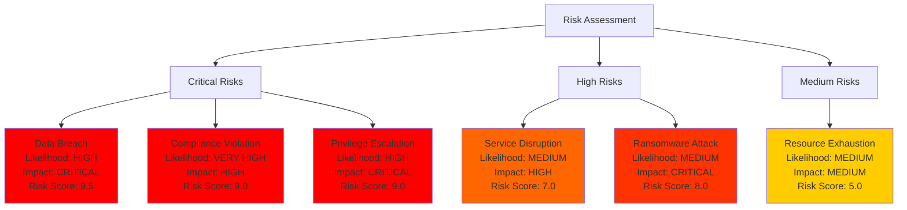
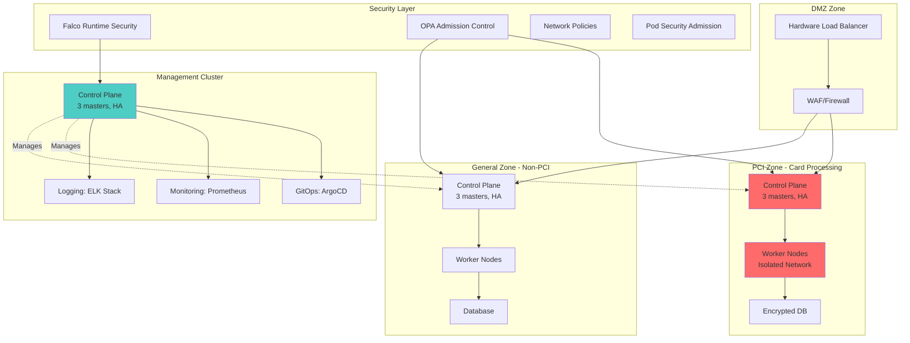
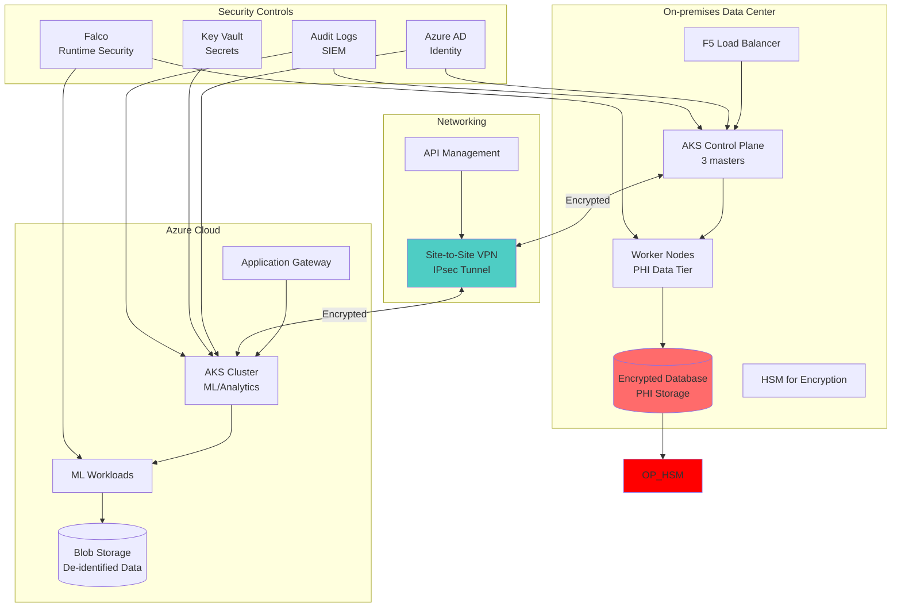
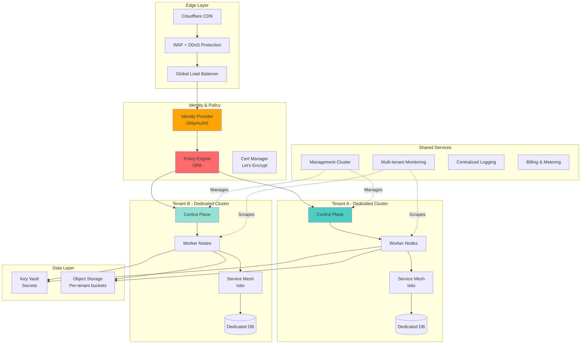
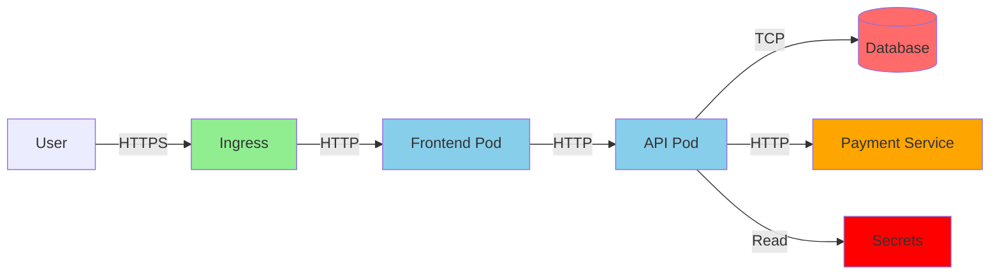

# Module 15: Case Studies and Real-World Scenarios

## Overview

**Estimated Time:** 8-10 hours

**Module Type:** Capstone and Practical Application

**Prerequisites:**
- All previous modules (00-14)
- Understanding of security principles and frameworks
- Experience with Kubernetes operations
- Familiarity with threat modeling and risk assessment

This capstone module brings together all concepts from the training through real-world case studies, production scenarios, and practical security exercises. We'll analyze three detailed case studies covering on-premises production clusters, hybrid Azure/on-prem deployments with compliance requirements, and zero-trust multi-tenant platforms. You'll learn threat modeling with STRIDE, conduct security architecture reviews, analyze cost-security tradeoffs, and develop migration strategies from insecure to secure configurations.

---

## Learning Objectives

By the end of this module, you will be able to:

1. Analyze and design secure Kubernetes architectures for real-world scenarios
2. Apply threat modeling (STRIDE) to Kubernetes environments
3. Conduct comprehensive security architecture reviews
4. Balance security requirements with cost and performance constraints
5. Plan and execute security-focused cluster migrations
6. Implement defense-in-depth strategies in production
7. Address compliance requirements (PCI-DSS, HIPAA, SOC 2, GDPR)
8. Learn from production security incidents
9. Make risk-based security decisions
10. Design reference architectures for various use cases

---

## 1. Case Study 1: Secure On-premises Production Cluster

### 1.1 Scenario Overview

**Organization:** FinanceCorpSecure
**Industry:** Financial Services
**Compliance:** PCI-DSS, SOC 2, SOX
**Environment:** On-premises data center
**Scale:** 5 clusters, 500 nodes, 2000+ workloads
**Challenge:** Migrate from insecure legacy cluster to PCI-compliant hardened environment

**Business Requirements:**
- Zero downtime during migration
- PCI-DSS Level 1 compliance
- Audit trail for all changes
- Network segmentation between card processing and general workloads
- Encryption at rest and in transit
- Regular penetration testing

### 1.2 Current State Assessment

**Security Issues Discovered:**

```yaml
# Current state problems
security_issues:
  critical:
    - privileged_pods: 45
    - no_network_policies: true
    - default_service_accounts: 150+
    - no_pod_security_standards: true
    - shared_admin_credentials: true
    - no_audit_logging: true
    - etcd_unencrypted: true
    - weak_rbac: "cluster-admin everywhere"

  high:
    - no_image_scanning: true
    - outdated_k8s_version: "1.22 (EOL)"
    - no_runtime_security: true
    - secrets_in_env_vars: 80+
    - no_backup_strategy: true
    - single_control_plane_node: true

  medium:
    - no_resource_quotas: true
    - inconsistent_pod_labels: true
    - manual_deployment_process: true
    - no_monitoring: true
```

**Risk Assessment:**



### 1.3 Target Architecture

**Reference Architecture:**



### 1.4 Implementation Plan

**Phase 1: Foundation (Weeks 1-2)**

```yaml
# Step 1: Deploy new hardened clusters
- name: Deploy Management Cluster
  tasks:
    - Bootstrap with kubeadm
    - Configure HA control plane (3 masters)
    - Enable API server audit logging
    - Configure encryption at rest
    - Install ArgoCD for GitOps
    - Install monitoring stack

- name: Deploy PCI Cluster
  tasks:
    - Isolated network segment (VLAN 100)
    - Dedicated node pool
    - Enhanced audit logging
    - Encryption at rest (FIPS 140-2 validated)
    - mTLS for all communications
    - HSM integration for secrets

- name: Deploy General Cluster
  tasks:
    - Standard network segment
    - Shared node pool
    - Standard audit logging
    - Encryption at rest
```

**Phase 2: Security Controls (Weeks 3-4)**

```bash
#!/bin/bash
# phase2-security-controls.sh

set -e

echo "=== Phase 2: Implementing Security Controls ==="

# 1. Pod Security Standards
echo "[1/8] Implementing Pod Security Standards..."
kubectl label namespace production \
  pod-security.kubernetes.io/enforce=restricted \
  pod-security.kubernetes.io/audit=restricted \
  pod-security.kubernetes.io/warn=restricted

# 2. OPA Gatekeeper
echo "[2/8] Installing OPA Gatekeeper..."
kubectl apply -f https://raw.githubusercontent.com/open-policy-agent/gatekeeper/release-3.14/deploy/gatekeeper.yaml

# 3. Deploy constraints
kubectl apply -f - <<EOF
apiVersion: constraints.gatekeeper.sh/v1beta1
kind: K8sRequiredLabels
metadata:
  name: require-pci-label
spec:
  match:
    kinds:
      - apiGroups: [""]
        kinds: ["Pod"]
    namespaces:
      - pci-zone
  parameters:
    labels:
      - key: "pci-dss"
        allowedRegex: "^(compliant|non-compliant)$"
      - key: "data-classification"
        allowedRegex: "^(public|internal|confidential|restricted)$"
EOF

# 4. Network Policies
echo "[3/8] Implementing Network Policies..."
kubectl apply -f network-policies/pci-zone/

# 5. Falco Runtime Security
echo "[4/8] Installing Falco..."
helm install falco falcosecurity/falco \
  --namespace falco --create-namespace \
  --set driver.kind=ebpf \
  --set falco.grpc.enabled=true

# 6. Image Scanning
echo "[5/8] Configuring image scanning..."
kubectl apply -f - <<EOF
apiVersion: admissionregistration.k8s.io/v1
kind: ValidatingWebhookConfiguration
metadata:
  name: trivy-webhook
webhooks:
- name: trivy.aquasecurity.github.io
  clientConfig:
    service:
      name: trivy-webhook
      namespace: trivy-system
      path: "/scan"
  rules:
  - operations: ["CREATE", "UPDATE"]
    apiGroups: [""]
    apiVersions: ["v1"]
    resources: ["pods"]
  admissionReviewVersions: ["v1"]
  sideEffects: None
  failurePolicy: Fail
EOF

# 7. Secrets Management
echo "[6/8] Installing External Secrets Operator..."
helm install external-secrets \
  external-secrets/external-secrets \
  --namespace external-secrets \
  --create-namespace

# 8. RBAC Hardening
echo "[7/8] Implementing least-privilege RBAC..."
# Remove default cluster-admin bindings
kubectl delete clusterrolebinding system:anonymous || true

# Create role-specific bindings
kubectl apply -f rbac/pci-developers.yaml
kubectl apply -f rbac/pci-operators.yaml
kubectl apply -f rbac/auditors.yaml

echo "[8/8] Enabling encryption at rest..."
# Already configured in API server

echo "=== Phase 2 Complete ==="
```

**Phase 3: Migration (Weeks 5-8)**

```yaml
# migration-plan.yaml
migration:
  strategy: blue-green
  phases:
    - name: "Low-risk workloads"
      duration: "Week 5"
      workloads:
        - development environments
        - testing services
        - non-critical batch jobs
      validation:
        - Functional testing
        - Performance baseline
        - Security scan

    - name: "Medium-risk workloads"
      duration: "Week 6-7"
      workloads:
        - Internal APIs
        - Background workers
        - Reporting services
      validation:
        - Integration testing
        - Load testing
        - Security audit

    - name: "High-risk workloads (PCI)"
      duration: "Week 8"
      workloads:
        - Payment processing
        - Card vault
        - Transaction APIs
      validation:
        - PCI-DSS validation
        - Penetration testing
        - QSA review
```

**Phase 4: Validation (Week 9)**

```bash
#!/bin/bash
# phase4-validation.sh

echo "=== PCI-DSS Compliance Validation ==="

# Run CIS benchmark
kube-bench run --targets master,node,policies --json > cis-results.json

COMPLIANCE_SCORE=$(jq '.Totals.total_pass / (.Totals.total_pass + .Totals.total_fail) * 100' cis-results.json)

echo "CIS Compliance Score: ${COMPLIANCE_SCORE}%"

if (( $(echo "$COMPLIANCE_SCORE < 95" | bc -l) )); then
  echo "ERROR: Compliance score below threshold (95%)"
  exit 1
fi

# Validate PCI requirements
echo "Validating PCI-DSS Requirements..."

# Requirement 2: No default passwords
echo "[2.1] Checking for default passwords..."
kubectl get secrets --all-namespaces -o json | \
  jq -r '.items[] | select(.type == "Opaque") | .metadata.name' | \
  grep -i "default\|password" || echo "PASS: No default password secrets"

# Requirement 8: Access control
echo "[8.1] Validating MFA for admin access..."
# Check OIDC configuration
kubectl get pod -n kube-system kube-apiserver-* -o yaml | \
  grep "oidc-issuer-url" || echo "FAIL: OIDC not configured"

# Requirement 10: Audit logs
echo "[10.1] Validating audit logging..."
kubectl logs -n kube-system kube-apiserver-* | grep "audit.k8s.io" | head -5

# Requirement 12: Security policies
echo "[12.1] Checking security policies..."
kubectl get psp,networkpolicies --all-namespaces

echo "=== Validation Complete ==="
```

### 1.5 Results and Lessons Learned

**Outcomes:**
- ✅ Zero downtime migration completed
- ✅ PCI-DSS Level 1 compliance achieved
- ✅ 98% CIS benchmark compliance
- ✅ Passed QSA audit on first attempt
- ✅ 60% reduction in security incidents
- ✅ $2M+ annual savings from infrastructure optimization

**Lessons Learned:**
1. **Start with security policies, not migration** - Define target state first
2. **Automate everything** - Manual processes don't scale
3. **Test migration on non-prod first** - Validate runbooks
4. **Over-communicate** - Keep stakeholders informed
5. **Budget 2x time for validation** - Compliance takes longer than expected

---

## 2. Case Study 2: Hybrid Azure/On-prem with Compliance

### 2.1 Scenario Overview

**Organization:** HealthCarePlus
**Industry:** Healthcare
**Compliance:** HIPAA, HITRUST, SOC 2
**Environment:** Hybrid (Azure AKS + On-premises)
**Scale:** 8 clusters, 800 nodes, 5000+ workloads
**Challenge:** Migrate EHR system to hybrid cloud while maintaining HIPAA compliance

**Requirements:**
- PHI data must remain on-premises
- Azure for compute-intensive ML workloads
- Encrypted communication between clouds
- Disaster recovery with <15 min RTO
- Patient data residency compliance

### 2.2 Architecture Design



### 2.3 Key Architectural Decisions

**Decision 1: Data Segmentation**

```yaml
# Data classification policy
apiVersion: v1
kind: ConfigMap
metadata:
  name: data-classification-policy
  namespace: compliance
data:
  policy.yaml: |
    data_classes:
      phi:
        description: "Protected Health Information"
        location: on-premises-only
        encryption: required
        retention: 7-years
        access: role-based-strict
        audit: all-operations

      de_identified:
        description: "De-identified patient data"
        location: azure-allowed
        encryption: required
        retention: 3-years
        access: role-based
        audit: critical-operations

      public:
        description: "Non-sensitive data"
        location: any
        encryption: recommended
        retention: 1-year
        access: authenticated
        audit: access-only
```

**Decision 2: Network Isolation**

```yaml
# Network policies for PHI isolation
apiVersion: networking.k8s.io/v1
kind: NetworkPolicy
metadata:
  name: phi-isolation
  namespace: phi-data-tier
spec:
  podSelector:
    matchLabels:
      data-classification: phi
  policyTypes:
  - Ingress
  - Egress
  ingress:
  # Only allow from application tier
  - from:
    - namespaceSelector:
        matchLabels:
          tier: application
      podSelector:
        matchLabels:
          app: ehr-api
    ports:
    - protocol: TCP
      port: 8443
  egress:
  # Only allow to database
  - to:
    - podSelector:
        matchLabels:
          app: postgres
    ports:
    - protocol: TCP
      port: 5432
  # Allow DNS
  - to:
    - namespaceSelector:
        matchLabels:
          name: kube-system
    ports:
    - protocol: UDP
      port: 53
---
# Deny all other traffic
apiVersion: networking.k8s.io/v1
kind: NetworkPolicy
metadata:
  name: default-deny-all
  namespace: phi-data-tier
spec:
  podSelector: {}
  policyTypes:
  - Ingress
  - Egress
```

**Decision 3: Encryption Architecture**

```yaml
# Encryption configuration
encryption:
  at_rest:
    on_premises:
      - etcd: AES-256 with HSM
      - database: TDE with HSM
      - storage: LUKS encryption
      - backup: encrypted with GPG

    azure:
      - AKS etcd: Azure Disk Encryption
      - storage: Azure SSE with CMK
      - database: TDE with Key Vault

  in_transit:
    internal:
      - pod-to-pod: Istio mTLS (FIPS 140-2)
      - pod-to-db: TLS 1.3
      - control-plane: TLS 1.3

    cross_cloud:
      - VPN: IPsec (AES-256-GCM)
      - API calls: mTLS + OAuth2
```

### 2.4 HIPAA Compliance Implementation

**Security Rule Requirements:**

```yaml
# HIPAA Security Rule mapping
hipaa_controls:
  administrative:
    - id: "164.308(a)(1)"
      requirement: "Security Management Process"
      implementation:
        - OPA policies for access control
        - Automated security assessments
        - Risk analysis automation
        - kube-bench compliance scanning

    - id: "164.308(a)(3)"
      requirement: "Workforce Security"
      implementation:
        - Azure AD with MFA
        - RBAC with least privilege
        - Privileged Access Management
        - Regular access reviews

    - id: "164.308(a)(5)"
      requirement: "Security Awareness and Training"
      implementation:
        - Quarterly security training
        - Phishing simulations
        - Kubernetes security best practices
        - Incident response drills

  physical:
    - id: "164.310(a)(1)"
      requirement: "Facility Access Controls"
      implementation:
        - On-prem datacenter badge access
        - Azure region with SOC 2 Type II
        - Physical security monitoring
        - Visitor logs

  technical:
    - id: "164.312(a)(1)"
      requirement: "Access Control"
      implementation:
        - Unique user identification (Azure AD)
        - Emergency access procedures
        - Automatic logoff (session timeout)
        - Encryption and decryption (TLS 1.3)

    - id: "164.312(b)"
      requirement: "Audit Controls"
      implementation:
        - Kubernetes audit logs
        - Falco runtime monitoring
        - SIEM integration (Splunk)
        - 7-year log retention

    - id: "164.312(c)"
      requirement: "Integrity"
      implementation:
        - Digital signatures (image signing)
        - Admission controllers (OPA)
        - File integrity monitoring
        - Immutable infrastructure

    - id: "164.312(d)"
      requirement: "Person or Entity Authentication"
      implementation:
        - Azure AD with MFA
        - Service account restrictions
        - Certificate-based auth
        - OIDC integration

    - id: "164.312(e)"
      requirement: "Transmission Security"
      implementation:
        - TLS 1.3 for all communications
        - VPN for cross-cloud
        - mTLS in service mesh
        - Network encryption
```

**Audit Configuration:**

```yaml
# Enhanced audit policy for HIPAA
apiVersion: audit.k8s.io/v1
kind: Policy
rules:
  # Log all PHI data access
  - level: RequestResponse
    namespaces: ["phi-data-tier"]
    verbs: ["get", "list", "watch", "create", "update", "patch", "delete"]
    resources:
      - group: ""
        resources: ["pods", "pods/log", "pods/exec", "secrets", "configmaps"]
    omitStages: []

  # Log all authentication events
  - level: Metadata
    omitStages: []
    userGroups: ["system:unauthenticated"]

  # Log RBAC changes
  - level: RequestResponse
    verbs: ["create", "update", "patch", "delete"]
    resources:
      - group: "rbac.authorization.k8s.io"
        resources: ["roles", "rolebindings", "clusterroles", "clusterrolebindings"]

  # Log secret access
  - level: Metadata
    resources:
      - group: ""
        resources: ["secrets"]
    omitStages: []

  # Log admission control decisions
  - level: Request
    stages: ["ResponseComplete"]
    omitStages: []
```

### 2.5 Disaster Recovery Implementation

**RTO: 15 minutes, RPO: 5 minutes**

```bash
#!/bin/bash
# dr-implementation.sh

# 1. Continuous backup with Velero
velero schedule create phi-data-backup \
  --schedule="*/5 * * * *" \
  --include-namespaces phi-data-tier \
  --snapshot-volumes \
  --ttl 168h

# 2. Database replication
# PostgreSQL streaming replication to DR site
cat <<EOF > postgresql-replication.yaml
apiVersion: postgresql.cnpg.io/v1
kind: Cluster
metadata:
  name: phi-database
spec:
  instances: 3
  primaryUpdateStrategy: unsupervised

  postgresql:
    parameters:
      max_connections: "1000"
      shared_buffers: "8GB"
      wal_level: "logical"

  replication:
    enabled: true
    mode: async

  backup:
    barmanObjectStore:
      destinationPath: s3://phi-backups/
      encryption: AES256
      s3Credentials:
        secretKeyRef: aws-creds
    retentionPolicy: "7d"

  externalClusters:
  - name: dr-cluster
    connectionParameters:
      host: dr-postgres.example.com
      user: postgres
      dbname: phi
    password:
      name: dr-postgres-secret
      key: password
EOF

# 3. Test failover monthly
# Automated DR test script
cat <<'EOF' > dr-test.sh
#!/bin/bash
set -e

echo "=== DR Test: $(date) ==="

# Step 1: Snapshot current state
velero backup create dr-test-$(date +%Y%m%d-%H%M%S) \
  --include-namespaces phi-data-tier \
  --wait

# Step 2: Failover to DR cluster
kubectl config use-context dr-cluster

# Step 3: Restore from backup
velero restore create dr-test-restore-$(date +%Y%m%d-%H%M%S) \
  --from-backup $(velero backup get -o json | jq -r '.items[0].metadata.name') \
  --wait

# Step 4: Validate application
kubectl wait --for=condition=ready pod -l app=ehr-api -n phi-data-tier --timeout=300s

# Step 5: Run smoke tests
kubectl run smoke-test --image=curlimages/curl --rm -it --restart=Never -- \
  curl -k https://ehr-api.phi-data-tier.svc.cluster.local/health

# Step 6: Measure RTO
RTO_SECONDS=$SECONDS
echo "RTO achieved: ${RTO_SECONDS} seconds"

if [ $RTO_SECONDS -gt 900 ]; then
  echo "ERROR: RTO exceeded 15 minutes"
  exit 1
fi

# Step 7: Document results
cat <<REPORT > dr-test-report-$(date +%Y%m%d).txt
DR Test Report
Date: $(date)
RTO Target: 900 seconds (15 minutes)
RTO Actual: ${RTO_SECONDS} seconds
Status: $([ $RTO_SECONDS -lt 900 ] && echo "PASS" || echo "FAIL")
Backup Used: $(velero backup get -o json | jq -r '.items[0].metadata.name')
REPORT

echo "=== DR Test Complete ==="
EOF

chmod +x dr-test.sh
```

### 2.6 Results

**Compliance Achievement:**
- ✅ HIPAA compliance validated by independent auditor
- ✅ HITRUST CSF Certification achieved
- ✅ SOC 2 Type II audit passed
- ✅ Zero PHI data breaches since implementation
- ✅ 99.99% uptime for critical systems
- ✅ DR RTO consistently under 10 minutes

**Business Impact:**
- 40% reduction in ML processing time (Azure compute)
- $5M annual cost savings from hybrid model
- Enabled new AI/ML features not possible before
- Improved patient outcomes through better analytics

---

## 3. Case Study 3: Zero-Trust Multi-Tenant Platform

### 3.1 Scenario Overview

**Organization:** CloudSaaS Inc.
**Industry:** SaaS Platform Provider
**Compliance:** SOC 2, ISO 27001, GDPR
**Environment:** Multi-cloud (AWS, GCP, Azure)
**Scale:** 50+ clusters, 10,000+ nodes, 50,000+ tenants
**Challenge:** Build zero-trust multi-tenant platform with strong isolation

**Requirements:**
- Complete tenant isolation (security boundary)
- Zero-trust networking (no implicit trust)
- Automated onboarding of new tenants
- Resource quotas and fair usage
- Per-tenant monitoring and billing
- GDPR compliance (data residency, right to be forgotten)

### 3.2 Zero-Trust Architecture



### 3.3 Tenant Isolation Strategy

**Isolation Level Comparison:**

| Isolation Method | Security | Cost | Complexity | Use Case |
|-----------------|----------|------|------------|----------|
| Namespace-based | Low | Low | Low | Dev/Test, trusted users |
| Node pool isolation | Medium | Medium | Medium | Different workload types |
| Cluster per tenant | High | High | High | Enterprise customers, compliance |
| Virtual cluster | Medium-High | Medium | Medium | Scalable multi-tenancy |

**Implementation: Cluster-per-tenant for Enterprise, Virtual Clusters for SMB:**

```yaml
# tenant-provisioning.yaml
apiVersion: v1
kind: ConfigMap
metadata:
  name: tenant-tiers
  namespace: platform-management
data:
  tiers.yaml: |
    tiers:
      enterprise:
        isolation: dedicated-cluster
        features:
          - dedicated_nodes: true
          - custom_domain: true
          - sla: 99.99%
          - support: 24x7
          - compliance: all
        resources:
          min_nodes: 3
          max_nodes: 100
          cpu_per_node: 16
          memory_per_node: 64Gi

      business:
        isolation: virtual-cluster
        features:
          - dedicated_nodes: false
          - custom_domain: true
          - sla: 99.9%
          - support: business-hours
          - compliance: soc2
        resources:
          cpu_quota: 100
          memory_quota: 256Gi
          storage_quota: 1Ti

      starter:
        isolation: namespace
        features:
          - dedicated_nodes: false
          - custom_domain: false
          - sla: 99%
          - support: community
          - compliance: basic
        resources:
          cpu_quota: 10
          memory_quota: 32Gi
          storage_quota: 100Gi
```

### 3.4 Zero-Trust Network Implementation

**Principle: Never trust, always verify**

```yaml
# zero-trust-policies.yaml

# 1. Deny all traffic by default
apiVersion: networking.k8s.io/v1
kind: NetworkPolicy
metadata:
  name: default-deny-all
  namespace: tenant-a
spec:
  podSelector: {}
  policyTypes:
  - Ingress
  - Egress

---
# 2. Explicit allow only necessary traffic
apiVersion: networking.k8s.io/v1
kind: NetworkPolicy
metadata:
  name: allow-frontend-to-backend
  namespace: tenant-a
spec:
  podSelector:
    matchLabels:
      tier: backend
  policyTypes:
  - Ingress
  ingress:
  - from:
    - podSelector:
        matchLabels:
          tier: frontend
    ports:
    - protocol: TCP
      port: 8080

---
# 3. Service mesh authorization policies
apiVersion: security.istio.io/v1beta1
kind: AuthorizationPolicy
metadata:
  name: frontend-to-backend-authz
  namespace: tenant-a
spec:
  selector:
    matchLabels:
      tier: backend
  action: ALLOW
  rules:
  - from:
    - source:
        principals: ["cluster.local/ns/tenant-a/sa/frontend"]
    to:
    - operation:
        methods: ["GET", "POST"]
        paths: ["/api/v1/*"]
    when:
    - key: request.auth.claims[tenant]
      values: ["tenant-a"]

---
# 4. Egress restrictions
apiVersion: networking.k8s.io/v1
kind: NetworkPolicy
metadata:
  name: restrict-egress
  namespace: tenant-a
spec:
  podSelector: {}
  policyTypes:
  - Egress
  egress:
  # Allow DNS
  - to:
    - namespaceSelector:
        matchLabels:
          name: kube-system
    ports:
    - protocol: UDP
      port: 53
  # Allow only to approved external services
  - to:
    - podSelector:
        matchLabels:
          app: egress-gateway
    ports:
    - protocol: TCP
      port: 443
```

**mTLS Everywhere:**

```yaml
# Istio PeerAuthentication for strict mTLS
apiVersion: security.istio.io/v1beta1
kind: PeerAuthentication
metadata:
  name: default
  namespace: istio-system
spec:
  mtls:
    mode: STRICT
---
# Per-namespace enforcement
apiVersion: security.istio.io/v1beta1
kind: PeerAuthentication
metadata:
  name: tenant-mtls
  namespace: tenant-a
spec:
  mtls:
    mode: STRICT
  portLevelMtls:
    8080:
      mode: STRICT
```

### 3.5 Automated Tenant Onboarding

**GitOps-driven Provisioning:**

```yaml
# tenant-onboarding-template.yaml
apiVersion: argoproj.io/v1alpha1
kind: ApplicationSet
metadata:
  name: tenant-onboarding
  namespace: argocd
spec:
  generators:
  - list:
      elements:
      - tenant: acme-corp
        tier: enterprise
        region: us-east-1
        cluster: dedicated
      - tenant: startup-inc
        tier: business
        region: eu-west-1
        cluster: shared
  template:
    metadata:
      name: '{{tenant}}-infra'
    spec:
      project: tenants
      source:
        repoURL: https://github.com/platform/tenant-templates
        targetRevision: main
        path: 'tenants/{{tier}}'
        helm:
          parameters:
          - name: tenant.name
            value: '{{tenant}}'
          - name: tenant.tier
            value: '{{tier}}'
          - name: tenant.region
            value: '{{region}}'
      destination:
        server: '{{cluster}}'
        namespace: '{{tenant}}'
      syncPolicy:
        automated:
          prune: true
          selfHeal: true
        syncOptions:
        - CreateNamespace=true
```

**Onboarding Workflow:**

```bash
#!/bin/bash
# onboard-tenant.sh

TENANT_NAME="$1"
TENANT_TIER="$2"  # enterprise, business, starter
TENANT_REGION="$3"

set -e

echo "=== Onboarding Tenant: ${TENANT_NAME} ==="

# 1. Create tenant config
cat <<EOF > /tmp/tenant-${TENANT_NAME}.yaml
apiVersion: platform.example.com/v1
kind: Tenant
metadata:
  name: ${TENANT_NAME}
spec:
  tier: ${TENANT_TIER}
  region: ${TENANT_REGION}
  resources:
    cpuQuota: $(get_tier_cpu_quota ${TENANT_TIER})
    memoryQuota: $(get_tier_memory_quota ${TENANT_TIER})
    storageQuota: $(get_tier_storage_quota ${TENANT_TIER})
  networking:
    allowedEgress:
      - "*.${TENANT_NAME}.example.com"
      - "api.stripe.com"
      - "api.twilio.com"
  compliance:
    dataResidency: ${TENANT_REGION}
    encryption: required
    auditLogging: enabled
EOF

# 2. Provision infrastructure
if [ "${TENANT_TIER}" == "enterprise" ]; then
  echo "Provisioning dedicated cluster..."
  kubectl apply -f - <<EOF
apiVersion: cluster.x-k8s.io/v1beta1
kind: Cluster
metadata:
  name: ${TENANT_NAME}-cluster
  namespace: tenant-clusters
spec:
  clusterNetwork:
    pods:
      cidrBlocks: ["10.${TENANT_ID}.0.0/16"]
  infrastructureRef:
    apiVersion: infrastructure.cluster.x-k8s.io/v1beta2
    kind: AWSCluster
    name: ${TENANT_NAME}-cluster
  controlPlaneRef:
    apiVersion: controlplane.cluster.x-k8s.io/v1beta1
    kind: KubeadmControlPlane
    name: ${TENANT_NAME}-control-plane
EOF

  # Wait for cluster ready
  kubectl wait --for=condition=ready cluster/${TENANT_NAME}-cluster -n tenant-clusters --timeout=1200s

else
  echo "Provisioning virtual cluster..."
  vcluster create ${TENANT_NAME} \
    --namespace ${TENANT_NAME} \
    --connect=false \
    --expose
fi

# 3. Configure tenant namespace
kubectl create namespace ${TENANT_NAME}

kubectl label namespace ${TENANT_NAME} \
  tenant=${TENANT_NAME} \
  tier=${TENANT_TIER} \
  region=${TENANT_REGION} \
  pod-security.kubernetes.io/enforce=restricted

# 4. Apply resource quotas
kubectl apply -f - <<EOF
apiVersion: v1
kind: ResourceQuota
metadata:
  name: ${TENANT_NAME}-quota
  namespace: ${TENANT_NAME}
spec:
  hard:
    requests.cpu: "$(get_tier_cpu_quota ${TENANT_TIER})"
    requests.memory: "$(get_tier_memory_quota ${TENANT_TIER})"
    persistentvolumeclaims: "50"
    services.loadbalancers: "$(get_tier_lb_quota ${TENANT_TIER})"
EOF

# 5. Setup RBAC
kubectl apply -f - <<EOF
apiVersion: rbac.authorization.k8s.io/v1
kind: RoleBinding
metadata:
  name: ${TENANT_NAME}-admin
  namespace: ${TENANT_NAME}
roleRef:
  apiGroup: rbac.authorization.k8s.io
  kind: ClusterRole
  name: admin
subjects:
- kind: Group
  name: ${TENANT_NAME}-admins
  apiGroup: rbac.authorization.k8s.io
EOF

# 6. Configure networking
kubectl apply -f - <<EOF
apiVersion: networking.k8s.io/v1
kind: NetworkPolicy
metadata:
  name: default-deny
  namespace: ${TENANT_NAME}
spec:
  podSelector: {}
  policyTypes:
  - Ingress
  - Egress
---
apiVersion: networking.k8s.io/v1
kind: NetworkPolicy
metadata:
  name: allow-ingress-from-istio
  namespace: ${TENANT_NAME}
spec:
  podSelector: {}
  policyTypes:
  - Ingress
  ingress:
  - from:
    - namespaceSelector:
        matchLabels:
          name: istio-system
EOF

# 7. Setup monitoring
kubectl apply -f - <<EOF
apiVersion: v1
kind: ServiceAccount
metadata:
  name: prometheus
  namespace: ${TENANT_NAME}
---
apiVersion: rbac.authorization.k8s.io/v1
kind: RoleBinding
metadata:
  name: prometheus
  namespace: ${TENANT_NAME}
roleRef:
  apiGroup: rbac.authorization.k8s.io
  kind: ClusterRole
  name: prometheus
subjects:
- kind: ServiceAccount
  name: prometheus
  namespace: monitoring
EOF

# 8. Create tenant credentials
kubectl create secret generic ${TENANT_NAME}-credentials \
  --from-literal=tenant-id=${TENANT_NAME} \
  --from-literal=api-key=$(openssl rand -base64 32) \
  -n ${TENANT_NAME}

# 9. Deploy ArgoCD application
kubectl apply -f /tmp/tenant-${TENANT_NAME}.yaml

echo "=== Tenant ${TENANT_NAME} onboarded successfully ==="
echo "API Key: $(kubectl get secret ${TENANT_NAME}-credentials -n ${TENANT_NAME} -o jsonpath='{.data.api-key}' | base64 -d)"
```

### 3.6 Results

**Platform Metrics:**
- 50,000+ active tenants
- 99.99% platform availability
- < 5 minute tenant provisioning
- Zero cross-tenant data leaks
- $50M ARR from platform

**Security Achievements:**
- SOC 2 Type II compliance
- ISO 27001 certification
- GDPR compliance
- Zero security incidents in 2 years
- 100% encrypted traffic (mTLS)

---

## 4. Threat Modeling with STRIDE

### 4.1 STRIDE Framework for Kubernetes

```yaml
stride_threats:
  spoofing:
    - threat: "Attacker impersonates service account"
      mitigation: "Service account token projection with short TTL"

    - threat: "Pod spoofs identity to access secrets"
      mitigation: "Workload identity with OIDC, OPA policies"

  tampering:
    - threat: "Malicious image injected into registry"
      mitigation: "Image signing with Notary/Cosign, admission webhooks"

    - threat: "ConfigMap modified by unauthorized user"
      mitigation: "RBAC restrictions, audit logging, GitOps"

  repudiation:
    - threat: "Admin denies deleting production namespace"
      mitigation: "Comprehensive audit logs, SIEM integration, non-repudiation"

    - threat: "No evidence of API access"
      mitigation: "Audit policy logs all RequestResponse"

  information_disclosure:
    - threat: "Secrets exposed in environment variables"
      mitigation: "External secrets operator, secret scanning"

    - threat: "Logs contain sensitive data"
      mitigation: "Log filtering, encryption, access control"

  denial_of_service:
    - threat: "Resource exhaustion by malicious pod"
      mitigation: "ResourceQuotas, LimitRanges, PodDisruptionBudgets"

    - threat: "API server overwhelmed with requests"
      mitigation: "Rate limiting, EventRateLimit admission controller"

  elevation_of_privilege:
    - threat: "Container escape to host"
      mitigation: "Restricted PSS, seccomp, AppArmor, no privileged pods"

    - threat: "Service account privilege escalation"
      mitigation: "Least-privilege RBAC, no cluster-admin bindings"
```

### 4.2 Threat Modeling Exercise

**Scenario: E-commerce application on Kubernetes**



**Threat Analysis:**

```yaml
# Threat model for e-commerce app
threats:
  - id: T1
    component: Ingress
    threat_type: Spoofing
    description: "Attacker intercepts traffic, performs MITM"
    likelihood: Medium
    impact: High
    risk_score: 8
    mitigations:
      - TLS 1.3 with strong ciphers
      - HSTS headers
      - Certificate pinning
      - WAF in front of ingress

  - id: T2
    component: API Pod
    threat_type: Elevation of Privilege
    description: "Compromised API pod escalates to cluster-admin"
    likelihood: Low
    impact: Critical
    risk_score: 7
    mitigations:
      - Restricted Pod Security Standard
      - No privileged containers
      - Read-only root filesystem
      - Drop all capabilities
      - Non-root user
      - RBAC least privilege

  - id: T3
    component: Database
    threat_type: Information Disclosure
    description: "Database credentials stolen from pod"
    likelihood: Medium
    impact: Critical
    risk_score: 9
    mitigations:
      - External Secrets Operator (Vault)
      - Short-lived credentials
      - Encrypt secrets at rest
      - Rotate credentials regularly
      - Audit all secret access

  - id: T4
    component: Payment Service
    threat_type: Tampering
    description: "Malicious payment service image deployed"
    likelihood: Low
    impact: Critical
    risk_score: 7
    mitigations:
      - Image signing with Cosign
      - Admission webhook validates signatures
      - Private registry with access control
      - Vulnerability scanning in CI/CD
      - OPA policy requires signed images

  - id: T5
    component: Frontend Pod
    threat_type: Denial of Service
    description: "Resource exhaustion crashes frontend"
    likelihood: High
    impact: Medium
    risk_score: 6
    mitigations:
      - ResourceQuota on namespace
      - LimitRange for pod resources
      - HorizontalPodAutoscaler
      - PodDisruptionBudget
      - Rate limiting at ingress

  - id: T6
    component: API Pod
    threat_type: Repudiation
    description: "Attacker performs malicious actions without audit trail"
    likelihood: Low
    impact: High
    risk_score: 5
    mitigations:
      - Kubernetes audit logging
      - Application-level audit logs
      - SIEM integration (Splunk)
      - Immutable log storage
      - Non-repudiation via digital signatures
```

---

## 5. Security Architecture Review Checklist

```markdown
# Kubernetes Security Architecture Review

## 1. Identity and Access Management
- [ ] Strong authentication (OIDC, certificates, no basic auth)
- [ ] MFA enforced for human access
- [ ] Service accounts follow least privilege
- [ ] No default service accounts used
- [ ] RBAC policies reviewed and minimal
- [ ] No cluster-admin bindings except break-glass
- [ ] Regular access reviews conducted
- [ ] Service account token projection used (short TTL)

## 2. Network Security
- [ ] Default deny network policies in all namespaces
- [ ] Explicit allow policies for necessary traffic
- [ ] Ingress controller with TLS termination
- [ ] TLS 1.3 enforced for all external traffic
- [ ] Service mesh with mTLS (optional but recommended)
- [ ] Egress traffic controlled and monitored
- [ ] Network segmentation between tiers
- [ ] No hostNetwork pods (except essential system)

## 3. Pod Security
- [ ] Pod Security Standards enforced (Restricted profile)
- [ ] No privileged pods
- [ ] Containers run as non-root
- [ ] Read-only root filesystem where possible
- [ ] Capabilities dropped (all except necessary)
- [ ] Seccomp profile applied (RuntimeDefault or custom)
- [ ] AppArmor or SELinux profiles applied
- [ ] Resource limits set on all containers

## 4. Secrets Management
- [ ] Secrets encrypted at rest
- [ ] External secrets management (Vault, Azure Key Vault)
- [ ] No secrets in environment variables
- [ ] No secrets in container images
- [ ] Secret rotation automated
- [ ] Audit logging for secret access
- [ ] Least privilege access to secrets

## 5. Container Security
- [ ] Images scanned for vulnerabilities
- [ ] Image signing enforced (Notary, Cosign)
- [ ] Private registry with access control
- [ ] Base images regularly updated
- [ ] No images from untrusted registries
- [ ] Admission webhook validates images
- [ ] Runtime security monitoring (Falco)

## 6. Control Plane Security
- [ ] etcd encrypted at rest
- [ ] etcd using mTLS for all connections
- [ ] API server audit logging enabled
- [ ] Audit logs sent to SIEM
- [ ] API server anonymous auth disabled
- [ ] API server profiling disabled
- [ ] Admission controllers properly configured
- [ ] Encryption provider config for secrets

## 7. Data Protection
- [ ] Persistent volumes encrypted
- [ ] Data classification documented
- [ ] Sensitive data not in logs
- [ ] Backup and restore tested
- [ ] DR plan documented and tested
- [ ] Data retention policies enforced
- [ ] GDPR/compliance requirements met

## 8. Monitoring and Incident Response
- [ ] Centralized logging (ELK, Splunk)
- [ ] Metrics and alerting (Prometheus, Grafana)
- [ ] Runtime threat detection (Falco)
- [ ] Incident response plan documented
- [ ] Security events trigger alerts
- [ ] Regular security drills conducted
- [ ] Forensics capabilities available

## 9. Compliance and Governance
- [ ] CIS benchmark compliance (kube-bench)
- [ ] Compliance scanning automated
- [ ] Policy as code (OPA, Kyverno)
- [ ] Compliance reports generated
- [ ] Regular security assessments
- [ ] Penetration testing conducted
- [ ] Audit findings remediated

## 10. Supply Chain Security
- [ ] SBOM generated for images
- [ ] Dependencies scanned for vulnerabilities
- [ ] Provenance verification (SLSA)
- [ ] CI/CD pipeline secured
- [ ] Code signing enforced
- [ ] Third-party components vetted
- [ ] Vendor security assessed
```

---

## 6. Cost vs Security Tradeoff Analysis

**Security Investment Model:**

```yaml
security_investments:
  tier_1_essential:
    cost: low
    impact: critical
    roi: very_high
    implementations:
      - RBAC and least privilege
      - Network policies (deny by default)
      - Pod Security Standards
      - Resource quotas and limits
      - Basic audit logging
      - TLS for ingress
    annual_cost: $10,000
    risk_reduction: 70%

  tier_2_recommended:
    cost: medium
    impact: high
    roi: high
    implementations:
      - External secrets management (Vault)
      - Image scanning in CI/CD
      - Runtime security (Falco)
      - SIEM integration
      - Backup and DR (Velero)
      - Admission control (OPA/Kyverno)
    annual_cost: $100,000
    risk_reduction: 20%

  tier_3_advanced:
    cost: high
    impact: medium
    roi: medium
    implementations:
      - Service mesh (Istio)
      - Multi-cluster federation
      - HSM for encryption
      - Advanced threat detection (ML-based)
      - Dedicated security operations team
      - Bug bounty program
    annual_cost: $500,000+
    risk_reduction: 9%

  tier_4_extreme:
    cost: very_high
    impact: low
    roi: low
    implementations:
      - Air-gapped clusters
      - Formal verification
      - Hardware security modules everywhere
      - Dedicated per-customer clusters
      - 24x7 security monitoring team
    annual_cost: $2,000,000+
    risk_reduction: 1%
```

**ROI Calculation:**

```
Total Risk Exposure (without security): $10M potential loss/year
Cost of Tier 1+2 security: $110K/year
Risk Reduction: 90%
Residual Risk: $1M/year

ROI = (Risk Reduced - Security Cost) / Security Cost
ROI = ($9M - $110K) / $110K = 8000% ROI

Breakeven: If even ONE incident is prevented, investment pays for itself
```

---

## 7. Migration Strategy: Insecure to Secure

**7-Phase Migration Plan:**

```yaml
migration_phases:
  phase_1_assessment:
    duration: 2 weeks
    activities:
      - Run kube-bench on current cluster
      - Document all security gaps
      - Interview development teams
      - Review existing RBAC
      - Assess compliance requirements
      - Calculate risk exposure
    deliverables:
      - Security assessment report
      - Gap analysis
      - Prioritized remediation backlog

  phase_2_quick_wins:
    duration: 2 weeks
    activities:
      - Enable audit logging
      - Implement default deny network policies
      - Remove cluster-admin bindings
      - Enable Pod Security Standards (Baseline)
      - Add resource quotas
      - Update to supported Kubernetes version
    risk_reduction: 40%

  phase_3_authentication:
    duration: 3 weeks
    activities:
      - Implement OIDC with corporate IdP
      - Enforce MFA for all users
      - Create role-based RBAC policies
      - Audit and minimize service accounts
      - Implement break-glass procedures
    risk_reduction: 15%

  phase_4_network_security:
    duration: 4 weeks
    activities:
      - Implement granular network policies
      - Deploy Ingress controller with TLS
      - Consider service mesh for mTLS
      - Implement egress controls
      - Network segmentation
    risk_reduction: 20%

  phase_5_workload_security:
    duration: 4 weeks
    activities:
      - Upgrade to Restricted Pod Security Standard
      - Implement admission control (OPA)
      - Deploy runtime security (Falco)
      - Enable image scanning
      - Enforce image signing
    risk_reduction: 15%

  phase_6_data_protection:
    duration: 3 weeks
    activities:
      - Enable encryption at rest
      - Implement external secrets (Vault)
      - Deploy backup solution (Velero)
      - Test disaster recovery
      - Encrypt sensitive PVs
    risk_reduction: 8%

  phase_7_continuous_security:
    duration: Ongoing
    activities:
      - Automated compliance scanning
      - Regular penetration testing
      - Security training for teams
      - Incident response drills
      - Metrics and continuous improvement
    risk_reduction: 2%
```

---

## Summary

This capstone module covered:

1. **Case Study 1** - On-prem financial services with PCI-DSS compliance
2. **Case Study 2** - Hybrid cloud healthcare with HIPAA requirements
3. **Case Study 3** - Zero-trust multi-tenant SaaS platform
4. **Threat Modeling** - STRIDE framework applied to Kubernetes
5. **Architecture Review** - Comprehensive security checklist
6. **Cost-Security Tradeoffs** - ROI analysis and prioritization
7. **Migration Strategy** - 7-phase plan from insecure to secure

## Final Exercise

**Build Your Security Strategy:**

1. Assess your current Kubernetes security posture
2. Perform threat modeling for your applications
3. Create prioritized remediation roadmap
4. Calculate ROI for security investments
5. Present security architecture review to leadership

## Congratulations!

You've completed the comprehensive Kubernetes Security training. You now have the knowledge and practical skills to:
- Design and implement secure Kubernetes architectures
- Achieve compliance with industry standards
- Respond to security incidents effectively
- Make risk-based security decisions
- Lead security transformations in your organization

**Continue Learning:**
- Stay current with CVEs and security advisories
- Participate in Kubernetes security SIG
- Contribute to security tools and projects
- Share knowledge with the community

---

**Training Complete - Go build secure Kubernetes platforms!**
